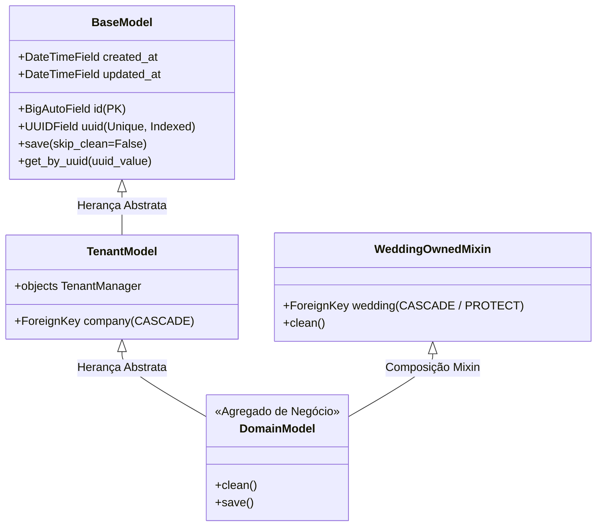

# Domínio Core & Infraestrutura Transversal

> **Categoria:** Domínios de Arquitetura (Bounded Contexts)
> **Relacionados:** [ADR-007: Chaves Híbridas (ID + UUID)](../adr/007-hybrid-keys.md) · [ADR-008: Soft Delete](../adr/008-soft-delete.md) · [ADR-011: BaseModel save com full_clean](../adr/011-basemodel-save-full-clean.md) · [ADR-016: Multi-Tenancy Pragmático](../adr/016-pragmatic-multi-tenancy.md) · [ADR-019: Validação de Tenant na Service Layer](../adr/019-tenant-validation-service-layer.md) · [Suíte de Guard-Rails Arquiteturais](../concepts/architectural-guard-rails-suite.md) · [Especificação de Modelos Core](../../reference/models/core-models.md) · [Envelope de Erros HTTP](../../reference/api/error-envelope-spec.md)

---

## 1. Visão Geral do Domínio

O domínio **Core** fornece a fundação estrutural, comportamental e de segurança de toda a aplicação. Ele não abriga entidades de negócio específicas de casamento, mas estabelece os padrões e contratos que todos os demais 9 Bounded Contexts são obrigados a obedecer:

1. **Persistência Segura e Tipada:** Modelo base abstrato (`BaseModel`) com chaves híbridas (`id` bigint sequencial para performance interna do banco e `uuid` para exposição segura em rotas e interfaces públicas).
2. **Execução Obrigatória de Invariantes:** Execução sistemática de `full_clean()` no método `save()` (ADR-011), impedindo que dados inconsistentes cheguem à camada de persistência.
3. **Blindagem de Multi-Tenancy:** Mixin `WeddingOwnedMixin` para validação bidirecional (vertical por empresa e horizontal entre casamentos distintos).
4. **Tratamento Padronizado de Exceções:** Hierarquia de erros de domínio (`ApplicationError`) mapeados diretamente para status HTTP e envelopes JSON imutáveis.
5. **Observabilidade e Healthchecks:** Endpoint de verificação ativa de disponibilidade `/health` para monitoramento de probes e balanceadores de carga.

---

## 2. Diagrama Estrutural da Fundação Core



---

## 3. Matriz Canônica de Invariantes Core (SSOT)

| ID | Regra / Invariante | Descrição & Comportamento | Entidades / Camadas | Referência Canônica |
| :--- | :--- | :--- | :--- | :--- |
| **`BR-C01`** | **Chaves Híbridas (ID + UUID)** | `id` bigint sequencial para chave primária interna e joins rápidos no PostgreSQL; `uuid` v4 único, indexado e imutável exposto nas URLs e APIs públicas. | `BaseModel` | [ADR-007](../adr/007-hybrid-keys.md) · [core-models.md](../../reference/models/core-models.md) |
| **`BR-C02`** | **Execução Compulsória de Invariantes** | Todo `BaseModel` executa compulsoriamente `self.full_clean()` dentro de `save()` (a menos de flag defensiva `skip_clean=True`), assegurando que nenhuma linha inconsistente chegue ao banco. | `BaseModel`, `TenantModel` | [ADR-011](../adr/011-basemodel-save-full-clean.md) · [ADR-030](../adr/030-rich-domain-model-service-layer.md) |
| **`BR-C03`** | **Blindagem Multi-Tenant Transversal** | `WeddingOwnedMixin` valida em `clean()` a coerência vertical (`self.company_id == self.wedding.company_id`) e a coerência horizontal entre todas as FKs de entidades do mesmo casamento. | `WeddingOwnedMixin` | [ADR-016](../adr/016-pragmatic-multi-tenancy.md) · [tenant-isolation-guard.md](../../reference/architecture-standards/guard-rails/tenant-isolation-guard.md) |
| **`BR-C04`** | **Envelopamento Semântico de Exceções** | Toda exceção de domínio descende de `ApplicationError`, carregando código de máquina (`code`), detalhe e status HTTP tipado, serializada pelo handler central do Django Ninja. | `ApplicationError`, `exceptions.py` | [error-envelope-spec.md](../../reference/api/error-envelope-spec.md) · [ADR-013](../adr/013-migrate-drf-to-ninja.md) |

---

## 4. Arquitetura Fullstack e Implementação no Código-Fonte

### Backend (`backend/apps/core/`)
- **Modelos Base & Mixins:** `BaseModel` (`models.py`) e `WeddingOwnedMixin` (`mixins.py`).
- **Exceções Globais:** `exceptions.py` com mapeamento para status HTTP e serialização RFC 7807 no Django Ninja (`config/api.py`).
- **Shortcuts & Tenant Guard:** `shortcuts.py` (`get_object_or_404_for_tenant`, `resolve_tenant_resource`) e `tenant.py` (`validate_tenant_ownership`).
- **Validações de I/O:** `validators.py` (`MaxFileSizeValidator`) com tolerância a falhas de storage externo.
- **Suíte de Guard-Rails Automatizados:** `test_atomic_service_audit.py`, `test_cascade_delete_safety.py`, `test_concurrency_locks.py`, `test_error_envelope_consistency.py`, `test_api_architecture.py`.

### Frontend (`frontend/src/`)
- **Cliente HTTP & Interceptadores:** `src/api/client.ts` com injeção automática de Bearer JWT, captura de tenant ativo e tratamento universal de envelopes de erro.
- **Átomos de UI (shadcn/ui):** `src/components/ui/` (`Button`, `Dialog`, `Sheet`, `Table`, `Input`, `Toaster`).
- **Formatadores Globais Puros:** `src/lib/utils.ts` (`formatCurrency`, `formatDate`, `cn`).

### Trechos Canônicos de Implementação

- **Modelo Base:** [`BaseModel`](../../../backend/apps/core/models.py)
- **Mixin de Casamento:** [`WeddingOwnedMixin`](../../../backend/apps/core/mixins.py)
- **Hierarquia de Exceções:** [`ApplicationError`](../../../backend/apps/core/exceptions.py)
- **Resolução de Tenant:** [`get_object_or_404_for_tenant()`](../../../backend/apps/core/shortcuts.py)
- **Validador de Uploads:** [`MaxFileSizeValidator`](../../../backend/apps/core/validators.py)

#### A. Modelo Base com Validação de Invariantes (`BaseModel`)

```python
class BaseModel(models.Model):
    id = models.BigAutoField(primary_key=True, editable=False)
    uuid = models.UUIDField(default=uuid4, unique=True, editable=False, db_index=True)
    created_at = models.DateTimeField(auto_now_add=True)
    updated_at = models.DateTimeField(auto_now=True)

    class Meta:
        abstract = True

    def save(self, *args: Any, skip_clean: bool = False, **kwargs: Any) -> None:
        if not skip_clean:
            self.full_clean()
        super().save(*args, **kwargs)
```

#### B. Mixin de Isolamento Transversal (`WeddingOwnedMixin`)

```python
class WeddingOwnedMixin(models.Model):
    wedding = models.ForeignKey("weddings.Wedding", on_delete=models.CASCADE, related_name="%(class)s_records")

    class Meta:
        abstract = True

    def clean(self) -> None:
        super().clean()
        # 1. Blindagem Vertical: Garante mesmo tenant
        if hasattr(self, "company_id") and self.wedding_id:
            if self.company_id != self.wedding.company_id:
                raise ValidationError({"wedding": "Este casamento pertence a outra organização."})

        # 2. Blindagem Horizontal: Valida se outras FKs pertencem ao mesmo casamento
        for field in self._meta.concrete_fields:
            if isinstance(field, models.ForeignKey) and field.name != "wedding":
                related_obj = getattr(self, field.name, None)
                if related_obj and getattr(related_obj, "wedding_id", None) != self.wedding_id:
                    raise ValidationError({field.name: "Este recurso pertence a outro casamento."})
```

#### C. Hierarquia de Exceções de Domínio (`ApplicationError`)

```python
class ApplicationError(Exception):
    status_code = 400
    default_detail = "Ocorreu um erro na aplicação."
    default_code = "application_error"

class ObjectNotFoundError(ApplicationError):
    status_code = 404
    default_code = "not_found"

class BusinessRuleViolation(ApplicationError):
    status_code = 422
    default_code = "business_rule_violation"

class DomainIntegrityError(ApplicationError):
    status_code = 409
    default_code = "domain_integrity_error"
```

#### D. Atalhos de Resolução Segura de Tenant (`shortcuts.py`)

```python
def get_object_or_404_for_tenant[ModelT: models.Model](
    model_cls: type[ModelT],
    company: "Company",
    uuid: UUID | str,
    *,
    select_related: list[str] | None = None,
    prefetch_related: list[str] | None = None,
    detail: str | None = None,
    code: str = "not_found_or_denied",
) -> ModelT:
    try:
        queryset = _build_tenant_queryset(model_cls, company, select_related=select_related, prefetch_related=prefetch_related)
        return queryset.get(uuid=uuid)
    except (ObjectDoesNotExist, ValueError, ValidationError) as e:
        raise ObjectNotFoundError(detail=_get_not_found_detail(model_cls, detail), code=code) from e
```

#### E. Validador de Tamanho de Uploads (`MaxFileSizeValidator`)

```python
class MaxFileSizeValidator:
    def __init__(self, max_size: int) -> None:
        self.max_size = max_size

    def __call__(self, value: _FileLike) -> None:
        try:
            size = value.size
        except OSError:
            return  # Degradação graciosa em indisponibilidade de I/O externo

        if size is not None and size > self.max_size:
            mb = self.max_size // (1024 * 1024)
            raise ValidationError(f"Arquivo excede o limite de {mb}MB.", code="max_file_size")
```

---

## 5. Integrações & Interfaces Públicas (ADR-031)

A fundação Core expõe os utilitários e contratos estruturais consumidos obrigatoriamente por todos os demais 9 Bounded Contexts:
- `apps.core.shortcuts.get_object_or_404_for_tenant`: Busca defensiva com escopo de tenant e 404 semântico.
- `apps.core.tenant.validate_tenant_ownership`: Guard de integridade para serviços que orquestram agregados de múltiplos módulos.
- `apps.core.mixins.WeddingOwnedMixin`: Validador de integridade vertical e horizontal em models vinculados a casamentos.
- `apps.core.validators.MaxFileSizeValidator`: Validador de limite de anexos para storage.
- `apps.core.exceptions.ApplicationError`: Raiz hierárquica para exceções de domínio padronizadas.

---

## 6. Aprofundamento & Referências

### Decisões Arquiteturais (ADRs)
- [ADR-007: Chaves Híbridas (ID + UUID)](../adr/007-hybrid-keys.md)
- [ADR-011: BaseModel save com full_clean](../adr/011-basemodel-save-full-clean.md)
- [ADR-013: Migração para Django Ninja](../adr/013-migrate-drf-to-ninja.md)
- [ADR-016: Multi-Tenancy Pragmático](../adr/016-pragmatic-multi-tenancy.md)
- [ADR-030: Rich Domain Model & Service Layer](../adr/030-rich-domain-model-service-layer.md)

### Especificações Técnicas
- [Suíte de Guard-Rails Arquiteturais](../concepts/architectural-guard-rails-suite.md)
- [Padrão Service Layer](../concepts/service-layer-pattern.md)
- [Especificação de Modelos Core](../../reference/models/core-models.md)
- [Envelope de Erros da API](../../reference/api/error-envelope-spec.md)
