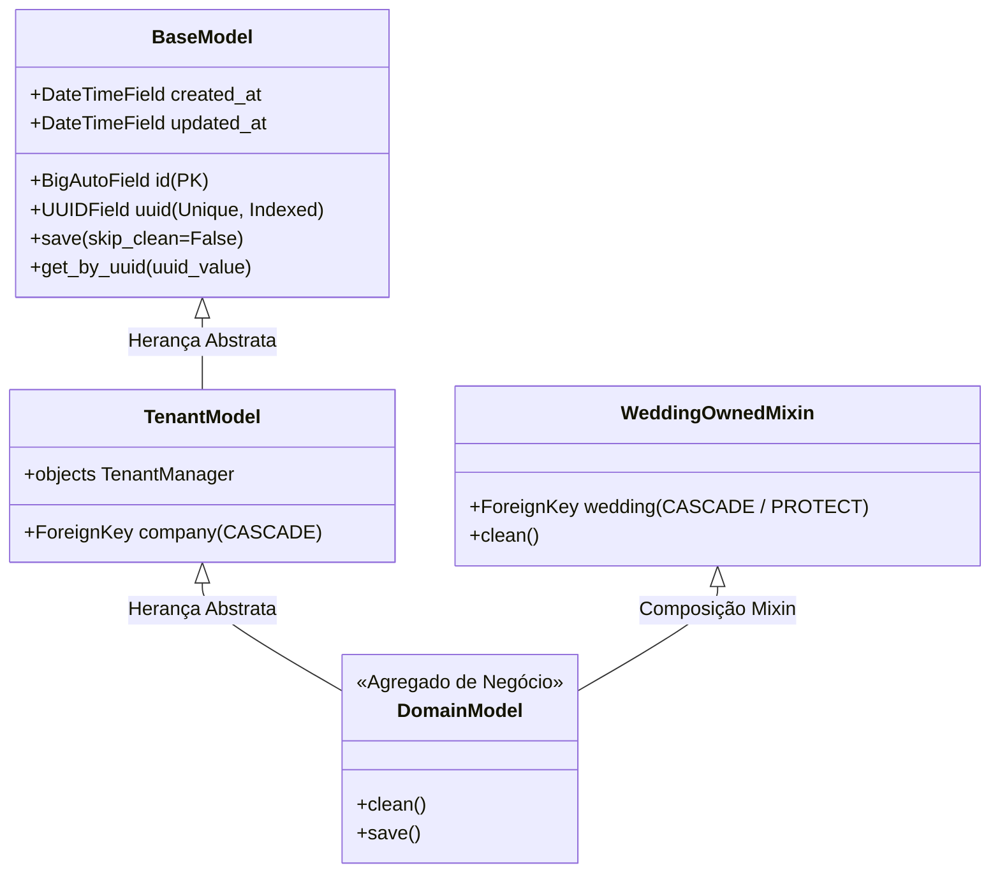

# Domínio Core & Infraestrutura Transversal

> **Categoria:** Domínios de Arquitetura (Bounded Contexts)
> **Relacionados:** [ADR-007: Chaves Híbridas (ID + UUID)](../adr/007-hybrid-keys.md) · [ADR-008: Soft Delete](../adr/008-soft-delete.md) · [ADR-011: BaseModel save com full_clean](../adr/011-basemodel-save-full-clean.md) · [ADR-016: Multi-Tenancy Pragmático](../adr/016-pragmatic-multi-tenancy.md) · [ADR-019: Validação de Tenant na Service Layer](../adr/019-tenant-validation-service-layer.md) · [Suíte de Guard-Rails Arquiteturais](../concepts/architectural-guard-rails-suite.md) · [Especificação de Modelos Core](../../reference/models/core-models.md) · [Envelope de Erros HTTP](../../reference/api/error-envelope-spec.md)

---

## 1. Visão Geral do Domínio

O domínio **Core** fornece a fundação estrutural, comportamental e de segurança de toda a aplicação. Ele não abriga entidades de negócio específicas de casamento, mas estabelece os padrões e contratos que todos os demais 9 Bounded Contexts são obrigados a obedecer:

1. **Persistência Segura e Tipada:** Modelo base abstrato (`BaseModel`) com chaves híbridas (`id` bigint sequencial para performance interna do banco e `uuid` para exposição segura em rotas e interfaces públicas).
2. **Execução Obrigatória de Invariantes:** Execução sistemática de `full_clean()` no método `save()` (ADR-011), impedindo que dados inconsistentes cheguem à camada de persistência.
3. **Blindagem de Multi-Tenancy:** Mixin `WeddingOwnedMixin` para validação bidirecional (vertical por empresa e horizontal entre casamentos distintos).
4. **Tratamento Padronizado de Exceções:** Hierarquia de erros de domínio (`ApplicationError`) mapeados diretamente para status HTTP e envelopes JSON imutáveis.
5. **Observabilidade e Healthchecks:** Endpoint de verificação ativa de disponibilidade `/health` para monitoramento de probes e balanceadores de carga.

---

## 2. Diagrama Estrutural da Fundação Core



---

## 3. Tabela de Entidades, Mixins e Invariantes de Persistência

| Componente Core | Tipo / Papel | Campos / Assinatura | Invariantes de Persistência & Regras de Arquitetura |
| :--- | :--- | :--- | :--- |
| **`BaseModel`** | Classe Abstrata (`models.Model`) | `id` (bigint PK), `uuid` (UUID4 único), `created_at`, `updated_at` | Executa obrigatoriamente `self.full_clean()` antes de persistir (`save()`), garantindo validação de schemas em qualquer ponto do sistema (ADR-011). O campo `uuid` é imutável (`editable=False`) e indexado para lookup seguro. |
| **`TenantModel`** | Classe Abstrata (`apps.tenants.models`) | `company` (`ForeignKey` para `tenants.Company`) | Garante que todo registro pertença a um tenant explícito. Configura o `TenantManager` como manager padrão com suporte ao método `.for_tenant(company)`. Possui índice composto `["company", "uuid"]`. |
| **`WeddingOwnedMixin`** | Mixin Abstrato (`apps.core.mixins`) | `wedding` (`ForeignKey` para `weddings.Wedding`) | **Blindagem Vertical:** Valida se `self.company_id == self.wedding.company_id`.<br/>**Blindagem Horizontal:** Itera sobre todas as FKs do modelo que referenciam outros agregados do casamento e valida se pertencem exatamente ao mesmo `wedding_id`. |
| **`MaxFileSizeValidator`** | Validador de I/O (`apps.core.validators`) | `max_size` (em bytes) | Valida o tamanho máximo de uploads (ex: 10MB para PDFs de contrato). Trata graciosamente exceções de `OSError` para tolerância a falhas de storage externo. |
| **`ApplicationError`** | Exceção Base (`apps.core.exceptions`) | `detail`, `code`, `status_code` | Raiz de todas as exceções de negócio da Service Layer. Permite tratamento desacoplado de códigos HTTP sem vazar detalhes de infraestrutura. |
| **`HealthCheck`** | Endpoint `/health` (`config/api.py`) | Retorna status da aplicação e ping no DB | Executa `connection.ensure_connection()` no Neon PostgreSQL. Retorna HTTP 200 `{"status": "healthy", "database": "up"}` ou HTTP 503 `{"status": "unhealthy", "database": "down"}`. |

---

## 4. Implementação no Código-Fonte Real

- **Modelo Base:** [`BaseModel`](../../../backend/apps/core/models.py)
- **Mixin de Casamento:** [`WeddingOwnedMixin`](../../../backend/apps/core/mixins.py)
- **Hierarquia de Exceções:** [`ApplicationError`](../../../backend/apps/core/exceptions.py)
- **Resolução de Tenant:** [`get_object_or_404_for_tenant()`](../../../backend/apps/core/shortcuts.py)
- **Validador de Uploads:** [`MaxFileSizeValidator`](../../../backend/apps/core/validators.py)

### A. Modelo Base com Validação de Invariantes (`BaseModel`)

```python
class BaseModel(models.Model):
    id = models.BigAutoField(primary_key=True, editable=False)
    uuid = models.UUIDField(default=uuid4, unique=True, editable=False, db_index=True)
    created_at = models.DateTimeField(auto_now_add=True)
    updated_at = models.DateTimeField(auto_now=True)

    class Meta:
        abstract = True

    def save(self, *args: Any, skip_clean: bool = False, **kwargs: Any) -> None:
        if not skip_clean:
            self.full_clean()
        super().save(*args, **kwargs)
```

### B. Mixin de Isolamento Transversal (`WeddingOwnedMixin`)

```python
class WeddingOwnedMixin(models.Model):
    wedding = models.ForeignKey("weddings.Wedding", on_delete=models.CASCADE, related_name="%(class)s_records")

    class Meta:
        abstract = True

    def clean(self) -> None:
        super().clean()
        # 1. Blindagem Vertical: Garante mesmo tenant
        if hasattr(self, "company_id") and self.wedding_id:
            if self.company_id != self.wedding.company_id:
                raise ValidationError({"wedding": "Este casamento pertence a outra organização."})

        # 2. Blindagem Horizontal: Valida se outras FKs pertencem ao mesmo casamento
        for field in self._meta.concrete_fields:
            if isinstance(field, models.ForeignKey) and field.name != "wedding":
                related_obj = getattr(self, field.name, None)
                if related_obj and getattr(related_obj, "wedding_id", None) != self.wedding_id:
                    raise ValidationError({field.name: "Este recurso pertence a outro casamento."})
```

### C. Hierarquia de Exceções de Domínio (`ApplicationError`)

```python
class ApplicationError(Exception):
    status_code = 400
    default_detail = "Ocorreu um erro na aplicação."
    default_code = "application_error"

class ObjectNotFoundError(ApplicationError):
    status_code = 404
    default_code = "not_found"

class BusinessRuleViolation(ApplicationError):
    status_code = 422
    default_code = "business_rule_violation"

class DomainIntegrityError(ApplicationError):
    status_code = 409
    default_code = "domain_integrity_error"
```

### D. Atalhos de Resolução Segura de Tenant (`shortcuts.py`)

```python
def get_object_or_404_for_tenant[ModelT: models.Model](
    model_cls: type[ModelT],
    company: "Company",
    uuid: UUID | str,
    *,
    select_related: list[str] | None = None,
    prefetch_related: list[str] | None = None,
    detail: str | None = None,
    code: str = "not_found_or_denied",
) -> ModelT:
    try:
        queryset = _build_tenant_queryset(model_cls, company, select_related=select_related, prefetch_related=prefetch_related)
        return queryset.get(uuid=uuid)
    except (ObjectDoesNotExist, ValueError, ValidationError) as e:
        raise ObjectNotFoundError(detail=_get_not_found_detail(model_cls, detail), code=code) from e
```

### E. Validador de Tamanho de Uploads (`MaxFileSizeValidator`)

```python
class MaxFileSizeValidator:
    def __init__(self, max_size: int) -> None:
        self.max_size = max_size

    def __call__(self, value: _FileLike) -> None:
        try:
            size = value.size
        except OSError:
            return  # Degradação graciosa em indisponibilidade de I/O externo

        if size is not None and size > self.max_size:
            mb = self.max_size // (1024 * 1024)
            raise ValidationError(f"Arquivo excede o limite de {mb}MB.", code="max_file_size")
```

---

## 5. Mapeamento de Camadas (Fullstack)

### Camada de Backend (`backend/apps/core/`)
- **Base Models:** `BaseModel` (`models.py`) e `WeddingOwnedMixin` (`mixins.py`).
- **Exceções Globais:** `exceptions.py` com integração aos exception handlers de `config/api.py`.
- **Shortcuts & Tenant Guard:** `shortcuts.py` (`get_object_or_404_for_tenant`, `resolve_tenant_resource`) e `tenant.py` (`validate_tenant_ownership`).
- **Suíte de Testes de Guard-Rails:** `tests/test_atomic_service_audit.py`, `tests/test_cascade_delete_safety.py`, `tests/test_concurrency_locks.py`, `tests/test_error_envelope_consistency.py`, `tests/test_api_architecture.py`.

### Camada de Frontend (`frontend/src/`)
- **Cliente HTTP Axios:** `src/api/client.ts` com injeção automática de Bearer JWT, extração do tenant ativo e interceptador unificado de envelopes de erro.
- **Componentes Primitivos (shadcn/ui):** `src/components/ui/` (`Button`, `Dialog`, `Sheet`, `Table`, `Input`, `Toaster`).
- **Formatadores Globais:** `src/lib/utils.ts` (`formatCurrency`, `formatDate`, `cn`).

---

## 6. Links e Referências Cruzadas

- [Suíte de Guard-Rails Arquiteturais](../concepts/architectural-guard-rails-suite.md)
- [Padrão Service Layer](../concepts/service-layer-pattern.md)
- [Estratégia de Multi-Tenancy](../concepts/multi-tenancy-strategy.md)
- [Especificação de Modelos Core](../../reference/models/core-models.md)
- [Especificação do Envelope de Erros HTTP](../../reference/api/error-envelope-spec.md)
- [ADR-007: Chaves Híbridas](../adr/007-hybrid-keys.md)
- [ADR-011: BaseModel save com full_clean](../adr/011-basemodel-save-full-clean.md)
