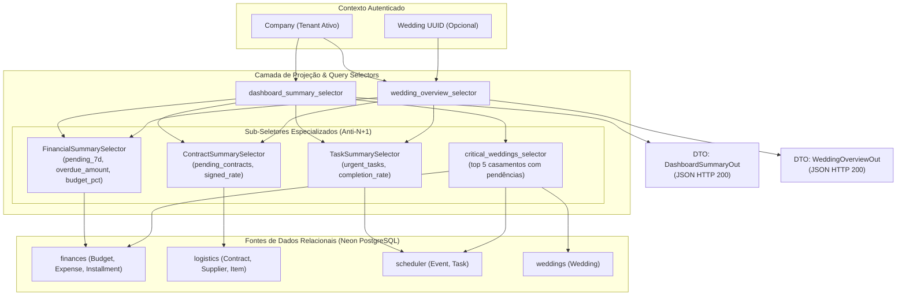

# Domínio de Dashboard & Indicadores Operacionais (Dashboard)

> **Categoria:** Domínios de Arquitetura (Bounded Contexts)
> **Relacionados:** [Padrão Query Selectors](../concepts/query-selectors-pattern.md) · [Estratégia de Multi-Tenancy](../concepts/multi-tenancy-strategy.md) · [ADR-006: Service Layer](../adr/006-service-layer.md) · [ADR-022: Rotas Estáticas para Performance](../adr/022-static-routes-for-performance.md) · [Weddings Domain](weddings-domain.md) · [Finances Domain](finances-domain.md) · [Logistics Domain](logistics-domain.md) · [Scheduler Domain](scheduler-domain.md) · [Reporting Domain](reporting-domain.md)

---

## 1. Visão Geral do Domínio

O domínio de **Dashboard** é responsável pela consolidação e projeção analítica em tempo real de todas as operações da assessoria. Ele não possui tabelas de persistência próprias; em vez disso, atua como uma camada de projeção e agregação em tempo real (CQRS-lite Read Model) que consolida métricas dos domínios `Weddings`, `Finances`, `Logistics` e `Scheduler`.

Pilares arquiteturais de agregação e performance:
1. **Queries Otimizadas Anti-N+1:** Todas as agregações são resolvidas diretamente no motor SQL do PostgreSQL através de funções de agregação (`Sum`, `Count`), filtros condicionais (`filter=Q(...)`) e anotações agregadas (`annotate`), evitando loops em memória.
2. **Duplo Nível de Projeção:**
   - **Dashboard Consolidado da Empresa (`dashboard_summary_selector`):** Visão executiva macro com total de parcelas a vencer em 7 dias, montante em atraso, contratos pendentes, tarefas urgentes e lista dos 5 casamentos mais críticos.
   - **Visão Geral do Casamento (`wedding_overview_selector`):** Visão micro com contagem regressiva em dias, percentual de orçamento consumido, taxa de conclusão de tarefas, contratos assinados e distribuição por categorias de despesa.
3. **Imutabilidade e Tipagem Estrita:** Respostas encapsuladas em schemas tipados para consumo automático via Orval no frontend.

---

## 2. Diagrama de Agregação de KPIs do Dashboard



---

## 3. Tabela de Projeções, Indicadores e Otimizações

| Projeção / Indicador | Seletor Responsável | Fonte de Dados | Estratégia de Consulta & Otimização Anti-N+1 |
| :--- | :--- | :--- | :--- |
| **`pending_installments_7d`** | `FinancialSummarySelector.pending_installments_7d` | `finances.Installment` | Agregação com `Sum('amount', filter=Q(status=PENDING, due_date__range=[today, today+7d]))`. |
| **`overdue_installments`** | `FinancialSummarySelector.overdue_installments` | `finances.Installment` | Agregação única devolvendo a tupla `(overdue_amount, overdue_count)` filtrando `due_date < today` e `status != PAID`. |
| **`urgent_tasks_count`** | `TaskSummarySelector.urgent_tasks_count` | `scheduler.Task` | Contagem rápida com `Count('id', filter=Q(is_completed=False, due_date__lte=today+7d))`. |
| **`pending_contracts_count`** | `ContractSummarySelector.pending_contracts_count` | `logistics.Contract` | Contagem direta filtrando `status__in=[DRAFT, PENDING]`. |
| **`critical_weddings`** | `critical_weddings_selector` | `weddings.Wedding` | Consulta anotada com `incomplete_tasks` e `overdue_installments`, filtrando eventos nos próximos 90 dias com `limit=5`. |
| **`budget_percentage_used`** | `FinancialSummarySelector.budget_percentage_used` | `finances.Budget` & `Installment` | Razão entre `total_overall_spent` (parcelas `PAID`) e `total_estimated` do orçamento mestre. |
| **`categories_summary`** | `FinancialSummarySelector.categories_summary` | `finances.BudgetCategory` | Query anotada com `allocated_budget` e soma de parcelas pagas por categoria. |

---

## 4. Transclusão de Código Real

### A. Seletor Consolidado da Empresa (`dashboard_summary_selector`)
```python
--8<-- "backend/apps/reporting/selectors/dashboard_selectors.py:27:93"
```

### B. Seletor Detalhado do Casamento (`wedding_overview_selector`)
```python
--8<-- "backend/apps/reporting/selectors/dashboard_selectors.py:95:158"
```

---

## 5. Mapeamento de Camadas (Fullstack)

### Camada de Backend (`backend/apps/reporting/`)
- **Query Selectors:** `selectors/dashboard_selectors.py`, `selectors/summaries/financial.py`, `selectors/summaries/contract.py`, `selectors/summaries/task.py`.
- **Endpoints:** `api.py` com rotas `GET /api/v1/dashboard/summary/` e `GET /api/v1/dashboard/wedding/{uuid}/`.

### Camada de Frontend (`frontend/src/features/dashboard/`)
- **Containers (Smart):** `DashboardPage.tsx`, `DashboardOperations.tsx`, `WeddingMonthlyChart.tsx`.
- **Views (Dumb Presenters):** `DashboardPageView.tsx`, `StatsCards.tsx`, `WeddingStatsCards.tsx`, `CriticalWeddings.tsx`, `UpcomingAppointments.tsx`, `UpcomingInstallments.tsx`, `WeddingBudgetBreakdown.tsx`.
- **Hooks Customizados:** `useDashboardData.ts`, `useDashboardOperations.ts`.
- **Utilitários:** `chart-helpers.ts` (funções puras de formatação e agrupamento temporal para Recharts).

---

## 6. Links e Referências Cruzadas

- [Padrão Query Selectors](../concepts/query-selectors-pattern.md)
- [Estratégia de Multi-Tenancy](../concepts/multi-tenancy-strategy.md)
- [ADR-006: Service Layer](../adr/006-service-layer.md)
- [ADR-022: Rotas Estáticas para Performance](../adr/022-static-routes-for-performance.md)
- [Weddings Domain](weddings-domain.md)
- [Finances Domain](finances-domain.md)
- [Logistics Domain](logistics-domain.md)
- [Scheduler Domain](scheduler-domain.md)
- [Reporting Domain](reporting-domain.md)
