# Domínio de Dashboard & Indicadores Operacionais (Dashboard)

> **Categoria:** Domínios de Arquitetura (Bounded Contexts)
> **Relacionados:** [Padrão Anti-Data-Stitching no Frontend](../concepts/anti-data-stitching-pattern.md) · [Padrão Smart/Dumb Components](../concepts/smart-dumb-components.md) · [Padrão Query Selectors](../concepts/query-selectors-pattern.md) · [Estratégia de Multi-Tenancy](../concepts/multi-tenancy-strategy.md) · [ADR-006: Service Layer](../adr/006-service-layer.md) · [ADR-024: Padrão Smart/Dumb](../adr/024-padrao-smart-dumb-desacoplamento-componentes-frontend.md) · [ADR-031: Isolamento de Bounded Contexts](../adr/031-inter-module-communication.md) · [Weddings Domain](weddings-domain.md) · [Finances Domain](finances-domain.md) · [Logistics Domain](logistics-domain.md) · [Scheduler Domain](scheduler-domain.md) · [Reporting Domain](reporting-domain.md)

---

## 1. Visão Geral do Domínio

O domínio de **Dashboard** é responsável pela consolidação e projeção analítica em tempo real de todas as operações da assessoria. Ele não possui tabelas de persistência próprias; em vez disso, atua como uma camada de projeção e agregação em tempo real (CQRS-lite Read Model) que consolida métricas dos domínios `Weddings`, `Finances`, `Logistics` e `Scheduler`.

A arquitetura analítica é estruturada em **quatro eixos de agregação especializados**:

1. **Resumo Executivo da Empresa (`dashboard_summary_selector`):** Visão macro com KPIs financeiros, operacionais e de contratos. Retorna o DTO `DashboardSummaryOut` contendo não apenas os números consolidados, mas também as coleções completas de detalhamento (`upcoming_installments`, `overdue_installments`, `urgent_tasks`, `pending_contracts` e `critical_weddings`), viabilizando a abertura instantânea de *DetailSheets* sem requisições de rede adicionais.
2. **Visão Analítica do Casamento (`wedding_overview_selector`):** Visão micro focada em uma cerimônia individual. Retorna o DTO `WeddingDashboardOut` com `total_allocated`, `total_spent`, contagem regressiva em dias, taxa de conclusão de tarefas, contratos assinados e distribuição percentual de gastos por categoria.
3. **Séries Temporais e Projeções Anuais:** Endpoints otimizados para gráficos temporais consumidos via Recharts:
   - Fluxo de Caixa Mensal (`/chart/cash-flow/` $\rightarrow$ `list[CashFlowMonthOut]`): Compara pagamentos realizados contra previsões mensais no ano.
   - Progresso de Tarefas (`/chart/task-progress/` $\rightarrow$ `list[TaskProgressWeddingOut]`): Percentual de conclusão e volume de pendências por casamento.
4. **Painel de Operações Unificado (`dashboard_operations_selector`):** Visão operacional consolidada que retorna o DTO `DashboardOperationsOut` com os Top 5 casamentos futuros (`upcoming_weddings`), Top 5 tarefas urgentes (`urgent_tasks`) e Top 5 contratos pendentes (`pending_contracts`), aplicando o [Padrão Anti-Data-Stitching](../concepts/anti-data-stitching-pattern.md) para eliminar loops e dicionários relacionais no cliente.

---

## 2. Diagrama de Agregação de KPIs do Dashboard

```mermaid
flowchart TD
    subgraph MultiTenantContext["Contexto Autenticado"]
        COMPANY["Company (Tenant Ativo)"]
        WEDDING_UUID["Wedding UUID (Opcional)"]
    end

    subgraph SelectorsLayer["Camada de Projeção & Query Selectors (apps/reporting)"]
        DS_SEL["dashboard_summary_selector"]
        WO_SEL["wedding_overview_selector"]
        DO_SEL["dashboard_operations_selector"]
        CF_SEL["FinancialSummarySelector.cash_flow_by_month"]
        TP_SEL["TaskSummarySelector.tasks_progress_by_wedding"]

        subgraph Summaries["Sub-Seletores Especializados (Anti-N+1)"]
            FIN_SUM["FinancialSummarySelector"]
            TASK_SUM["TaskSummarySelector"]
            CONT_SUM["ContractSummarySelector"]
            CRIT_WED["critical_weddings_selector"]
        end
    end

    subgraph Sources["Fontes de Dados Relacionais (Neon PostgreSQL)"]
        DB_FIN["finances (Budget, Expense, Installment)"]
        DB_LOG["logistics (Contract, Supplier, Item)"]
        DB_SCHED["scheduler (Event, Task)"]
        DB_WED["weddings (Wedding)"]
    end

    COMPANY --> DS_SEL & DO_SEL & CF_SEL & TP_SEL
    COMPANY & WEDDING_UUID --> WO_SEL

    DS_SEL --> FIN_SUM & TASK_SUM & CONT_SUM & CRIT_WED
    DO_SEL --> TASK_SUM & CONT_SUM & DB_WED
    WO_SEL --> FIN_SUM & TASK_SUM & CONT_SUM

    FIN_SUM --> DB_FIN
    TASK_SUM --> DB_SCHED
    CONT_SUM --> DB_LOG
    CRIT_WED --> DB_WED & DB_FIN & DB_SCHED

    DS_SEL --> OUT_DASH["DTO: DashboardSummaryOut"]
    WO_SEL --> OUT_WED["DTO: WeddingDashboardOut"]
    DO_SEL --> OUT_OPS["DTO: DashboardOperationsOut"]
    CF_SEL --> OUT_CF["DTO: list[CashFlowMonthOut]"]
    TP_SEL --> OUT_TP["DTO: list[TaskProgressWeddingOut]"]
```



---

## 3. Tabela de Eixos Analíticos e Otimizações

| Eixo Analítico | Endpoint & Seletor | DTO de Resposta | Estratégia de Consulta & Otimização Anti-N+1 |
| :--- | :--- | :--- | :--- |
| **1. Resumo Executivo** | `GET /summary/`<br/>`dashboard_summary_selector` | `DashboardSummaryOut` | Agregações condicionais em SQL com `Sum` e `Count`. Retorna listas de detalhamento embutidas no payload para consumo direto pelos modais do frontend. |
| **2. Visão do Casamento** | `GET /wedding/{uuid}/`<br/>`wedding_overview_selector` | `WeddingDashboardOut` | Cruza `total_allocated` do orçamento mestre com `total_spent` das parcelas pagas, anota taxa de conclusão de tarefas e distribuição de categorias em $< 30\text{ ms}$. |
| **3. Séries Temporais** | `GET /chart/cash-flow/`<br/>`cash_flow_by_month` | `list[CashFlowMonthOut]` | Agrupamento por mês (`TruncMonth`) somando valores pagos vs pendentes em uma única query com filtro de ano. |
| **3. Séries Temporais** | `GET /chart/task-progress/`<br/>`tasks_progress_by_wedding` | `list[TaskProgressWeddingOut]` | Agrupamento por casamento anotando contagem de tarefas concluídas e total de tarefas com filtro de ano. |
| **4. Painel de Operações** | `GET /operations/`<br/>`dashboard_operations_selector` | `DashboardOperationsOut` | Consulta atômica com `LIMIT 5` para casamentos futuros, tarefas urgentes e contratos pendentes com `wedding_name` e `supplier_name` pré-projetados. |

---

## 4. Implementação no Código-Fonte Real

- **Seletores Centrais:** [`dashboard_summary_selector()`](../../../backend/apps/reporting/selectors/dashboard_selectors.py), [`wedding_overview_selector()`](../../../backend/apps/reporting/selectors/dashboard_selectors.py), [`dashboard_operations_selector()`](../../../backend/apps/reporting/selectors/dashboard_selectors.py).
- **Sub-Seletores Especializados:** [`FinancialSummarySelector`](../../../backend/apps/reporting/selectors/summaries/financial.py), [`TaskSummarySelector`](../../../backend/apps/reporting/selectors/summaries/task.py), [`ContractSummarySelector`](../../../backend/apps/reporting/selectors/summaries/contract.py).

### A. Seletor do Painel de Operações (`dashboard_operations_selector`)

```python
def dashboard_operations_selector(*, company: Company) -> dict[str, Any]:
    today = timezone.localdate()

    # Top 5 casamentos futuros
    upcoming_weddings = (
        Wedding.objects.for_tenant(company)
        .filter(date__gte=today)
        .exclude(status=Wedding.StatusChoices.CANCELED)
        .order_by("date")[:5]
    )

    # Top 5 tarefas urgentes com wedding_name projetado
    urgent_tasks = TaskSummarySelector.urgent_tasks_list(company=company, limit=5)

    # Top 5 contratos pendentes com wedding_name e supplier_name
    pending_contracts = ContractSummarySelector.pending_contracts_list(company=company, limit=5)

    return {
        "upcoming_weddings": upcoming_weddings,
        "urgent_tasks": urgent_tasks,
        "pending_contracts": pending_contracts,
    }
```

---

## 5. Mapeamento de Camadas (Fullstack)

### Camada de Backend (`backend/apps/reporting/`)
- **Query Selectors:**
  - `selectors/dashboard_selectors.py`: `dashboard_summary_selector`, `wedding_overview_selector`, `dashboard_operations_selector`.
  - `selectors/summaries/financial.py`: `FinancialSummarySelector` (incluindo `cash_flow_by_month`).
  - `selectors/summaries/task.py`: `TaskSummarySelector` (incluindo `tasks_progress_by_wedding`).
  - `selectors/summaries/contract.py`: `ContractSummarySelector`.
- **Endpoints Ninja:**
  - `GET /api/v1/dashboard/summary/`: Resumo executivo com DTO `DashboardSummaryOut`.
  - `GET /api/v1/dashboard/wedding/{uuid}/`: Detalhamento do casamento com DTO `WeddingDashboardOut`.
  - `GET /api/v1/dashboard/chart/cash-flow/`: Série temporal de fluxo de caixa com `CashFlowMonthOut`.
  - `GET /api/v1/dashboard/chart/task-progress/`: Progresso de tarefas com `TaskProgressWeddingOut`.
  - `GET /api/v1/dashboard/operations/`: Operações consolidadas com DTO `DashboardOperationsOut`.

### Camada de Frontend (`frontend/src/features/dashboard/`)
- **Padrão Smart/Dumb ([ADR-024](../concepts/smart-dumb-components.md)):**
  - **Smart Containers:**
    - [`DashboardPage.tsx`](../../../frontend/src/features/dashboard/pages/DashboardPage.tsx): Orquestra o carregamento de métricas executivas (`useDashboardSummary`) e casamentos do tenant.
    - [`DashboardOperations.tsx`](../../../frontend/src/features/dashboard/components/DashboardOperations.tsx): Orquestra o hook `useDashboardOperations()` (`useDashboardOperationsList`) e a navegação entre casamentos.
    - [`WeddingMonthlyChart.tsx`](../../../frontend/src/features/dashboard/components/WeddingMonthlyChart.tsx): Orquestra as abas gráficas e busca preguiçosa dos endpoints de séries temporais.
  - **Dumb Presenters (Views Puras):**
    - [`DashboardOperationsView.tsx`](../../../frontend/src/features/dashboard/components/DashboardOperationsView.tsx): View síncrona orientada estritamente por props tipadas (`UpcomingWeddingOut[]`, `DashboardTaskDetailOut[]`, `DashboardContractDetailOut[]`).
    - [`WeddingMonthlyChartView.tsx`](../../../frontend/src/features/dashboard/components/WeddingMonthlyChartView.tsx): View síncrona que recebe dados pré-formatados e delega para o Recharts sem dependência de rede.
    - [`StatsCards.tsx`](../../../frontend/src/features/dashboard/components/StatsCards.tsx): View síncrona que recebe `summary?: DashboardSummaryOut` e renderiza os 4 cartões de KPIs e *DetailSheets* em memória sem efetuar novas consultas HTTP.
- **Utilitários Puros:** [`chart-helpers.ts`](../../../frontend/src/features/dashboard/utils/chart-helpers.ts) (funções puras de formatação monetária e agrupamento temporal).

---

## 6. Links e Referências Cruzadas

- [Padrão Query Selectors](../concepts/query-selectors-pattern.md)
- [Estratégia de Multi-Tenancy](../concepts/multi-tenancy-strategy.md)
- [ADR-006: Service Layer](../adr/006-service-layer.md)
- [ADR-022: Rotas Estáticas para Performance](../adr/022-static-routes-for-performance.md)
- [Weddings Domain](weddings-domain.md)
- [Finances Domain](finances-domain.md)
- [Logistics Domain](logistics-domain.md)
- [Scheduler Domain](scheduler-domain.md)
- [Reporting Domain](reporting-domain.md)
