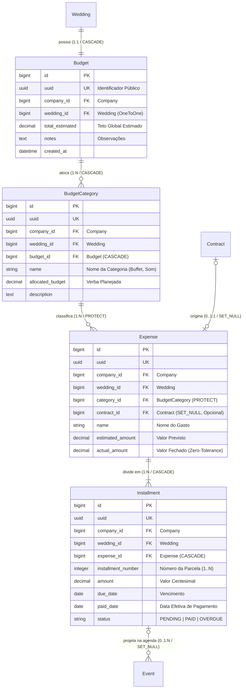

# Domínio Financeiro & Gestão Orçamentária (Finances)

> **Categoria:** Domínios de Arquitetura (Bounded Contexts)
> **Relacionados:** [Regras de Integridade Contábil & Financeira](../business-rules/finances/financial-integrity-rules.md) · [Distribuição Orçamentária & Categorias](../business-rules/finances/budget-category-distribution.md) · [Lógica de Tolerância Zero & Parcelas Atrasadas](../business-rules/finances/installment-overdue-logic.md) · [Integração Financeiro-Agenda](../business-rules/finances/payment-schedule-integration.md) · [ADR-006: Service Layer](../adr/006-service-layer.md) · [ADR-010: Tolerância Zero em Parcelas](../adr/010-tolerance-zero.md) · [ADR-011: BaseModel save com full_clean](../adr/011-basemodel-save-full-clean.md) · [ADR-023: Desacoplamento de Módulos](../adr/023-desacoplamento-modulos-scheduler-finances-weddings.md)

---

## 1. Visão Geral do Domínio

O domínio de **Finances** gerencia todo o planejamento orçamentário, alocação de verbas por categorias temáticas (Buffet, Decoração, Fotografia), controle de despesas reais e parcelamentos de pagamentos.

Pilares arquiteturais de integridade contábil:
1. **Regra de Tolerância Zero (BR-F01 / ADR-010):** A soma exata dos valores centesimais das parcelas (`Installment.amount`) deve ser estritamente idêntica ao valor real da despesa (`Expense.actual_amount`).
2. **Conformidade com Contrato Logístico (BR-F02):** Quando uma despesa é vinculada a um contrato assinado, o `actual_amount` inicial da despesa deve coincidir com o `total_amount` do contrato.
3. **Proteção contra Deleção Acidental (`models.PROTECT`):** Categorias com despesas cadastradas não podem ser excluídas sem reatribuição prévia.
4. **Cálculo Preciso de Saldo e Gastos:** Propriedades e anotações SQL (`with_total_spent()`) que somam exclusivamente parcelas com status `PAID` para determinar o montante executado.
5. **Integração Desacoplada com o Scheduler (BR-S01):** Cada parcela gerada cria automaticamente um evento correspondente na agenda do casamento como registro *read-only*.

---

## 2. Diagrama ERD Completo do Domínio Financeiro

---

## 3. Tabela de Entidades e Invariantes de Persistência

| Entidade | Papel & Relações | Campos & Tipos | Invariantes de Persistência & Regras Contábeis |
| :--- | :--- | :--- | :--- |
| **`Budget`** | Orçamento Mestre (1:1 com `Wedding`) | `wedding` (`OneToOneField`, `CASCADE`), `total_estimated` (Decimal $\ge 0.00$), `notes` | **Unicidade:** Cada casamento possui exatamente 1 orçamento global (ADR-003). **Propriedade `total_overall_spent`:** Retorna a soma de todas as parcelas `PAID` associadas às categorias do orçamento. |
| **`BudgetCategory`** | Alocação Temática (N:1 com `Budget`) | `budget` (`ForeignKey`, `CASCADE`), `name` (max 100), `allocated_budget` (Decimal $\ge 0.00$) | **Unicidade de Nome:** `unique_together = [["budget", "name"]]`. **Propriedade `total_spent`:** Retorna a soma das parcelas `PAID` pertencentes às despesas desta categoria. **Regra de Proteção:** `on_delete=models.PROTECT` em `Expense.category` impede deleção da categoria se houver despesas. |
| **`Expense`** | Compromisso Financeiro (N:1 com `Category`) | `category` (`ForeignKey`, `PROTECT`), `contract` (`OneToOneField`, `SET_NULL`, nullable), `name`, `estimated_amount`, `actual_amount` | **Tolerância Zero (BR-F01):** Para despesas persistidas (`self.pk`), `sum(installments.amount) == self.actual_amount`. **Conformidade Contratual (BR-F02):** Na criação, se vinculada a contrato, `actual_amount == contract.total_amount`. |
| **`Installment`** | Parcela Financeira (N:1 com `Expense`) | `expense` (`ForeignKey`, `CASCADE`), `installment_number` (Int $\ge 1$), `amount` (Decimal $\ge 0.00$), `due_date`, `paid_date`, `status` (`PENDING`, `PAID`, `OVERDUE`) | **Unicidade Sequencial:** `unique_together = [["expense", "installment_number"]]`. **Consistência de Pagamento:** Se `paid_date` preenchida, `status == PAID`. Se `status == PAID`, `paid_date` é obrigatória. **Integração com Agenda (BR-S01):** Cada parcela projeta um evento de pagamento no Scheduler. |

---

## 4. Implementação do Modelo de Domínio e Serviços

O módulo segue rigorosamente a **ADR-030** (Rich Domain Model & Service Layer), estruturado em três níveis de validação:

- **Modelos de Domínio Ricos:**
  - [`apps/finances/models/installment.py`](../../../backend/apps/finances/models/installment.py) (`Installment`): Encapsula a máquina de estados finitos (`PENDING`, `PAID`, `OVERDUE`), métodos semânticos de ciclo de vida (`mark_as_paid()`, `unmark_as_paid()`, `mark_as_overdue()`) e invariantes temporais em `clean()`.
  - [`apps/finances/models/expense.py`](../../../backend/apps/finances/models/expense.py) (`Expense`): Encapsula propriedades de liquidação em memória (`is_settled`, `is_partially_paid`, `balance_due`, `payment_progress_percent`) e a regra de Tolerância Zero (ADR-010 / BR-F01) no `clean()`.
  - [`apps/finances/models/budget_category.py`](../../../backend/apps/finances/models/budget_category.py) (`BudgetCategory`): Encapsula cálculo de verba restante (`remaining_budget`), detecção de estouro (`is_over_budget`) e percentual de utilização orçamentária.
  - [`apps/finances/models/budget.py`](../../../backend/apps/finances/models/budget.py) (`Budget`): Encapsula o teto global do casamento (`remaining_overall_budget`, `is_over_budget`) e garante a relação $1:1$ (ADR-003).
- **Casos de Uso e Serviços:**
  - [`apps/finances/services/installment_service.py`](../../../backend/apps/finances/services/installment_service.py) (`InstallmentService`): Orquestra a geração inicial de parcelas com ajuste centesimal na última cota, reversão atômica, sincronização de eventos com a agenda via fachada do scheduler e mutações cirúrgicas com `update_fields`.
  - [`apps/finances/services/expense_service.py`](../../../backend/apps/finances/services/expense_service.py) (`ExpenseService`): Coordena a criação de despesas, validação com o contrato vinculado (BR-F02), redistribuição proporcional, exclusão segura e importação via `ExpenseService.from_document()`, que consome a fachada pública [`apps.logistics.interfaces.get_contract_for_company`](../../../backend/apps/logistics/interfaces.py) sem acoplamento direto com os models de logística (ADR-031).
  - [`apps/finances/services/budget_category_service.py`](../../../backend/apps/finances/services/budget_category_service.py) (`BudgetCategoryService`): Gerencia alocações sob trava pessimista (`select_for_update`) prevenindo estouro concorrente (TOCTOU).
  - [`apps/finances/services/budget_service.py`](../../../backend/apps/finances/services/budget_service.py) (`BudgetService`): Controla o orçamento mestre por tenant.
- **Seletores de Leitura CQRS:**
  - [`apps/finances/selectors/expense_selectors.py`](../../../backend/apps/finances/selectors/expense_selectors.py) (`expense_list_selector`, `expense_get_selector`): Consultas otimizadas via `ExpenseQuerySet.with_details()` com anotações pré-calculadas em SQL (`installments_count`, `paid_installments_count`, `total_paid`, `total_pending`).
  - [`apps/finances/selectors/budget_selectors.py`](../../../backend/apps/finances/selectors/budget_selectors.py): Consultas do orçamento que integram a função `_attach_tenant_budget_metrics()`, anotando métricas analíticas globais do tenant: `tenant_average_budget` (média de orçamento entre casamentos da empresa) e `comparison_percentage` (desvio percentual do casamento frente à média corporativa).
  - [`apps/finances/selectors/budget_category_selectors.py`](../../../backend/apps/finances/selectors/budget_category_selectors.py) e [`installment_selectors.py`](../../../backend/apps/finances/selectors/installment_selectors.py): Consultas analíticas e agregações isoladas por tenant.
- **Validação de Entrada (Pydantic):**
  - [`apps/finances/schemas/`](../../../backend/apps/finances/schemas/): Pacote modular (`budget.py`, `budget_category.py`, `expense.py`, `installment.py`) com regras de Nível 1 (sanitização de strings via `str_strip_whitespace=True`, limites de caracteres e valores numéricos não negativos).

---

## 5. Mapeamento de Camadas (Fullstack)

### Camada de Backend (`backend/apps/finances/`)
- **Modelos:** `Budget` (`budget.py`), `BudgetCategory` (`budget_category.py`), `Expense` (`expense.py`), `Installment` (`installment.py`) em `models/`.
- **Schemas:** `Budget` (`budget.py`), `BudgetCategory` (`budget_category.py`), `Expense` (`expense.py`), `Installment` (`installment.py`) em `schemas/`.
- **Managers:** `BudgetManager`, `BudgetCategoryManager`, `ExpenseManager`, `InstallmentManager` em `managers.py`.
- **Services:** `budget_service.py`, `budget_category_service.py`, `expense_service.py`, `installment_service.py` em `services/`.
- **Selectors:** `budget_selectors.py`, `budget_category_selectors.py`, `expense_selectors.py`, `installment_selectors.py` em `selectors/`.
- **Endpoints:**
  - Orçamentos: `GET /finances/budgets/`, `GET /finances/budgets/{uuid}/`.
  - Categorias: `GET /finances/categories/`, `POST /finances/categories/`, `PUT /finances/categories/{uuid}/`, `DELETE /finances/categories/{uuid}/`.
  - Despesas: `GET /finances/expenses/`, `POST /finances/expenses/`, `GET /finances/expenses/{uuid}/`, `PATCH /finances/expenses/{uuid}/`, `DELETE /finances/expenses/{uuid}/`, rota de busca de contratos `GET /finances/expenses/contracts-lookup/` (consumindo [`apps.logistics.interfaces.list_contracts_for_wedding`](../../../backend/apps/logistics/interfaces.py)) e `GET /finances/expenses/{uuid}/from-document/`.
  - Parcelas: `GET /finances/installments/`, `POST /finances/installments/{uuid}/pay/`, `POST /finances/installments/{uuid}/unpay/`.
- **Management Command:** `python manage.py mark_overdue_installments` (atualização automática de parcelas com data de vencimento no passado).

### Camada de Frontend (`frontend/src/features/finances/`)
- **Padrão Smart/Dumb ([ADR-024](../concepts/smart-dumb-components.md)):**
  - **Containers (Smart):** Orquestram os hooks gerados pelo Orval (`useFinancesExpensesList`, `useFinancesBudgetsList`), gerenciam o estado de filtros temporais e dialogs de mutação.
  - **Presenters (Dumb):** Componentes síncronos puros orientados a props (tabelas de despesas e parcelas, resumo executivo de categorias e `ExpenseDetailSheet`).
  - **Visualização Analítica:** Gráficos interativos de distribuição orçamentária via Recharts e cartões de KPI financeiro.
  - **Formulários e Mutações:** Integração com `react-hook-form` + Zod para validação antecipada de tolerância zero e notificações de feedback via Sonner.

---

## 6. Links e Regras de Negócio Associadas

- [Regras de Integridade Contábil & Financeira](../business-rules/finances/financial-integrity-rules.md)
- [Distribuição Orçamentária & Categorias](../business-rules/finances/budget-category-distribution.md)
- [Lógica de Tolerância Zero & Parcelas Atrasadas](../business-rules/finances/installment-overdue-logic.md)
- [Integração Financeiro-Agenda](../business-rules/finances/payment-schedule-integration.md)
- [ADR-010: Tolerância Zero em Parcelas](../adr/010-tolerance-zero.md)
- [ADR-011: BaseModel save com full_clean](../adr/011-basemodel-save-full-clean.md)
- [ADR-023: Desacoplamento de Módulos](../adr/023-desacoplamento-modulos-scheduler-finances-weddings.md)
- [Modelos Base & Padrões Core](../../reference/models/core-models.md)
