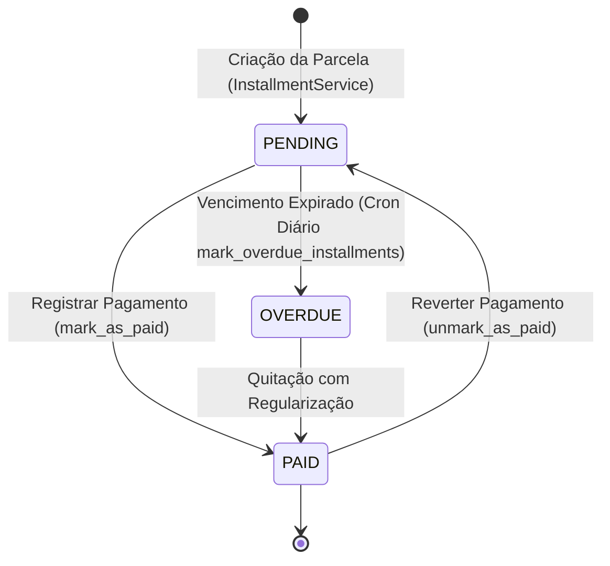

# Domínio Financeiro & Gestão Orçamentária (Finances)

> **Categoria:** Domínios de Arquitetura (Bounded Contexts)
> **Relacionados:** [Catálogo Canônico de Regras de Negócio](../business-rules/index.md) · [ADR-006: Service Layer](../adr/006-service-layer.md) · [ADR-010: Tolerância Zero](../adr/010-tolerance-zero.md) · [ADR-011: BaseModel save com full_clean](../adr/011-basemodel-save-full-clean.md) · [ADR-023: Desacoplamento de Módulos](../adr/023-desacoplamento-modulos-scheduler-finances-weddings.md) · [ADR-030: Rich Domain Model](../adr/030-rich-domain-model-service-layer.md) · [ADR-031: Comunicação Entre Módulos](../adr/031-inter-module-communication.md)

O **Módulo Financeiro (`finances`)** é o núcleo de controle orçamentário e contábil do *Wedding Management System*. Ele permite que assessores de eventos e casais definam o teto de gastos do casamento, distribuam verbas entre centros de custo, registrem compromissos financeiros e acompanhem o fluxo de desembolsos em parcelas com precisão matemática rigorosa.

---

## 1. Visão de Negócio & Capacidades Operacionais

O planejamento orçamentário de um casamento envolve dezenas de contratos, fornecedores distintos e múltiplos prazos de pagamento. Para eliminar ambiguidades no fluxo de caixa e prevenir divergências em auditorias, o módulo opera sob confiabilidade contábil absoluta.

### Principais Capacidades Operacionais
- **Orçamento Mestre Unificado:** Definição do teto orçamentário global por casamento (relação 1:1).
- **Categorização Estruturada:** Distribuição proporcional do orçamento em centros de custo temáticos (Buffet, Espaço, Decoração, Fotografia, Música).
- **Contratos & Despesas:** Registro detalhado de compromissos vinculados a fornecedores homologados ou contratações diretas.
- **Plano de Parcelamento Flexível:** Divisão de despesas em parcelas com controle de datas de vencimento, formas de pagamento e status em tempo real.
- **Detecção Automatizada de Atrasos:** Rotina diária de auditoria temporal que identifica parcelas expiradas e atualiza o estado financeiro do evento.
- **Monitoramento em Tempo Real:** Consolidação instantânea de teto total, valor comprometido, valor efetivamente pago e saldo remanescente.

### Tolerância Zero & Integridade Contábil
No planejamento de casamentos, frações de centavos acumuladas em dezenas de fornecedores geram distorções financeiras. Por essa razão, a plataforma adota o princípio de **Tolerância Zero Centesimal (ADR-010 / BR-F01)**:
- **Precisão Decimal Estrita:** Todos os cálculos monetários utilizam o tipo `Decimal` do Python e colunas `DecimalField(max_digits=12, decimal_places=2)` no PostgreSQL Neon.
- **Prevenção de Drift Contábil:** A soma exata das parcelas nominais de uma despesa DEVE ser rigorosamente idêntica ao valor fechado da despesa (\(\sum \text{Installments.amount} \equiv \text{Expense.actual\_amount}\)). Discrepâncias de até R$ 0,01 são sumariamente rejeitadas pelo Service Layer com `DomainIntegrityError`.
- **Integridade Referencial com Proteção:** Categorias vinculadas a despesas ativas utilizam `on_delete=models.PROTECT`, impedindo deleções acidentais em cascata que destruam o histórico orçamentário.

### Ciclo de Vida da Parcela & Máquina de Estados
Cada despesa pode ser quitada à vista ou parcelada. O ciclo de vida de uma parcela é gerenciado por uma máquina de estados finita:
- **`PENDING` (Pendente):** Parcela cadastrada cujo prazo de vencimento ainda não expirou (`due_date >= hoje`).
- **`PAID` (Paga):** Parcela liquidada e confirmada pelo assessor ou casal, com data de quitação (`paid_date`) e comprovante registrados.
- **`OVERDUE` (Em Atraso):** Parcela não quitada cuja data de vencimento é estritamente anterior à data atual (`due_date < hoje`).

---

## 2. Modelo de Dados & Diagrama ERD

### Tabela de Entidades e Invariantes de Persistência

| Entidade | Papel & Relações | Campos & Tipos | Invariantes de Persistência & Regras Contábeis |
| :--- | :--- | :--- | :--- |
| **`Budget`** | Orçamento Mestre (1:1 com `Wedding`) | `wedding` (`OneToOneField`, `CASCADE`), `total_estimated` (Decimal $\ge 0.00$), `notes` | **Unicidade:** Cada casamento possui exatamente 1 orçamento global. **Propriedade `total_overall_spent`:** Retorna a soma de todas as parcelas `PAID` associadas às categorias do orçamento. |
| **`BudgetCategory`** | Alocação Temática (N:1 com `Budget`) | `budget` (`ForeignKey`, `CASCADE`), `name` (max 100), `allocated_budget` (Decimal $\ge 0.00$) | **Unicidade de Nome:** `unique_together = [["budget", "name"]]`. **Propriedade `total_spent`:** Soma das parcelas `PAID` pertencentes às despesas desta categoria. **Regra de Proteção:** `on_delete=models.PROTECT` em `Expense.category` impede deleção da categoria se houver despesas. |
| **`Expense`** | Compromisso Financeiro (N:1 com `Category`) | `category` (`ForeignKey`, `PROTECT`), `contract` (`OneToOneField`, `SET_NULL`, nullable), `name`, `estimated_amount`, `actual_amount` | **Tolerância Zero (BR-F01):** Para despesas persistidas, \(\sum \text{installments.amount} \equiv \text{actual\_amount}\). **Conformidade Contratual (BR-F02):** Na criação vinculada a contrato, `actual_amount == contract.total_amount`. |
| **`Installment`** | Parcela Financeira (N:1 com `Expense`) | `expense` (`ForeignKey`, `CASCADE`), `installment_number` (Int $\ge 1$), `amount` (Decimal $\ge 0.00$), `due_date`, `paid_date`, `status` (`PENDING`, `PAID`, `OVERDUE`) | **Unicidade Sequencial:** `unique_together = [["expense", "installment_number"]]`. **Consistência de Pagamento:** Se `paid_date` preenchida, `status == PAID`. Se `status == PAID`, `paid_date` é obrigatória. **Integração com Agenda (BR-S01):** Cada parcela projeta um evento de pagamento no Scheduler. |

---

## 3. Matriz Consolidada de Regras de Negócio (SSOT)

| Código Canônico | Regra / Especificação | Escopo / Responsabilidade | Entidades Envolvidas | Nota Detalhada |
| :--- | :--- | :--- | :--- | :--- |
| **`BR-F01`** | **Tolerância Zero Centesimal** | Conservação estrita na soma das parcelas (\(\sum \text{parcelas} \equiv \text{actual\_amount}\)), sem arredondamento cumulativo e imutabilidade de parcelas quitadas. | `Expense`, `Installment` | [financial-integrity-rules.md](../business-rules/finances/financial-integrity-rules.md) |
| **`BR-F02`** | **Conformidade Contratual** | Quando vinculada a contrato de logística, o `actual_amount` inicial deve corresponder ao `total_amount` do contrato. | `Expense`, `Contract` | [financial-integrity-rules.md](../business-rules/finances/financial-integrity-rules.md) |
| **`BR-F03`** | **Fronteira Multi-Casamento** | Casamento, categoria, despesa e contrato devem pertencer compulsoriamente ao mesmo `company` e mesmo `wedding`. | Todas | [financial-integrity-rules.md](../business-rules/finances/financial-integrity-rules.md) |
| **`BR-F04-A..D`** | **Distribuição Orçamentária** | Conservação do teto orçamentário (\(\sum A_k \le T_{\text{estimated}}\)), trava pessimista (*select_for_update*) anti-TOCTOU e proteção contra deleção de categoria ativa. | `Budget`, `BudgetCategory` | [budget-category-distribution.md](../business-rules/finances/budget-category-distribution.md) |
| **`BR-F05`** | **Máquina de Estados de Parcelas** | Transições de status de parcelas (`PENDING` $\to$ `PAID` / `OVERDUE`), quitação com data e reconciliação automática via cron OIDC. | `Installment`, `Notification` | [installment-overdue-logic.md](../business-rules/finances/installment-overdue-logic.md) |
| **`BR-F06`** | **Benchmark por Assessoria** | Cálculo analítico em tempo de leitura da média orçamentária da assessoria (\(\mu_{\text{tenant}}\)) e variação percentual relativa (\(\Delta\%\)). | `Budget`, `Company` | [tenant-budget-benchmark.md](../business-rules/finances/tenant-budget-benchmark.md) |

### Matriz de Integração e Relações Cruzadas
- **Com o Módulo de Logística:** Despesas podem ser associadas a contratos de fornecedores, exigindo paridade de valores e pertencimento ao mesmo casamento. Veja [Domínio de Logística](logistics-domain.md).
- **Com o Módulo de Cronograma:** Toda parcela gerada reflete atômica e automaticamente como um evento no calendário protegido por *read-only guard*. Veja [Domínio de Cronograma](scheduler-domain.md) e [Regra BR-S01](../business-rules/scheduler/payment-event-readonly-guard.md).
- **Com o Módulo de Notificações:** Parcelas que atingem a data de vencimento sem liquidação disparam alertas operacionais in-app para a assessoria. Veja [Domínio de Notificações](notifications-domain.md) e [Regras In-App](../business-rules/notifications/in-app-notifications-rules.md).

---

## 4. Arquitetura Fullstack do Módulo

O módulo segue rigorosamente a **ADR-030** (Rich Domain Model & Service Layer) estruturado em três níveis formais de validação:

### Backend (`backend/apps/finances/`)
- **Modelos Ricos (Nível 2 - Domínio):**
  - `Installment`: Encapsula a máquina de estados finitos (`PENDING`, `PAID`, `OVERDUE`), métodos semânticos de ciclo de vida (`mark_as_paid()`, `unmark_as_paid()`, `mark_as_overdue()`) e invariantes temporais em `clean()`.
  - `Expense`: Encapsula propriedades de liquidação em memória (`is_settled`, `is_partially_paid`, `balance_due`, `payment_progress_percent`) e a regra de Tolerância Zero (ADR-010 / BR-F01) no `clean()`.
  - `BudgetCategory`: Encapsula cálculo de verba restante (`remaining_budget`), detecção de estouro (`is_over_budget`) e percentual de utilização orçamentária.
  - `Budget`: Encapsula o teto global do casamento (`remaining_overall_budget`, `is_over_budget`) e garante a relação $1:1$.
- **Casos de Uso e Serviços (Nível 3 - Orquestração):**
  - `InstallmentService`: Orquestra geração inicial de parcelas com ajuste centesimal na última cota, reversão atômica, sincronização de eventos com a agenda via fachada do scheduler e mutações cirúrgicas com `update_fields`.
  - `ExpenseService`: Coordena criação de despesas, validação com o contrato vinculado (BR-F02), redistribuição proporcional, exclusão segura e importação via `ExpenseService.from_document()`.
  - `BudgetCategoryService`: Gerencia alocações sob trava pessimista (`select_for_update`) prevenindo estouro concorrente (TOCTOU).
  - `BudgetService`: Controla o orçamento mestre por tenant.
- **Seletores de Leitura CQRS:**
  - `expense_list_selector`, `expense_get_selector`: Consultas otimizadas via `ExpenseQuerySet.with_details()` com anotações pré-calculadas em SQL (`installments_count`, `paid_installments_count`, `total_paid`, `total_pending`).
  - `budget_selectors.py`: Consultas do orçamento que integram a função `_attach_tenant_budget_metrics()`, anotando métricas analíticas corporativas (`tenant_average_budget` e `comparison_percentage`).
  - `budget_category_selectors.py` e `installment_selectors.py`: Consultas analíticas e agregações isoladas por tenant.
- **Validação de Entrada (Nível 1 - Pydantic):**
  - Schemas modulares em `apps/finances/schemas/` (`budget.py`, `budget_category.py`, `expense.py`, `installment.py`) com sanitização de strings via `str_strip_whitespace=True`, limites de caracteres e valores numéricos não negativos.
- **Rotinas e Comandos:**
  - `python manage.py mark_overdue_installments`: Comando executado diariamente via Cloud Scheduler para transição em lote de parcelas vencidas.

### Frontend (`frontend/src/features/finances/`)
- **Padrão Smart/Dumb (ADR-024):**
  - **Smart Components (Containers):** Orquestram os hooks gerados pelo Orval (`useFinancesExpensesList`, `useFinancesBudgetsList`), gerenciam o estado de filtros temporais e dialogs de mutação.
  - **Dumb Components (Presenters):** Componentes síncronos puros orientados a props (tabelas de despesas e parcelas, resumo executivo de categorias e `ExpenseDetailSheet`).
  - **Visualização Analítica:** Gráficos interativos de distribuição orçamentária via Recharts e cartões de KPI financeiro.
  - **Formulários e Mutações:** Integração com `react-hook-form` + Zod para validação antecipada de tolerância zero e notificações de feedback via Sonner.

---

## 5. Integrações & Interfaces Públicas (ADR-031)

Em estrita conformidade com a arquitetura de isolamento de Bounded Contexts:
1. **Consumo de Logística:** `ExpenseService` não importa models de logística diretamente. Consome exclusivamente a fachada pública `apps.logistics.interfaces.get_contract_for_company`.
2. **Projeção no Scheduler:** A sincronização de parcelas no calendário não muta models do scheduler diretamente; delega para `apps.scheduler.interfaces.sync_installment_event`.
3. **Disparo de Notificações:** Eventos de parcelas vencidas emitem alertas através de `apps.notifications.interfaces.notify_tenant_users`.

---

## 6. Aprofundamento & Referências

### Regras de Negócio Detalhadas (Fórmulas & Algoritmos)
- [Regras de Integridade Contábil & Tolerância Zero (`BR-F01` a `BR-F03`)](../business-rules/finances/financial-integrity-rules.md)
- [Distribuição e Alocação de Orçamento por Categoria (`BR-F04-A..D`)](../business-rules/finances/budget-category-distribution.md)
- [Lógica de Vencimento e Máquina de Estados de Parcelas (`BR-F05`)](../business-rules/finances/installment-overdue-logic.md)
- [Integração de Pagamentos com Agenda de Compromissos (`BR-S01-SYNC`)](../business-rules/finances/payment-schedule-integration.md)
- [Benchmark e Média Orçamentária por Assessoria (`BR-F06`)](../business-rules/finances/tenant-budget-benchmark.md)

### Decisões de Arquitetura (ADRs)
- [ADR-006: Service Layer Pattern](../adr/006-service-layer.md)
- [ADR-010: Tolerância Zero Financeira](../adr/010-tolerance-zero.md)
- [ADR-011: BaseModel save com full_clean](../adr/011-basemodel-save-full-clean.md)
- [ADR-023: Desacoplamento entre Scheduler, Finances e Weddings](../adr/023-desacoplamento-modulos-scheduler-finances-weddings.md)
- [ADR-030: Rich Domain Model e Casos de Uso](../adr/030-rich-domain-model-service-layer.md)
- [ADR-031: Comunicação Entre Módulos](../adr/031-inter-module-communication.md)
