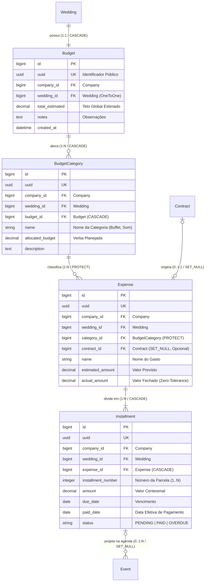

# Domínio Financeiro & Gestão Orçamentária (Finances)

> **Categoria:** Domínios de Arquitetura (Bounded Contexts)
> **Relacionados:** [Regras de Integridade Contábil & Financeira](../business-rules/finances/financial-integrity-rules.md) · [Distribuição Orçamentária & Categorias](../business-rules/finances/budget-category-distribution.md) · [Lógica de Tolerância Zero & Parcelas Atrasadas](../business-rules/finances/installment-overdue-logic.md) · [Integração Financeiro-Agenda](../business-rules/finances/payment-schedule-integration.md) · [ADR-006: Service Layer](../adr/006-service-layer.md) · [ADR-010: Tolerância Zero em Parcelas](../adr/010-tolerance-zero.md) · [ADR-011: BaseModel save com full_clean](../adr/011-basemodel-save-full-clean.md) · [ADR-023: Desacoplamento de Módulos](../adr/023-desacoplamento-modulos-scheduler-finances-weddings.md)

---

## 1. Visão Geral do Domínio

O domínio de **Finances** gerencia todo o planejamento orçamentário, alocação de verbas por categorias temáticas (Buffet, Decoração, Fotografia), controle de despesas reais e parcelamentos de pagamentos.

Pilares arquiteturais de integridade contábil:
1. **Regra de Tolerância Zero (BR-F01 / ADR-010):** A soma exata dos valores centesimais das parcelas (`Installment.amount`) deve ser estritamente idêntica ao valor real da despesa (`Expense.actual_amount`).
2. **Conformidade com Contrato Logístico (BR-F02):** Quando uma despesa é vinculada a um contrato assinado, o `actual_amount` inicial da despesa deve coincidir com o `total_amount` do contrato.
3. **Proteção contra Deleção Acidental (`models.PROTECT`):** Categorias com despesas cadastradas não podem ser excluídas sem reatribuição prévia.
4. **Cálculo Preciso de Saldo e Gastos:** Propriedades e anotações SQL (`with_total_spent()`) que somam exclusivamente parcelas com status `PAID` para determinar o montante executado.
5. **Integração Desacoplada com o Scheduler (BR-S01):** Cada parcela gerada cria automaticamente um evento correspondente na agenda do casamento como registro *read-only*.

---

## 2. Diagrama ERD Completo do Domínio Financeiro



---

## 3. Tabela de Entidades e Invariantes de Persistência

| Entidade | Papel & Relações | Campos & Tipos | Invariantes de Persistência & Regras Contábeis |
| :--- | :--- | :--- | :--- |
| **`Budget`** | Orçamento Mestre (1:1 com `Wedding`) | `wedding` (`OneToOneField`, `CASCADE`), `total_estimated` (Decimal $\ge 0.00$), `notes` | **Unicidade:** Cada casamento possui exatamente 1 orçamento global (ADR-003).<br/>**Propriedade `total_overall_spent`:** Retorna a soma de todas as parcelas `PAID` associadas às categorias do orçamento. |
| **`BudgetCategory`** | Alocação Temática (N:1 com `Budget`) | `budget` (`ForeignKey`, `CASCADE`), `name` (max 100), `allocated_budget` (Decimal $\ge 0.00$) | **Unicidade de Nome:** `unique_together = [["budget", "name"]]`.<br/>**Propriedade `total_spent`:** Retorna a soma das parcelas `PAID` pertencentes às despesas desta categoria.<br/>**Regra de Proteção:** `on_delete=models.PROTECT` em `Expense.category` impede deleção da categoria se houver despesas. |
| **`Expense`** | Compromisso Financeiro (N:1 com `Category`) | `category` (`ForeignKey`, `PROTECT`), `contract` (`OneToOneField`, `SET_NULL`, nullable), `name`, `estimated_amount`, `actual_amount` | **Tolerância Zero (BR-F01):** Para despesas persistidas (`self.pk`), `sum(installments.amount) == self.actual_amount`.<br/>**Conformidade Contratual (BR-F02):** Na criação, se vinculada a contrato, `actual_amount == contract.total_amount`. |
| **`Installment`** | Parcela Financeira (N:1 com `Expense`) | `expense` (`ForeignKey`, `CASCADE`), `installment_number` (Int $\ge 1$), `amount` (Decimal $\ge 0.00$), `due_date`, `paid_date`, `status` (`PENDING`, `PAID`, `OVERDUE`) | **Unicidade Sequencial:** `unique_together = [["expense", "installment_number"]]`.<br/>**Consistência de Pagamento:** Se `paid_date` preenchida, `status == PAID`. Se `status == PAID`, `paid_date` é obrigatória.<br/>**Integração com Agenda (BR-S01):** Cada parcela projeta um evento de pagamento no Scheduler. |

---

## 4. Transclusão de Código Real

### A. Modelo de Orçamento Mestre (`Budget`)
```python
--8<-- "backend/apps/finances/models/budget.py:21:64"
```

### B. Modelo de Categoria Orçamentária (`BudgetCategory`)
```python
--8<-- "backend/apps/finances/models/budget_category.py:21:57"
```

### C. Modelo de Despesa e Validador de Tolerância Zero (`Expense.clean`)
```python
--8<-- "backend/apps/finances/models/expense.py:19:80"
```

### D. Modelo de Parcelas e Invariantes de Pagamento (`Installment.clean`)
```python
--8<-- "backend/apps/finances/models/installment.py:18:74"
```

### E. Orquestração de Criação de Despesa com Contrato e Parcelas (`ExpenseService.create`)
```python
--8<-- "backend/apps/finances/services/expense_service.py:93:196"
```

---

## 5. Mapeamento de Camadas (Fullstack)

### Camada de Backend (`backend/apps/finances/`)
- **Modelos:** `Budget` (`budget.py`), `BudgetCategory` (`budget_category.py`), `Expense` (`expense.py`), `Installment` (`installment.py`).
- **Managers:** `BudgetManager`, `BudgetCategoryManager`, `ExpenseManager`, `InstallmentManager` em `managers.py`.
- **Services:** `budget_service.py`, `budget_category_service.py`, `expense_service.py`, `installment_service.py`.
- **Selectors:** `budget_selectors.py`, `budget_category_selectors.py`, `expense_selectors.py`, `installment_selectors.py`.
- **Management Command:** `python manage.py mark_overdue_installments` (atualização automática de parcelas com data de vencimento no passado).

### Camada de Frontend (`frontend/src/features/finances/`)
- **Containers & Views:** `FinancesView.tsx`, `ExpensesTab.tsx`, `ExpensesTable.tsx`, `ExpenseDetailSheet.tsx`, `ExpenseDetailSheetPresenter.tsx`.
- **Gráficos & Resumos:** `FinancesSummaryCards.tsx`, `FinancesDistributionChart.tsx` (Recharts).
- **Dialogs:** `CreateExpenseDialog.tsx`, `EditExpenseDialog.tsx`, `DeleteExpenseDialog.tsx`, `CreateBudgetCategoryDialog.tsx`, `EditBudgetCategoryDialog.tsx`.
- **Hooks Customizados:** `useBudget.ts`, `useExpenses.ts`, `useCreateExpenseForm.ts`, `useEditExpenseForm.ts`.

---

## 6. Links e Regras de Negócio Associadas

- [Regras de Integridade Contábil & Financeira](../business-rules/finances/financial-integrity-rules.md)
- [Distribuição Orçamentária & Categorias](../business-rules/finances/budget-category-distribution.md)
- [Lógica de Tolerância Zero & Parcelas Atrasadas](../business-rules/finances/installment-overdue-logic.md)
- [Integração Financeiro-Agenda](../business-rules/finances/payment-schedule-integration.md)
- [ADR-010: Tolerância Zero em Parcelas](../adr/010-tolerance-zero.md)
- [ADR-011: BaseModel save com full_clean](../adr/011-basemodel-save-full-clean.md)
- [ADR-023: Desacoplamento de Módulos](../adr/023-desacoplamento-modulos-scheduler-finances-weddings.md)
- [Modelos Base & Padrões Core](../../reference/models/core-models.md)
