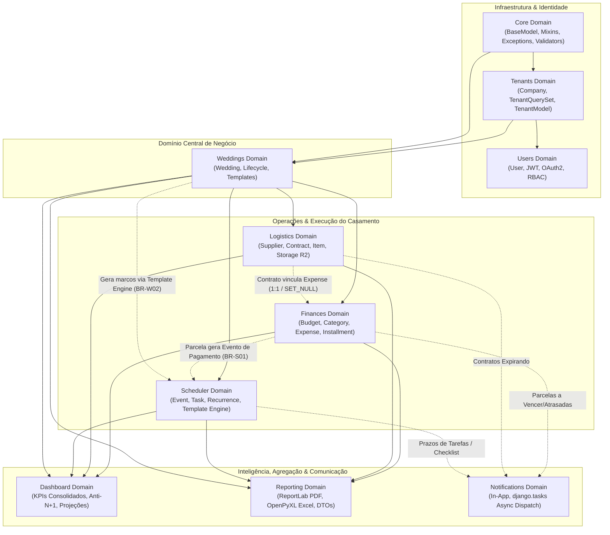
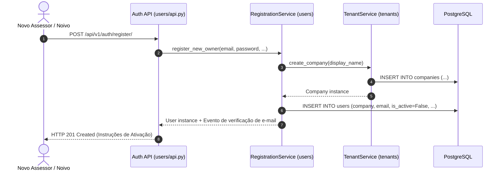
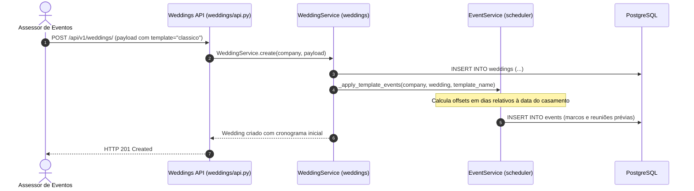
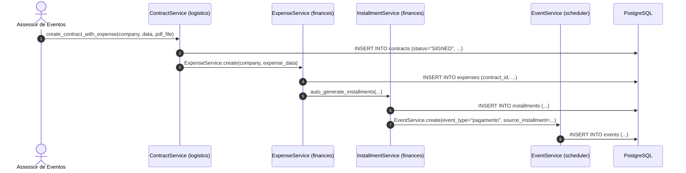

# Topologia Geral de Domínios e Bounded Contexts (MOC)

> **Categoria:** Arquitetura de Domínios (Bounded Contexts)
> **Relacionados:** [Visão Geral do Sistema](../concepts/system-overview.md) · [Estratégia de Multi-Tenancy](../concepts/multi-tenancy-strategy.md) · [Padrão Service Layer](../concepts/service-layer-pattern.md) · [ADR-006: Service Layer](../adr/006-service-layer.md) · [ADR-009: Multi-Tenancy](../adr/009-multitenancy.md) · [ADR-023: Desacoplamento de Módulos](../adr/023-desacoplamento-modulos-scheduler-finances-weddings.md)

---

## 1. Visão Geral da Topologia de Domínios

O **Wedding Management System** é estruturado segundo os princípios do *Domain-Driven Design* (DDD), particionado em **10 Bounded Contexts** coesos e desacoplados. Cada domínio possui sua própria camada de persistência (`models/`), lógica de mutação encapsulada (`services/`), consultas otimizadas para leitura (`selectors/`) e adaptadores de entrada HTTP (`api/`).

As fronteiras entre os domínios garantem isolamento multi-tenant estrito por empresa (`Company`), validação de integridade por casamento (`Wedding`) e integridade referencial com proteções de deleção em cascata controladas (`PROTECT` vs `CASCADE`).

---

## 2. Mapa de Dependências e Fluxos Trans-Domínio

O diagrama a seguir ilustra a topologia de relacionamento entre os 10 domínios, evidenciando o fluxo de dados, as dependências de orquestração síncrona e as integrações assíncronas:



---

## 3. Matriz dos 10 Bounded Contexts

| Bounded Context | Especificação | Agregado Raiz / Entidades Principais | Responsabilidade Primária | Dependências Upstream | Consumidores Downstream |
| :--- | :--- | :--- | :--- | :--- | :--- |
| **Core** | [core-domain](core-domain.md) | `BaseModel`, `WeddingOwnedMixin` | Base models, exceções de domínio, validadores, shortcuts e healthchecks. | Framework / Django | Todos os domínios |
| **Tenants** | [tenants-domain](tenants-domain.md) | `Company`, `TenantModel` | Isolamento lógico por assessoria/empresa e provisionamento de workspaces. | `Core` | Todos os domínios |
| **Users** | [users-domain](users-domain.md) | `User` | Autenticação JWT, login social Google, verificação de e-mail e perfis. | `Tenants`, `Core` | Todos os domínios |
| **Weddings** | [weddings-domain](weddings-domain.md) | `Wedding` | Ciclo de vida do casamento, dados do casal, convidados e orquestração de templates. | `Tenants`, `Core` | `Finances`, `Logistics`, `Scheduler`, `Dashboard`, `Reporting` |
| **Finances** | [finances-domain](finances-domain.md) | `Budget`, `BudgetCategory`, `Expense`, `Installment` | Teto orçamentário, categorias de gastos, despesas e parcelas com Tolerância Zero. | `Weddings`, `Tenants`, `Logistics` (opcional) | `Scheduler`, `Dashboard`, `Reporting`, `Notifications` |
| **Logistics** | [logistics-domain](logistics-domain.md) | `Supplier`, `Contract`, `Item` | Catálogo de fornecedores, contratos com aditivos, anexos em Cloudflare R2 e itens. | `Weddings`, `Tenants` | `Finances`, `Dashboard`, `Reporting`, `Notifications` |
| **Scheduler** | [scheduler-domain](scheduler-domain.md) | `Event`, `Task` | Agenda de compromissos, checklist operacional, recorrência e eventos de pagamento. | `Weddings`, `Tenants`, `Finances` | `Dashboard`, `Reporting`, `Notifications` |
| **Dashboard** | [dashboard-domain](dashboard-domain.md) | Agregações e Projeções | Visão executiva em tempo real com KPIs consolidados e queries anti-N+1. | `Weddings`, `Finances`, `Logistics`, `Scheduler` | Frontend (UI Dashboard) |
| **Reporting** | [reporting-domain](reporting-domain.md) | `WeddingReportDataDTO` | Diagramação e exportação de relatórios executivos em PDF (ReportLab) e Excel (.xlsx). | `Weddings`, `Finances`, `Logistics`, `Scheduler` | Frontend (Downloads) |
| **Notifications** | [notifications-domain](notifications-domain.md) | `Notification` | Centralização de alertas in-app, persistência e despacho assíncrono via `django.tasks`. | `Tenants`, `Users` | Frontend (Sino/UI) |

---

## 4. Padrões de Comunicação e Fronteiras Trans-Domínio

Para manter o acoplamento baixo entre os módulos sem sacrificar a integridade relacional do banco PostgreSQL, a arquitetura adota as seguintes regras de fronteira:

### A. Relações Fortes vs Desacoplamento Estrutural
1. **Pertença ao Casamento (`WeddingOwnedMixin`):** Modelos pertencentes ao evento vinculam-se a `Wedding` via FK com `CASCADE` (apagar o casamento remove o evento e suas ramificações) ou com `PROTECT` nos contratos para evitar perda acidental de documentos assinados.
2. **Integração Logística-Financeira (`Contract` ↔ `Expense`):** A relação é de `OneToOneField(on_delete=models.SET_NULL, null=True, blank=True)`. Um contrato assinado pode gerar uma despesa correspondente, mas ambos mantêm ciclos de vida independentes.
3. **Integração Financeiro-Agenda (`Installment` ↔ `Event`):** Eventos de pagamento no Scheduler armazenam uma FK opcional `source_installment` (`on_delete=models.SET_NULL`). O Scheduler trata esses registros como somente leitura (`read-only`), delegando qualquer mutação para o `InstallmentService`.
4. **Despacho Assíncrono para Notificações:** Serviços operacionais (Finances, Logistics, Scheduler) não persistem notificações de forma acoplada; utilizam tarefas em background (`dispatch_async_notification_task`) para garantir que falhas no envio de notificações não revertam transações financeiras.

---

## 5. Fluxos Trans-Domínio Principais

### Fluxo 1: Onboarding e Criação de Tenant


### Fluxo 2: Criação de Casamento e Aplicação de Template de Cerimônia


### Fluxo 3: Contratação Logística, Despesa e Evento na Agenda


---

## 6. Registro Centralizado de Rotas (Django Ninja Extra)

A integração e exposição dos 10 domínios via API REST HTTP ocorre centralizadamente em `backend/config/api.py`:

```python
--8<-- "backend/config/api.py:157:176"
```

---

## 7. Navegação dos Domínios

Consulte a especificação detalhada de cada Bounded Context:

- [Core Domain](core-domain.md) — Modelos base, auditoria, validadores e infraestrutura transversal.
- [Tenants Domain](tenants-domain.md) — Isolamento de empresas, tenancy e provisionamento.
- [Users Domain](users-domain.md) — Autenticação, autorização JWT, OAuth2 e gestão de perfis.
- [Weddings Domain](weddings-domain.md) — Gestão do ciclo de vida de casamentos e templates.
- [Finances Domain](finances-domain.md) — Orçamento, despesas, parcelamentos e tolerância zero.
- [Logistics Domain](logistics-domain.md) — Fornecedores, contratos, aditivos e anexos R2.
- [Scheduler Domain](scheduler-domain.md) — Agenda, tarefas, recorrência e marcos temporais.
- [Dashboard Domain](dashboard-domain.md) — Métricas consolidadas, KPIs e otimizações anti-N+1.
- [Reporting Domain](reporting-domain.md) — Exportações analíticas em PDF (ReportLab) e Excel (.xlsx).
- [Notifications Domain](notifications-domain.md) — Alertas in-app e despacho assíncrono via `django.tasks`.
