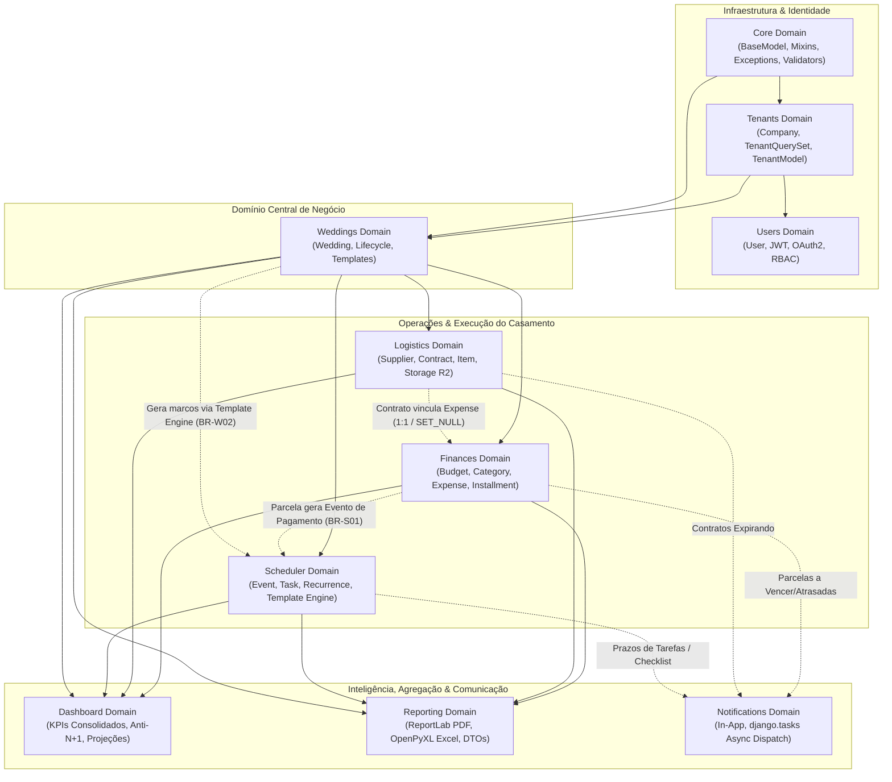
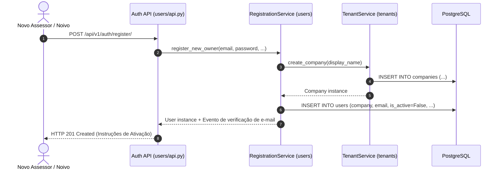
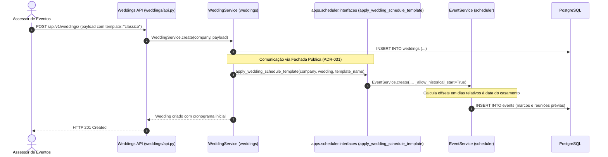
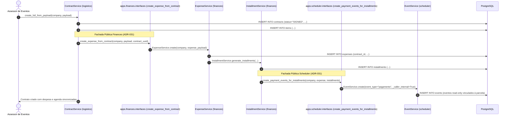

# Topologia Geral de Domínios e Bounded Contexts

> **Categoria:** Arquitetura de Domínios (Bounded Contexts)
> **Relacionados:** [Visão Geral do Sistema](../concepts/system-overview.md) · [Estratégia de Multi-Tenancy](../concepts/multi-tenancy-strategy.md) · [Padrão Service Layer](../concepts/service-layer-pattern.md) · [ADR-030: Rich Domain Model](../adr/030-rich-domain-model-service-layer.md) · [ADR-006: Service Layer](../adr/006-service-layer.md) · [ADR-009: Multi-Tenancy](../adr/009-multitenancy.md) · [ADR-023: Desacoplamento de Módulos](../adr/023-desacoplamento-modulos-scheduler-finances-weddings.md)

---

## 1. Visão Geral da Topologia de Domínios

O **Wedding Management System** é estruturado segundo os princípios do *Domain-Driven Design* (DDD), particionado em **10 Bounded Contexts** coesos e desacoplados. Cada domínio possui sua própria camada de persistência (`models/`), lógica de mutação encapsulada (`services/`), consultas otimizadas para leitura (`selectors/`) e adaptadores de entrada HTTP (`api/`).

As fronteiras entre os domínios garantem isolamento multi-tenant estrito por empresa (`Company`), validação de integridade por casamento (`Wedding`) e integridade referencial com proteções de deleção em cascata controladas (`PROTECT` vs `CASCADE`).

---

## 2. Mapa de Dependências e Fluxos Trans-Domínio

O diagrama a seguir ilustra a topologia de relacionamento entre os 10 domínios, evidenciando o fluxo de dados, as dependências de orquestração síncrona e as integrações assíncronas:



---

## 3. Matriz dos 10 Bounded Contexts e Interfaces Públicas

| Bounded Context | Especificação | Entidades Principais | Responsabilidade Primária & Capacidades | Interface Pública Trans-Domínio (ADR-031) |
| :--- | :--- | :--- | :--- | :--- |
| **Core** | [core-domain](core-domain.md) | `BaseModel`, `TenantModel`, `WeddingOwnedMixin` | Base models, exceções de domínio, validadores e shortcuts multi-tenant. | `apps.core.shortcuts`, `apps.core.exceptions` |
| **Tenants** | [tenants-domain](tenants-domain.md) | `Company` | Isolamento lógico por assessoria/empresa e gestão de planos/tenancy. | `apps.tenants.managers.TenantQuerySet` |
| **Users** | [users-domain](users-domain.md) | `User` | Autenticação JWT, login social Google, RBAC e perfis de assessores. | `apps.users.services`, `AuthRequest` |
| **Weddings** | [weddings-domain](weddings-domain.md) | `Wedding` | Ciclo de vida da cerimônia, noivos, convidados e orquestração de templates. | `apps.weddings.interfaces` |
| **Finances** | [finances-domain](finances-domain.md) | `Budget`, `BudgetCategory`, `Expense`, `Installment` | Teto orçamentário, despesas, parcelas com Tolerância Zero e métricas analíticas. | `apps.finances.interfaces.create_expense_from_contract` |
| **Logistics** | [logistics-domain](logistics-domain.md) | `Supplier`, `Contract`, `Item` | Fornecedores, contratos, termos aditivos, arquivos R2 e itens de serviço. | `apps.logistics.interfaces` (`get_contract_for_company`, `list_contracts_for_wedding`) |
| **Scheduler** | [scheduler-domain](scheduler-domain.md) | `Event`, `Task` | Agenda, checklist de tarefas, detecção de conflitos e motor de recorrência. | `apps.scheduler.interfaces` (`apply_wedding_schedule_template`, `create_payment_events_for_installments`) |
| **Dashboard** | [dashboard-domain](dashboard-domain.md) | Projeções Analíticas CQRS | Quatro eixos analíticos, KPIs macro/micro, séries temporais e Anti-Data-Stitching. | `apps.reporting.selectors.dashboard_selectors` |
| **Reporting** | [reporting-domain](reporting-domain.md) | `WeddingReportDataDTO` | Diagramação e exportação de relatórios executivos em PDF (ReportLab) e Excel (.xlsx). | `apps.reporting.services.ReportGenerationService` |
| **Notifications** | [notifications-domain](notifications-domain.md) | `Notification` | Centralização de alertas in-app e despacho assíncrono não-bloqueante. | `apps.notifications.interfaces`, `dispatch_async_notification_task` |

---

## 4. Padrões de Comunicação e Fronteiras Trans-Domínio

Para manter o acoplamento baixo entre os módulos sem sacrificar a integridade relacional do banco PostgreSQL, a arquitetura adota as seguintes regras de fronteira estritas ([ADR-031](../adr/031-inter-module-communication.md)):

1. **Pertença ao Casamento (`WeddingOwnedMixin`):** Modelos pertencentes ao evento vinculam-se a `Wedding` via FK com `CASCADE` (apagar o casamento remove o evento e suas ramificações) ou com `PROTECT` nos contratos para evitar perda acidental de documentos assinados.
2. **Fachadas Públicas Canônicas (`apps.<contexto>.interfaces`):** É proibido importar `models.py` ou `services.py` de outro Bounded Context diretamente. Toda mutação síncrona trans-domínio passa exclusivamente pela fachada canônica exposta em `interfaces.py`.
3. **Integração Logística-Financeira (`Contract` ↔ `Expense`):** A relação é de `OneToOneField(on_delete=models.SET_NULL, null=True, blank=True)`. Quando um contrato assinado gera uma despesa correspondente, o `ContractService` aciona `apps.finances.interfaces.create_expense_from_contract()`.
4. **Integração Financeiro-Agenda (`Installment` ↔ `Event`):** Eventos de pagamento no Scheduler armazenam uma FK opcional `source_installment` (`on_delete=models.SET_NULL`). O Scheduler trata esses registros como somente leitura (`read-only`), e a criação é delegada à fachada `apps.scheduler.interfaces.create_payment_events_for_installments()`.
5. **Despacho Assíncrono para Notificações:** Serviços operacionais (Finances, Logistics, Scheduler) não persistem notificações de forma síncrona acoplada; utilizam tarefas em background (`dispatch_async_notification_task`) para garantir que falhas no envio de notificações não revertam transações financeiras.

---

## 5. Fluxos Trans-Domínio Principais

### Fluxo 1: Onboarding e Criação de Tenant


### Fluxo 2: Criação de Casamento e Aplicação de Template de Cerimônia


### Fluxo 3: Contratação Logística, Despesa e Evento na Agenda


---

## 6. Registro Centralizado de Rotas (Django Ninja Extra)

A integração e exposição dos 10 domínios via API REST HTTP ocorre centralizadamente na instância global [`NinjaExtraAPI`](../../../backend/config/api.py):

```python
# backend/config/api.py
api.add_router("/auth/", auth_router, auth=None)
api.add_router("/weddings/", weddings_router)
api.add_router("/dashboard/", dashboard_router)
api.add_router("/reports/", reports_router)
api.add_router("/logistics/suppliers/", suppliers_router)
api.add_router("/logistics/contracts/", contracts_router)
api.add_router("/logistics/items/", items_router)
api.add_router("/finances/budgets/", budgets_router)
api.add_router("/finances/categories/", budget_categories_router)
api.add_router("/finances/expenses/", expenses_router)
api.add_router("/finances/installments/", installments_router)
api.add_router("/scheduler/events/", scheduler_events_router)
api.add_router("/scheduler/tasks/", scheduler_tasks_router)
api.add_router("/notifications/", notifications_router)
api.add_router("/internal/cron/", cron_router, auth=None)
```

---

## 7. Navegação dos Domínios

Consulte a especificação detalhada de cada Bounded Context:

- [Core Domain](core-domain.md) — Modelos base, auditoria, validadores e infraestrutura transversal.
- [Tenants Domain](tenants-domain.md) — Isolamento de empresas, tenancy e provisionamento.
- [Users Domain](users-domain.md) — Autenticação, autorização JWT, OAuth2 e gestão de perfis.
- [Weddings Domain](weddings-domain.md) — Gestão do ciclo de vida de casamentos e templates.
- [Finances Domain](finances-domain.md) — Orçamento, despesas, parcelamentos e tolerância zero.
- [Logistics Domain](logistics-domain.md) — Fornecedores, contratos, aditivos e anexos R2.
- [Scheduler Domain](scheduler-domain.md) — Agenda, tarefas, recorrência e marcos temporais.
- [Dashboard Domain](dashboard-domain.md) — Métricas consolidadas, KPIs e otimizações anti-N+1.
- [Reporting Domain](reporting-domain.md) — Exportações analíticas em PDF (ReportLab) e Excel (.xlsx).
- [Notifications Domain](notifications-domain.md) — Alertas in-app e despacho assíncrono via `django.tasks`.
