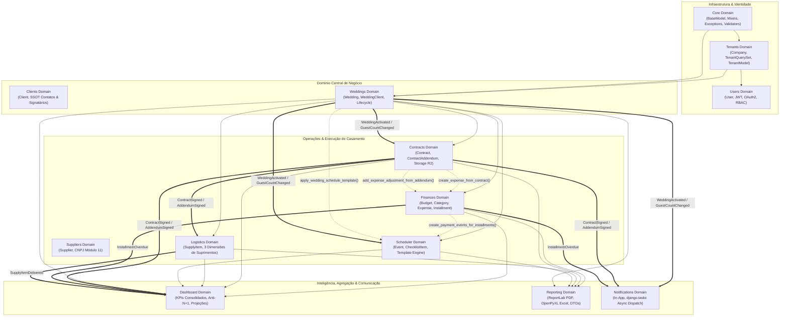
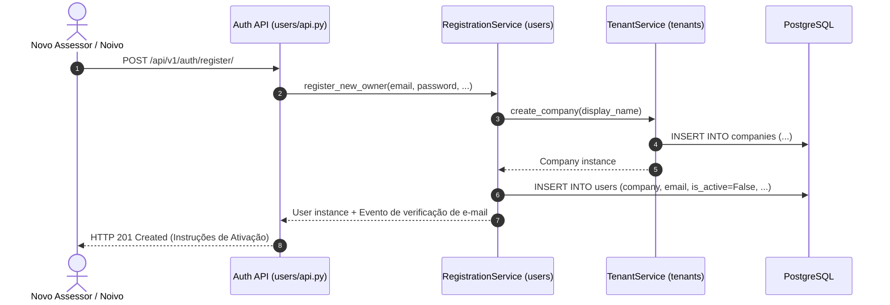
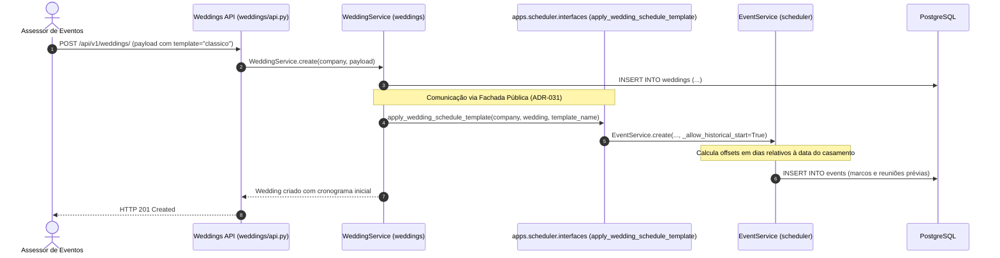
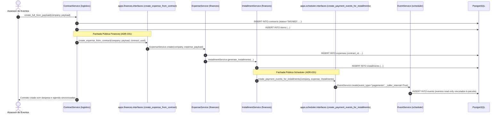

# Topologia Geral de Domínios e Bounded Contexts

> **Categoria:** Arquitetura de Domínios (Bounded Contexts)
> **Relacionados:** [RFC-001: Redesenho de Domínios](../rfc/001-macro-architecture-and-domain-redesign.md) · [Visão Geral do Sistema](../concepts/system-overview.md) · [Estratégia de Multi-Tenancy](../concepts/multi-tenancy-strategy.md) · [Padrão Service Layer](../concepts/service-layer-pattern.md) · [ADR-030: Rich Domain Model](../adr/030-rich-domain-model-service-layer.md) · [ADR-031: Comunicação Entre Módulos](../adr/031-inter-module-communication.md)

---

## 1. Visão Geral da Topologia de Domínios

O **Wedding Management System** é estruturado segundo os princípios do *Domain-Driven Design* (DDD), particionado em Bounded Contexts coesos e desacoplados, consolidados pela [RFC-001](../rfc/001-macro-architecture-and-domain-redesign.md). Cada domínio possui sua própria camada de persistência (`models/`), lógica de mutação encapsulada (`services/`), consultas otimizadas para leitura (`selectors/`) e adaptadores de entrada HTTP (`api/`).

As fronteiras entre os domínios garantem isolamento multi-tenant estrito por empresa (`Company`), validação de integridade por casamento (`Wedding`) e integridade referencial com proteções de deleção em cascata controladas (`PROTECT` vs `CASCADE`).

---

## 2. Mapa de Dependências e Fluxos Trans-Domínio

O diagrama a seguir ilustra a topologia de relacionamento entre os domínios, evidenciando o fluxo de dados, as dependências de orquestração síncrona e a esteira de tarefas assíncronas:


```mermaid
flowchart TD
    subgraph Foundation["Infraestrutura & Identidade"]
        CORE["Core Domain<br/>(BaseModel, Mixins, Exceptions, Validators)"]
        TENANTS["Tenants Domain<br/>(Company, TenantQuerySet, TenantModel)"]
        USERS["Users Domain<br/>(User, JWT, OAuth2, RBAC)"]
    end

    subgraph CoreDomain["Domínio Central de Negócio"]
        CLIENTS["Clients Domain<br/>(Client, SSOT Contatos & Signatários)"]
        WEDDINGS["Weddings Domain<br/>(Wedding, WeddingClient, Lifecycle)"]
    end

    subgraph Operations["Operações & Execução do Casamento"]
        FINANCES["Finances Domain<br/>(Budget, Category, Expense, Installment)"]
        SUPPLIERS["Suppliers Domain<br/>(Supplier, CNPJ Módulo 11)"]
        CONTRACTS["Contracts Domain<br/>(Contract, ContractAddendum, Storage R2)"]
        LOGISTICS["Logistics Domain<br/>(SupplyItem, 3 Dimensões de Suprimentos)"]
        SCHEDULER["Scheduler Domain<br/>(Event, ChecklistItem, Template Engine)"]
    end

    subgraph Intelligence["Inteligência, Agregação & Comunicação"]
        DASHBOARD["Dashboard Domain<br/>(KPIs Consolidados, Anti-N+1, Projeções)"]
        REPORTING["Reporting Domain<br/>(ReportLab PDF, OpenPyXL Excel, DTOs)"]
        NOTIFICATIONS["Notifications Domain<br/>(In-App, django.tasks Async Dispatch)"]
    end

    %% Relações de Infraestrutura
    CORE --> TENANTS
    TENANTS --> USERS
    TENANTS --> WEDDINGS
    CORE --> WEDDINGS

    %% Dependências do Casamento
    WEDDINGS --> FINANCES
    WEDDINGS --> CONTRACTS
    WEDDINGS --> LOGISTICS
    WEDDINGS --> SCHEDULER

    %% Interações Trans-Domínio Operacionais Síncronas (interfaces.py)
    CONTRACTS -.->|"create_expense_from_contract()"| FINANCES
    CONTRACTS -.->|"add_expense_adjustment_from_addendum()"| FINANCES
    FINANCES -.->|"create_payment_events_for_installments()"| SCHEDULER
    WEDDINGS -.->|"apply_wedding_schedule_template()"| SCHEDULER

    %% Agregações para Dashboard e Reporting (CQRS Neutro)
    FINANCES --> DASHBOARD
    CONTRACTS --> DASHBOARD
    LOGISTICS --> DASHBOARD
    SCHEDULER --> DASHBOARD
    WEDDINGS --> DASHBOARD

    FINANCES --> REPORTING
    CONTRACTS --> REPORTING
    LOGISTICS --> REPORTING
    SCHEDULER --> REPORTING
    WEDDINGS --> REPORTING

    %% Eventos de Domínio Assíncronos (transaction.on_commit + django.tasks)
    WEDDINGS ==>|"WeddingActivated / GuestCountChanged"| SCHEDULER & NOTIFICATIONS & CONTRACTS
    CONTRACTS ==>|"ContractSigned / AddendumSigned"| LOGISTICS & NOTIFICATIONS & DASHBOARD
    FINANCES ==>|"InstallmentOverdue"| NOTIFICATIONS & DASHBOARD
    LOGISTICS ==>|"SupplyItemDelivered"| DASHBOARD
```

---

## 3. Matriz dos Bounded Contexts e Interfaces Públicas

| Bounded Context | Especificação | Entidades Principais | Responsabilidade Primária & Capacidades | Interface Pública Trans-Domínio (ADR-031 / RFC-001) |
| :--- | :--- | :--- | :--- | :--- |
| **Core** | [core-domain](core-domain.md) | `BaseModel`, `TenantModel`, `WeddingOwnedMixin` | Base models, exceções de domínio, validadores e shortcuts multi-tenant. | `apps.core.shortcuts`, `apps.core.exceptions` |
| **Tenants** | [tenants-domain](tenants-domain.md) | `Company` | Isolamento lógico por assessoria/empresa e gestão de planos/tenancy. | `apps.tenants.managers.TenantQuerySet` |
| **Users** | [users-domain](users-domain.md) | `User` | Autenticação JWT, login social Google, RBAC e perfis de assessores. | `apps.users.services`, `AuthRequest` |
| **Clients** | [clients-domain](clients-domain.md) | `Client`, `WeddingClient` | Única Fonte da Verdade (SSOT) de pessoas físicas, noivos, contratantes financeiros e signatários. | `apps.clients.interfaces` (`get_or_create_client_for_proposal`) |
| **Weddings** | [weddings-domain](weddings-domain.md) | `Wedding`, `WeddingClient` | Ciclo de vida (`PROPOSTA` $\to$ `PLANEJAMENTO` $\to$ `EM_ANDAMENTO` $\to$ `CONCLUIDO`), noivos, contratantes e ancoragem temporal. | `apps.weddings.interfaces` |
| **Finances** | [finances-domain](finances-domain.md) | `Budget`, `BudgetCategory`, `Expense`, `Installment` | Teto orçamentário, despesas, parcelas com Tolerância Zero e métricas analíticas. | `apps.finances.interfaces` (`create_expense_from_contract`, `freeze_budget_baseline_for_wedding`) |
| **Contracts** | [contracts-domain](contracts-domain.md) | `Contract`, `ContractAddendum` | Governança jurídica de contratos (fornecedores e honorários `PLANNER`), aditivos acíclicos e guarda no R2. | `apps.contracts.interfaces` (`get_planner_contract_for_wedding`, `save_planner_contract_for_wedding`) |
| **Suppliers** | [suppliers-domain](suppliers-domain.md) | `Supplier` | Catálogo corporativo de parceiros comerciais no tenant com validação de CNPJ (Módulo 11). | `apps.suppliers.interfaces` |
| **Logistics** | [logistics-domain](logistics-domain.md) | `SupplyItem` | Materiais físicos, entregáveis, 3 dimensões (escopo com motivo de descarte, cotação e entrega física). | `apps.logistics.interfaces` |
| **Scheduler** | [scheduler-domain](scheduler-domain.md) | `Event`, `ChecklistItem`, `ScheduleTemplate` | Agenda, checklist de ações operacionais, detecção de conflitos (*soft overlap*) e recorrência. | `apps.scheduler.interfaces` (`apply_wedding_schedule_template`, `create_payment_events_for_installments`) |
| **Dashboard** | [dashboard-domain](dashboard-domain.md) | Projeções Analíticas CQRS | Quatro eixos analíticos, KPIs macro/micro, séries temporais e Anti-Data-Stitching. | `apps.reporting.selectors.dashboard_selectors` |
| **Reporting** | [reporting-domain](reporting-domain.md) | `WeddingReportDataDTO` | Diagramação e exportação de relatórios executivos em PDF (ReportLab) e Excel (.xlsx). | `apps.reporting.services.ReportGenerationService` |
| **Notifications** | [notifications-domain](notifications-domain.md) | `Notification` | Centralização de alertas in-app e despacho assíncrono não-bloqueante. | `apps.notifications.interfaces`, `dispatch_async_notification_task` |

---

## 4. Padrões de Comunicação Híbrida e Fronteiras Trans-Domínio

Para manter o acoplamento baixo sem abrir mão da integridade referencial do PostgreSQL, a arquitetura combina dois modelos complementares ([ADR-031](../adr/031-inter-module-communication.md) e [RFC-001](../rfc/001-macro-architecture-and-domain-redesign.md)):

### 4.1. Camada Síncrona Transacional (Interfaces Públicas)
1. **Pertença ao Casamento (`WeddingOwnedMixin`):** Modelos pertencentes ao evento vinculam-se a `Wedding` via FK com `CASCADE` ou com `PROTECT` nos contratos para evitar perda acidental de documentos assinados.
2. **Fachadas Públicas Canônicas (`apps.<contexto>.interfaces`):** Toda mutação síncrona trans-domínio que exige consistência atômica imediata (`@transaction.atomic`) passa exclusivamente pela fachada canônica exposta em `interfaces.py`.
3. **Integração Contratos-Finanças:** A assinatura de contrato aciona `apps.finances.interfaces.create_expense_from_contract()`, garantindo a criação simultânea de contrato e despesa.
4. **Integração Finanças-Agenda:** Parcelas criam eventos de pagamento somente leitura via `apps.scheduler.interfaces.create_payment_events_for_installments()`.

### 4.2. Camada Assíncrona Orientada a Eventos de Domínio (EDA)
5. **Publicação Pós-Commit (`transaction.on_commit`):** Todos os efeitos secundários, notificações in-app, atualizações de dashboards e reações operacionais são emitidos como **Eventos de Domínio** pelos Aggregate Roots e processados assincronamente pelo `django.tasks`:
   - `WeddingActivatedEvent`: Dispara geração assíncrona de `ChecklistItems` do cronograma.
   - `WeddingGuestCountChangedEvent`: Notifica a assessoria para avaliar termos aditivos em contratos sensíveis.
   - `ContractSignedEvent`: Habilita os `SupplyItems` correspondentes para conferência física de entrega.
   - `InstallmentOverdueEvent`: Dispara notificações de inadimplência e badges de alerta financeiro.

---

## 5. Fluxos Trans-Domínio Principais

### Fluxo 1: Onboarding e Criação de Tenant

```mermaid
sequenceDiagram
    autonumber
    actor User as Novo Assessor / Noivo
    participant API as Auth API (users/api.py)
    participant RegSvc as RegistrationService (users)
    participant TenantSvc as TenantService (tenants)
    participant DB as PostgreSQL

    User->>API: POST /api/v1/auth/register/
    API->>RegSvc: register_new_owner(email, password, ...)
    RegSvc->>TenantSvc: create_company(display_name)
    TenantSvc->>DB: INSERT INTO companies (...)
    TenantSvc-->>RegSvc: Company instance
    RegSvc->>DB: INSERT INTO users (company, email, is_active=False, ...)
    RegSvc-->>API: User instance + Evento de verificação de e-mail
    API-->>User: HTTP 201 Created (Instruções de Ativação)
```

### Fluxo 2: Criação de Casamento e Aplicação de Template de Cerimônia

```mermaid
sequenceDiagram
    autonumber
    actor Planner as Assessor de Eventos
    participant API as Weddings API (weddings/api.py)
    participant WedSvc as WeddingService (weddings)
    participant SchedFacade as apps.scheduler.interfaces (apply_wedding_schedule_template)
    participant SchedSvc as EventService (scheduler)
    participant DB as PostgreSQL

    Planner->>API: POST /api/v1/weddings/ (payload com template="classico")
    API->>WedSvc: WeddingService.create(company, payload)
    WedSvc->>DB: INSERT INTO weddings (...)
    Note over WedSvc,SchedFacade: Comunicação via Fachada Pública (ADR-031)
    WedSvc->>SchedFacade: apply_wedding_schedule_template(company, wedding, template_name)
    SchedFacade->>SchedSvc: EventService.create(..., _allow_historical_start=True)
    Note over SchedSvc: Calcula offsets em dias relativos à data do casamento
    SchedSvc->>DB: INSERT INTO events (marcos e reuniões prévias)
    WedSvc-->>API: Wedding criado com cronograma inicial
    API-->>Planner: HTTP 201 Created
```

### Fluxo 3: Contratação Logística, Despesa e Evento na Agenda

```mermaid
sequenceDiagram
    autonumber
    actor Planner as Assessor de Eventos
    participant ContractSvc as ContractService (logistics)
    participant FinFacade as apps.finances.interfaces (create_expense_from_contract)
    participant ExpenseSvc as ExpenseService (finances)
    participant InstallmentSvc as InstallmentService (finances)
    participant SchedFacade as apps.scheduler.interfaces (create_payment_events_for_installments)
    participant SchedSvc as EventService (scheduler)
    participant DB as PostgreSQL

    Planner->>ContractSvc: create_full_from_payload(company, payload)
    ContractSvc->>DB: INSERT INTO contracts (status="SIGNED", ...)
    ContractSvc->>DB: INSERT INTO items (...)
    Note over ContractSvc,FinFacade: Fachada Pública Finances (ADR-031)
    ContractSvc->>FinFacade: create_expense_from_contract(company, payload, contract_uuid)
    FinFacade->>ExpenseSvc: ExpenseService.create(company, expense_payload)
    ExpenseSvc->>DB: INSERT INTO expenses (contract_id, ...)
    ExpenseSvc->>InstallmentSvc: InstallmentService.generate_installments(...)
    InstallmentSvc->>DB: INSERT INTO installments (...)
    Note over InstallmentSvc,SchedFacade: Fachada Pública Scheduler (ADR-031)
    InstallmentSvc->>SchedFacade: create_payment_events_for_installments(company, expense, installments)
    SchedFacade->>SchedSvc: EventService.create(event_type="pagamento", _caller_internal=True)
    SchedSvc->>DB: INSERT INTO events (eventos read-only vinculados à parcela)
    ContractSvc-->>Planner: Contrato criado com despesa e agenda sincronizadas
```

---

## 6. Registro Centralizado de Rotas (Django Ninja Extra)

A integração e exposição dos 10 domínios via API REST HTTP ocorre centralizadamente na instância global [`NinjaExtraAPI`](../../../backend/config/api.py):

```python
# backend/config/api.py
api.add_router("/auth/", auth_router, auth=None)
api.add_router("/weddings/", weddings_router)
api.add_router("/dashboard/", dashboard_router)
api.add_router("/reports/", reports_router)
api.add_router("/logistics/suppliers/", suppliers_router)  # código em apps.contracts.api
api.add_router("/contracts/", contracts_router)
api.add_router("/logistics/items/", items_router)
api.add_router("/finances/budgets/", budgets_router)
api.add_router("/finances/categories/", budget_categories_router)
api.add_router("/finances/expenses/", expenses_router)
api.add_router("/finances/installments/", installments_router)
api.add_router("/scheduler/events/", scheduler_events_router)
api.add_router("/scheduler/tasks/", scheduler_tasks_router)
api.add_router("/notifications/", notifications_router)
api.add_router("/internal/cron/", cron_router, auth=None)
```

---

## 7. Navegação dos Domínios

Consulte a especificação detalhada de cada Bounded Context:

- [Core Domain](core-domain.md) — Modelos base, auditoria, validadores e infraestrutura transversal.
- [Tenants Domain](tenants-domain.md) — Isolamento de empresas, tenancy e provisionamento.
- [Users Domain](users-domain.md) — Autenticação, autorização JWT, OAuth2 e gestão de perfis.
- [Clients Domain](clients-domain.md) — Fonte da Verdade (SSOT) de clientes, participantes e signatários.
- [Weddings Domain](weddings-domain.md) — Gestão do ciclo de vida de casamentos e templates.
- [Finances Domain](finances-domain.md) — Orçamento, despesas, parcelamentos e tolerância zero.
- [Contracts Domain](contracts-domain.md) — Contratos de assessoria e fornecedores, aditivos e guarda digital no Cloudflare R2.
- [Suppliers Domain](suppliers-domain.md) — Catálogo corporativo compartilhado de parceiros com validação de CNPJ.
- [Logistics Domain](logistics-domain.md) — Suprimentos operacionais (`SupplyItem`), escopo, cotação e entregáveis.
- [Scheduler Domain](scheduler-domain.md) — Agenda, tarefas, recorrência e marcos temporais.
- [Dashboard Domain](dashboard-domain.md) — Métricas consolidadas, KPIs e otimizações anti-N+1.
- [Reporting Domain](reporting-domain.md) — Exportações analíticas em PDF (ReportLab) e Excel (.xlsx).
- [Notifications Domain](notifications-domain.md) — Alertas in-app e despacho assíncrono via `django.tasks`.
