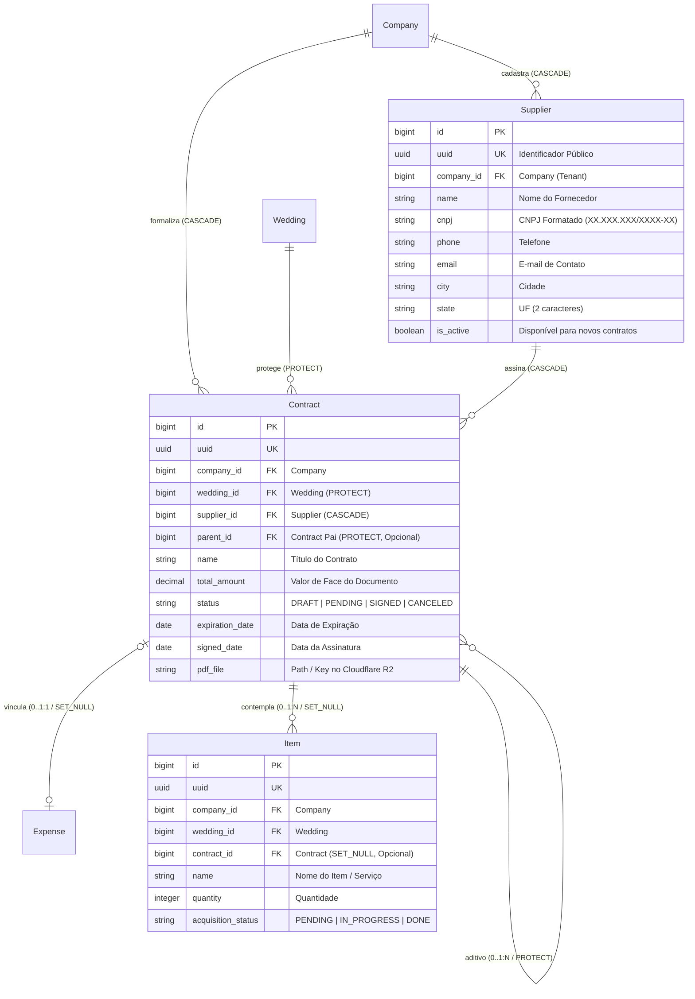

# Domínio de Logística, Fornecedores & Contratos (Logistics)

> **Categoria:** Domínios de Arquitetura (Bounded Contexts)
> **Relacionados:** [Regras de Validação de CNPJ](../business-rules/logistics/cnpj-validation-rules.md) · [Hierarquia de Contratos e Aditivos](../business-rules/logistics/contract-parent-child-hierarchy.md) · [Máquina de Estados de Contratos](../business-rules/logistics/contract-state-machine.md) · [Upload de Contratos PDF via R2](../concepts/contract-pdf-upload-r2-flow.md) · [ADR-003: Storage Cloudflare R2](../adr/003-why-r2.md) · [ADR-004: Presigned URLs](../adr/004-presigned-urls.md) · [ADR-006: Service Layer](../adr/006-service-layer.md) · [ADR-020: Abstração de Storage](../adr/020-storage-service-abstraction.md) · [ADR-030: Rich Domain Model e Validação em 3 Níveis](../adr/030-rich-domain-model-service-layer.md)

---

## 1. Visão Geral do Domínio

O domínio de **Logistics** é responsável pela gestão de parceiros e fornecedores (`Supplier`), formalização jurídica e documental de contratos de prestação de serviços (`Contract`), armazenamento seguro de arquivos PDF em Cloudflare R2 e controle dos itens materiais ou serviços contratados (`Item`).

Pilares arquiteturais de logística:
1. **Catálogo Unificado de Fornecedores:** Cadastro compartilhado em nível de empresa (`Company`), permitindo reaproveitamento de fornecedores em múltiplos casamentos com validação estrita de formato de CNPJ.
2. **Contratos com Proteção Jurídica e R2 Storage:** Contratos possuem status de formalização (`DRAFT`, `PENDING`, `SIGNED`, `CANCELED`), armazenando PDFs com links temporários e validação de tamanho máximo (10MB).
3. **Hierarquia de Aditivos Contratuais (Parent-Child):** Suporte nativo a aditivos contratuais (`parent = ForeignKey('self', on_delete=models.PROTECT)`), prevenindo ciclos e auto-referência.
4. **Proteção de Deleção no Casamento:** Contratos utilizam `wedding = ForeignKey('weddings.Wedding', on_delete=models.PROTECT)`, impedindo a exclusão acidental de casamentos com compromissos contratuais ativos.
5. **Máquina de Estados de Itens:** Transições controladas para aquisição e entrega de itens (`PENDING` $\rightarrow$ `IN_PROGRESS` $\rightarrow$ `DONE`).

---

## 2. Diagrama ERD do Domínio de Logística

---

## 3. Tabela de Entidades e Invariantes de Persistência

| Entidade | Papel & Relações | Campos & Tipos | Invariantes de Persistência & Regras Logísticas |
| :--- | :--- | :--- | :--- |
| **`Supplier`** | Catálogo de Parceiros (`TenantModel`) | `name` (max 255), `cnpj` (max 18, format regex), `phone`, `email`, `city`, `state` (Min/Max 2 chars), `is_active` | **Validação de CNPJ (BR-L01):** Validado com regex `XX.XXX.XXX/XXXX-XX`. **Isolamento Multi-Tenant:** Visível exclusivamente para a empresa dona do registro. |
| **`Contract`** | Instrumento Contratual (N:1 com `Supplier` e `Wedding`) | `wedding` (`ForeignKey`, `PROTECT`), `supplier` (`ForeignKey`, `CASCADE`), `parent` (`ForeignKey('self')`, `PROTECT`), `total_amount` (Decimal), `status` (`StatusChoices`), `pdf_file`, `signed_date` | **Contrato Assinado (BR-L02):** Se `status == SIGNED`, exige obrigatoriamente `pdf_file`, `signed_date` e `total_amount > 0`. **Transições Permitidas (BR-L03):** `DRAFT` $\rightarrow$ `PENDING`/`CANCELED`; `PENDING` $\rightarrow$ `SIGNED`/`DRAFT`/`CANCELED`; `SIGNED` $\rightarrow$ `CANCELED`. **Grafo Acíclico (BR-L04):** `parent` não pode ser self nem criar loops no grafo de aditivos. |
| **`Item`** | Item / Serviço Logístico (N:1 com `Contract`) | `contract` (`ForeignKey`, `SET_NULL`, nullable), `name`, `quantity` (Int $\ge 1$), `acquisition_status` (`PENDING`, `IN_PROGRESS`, `DONE`) | **Transições de Status (BR-L05):** `PENDING` $\rightarrow$ `IN_PROGRESS` $\rightarrow$ `DONE`. **Fornecedor Derivado:** Property `item.supplier` acessa `self.contract.supplier`. |

---

## 4. Implementação do Modelo de Domínio e Serviços

O módulo segue rigorosamente a **ADR-030** (Rich Domain Model & Service Layer), estruturado em três níveis de validação:

- **Modelos de Domínio Ricos:**
  - [`apps/logistics/models/supplier.py`](../../../backend/apps/logistics/models/supplier.py) (`Supplier`): Encapsula normalização e validação estrita de CNPJ e dados de contato.
  - [`apps/logistics/models/contract.py`](../../../backend/apps/logistics/models/contract.py) (`Contract`): Encapsula a máquina de estados determinística (`DRAFT`, `PENDING`, `SIGNED`, `CANCELED`), validações invariantes de formalização em `clean()` e hierarquia acíclica de aditivos.
  - [`apps/logistics/models/item.py`](../../../backend/apps/logistics/models/item.py) (`Item`): Encapsula o ciclo de vida operacional (`PENDING`, `IN_PROGRESS`, `DONE`), quantidade mínima invariante ($\ge 1$) e resolução do fornecedor via contrato.
- **Casos de Uso e Serviços:**
  - [`apps/logistics/services/supplier_service.py`](../../../backend/apps/logistics/services/supplier_service.py) (`SupplierService`): Orquestração multi-tenant e mutações cirúrgicas com `update_fields`.
  - [`apps/logistics/services/contract_service.py`](../../../backend/apps/logistics/services/contract_service.py) (`ContractService`): Ciclo de vida contratual, upload assíncrono em storage e criação atômica consolidada (`create_full_from_payload()`) sob `@transaction.atomic`.
  - [`apps/logistics/services/item_service.py`](../../../backend/apps/logistics/services/item_service.py) (`ItemService`): Gestão de itens e avanço do status operacional de aquisição.
  - **Fachada Pública Trans-Domínio ([`apps/logistics/interfaces.py`](../../../backend/apps/logistics/interfaces.py)):** Ponto único de entrada para outros Bounded Contexts (ADR-031), expondo `get_contract_for_company` (resolução segura por tenant) e `list_contracts_for_wedding` (consulta de contratos por casamento para vínculo financeiro).
- **Seletores de Leitura CQRS:**
  - [`apps/logistics/selectors/contract_selectors.py`](../../../backend/apps/logistics/selectors/contract_selectors.py):
    - `contract_list_selector`: Consultas otimizadas via `ContractQuerySet.with_totals()` com anotações pré-computadas em SQL para `supplier_name`, `total_paid`, `addendums_count` e `expense_id`.
    - `contract_get_selector`: Busca unitária por UUID com validação de tenant e 404 semântico.
    - `contract_detail_aggregate_selector`: Seletor analítico consolidado que pré-carrega o contrato, seus itens e termos aditivos em uma única consulta (`select_related` + `prefetch_related`), devolvendo o DTO `ContractDetailAggregateOut` para eliminar waterfalls no frontend.
  - [`apps/logistics/selectors/supplier_selectors.py`](../../../backend/apps/logistics/selectors/supplier_selectors.py) e [`apps/logistics/selectors/item_selectors.py`](../../../backend/apps/logistics/selectors/item_selectors.py): Filtros isolados por tenant e anotações agregadas.
- **Validação de Entrada e Schemas Ninja (Pydantic):**
  - [`apps/logistics/schemas/contract.py`](../../../backend/apps/logistics/schemas/contract.py):
    - `ContractIn`, `ContractPatchIn`, `ContractOut`: Schemas CRUD fundamentais com sanitização `str_strip_whitespace=True`.
    - `ContractFullCreateIn`: Contrato completo para criação em lote recebendo `items: list[ItemIn]` tipados e dados opcionais de despesa financeira.
    - `ContractDetailAggregateOut`: DTO agregado contendo o contrato, lista de itens e aditivos para o diálogo de visualização rápida.
  - [`apps/logistics/schemas/supplier.py`](../../../backend/apps/logistics/schemas/supplier.py) e [`item.py`](../../../backend/apps/logistics/schemas/item.py): Schemas tipados de fornecedores e itens.

---

## 5. Mapeamento de Camadas (Fullstack)

### Camada de Backend (`backend/apps/logistics/`)
- **Modelos:** `Supplier` (`supplier.py`), `Contract` (`contract.py`), `Item` (`item.py`) em `models/`.
- **Schemas:** `supplier.py`, `contract.py`, `item.py` em `schemas/`.
- **Managers:** `SupplierQuerySet`, `ContractQuerySet`, `ItemQuerySet` em `managers.py`.
- **Services:** `supplier_service.py`, `contract_service.py`, `item_service.py` em `services/`.
- **Interfaces Públicas:** `apps/logistics/interfaces.py` (`get_contract_for_company`, `list_contracts_for_wedding`).
- **Selectors:** `supplier_selectors.py`, `contract_selectors.py`, `item_selectors.py` em `selectors/`.
- **Endpoints:**
  - `POST /logistics/contracts/upload-url/`: Geração de URL pré-assinada no Cloudflare R2.
  - `POST /logistics/contracts/full/`: Criação atômica consolidada com `ContractFullCreateIn`.
  - `GET /logistics/contracts/{uuid}/details/`: Detalhes agregados do contrato via `ContractDetailAggregateOut`.
  - CRUD padrão para contratos, fornecedores e itens (`/logistics/suppliers/`, `/logistics/contracts/`, `/logistics/items/`).
- **Armazenamento:** `core/services/storage/` (Cloudflare R2 Storage Provider com geração de URLs seguras).

### Camada de Frontend (`frontend/src/features/logistics/`)
- **Padrão Smart/Dumb ([ADR-024](../concepts/smart-dumb-components.md)):**
  - **Containers (Smart):** Orquestram os hooks Orval (`useLogisticsSuppliersList`, `useLogisticsContractsList`), filtros de fornecedor/contrato e upload direto para Cloudflare R2 via `useContractUpload`.
  - **Presenters (Dumb):** Tabelas síncronas de fornecedores, visualizadores de hierarquia de aditivos e detalhes de contratos orientados estritamente por props.
  - **Formulários e Diálogos:** Formulários com validação instantânea de CNPJ via Zod e composição de componentes atômicos shadcn/ui.

---

## 6. Links e Regras de Negócio Associadas

- [Validação de CNPJ de Fornecedores](../business-rules/logistics/cnpj-validation-rules.md)
- [Hierarquia de Contratos e Aditivos](../business-rules/logistics/contract-parent-child-hierarchy.md)
- [Máquinas de Estado de Contratos e Itens](../business-rules/logistics/contract-state-machine.md)
- [Fluxo de Upload de PDF para Cloudflare R2](../concepts/contract-pdf-upload-r2-flow.md)
- [ADR-003: Cloudflare R2](../adr/003-why-r2.md)
- [ADR-004: Presigned URLs](../adr/004-presigned-urls.md)
- [ADR-020: Abstração de Storage](../adr/020-storage-service-abstraction.md)
- [Modelos Base & Padrões Core](../../reference/models/core-models.md)
- [Finances Domain](finances-domain.md)
