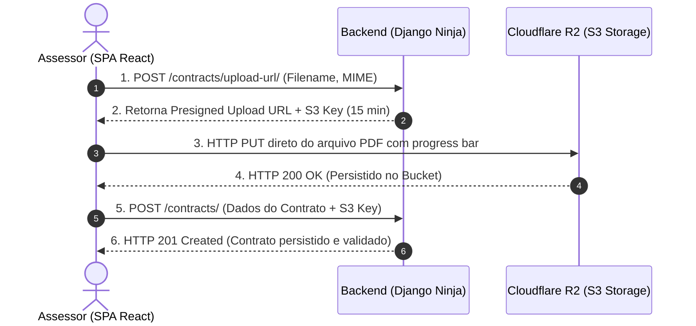
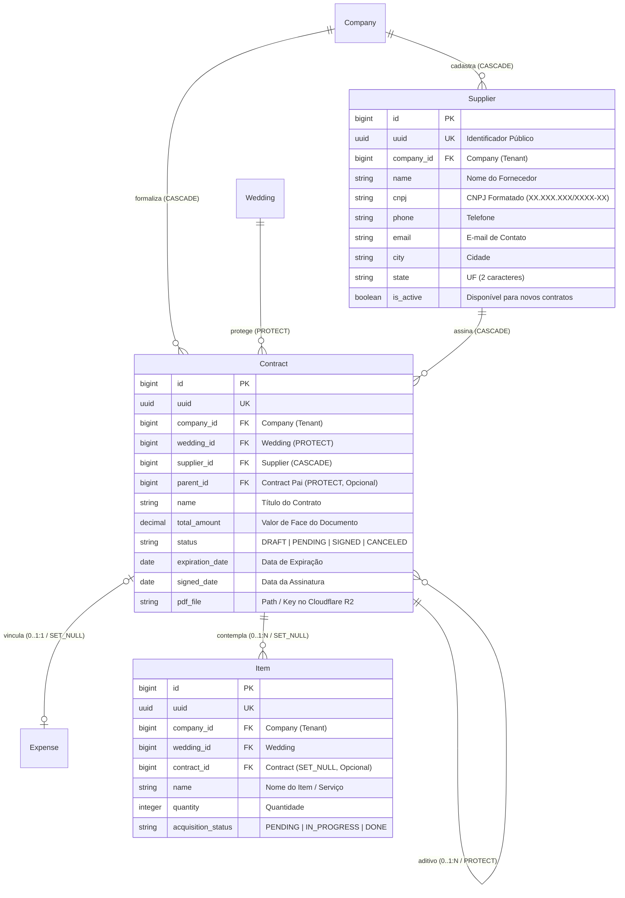

# Domínio de Logística, Fornecedores & Contratos (Logistics)

> **Categoria:** Domínios de Arquitetura (Bounded Contexts)
> **Relacionados:** [Catálogo Canônico de Regras de Negócio](../business-rules/index.md) · [ADR-003: Storage Cloudflare R2](../adr/003-why-r2.md) · [ADR-004: Presigned URLs](../adr/004-presigned-urls.md) · [ADR-006: Service Layer](../adr/006-service-layer.md) · [ADR-020: Abstração de Storage](../adr/020-storage-service-abstraction.md) · [ADR-030: Rich Domain Model](../adr/030-rich-domain-model-service-layer.md) · [ADR-031: Comunicação Entre Módulos](../adr/031-inter-module-communication.md)

O **Domínio de Logística (`logistics`)** centraliza a gestão corporativa de fornecedores, a custódia digital de contratos jurídicos em PDF via Cloudflare R2, o controle de termos aditivos (parent-child) e o rastreamento operacional dos itens e serviços contratados para cada casamento.

---

## 1. Visão de Negócio & Capacidades Operacionais

Um casamento de médio ou grande porte envolve dezenas de contratos com empresas distintas (espaço de festas, buffet, fotógrafos, músicos, decoradores, floristas). A plataforma resolve os desafios de conformidade fiscal, custódia digital desses acordos e acompanhamento físico de entregáveis.

### Principais Capacidades Operacionais
- **Catálogo Corporativo de Fornecedores:** Cadastro compartilhado de parceiros em nível de empresa (`Company`), permitindo reaproveitamento de fornecedores em múltiplos casamentos com validação estrita de CNPJ.
- **Custódia Segura de PDFs no Cloudflare R2:** Armazenamento em nuvem de minutas contratuais assinadas com links efêmeros e custo zero de egresso.
- **Rastreamento de Itens & Entregáveis:** Detalhamento dos serviços e bens contratados por contrato ou aditivo, com controle de status de aquisição.
- **Gestão de Termos Aditivos:** Suporte a contratos adicionais (reajustes, prorrogações ou expansão de escopo) vinculados ao contrato original com agregação de valor em cascata.

### Upload Direto de PDFs via Presigned URLs (R2)
O upload de minutas contratuais pesadas (PDFs de 10 MB a 50 MB) representa um risco operacional para arquiteturas serverless tradicionais. O tráfego de binários pelo processo Django consome memória, bloqueia workers e encarece a infraestrutura.

A plataforma implementa a estratégia de **Presigned URLs (ADR-004)**:
1. O cliente (SPA React) solicita uma URL de upload ao backend via `POST /api/v1/logistics/contracts/upload-url/`.
2. O Django Ninja valida as credenciais do tenant e gera uma URL assinada (S3 Compatible) temporária (expiração em 15 minutos) do **Cloudflare R2** com assinatura HMAC SHA-256.
3. O frontend realiza o envio binário direto (`HTTP PUT`) para o Cloudflare R2, com monitoramento de progresso na interface.
4. Após o upload bem-sucedido, o cliente confirma o registro do contrato no backend (`POST /api/v1/logistics/contracts/`), persistindo metadados e a chave de objeto (*storage key*).

### Validação Rigorosa de CNPJ (Módulo 11)
Para evitar fornecedores fraudulentos, erros de digitação e duplicidade:
- **Algoritmo Módulo 11:** O backend e o frontend validam matematicamente os dois dígitos verificadores (DV1 e DV2) do CNPJ.
- **Rejeição de Sequências Repetidas:** Números falsos com caracteres idênticos (`00.000.000/0000-00`, `11.111.111/1111-11`, etc.) são sumariamente invalidados.
- **Sanitização:** O banco de dados armazena os 14 dígitos numéricos puros, enquanto o frontend apresenta a máscara `XX.XXX.XXX/XXXX-XX`.

---

## 2. Modelo de Dados & Diagrama ERD

### Tabela de Entidades e Invariantes de Persistência

| Entidade | Papel & Relações | Campos & Tipos | Invariantes de Persistência & Regras Logísticas |
| :--- | :--- | :--- | :--- |
| **`Supplier`** | Catálogo de Parceiros (`TenantModel`) | `name` (max 255), `cnpj` (max 18, format regex), `phone`, `email`, `city`, `state` (Min/Max 2 chars), `is_active` | **Validação de CNPJ (BR-L05):** Algoritmo Módulo 11 e rejeição de sequências repetidas. **Multi-Tenant:** Isolamento rigoroso por empresa. |
| **`Contract`** | Instrumento Contratual (N:1 com `Supplier` e `Wedding`) | `wedding` (`ForeignKey`, `PROTECT`), `supplier` (`ForeignKey`, `CASCADE`), `parent` (`ForeignKey('self')`, `PROTECT`), `total_amount` (Decimal), `status` (`StatusChoices`), `pdf_file`, `signed_date` | **Contrato Assinado (BR-L01):** Se `status == SIGNED`, exige obrigatoriamente `pdf_file`, `signed_date` e `total_amount > 0`. **Transições Permitidas:** `DRAFT` $\to$ `PENDING`/`CANCELED`; `PENDING` $\to$ `SIGNED`/`DRAFT`/`CANCELED`; `SIGNED` $\to$ `CANCELED`. **Grafo Acíclico (BR-L02):** `parent` não pode ser self nem criar ciclos na árvore de aditivos. |
| **`Item`** | Item / Serviço Logístico (N:1 com `Contract`) | `contract` (`ForeignKey`, `SET_NULL`, nullable), `name`, `quantity` (Int $\ge 1$), `acquisition_status` (`PENDING`, `IN_PROGRESS`, `DONE`) | **Transições de Status (BR-L04):** `PENDING` $\to$ `IN_PROGRESS` $\to$ `DONE`. **Fornecedor Derivado:** Property `item.supplier` acessa `self.contract.supplier`. |

---

## 3. Matriz Consolidada de Regras de Negócio (SSOT)

| Código Canônico | Regra / Especificação | Escopo / Responsabilidade | Entidades Envolvidas | Nota Detalhada |
| :--- | :--- | :--- | :--- | :--- |
| **`BR-L01`** | **Máquina de Estados de Contratos** | Ciclo determinístico (`DRAFT` $\to$ `PENDING` $\to$ `SIGNED` $\to$ `CANCELED`), exigindo PDF, valor e data de assinatura para o estado `SIGNED`. | `Contract` | [contract-state-machine.md](../business-rules/logistics/contract-state-machine.md) |
| **`BR-L02`** | **Hierarquia Pai-Filho e Aditivos** | Termos aditivos (`parent`) com agregação de valor em cascata (\(V_{\text{efetivo}} = V_{\text{base}} + \sum V_{\text{aditivos}}\)), validação anti-ciclos e vínculo ao mesmo casamento. | `Contract`, `Wedding` | [contract-parent-child-hierarchy.md](../business-rules/logistics/contract-parent-child-hierarchy.md) |
| **`BR-L03`** | **Compartilhamento de Fornecedores** | O fornecedor pertence ao catálogo do tenant (`Company`) e pode ser referenciado em múltiplos contratos e casamentos distintos. | `Supplier`, `Company` | [contract-state-machine.md](../business-rules/logistics/contract-state-machine.md) |
| **`BR-L04`** | **Desacoplamento de Itens e Pagamentos** | O ciclo operacional do item (`PENDING` $\to$ `IN_PROGRESS` $\to$ `DONE`) é desacoplado do cronograma financeiro de quitação. | `Item`, `Contract` | [contract-state-machine.md](../business-rules/logistics/contract-state-machine.md) |
| **`BR-L05`** | **Validação e Sanitização de CNPJ** | Validação estrita dos dígitos verificadores (Módulo 11), rejeição de sequências repetidas e máscara `XX.XXX.XXX/XXXX-XX`. | `Supplier` | [cnpj-validation-rules.md](../business-rules/logistics/cnpj-validation-rules.md) |

### Matriz de Integração e Relações Cruzadas
- **Com o Módulo de Finanças:** Contratos assinados (`SIGNED`) podem ser vinculados a despesas financeiras. O `ExpenseService` valida que o valor inicial coincide com o valor do contrato através da fachada pública `apps.logistics.interfaces.get_contract_for_company`. Veja [Domínio Financeiro](finances-domain.md).
- **Com o Armazenamento Cloudflare R2:** Upload e download de PDFs utilizam URLs pré-assinadas com custo zero de egresso e expiração controlada. Veja [ADR-004](../adr/004-presigned-urls.md).

---

## 4. Arquitetura Fullstack do Módulo

O módulo segue rigorosamente a **ADR-030** (Rich Domain Model & Service Layer) estruturado em três níveis de validação:

### Backend (`backend/apps/logistics/`)
- **Modelos de Domínio Ricos (Nível 2):**
  - `Supplier`: Encapsula normalização e validação estrita de CNPJ e dados de contato.
  - `Contract`: Encapsula a máquina de estados determinística (`DRAFT`, `PENDING`, `SIGNED`, `CANCELED`), validações invariantes de formalização em `clean()` e hierarquia acíclica de aditivos.
  - `Item`: Encapsula o ciclo de vida operacional (`PENDING`, `IN_PROGRESS`, `DONE`), quantidade mínima invariante ($\ge 1$) e resolução do fornecedor via contrato.
- **Casos de Uso e Serviços (Nível 3):**
  - `SupplierService`: Orquestração multi-tenant e mutações cirúrgicas com `update_fields`.
  - `ContractService`: Ciclo de vida contratual, upload assíncrono em storage e criação atômica consolidada (`create_full_from_payload()`) sob `@transaction.atomic`.
  - `ItemService`: Gestão de itens e avanço do status operacional de aquisição.
- **Seletores de Leitura CQRS:**
  - `contract_list_selector`: Consultas otimizadas via `ContractQuerySet.with_totals()` com anotações pré-computadas em SQL para `supplier_name`, `total_paid`, `addendums_count` e `expense_id`.
  - `contract_get_selector`: Busca unitária por UUID com validação de tenant e 404 semântico.
  - `contract_detail_aggregate_selector`: Seletor analítico consolidado que pré-carrega o contrato, seus itens e termos aditivos em uma única consulta (`select_related` + `prefetch_related`), devolvendo o DTO `ContractDetailAggregateOut` para eliminar waterfalls no frontend.
  - `supplier_selectors.py` e `item_selectors.py`: Filtros isolados por tenant e anotações agregadas.
- **Validação de Entrada e Schemas Ninja (Pydantic):**
  - Schemas tipados em `apps/logistics/schemas/` (`supplier.py`, `contract.py`, `item.py`) com sanitização `str_strip_whitespace=True`.

### Frontend (`frontend/src/features/logistics/`)
- **Padrão Smart/Dumb (ADR-024):**
  - **Containers (Smart):** Orquestram os hooks Orval (`useLogisticsSuppliersList`, `useLogisticsContractsList`), filtros de fornecedor/contrato e upload direto para Cloudflare R2 via `useContractUpload`.
  - **Presenters (Dumb):** Tabelas síncronas de fornecedores, visualizadores de hierarquia de aditivos e detalhes de contratos orientados estritamente por props.
  - **Formulários e Diálogos:** Formulários com validação instantânea de CNPJ via Zod e composição de componentes atômicos shadcn/ui.

---

## 5. Integrações & Interfaces Públicas (ADR-031)

A comunicação síncrona com o módulo de Logística passa exclusivamente pela sua fachada pública:
- `apps.logistics.interfaces.get_contract_for_company`: Lookup seguro por tenant para vínculo financeiro.
- `apps.logistics.interfaces.list_contracts_for_wedding`: Listagem de contratos ativos para vinculação de despesas.

---

## 6. Aprofundamento & Referências

### Regras de Negócio Detalhadas
- [Máquina de Estados de Contratos e Itens Logísticos (`BR-L01`, `BR-L03`, `BR-L04`)](../business-rules/logistics/contract-state-machine.md)
- [Hierarquia Pai-Filho e Termos Aditivos (`BR-L02`)](../business-rules/logistics/contract-parent-child-hierarchy.md)
- [Validação e Sanitização de CNPJ (`BR-L05`)](../business-rules/logistics/cnpj-validation-rules.md)

### Decisões de Arquitetura (ADRs)
- [ADR-003: Armazenamento Cloudflare R2](../adr/003-why-r2.md)
- [ADR-004: Presigned URLs no Cloudflare R2](../adr/004-presigned-urls.md)
- [ADR-006: Service Layer Pattern](../adr/006-service-layer.md)
- [ADR-020: Abstração do Serviço de Storage](../adr/020-storage-service-abstraction.md)
- [ADR-030: Rich Domain Model e Casos de Uso](../adr/030-rich-domain-model-service-layer.md)
- [ADR-031: Comunicação Entre Módulos](../adr/031-inter-module-communication.md)
