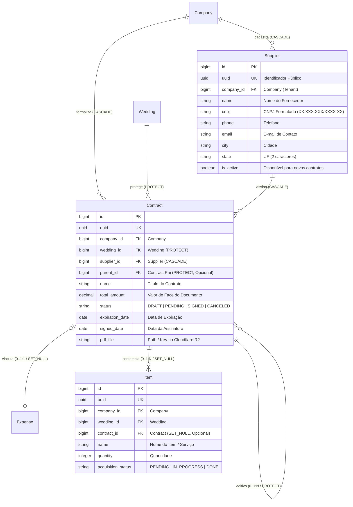

# Domínio de Logística, Fornecedores & Contratos (Logistics)

> **Categoria:** Domínios de Arquitetura (Bounded Contexts)
> **Relacionados:** [Regras de Validação de CNPJ](../business-rules/logistics/cnpj-validation-rules.md) · [Hierarquia de Contratos e Aditivos](../business-rules/logistics/contract-parent-child-hierarchy.md) · [Máquina de Estados de Contratos](../business-rules/logistics/contract-state-machine.md) · [Upload de Contratos PDF via R2](../concepts/contract-pdf-upload-r2-flow.md) · [ADR-003: Storage Cloudflare R2](../adr/003-why-r2.md) · [ADR-004: Presigned URLs](../adr/004-presigned-urls.md) · [ADR-006: Service Layer](../adr/006-service-layer.md) · [ADR-020: Abstração de Storage](../adr/020-storage-service-abstraction.md)

---

## 1. Visão Geral do Domínio

O domínio de **Logistics** é responsável pela gestão de parceiros e fornecedores (`Supplier`), formalização jurídica e documental de contratos de prestação de serviços (`Contract`), armazenamento seguro de arquivos PDF em Cloudflare R2 e controle dos itens materiais ou serviços contratados (`Item`).

Pilares arquiteturais de logística:
1. **Catálogo Unificado de Fornecedores:** Cadastro compartilhado em nível de empresa (`Company`), permitindo reaproveitamento de fornecedores em múltiplos casamentos com validação estrita de formato de CNPJ.
2. **Contratos com Proteção Jurídica e R2 Storage:** Contratos possuem status de formalização (`DRAFT`, `PENDING`, `SIGNED`, `CANCELED`), armazenando PDFs com links temporários e validação de tamanho máximo (10MB).
3. **Hierarquia de Aditivos Contratuais (Parent-Child):** Suporte nativo a aditivos contratuais (`parent = ForeignKey('self', on_delete=models.PROTECT)`), prevenindo ciclos e auto-referência.
4. **Proteção de Deleção no Casamento:** Contratos utilizam `wedding = ForeignKey('weddings.Wedding', on_delete=models.PROTECT)`, impedindo a exclusão acidental de casamentos com compromissos contratuais ativos.
5. **Máquina de Estados de Itens:** Transições controladas para aquisição e entrega de itens (`PENDING` $\rightarrow$ `IN_PROGRESS` $\rightarrow$ `DONE`).

---

## 2. Diagrama ERD do Domínio de Logística



---

## 3. Tabela de Entidades e Invariantes de Persistência

| Entidade | Papel & Relações | Campos & Tipos | Invariantes de Persistência & Regras Logísticas |
| :--- | :--- | :--- | :--- |
| **`Supplier`** | Catálogo de Parceiros (`TenantModel`) | `name` (max 255), `cnpj` (max 18, format regex), `phone`, `email`, `city`, `state` (Min/Max 2 chars), `is_active` | **Validação de CNPJ (BR-L01):** Validado com regex `XX.XXX.XXX/XXXX-XX`.<br/>**Isolamento Multi-Tenant:** Visível exclusivamente para a empresa dona do registro. |
| **`Contract`** | Instrumento Contratual (N:1 com `Supplier` e `Wedding`) | `wedding` (`ForeignKey`, `PROTECT`), `supplier` (`ForeignKey`, `CASCADE`), `parent` (`ForeignKey('self')`, `PROTECT`), `total_amount` (Decimal), `status` (`StatusChoices`), `pdf_file`, `signed_date` | **Contrato Assinado (BR-L02):** Se `status == SIGNED`, exige obrigatoriamente `pdf_file`, `signed_date` e `total_amount > 0`.<br/>**Transições Permitidas (BR-L03):** `DRAFT` $\rightarrow$ `PENDING`/`CANCELED`; `PENDING` $\rightarrow$ `SIGNED`/`DRAFT`/`CANCELED`; `SIGNED` $\rightarrow$ `CANCELED`.<br/>**Grafo Acíclico (BR-L04):** `parent` não pode ser self nem criar loops no grafo de aditivos. |
| **`Item`** | Item / Serviço Logístico (N:1 com `Contract`) | `contract` (`ForeignKey`, `SET_NULL`, nullable), `name`, `quantity` (Int $\ge 1$), `acquisition_status` (`PENDING`, `IN_PROGRESS`, `DONE`) | **Transições de Status (BR-L05):** `PENDING` $\rightarrow$ `IN_PROGRESS` $\rightarrow$ `DONE`.<br/>**Fornecedor Derivado:** Property `item.supplier` acessa `self.contract.supplier`. |

---

## 4. Transclusão de Código Real

### A. Modelo de Fornecedores com Validador de CNPJ (`Supplier`)
```python
--8<-- "backend/apps/logistics/models/supplier.py:26:106"
```

### B. Modelo de Contratos e Máquina de Transição (`Contract`)
```python
--8<-- "backend/apps/logistics/models/contract.py:23:118"
```

### C. Invariantes de Contrato Assinado e Hierarquia de Aditivos (`Contract.clean`)
```python
--8<-- "backend/apps/logistics/models/contract.py:143:196"
```

### D. Modelo de Itens de Logística (`Item`)
```python
--8<-- "backend/apps/logistics/models/item.py:24:76"
```

---

## 5. Mapeamento de Camadas (Fullstack)

### Camada de Backend (`backend/apps/logistics/`)
- **Modelos:** `Supplier` (`supplier.py`), `Contract` (`contract.py`), `Item` (`item.py`).
- **Managers:** `SupplierQuerySet`, `ContractQuerySet`, `ItemQuerySet` em `managers.py`.
- **Services:** `supplier_service.py`, `contract_service.py`, `item_service.py`.
- **Selectors:** `supplier_selectors.py`, `contract_selectors.py`, `item_selectors.py`.
- **Armazenamento:** `core/services/storage/` (Cloudflare R2 Storage Provider com geração de URLs seguras).

### Camada de Frontend (`frontend/src/features/logistics/`)
- **Páginas & Views:** `SuppliersPage.tsx`, `VendorsItemsView.tsx`.
- **Componentes:** `SuppliersTable.tsx`, `SupplierFormDialog.tsx`, `SupplierDetailDialog.tsx`, `ContractDetailDialog.tsx`, `EditContractDialog.tsx`, `ContractUploadDialog.tsx`, `ItemsTable.tsx`.
- **Hooks Customizados:** `useSuppliersPage.ts`, `useContractUpload.ts`, `useVendorsItems.ts`.

---

## 6. Links e Regras de Negócio Associadas

- [Validação de CNPJ de Fornecedores](../business-rules/logistics/cnpj-validation-rules.md)
- [Hierarquia de Contratos e Aditivos](../business-rules/logistics/contract-parent-child-hierarchy.md)
- [Máquinas de Estado de Contratos e Itens](../business-rules/logistics/contract-state-machine.md)
- [Fluxo de Upload de PDF para Cloudflare R2](../concepts/contract-pdf-upload-r2-flow.md)
- [ADR-003: Cloudflare R2](../adr/003-why-r2.md)
- [ADR-004: Presigned URLs](../adr/004-presigned-urls.md)
- [ADR-020: Abstração de Storage](../adr/020-storage-service-abstraction.md)
- [Modelos Base & Padrões Core](../../reference/models/core-models.md)
- [Finances Domain](finances-domain.md)
