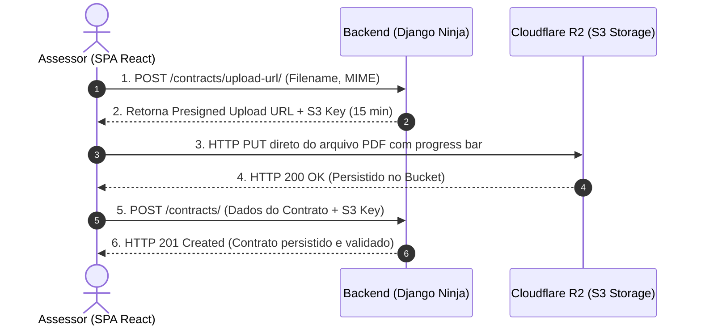
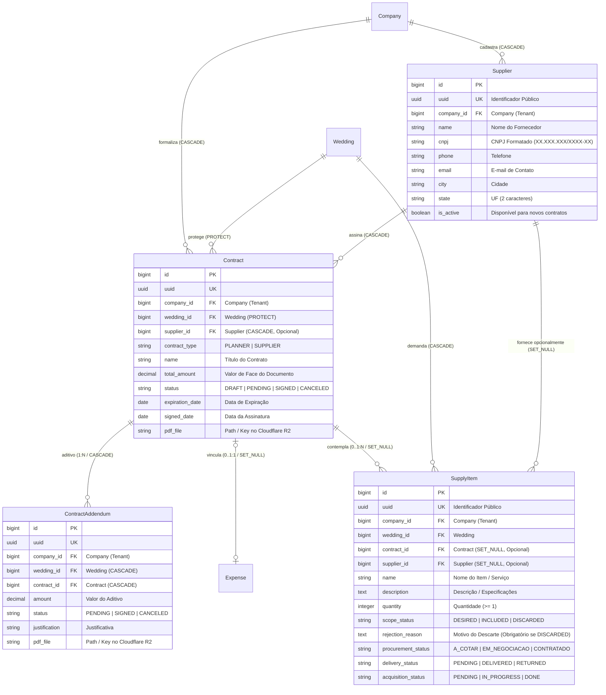

# Domínio de Logística, Fornecedores & Contratos (Logistics)

> **Categoria:** Domínios de Arquitetura (Bounded Contexts)
> **Relacionados:** [Catálogo Canônico de Regras de Negócio](../business-rules/index.md) · [ADR-003: Storage Cloudflare R2](../adr/003-why-r2.md) · [ADR-004: Presigned URLs](../adr/004-presigned-urls.md) · [ADR-006: Service Layer](../adr/006-service-layer.md) · [ADR-020: Abstração de Storage](../adr/020-storage-service-abstraction.md) · [ADR-030: Rich Domain Model](../adr/030-rich-domain-model-service-layer.md) · [ADR-031: Comunicação Entre Módulos](../adr/031-inter-module-communication.md)

O **Domínio de Logística (`logistics`)** centraliza o catálogo corporativo de fornecedores e o rastreamento operacional dos itens e serviços contratados para cada casamento. A gestão jurídica de contratos e termos aditivos vive no Bounded Context dedicado **`contracts`** (extração Onda 3 da RFC-001); este hub referencia as regras contratuais sem duplicá-las.

---

## 1. Visão de Negócio & Capacidades Operacionais

Um casamento de médio ou grande porte envolve dezenas de contratos com empresas distintas (espaço de festas, buffet, fotógrafos, músicos, decoradores, floristas). A plataforma resolve os desafios de conformidade fiscal, custódia digital desses acordos e acompanhamento físico de entregáveis.

### Principais Capacidades Operacionais
- **Catálogo Corporativo de Fornecedores:** Cadastro compartilhado de parceiros em nível de empresa (`Company`), permitindo reaproveitamento de fornecedores em múltiplos casamentos com validação estrita de CNPJ.
- **Custódia Segura de PDFs no Cloudflare R2:** Armazenamento em nuvem de minutas contratuais assinadas com links efêmeros e custo zero de egresso.
- **Rastreamento de Itens & Entregáveis:** Detalhamento dos serviços e bens contratados por contrato ou aditivo, com controle de status de aquisição.
- **Gestão de Termos Aditivos:** Suporte a contratos adicionais (reajustes, prorrogações ou expansão de escopo) vinculados ao contrato original com agregação de valor em cascata.

### Upload Direto de PDFs via Presigned URLs (R2)
O upload de minutas contratuais pesadas (PDFs de 10 MB a 50 MB) representa um risco operacional para arquiteturas serverless tradicionais. O tráfego de binários pelo processo Django consome memória, bloqueia workers e encarece a infraestrutura.

A plataforma implementa a estratégia de **Presigned URLs (ADR-004)** (fluxo completo em [contract-pdf-upload-r2-flow.md](../concepts/contract-pdf-upload-r2-flow.md)):
1. O cliente (SPA React) solicita uma URL de upload ao backend via `POST /api/v1/contracts/upload-url/`.
2. O Django Ninja valida as credenciais do tenant e gera uma URL assinada (S3 Compatible) temporária (expiração em 15 minutos) do **Cloudflare R2** com assinatura HMAC SHA-256.
3. O frontend realiza o envio binário direto (`HTTP PUT`) para o Cloudflare R2, com monitoramento de progresso na interface.
4. Após o upload bem-sucedido, o cliente confirma o registro do contrato no backend (`POST /api/v1/contracts/` ou `POST /api/v1/contracts/full/` para criação atômica com itens e despesa), persistindo metadados e a chave de objeto (*storage key*).

```mermaid
sequenceDiagram
    autonumber
    actor Assessor as Assessor (SPA React)
    participant Django as Backend (Django Ninja)
    participant R2 as Cloudflare R2 (S3 Storage)

    Assessor->>Django: 1. POST /contracts/upload-url/ (Filename, MIME)
    Django-->>Assessor: 2. Retorna Presigned Upload URL + S3 Key (15 min)
    Assessor->>R2: 3. HTTP PUT direto do arquivo PDF com progress bar
    R2-->>Assessor: 4. HTTP 200 OK (Persistido no Bucket)
    Assessor->>Django: 5. POST /contracts/ (Dados do Contrato + S3 Key)
    Django-->>Assessor: 6. HTTP 201 Created (Contrato persistido e validado)
```

### Validação Rigorosa de CNPJ (Módulo 11)
Para evitar fornecedores fraudulentos, erros de digitação e duplicidade:
- **Algoritmo Módulo 11:** O backend e o frontend validam matematicamente os dois dígitos verificadores (DV1 e DV2) do CNPJ.
- **Rejeição de Sequências Repetidas:** Números falsos com caracteres idênticos (`00.000.000/0000-00`, `11.111.111/1111-11`, etc.) são sumariamente invalidados.
- **Sanitização:** O banco de dados armazena os 14 dígitos numéricos puros, enquanto o frontend apresenta a máscara `XX.XXX.XXX/XXXX-XX`.

---

## 2. Modelo de Dados & Diagrama ERD

```mermaid
erDiagram
    Company ||--o{ Supplier : "cadastra (CASCADE)"
    Company ||--o{ Contract : "formaliza (CASCADE)"
    Wedding ||--o{ Contract : "protege (PROTECT)"
    Supplier ||--o{ Contract : "assina (CASCADE)"
    Contract ||--o{ ContractAddendum : "aditivo (1:N / CASCADE)"
    Contract |o--o| Expense : "vincula (0..1:1 / SET_NULL)"
    Contract ||--o{ SupplyItem : "contempla (0..1:N / SET_NULL)"
    Wedding ||--o{ SupplyItem : "demanda (CASCADE)"
    Supplier ||--o{ SupplyItem : "fornece opcionalmente (SET_NULL)"

    Supplier {
        bigint id PK
        uuid uuid UK "Identificador Público"
        bigint company_id FK "Company (Tenant)"
        string name "Nome do Fornecedor"
        string cnpj "CNPJ Formatado (XX.XXX.XXX/XXXX-XX)"
        string phone "Telefone"
        string email "E-mail de Contato"
        string city "Cidade"
        string state "UF (2 caracteres)"
        boolean is_active "Disponível para novos contratos"
    }

    Contract {
        bigint id PK
        uuid uuid UK
        bigint company_id FK "Company (Tenant)"
        bigint wedding_id FK "Wedding (PROTECT)"
        bigint supplier_id FK "Supplier (CASCADE, Opcional)"
        string contract_type "PLANNER | SUPPLIER"
        string name "Título do Contrato"
        decimal total_amount "Valor de Face do Documento"
        string status "DRAFT | PENDING | SIGNED | CANCELED"
        date expiration_date "Data de Expiração"
        date signed_date "Data da Assinatura"
        string pdf_file "Path / Key no Cloudflare R2"
    }

    ContractAddendum {
        bigint id PK
        uuid uuid UK
        bigint company_id FK "Company (Tenant)"
        bigint wedding_id FK "Wedding (CASCADE)"
        bigint contract_id FK "Contract (CASCADE)"
        decimal amount "Valor do Aditivo"
        string status "PENDING | SIGNED | CANCELED"
        string justification "Justificativa"
        string pdf_file "Path / Key no Cloudflare R2"
    }

    SupplyItem {
        bigint id PK
        uuid uuid UK "Identificador Público"
        bigint company_id FK "Company (Tenant)"
        bigint wedding_id FK "Wedding"
        bigint contract_id FK "Contract (SET_NULL, Opcional)"
        bigint supplier_id FK "Supplier (SET_NULL, Opcional)"
        string name "Nome do Item / Serviço"
        text description "Descrição / Especificações"
        integer quantity "Quantidade (>= 1)"
        string scope_status "DESIRED | INCLUDED | DISCARDED"
        text rejection_reason "Motivo do Descarte (Obrigatório se DISCARDED)"
        string procurement_status "A_COTAR | EM_NEGOCIACAO | CONTRATADO"
        string delivery_status "PENDING | DELIVERED | RETURNED"
        string acquisition_status "PENDING | IN_PROGRESS | DONE"
    }
```

### Tabela de Entidades e Invariantes de Persistência

| Entidade | Papel & Relações | Campos & Tipos | Invariantes de Persistência & Regras Logísticas |
| :--- | :--- | :--- | :--- |
| **`Supplier`** | Catálogo de Parceiros (`TenantModel`) | `name` (max 255), `cnpj` (max 18, format regex), `phone`, `email`, `city`, `state` (Min/Max 2 chars), `is_active` | **Validação de CNPJ (BR-L05):** Algoritmo Módulo 11 e rejeição de sequências repetidas. **Multi-Tenant:** Isolamento rigoroso por empresa. |
| **`Contract`** (`apps.contracts`) | Instrumento Contratual (N:1 com `Supplier` e `Wedding`) | `wedding` (`ForeignKey`, `PROTECT`), `supplier` (`ForeignKey`, `CASCADE`, opcional), `contract_type` (`PLANNER`/`SUPPLIER`), `total_amount` (Decimal), `status` (`StatusChoices`), `pdf_file`, `signed_date` | **Contrato Assinado (BR-L01):** Se `status == SIGNED`, exige obrigatoriamente `pdf_file` (SUPPLIER), `signed_date` e `total_amount > 0`. **Transições Permitidas:** `DRAFT` $\to$ `PENDING`/`CANCELED`; `PENDING` $\to$ `SIGNED`/`DRAFT`/`CANCELED`; `SIGNED` $\to$ `CANCELED`; `CANCELED` $\to$ `DRAFT`. **Aditivos 1:N (BR-L02):** Entidade filha `ContractAddendum` (`CASCADE`); somente `SIGNED` compõe `effective_amount` (`V_{\text{efetivo}} = V_{\text{base}} + \sum V_{\text{aditivos SIGNED}}`); `PENDING` em `addendums_pending_total`. |
| **`SupplyItem`** | Item / Suprimento Logístico (N:1 com `Wedding`, 0..1:N com `Contract`) | `contract` (FK, `SET_NULL`, nullable), `supplier` (FK, `SET_NULL`, nullable), `name`, `quantity` (Int $\ge 1$), `scope_status`, `rejection_reason`, `procurement_status`, `delivery_status`, `acquisition_status` | **3 Dimensões Operacionais (RF-15 / RFC-001):** 1. **Escopo:** `DESIRED`, `INCLUDED`, `DISCARDED`. Se `DISCARDED`, `rejection_reason` é estritamente obrigatório no `clean()`. 2. **Cotação:** `A_COTAR`, `EM_NEGOCIACAO`, `CONTRATADO`. 3. **Entrega Física:** `PENDING`, `DELIVERED`, `RETURNED` (além de `acquisition_status` para o ciclo de aquisição: `PENDING` $\leftrightarrow$ `IN_PROGRESS` $\leftrightarrow$ `DONE`). |

---

## 3. Matriz Consolidada de Regras de Negócio (SSOT)

| Código Canônico | Regra / Especificação | Escopo / Responsabilidade | Entidades Envolvidas | Nota Detalhada |
| :--- | :--- | :--- | :--- | :--- |
| **`BR-L01`** | **Máquina de Estados de Contratos** | Ciclo determinístico (`DRAFT` $\to$ `PENDING` $\to$ `SIGNED` $\to$ `CANCELED`), exigindo PDF, valor e data de assinatura para o estado `SIGNED`. | `Contract` | [contract-state-machine.md](../business-rules/logistics/contract-state-machine.md) |
| **`BR-L02`** | **Aditivos 1:N (ContractAddendum)** | Entidade filha dedicada com alinhamento de contrato/casamento, deleção em cascata e composição SIGNED-only (\(V_{\text{efetivo}} = V_{\text{base}} + \sum V_{\text{aditivos SIGNED}}\)). | `Contract`, `ContractAddendum`, `Wedding` | [contract-parent-child-hierarchy.md](../business-rules/logistics/contract-parent-child-hierarchy.md) |
| **`BR-L03`** | **Compartilhamento de Fornecedores** | O fornecedor pertence ao catálogo do tenant (`Company`) e pode ser referenciado em múltiplos contratos e casamentos distintos. | `Supplier`, `Company` | [contract-state-machine.md](../business-rules/logistics/contract-state-machine.md) |
| **`BR-L04`** | **Desacoplamento de Suprimentos e Pagamentos** | O ciclo operacional do suprimento (`SupplyItem`) é desacoplado do cronograma financeiro de quitação. | `SupplyItem`, `Contract` | [contract-state-machine.md](../business-rules/logistics/contract-state-machine.md) |
| **`BR-L05`** | **Validação e Sanitização de CNPJ** | Validação estrita dos dígitos verificadores (Módulo 11), rejeição de sequências repetidas e máscara `XX.XXX.XXX/XXXX-XX`. | `Supplier` | [cnpj-validation-rules.md](../business-rules/logistics/cnpj-validation-rules.md) |
| **`BR-L06`** | **Motivo Obrigatório ao Descartar Item** | Ao marcar `scope_status = DISCARDED`, o preenchimento de `rejection_reason` é estritamente obrigatório no `clean()`. | `SupplyItem` | [contract-state-machine.md](../business-rules/logistics/contract-state-machine.md) |

### Matriz de Integração e Relações Cruzadas
- **Com o Módulo de Finanças:** Contratos assinados (`SIGNED`) podem ser vinculados a despesas financeiras. O `ExpenseService` valida que o valor inicial coincide com o valor do contrato através da fachada pública `apps.contracts.interfaces.get_contract_for_company`. Veja [Domínio Financeiro](finances-domain.md).
- **Com o Módulo de Contratos:** `Supplier` (catálogo compartilhado, tabela `logistics_supplier` preservada sem migração de dados — Onda 4) vive em `apps.contracts`; `Contract.supplier` resolve via `apps.contracts.interfaces.get_supplier_for_company`, e itens são criados via `apps.logistics.interfaces.create_item_for_contract`. Veja [RFC-001](../rfc/001-macro-architecture-and-domain-redesign.md).
- **Com o Armazenamento Cloudflare R2:** Upload e download de PDFs utilizam URLs pré-assinadas com custo zero de egresso e expiração controlada. Veja [ADR-004](../adr/004-presigned-urls.md).

---

## 4. Arquitetura Fullstack do Módulo

O módulo segue rigorosamente a **ADR-030** (Rich Domain Model & Service Layer) estruturado em três níveis de validação:

### Backend (`backend/apps/logistics/` + `backend/apps/contracts/`)
- **Modelos de Domínio Ricos (Nível 2):**
  - `Supplier` (`apps.logistics`): Encapsula normalização e validação estrita de CNPJ e dados de contato.
  - `Contract` / `ContractAddendum` (`apps.contracts`): Encapsulam a máquina de estados determinística (`DRAFT`, `PENDING`, `SIGNED`, `CANCELED`), validações invariantes de formalização em `clean()`, isolamento de tenant (`wedding.company`) e composição SIGNED-only de aditivos.
  - `SupplyItem` (`apps.logistics`): Encapsula as 3 dimensões operacionais (escopo com justificativa obrigatória de descarte, cotação e entrega física), quantidade mínima invariante ($\ge 1$) e ciclo de aquisição.
- **Casos de Uso e Serviços (Nível 3):**
  - `SupplierService` (`apps.contracts`): Orquestração multi-tenant do catálogo e mutações cirúrgicas com `update_fields`.
  - `ContractService` / `ContractAddendumService` (`apps.contracts`): Ciclo de vida contratual, upload assíncrono em storage e criação atômica consolidada (`create_full_from_payload()` → `create_full()`) sob `@transaction.atomic`. `update()` com travas: `status`/`contract_type` exigem endpoints dedicados; `total_amount` de `SIGNED` só via aditivo (BR-F02).
  - `SupplyItemService` (`apps.logistics.services.item_service.ItemService`): Gestão de suprimentos e avanço do status operacional de aquisição e entrega.
- **Seletores de Leitura CQRS:**
  - `contract_list_selector`: Consultas otimizadas via `ContractQuerySet.with_totals()` com anotações pré-computadas em SQL (`supplier_name`, `addendums_total` SIGNED, `addendums_pending_total` PENDING, `effective_amount`, `addendums_count`, `expense_id` via reporting).
  - `contract_get_selector`: Busca unitária por UUID com validação de tenant e 404 semântico.
  - `contract_detail_aggregate_selector`: Seletor analítico consolidado que pré-carrega o contrato, seus itens e termos aditivos em uma única consulta (`select_related` + `prefetch_related`), devolvendo o DTO `ContractDetailAggregateOut` para eliminar waterfalls no frontend.
  - `supplier_selectors.py` (`apps.contracts`) e `item_selectors.py`: Filtros isolados por tenant e anotações agregadas.
- **Validação de Entrada e Schemas Ninja (Pydantic):**
  - Schemas tipados em `apps/contracts/schemas/` (`contract.py`, `contract_addendum.py`, `supplier.py`) e `apps/logistics/schemas/` (`item.py`) com sanitização `str_strip_whitespace=True`.

### Frontend (`frontend/src/features/logistics/` + `frontend/src/features/contracts/`)
- **Padrão Smart/Dumb (ADR-024):**
  - **Containers (Smart):** Orquestram os hooks Orval (`useLogisticsSuppliersList`, `useContractsList`), filtros de fornecedor/contrato e upload direto para Cloudflare R2 via `useContractUploadForm` (`features/contracts/hooks/`).
  - **Presenters (Dumb):** Tabelas síncronas de fornecedores, visualizadores de hierarquia de aditivos e detalhes de contratos orientados estritamente por props (`*View.tsx`, sem hooks de dados/rotas).
  - **Formulários e Diálogos:** Formulários com validação instantânea de CNPJ via Zod e composição de componentes atômicos shadcn/ui.

---

## 5. Integrações & Interfaces Públicas (ADR-031)

A comunicação síncrona sobre contratos passa exclusivamente pela fachada pública do Bounded Context dedicado:
- `apps.contracts.interfaces.get_contract_for_company`: Lookup seguro por tenant para vínculo financeiro.
- `apps.contracts.interfaces.list_contracts_for_wedding`: Listagem de contratos ativos para vinculação de despesas.
- `apps.contracts.interfaces.get_planner_contract_for_wedding`: Contrato de honorários (PLANNER) do casamento.
- `apps.contracts.interfaces.enqueue_guest_count_evaluation`: Avaliação reativa de impacto de convidados (evento `WeddingGuestCountChangedEvent`, RFC-001).

O roteador legado `apps/logistics/api/contracts.py` (`/api/v1/logistics/contracts/`) foi removido na Onda 4 — prefixo canônico `/api/v1/contracts/`.

---

## 6. Aprofundamento & Referências

### Regras de Negócio Detalhadas
- [Máquina de Estados de Contratos e Itens Logísticos (`BR-L01`, `BR-L03`, `BR-L04`)](../business-rules/logistics/contract-state-machine.md)
- [Hierarquia Pai-Filho e Termos Aditivos (`BR-L02`)](../business-rules/logistics/contract-parent-child-hierarchy.md)
- [Validação e Sanitização de CNPJ (`BR-L05`)](../business-rules/logistics/cnpj-validation-rules.md)

### Decisões de Arquitetura (ADRs)
- [ADR-003: Armazenamento Cloudflare R2](../adr/003-why-r2.md)
- [ADR-004: Presigned URLs no Cloudflare R2](../adr/004-presigned-urls.md)
- [ADR-006: Service Layer Pattern](../adr/006-service-layer.md)
- [ADR-020: Abstração do Serviço de Storage](../adr/020-storage-service-abstraction.md)
- [ADR-030: Rich Domain Model e Casos de Uso](../adr/030-rich-domain-model-service-layer.md)
- [ADR-031: Comunicação Entre Módulos](../adr/031-inter-module-communication.md)
