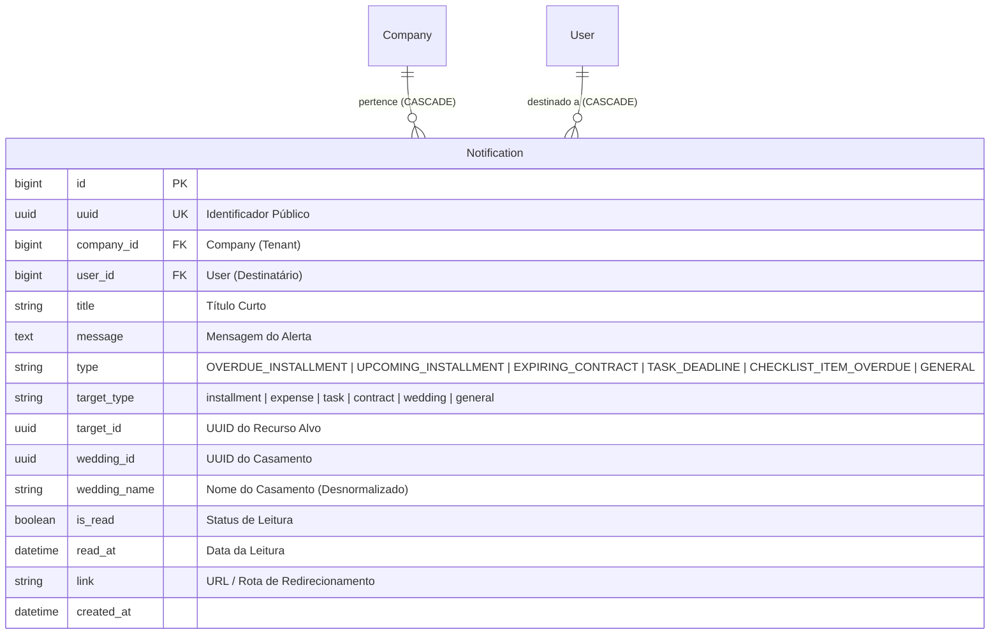
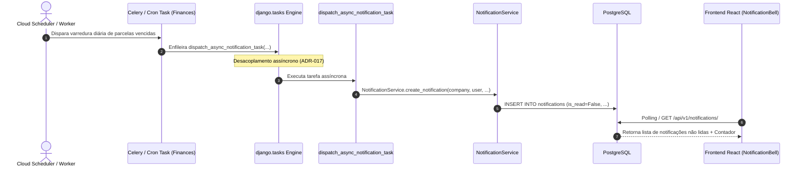

# Domínio de Notificações & Alertas In-App (Notifications)

> **Categoria:** Domínios de Arquitetura (Bounded Contexts)
> **Relacionados:** [Catálogo Canônico de Regras de Negócio](../business-rules/index.md) · [Arquitetura de Tarefas Assíncronas](../concepts/async-tasks-architecture.md) · [ADR-006: Service Layer](../adr/006-service-layer.md) · [ADR-009: Multi-Tenancy](../adr/009-multitenancy.md) · [ADR-017: Tarefas Assíncronas](../adr/017-async-task-infrastructure.md) · [ADR-030: Rich Domain Model](../adr/030-rich-domain-model-service-layer.md) · [ADR-031: Comunicação Entre Módulos](../adr/031-inter-module-communication.md)

O **Domínio de Notificações (`notifications`)** fornece o mecanismo transacional e assíncrono de alertas operacionais, avisos e lembretes para usuários da assessoria e casais, reagindo a eventos disparados pelos demais domínios.

---

## 1. Visão de Negócio & Capacidades Operacionais

Em um ambiente operacional de casamentos, perder um prazo de pagamento ou de confirmação de contrato pode inviabilizar um serviço. O módulo centraliza avisos operacionais com entrega visual in-app e suporte a deep linking.

### Principais Capacidades Operacionais
- **Central de Alertas In-App:** Exibição em tempo real no sino de notificações (*notification bell*) da interface web, com contadores de não lidas.
- **Deep Linking Contextual:** Cada notificação contém metadados de ancoragem (`target_type` e `target_id`), permitindo redirecionar o usuário diretamente para o contrato, parcela, tarefa ou casamento em questão.
- **Gestão Individual e em Lote:** Capacidade de marcar itens como lidos individualmente, marcar todos como lidos em massa ou expurgar notificações obsoletas.
- **Despacho Desacoplado:** Notificações disparadas por rotinas cron pesadas utilizam execução assíncrona não bloqueante via `django.tasks`.

---

## 2. Modelo de Dados & Diagrama ERD

### Tabela de Entidades e Invariantes de Persistência

| Entidade / Componente | Papel Arquitetural | Campos & Tipos | Invariantes de Persistência & Regras de Notificação |
| :--- | :--- | :--- | :--- |
| **`Notification`** | Agregado de Notificação (`BaseModel`) | `company` (`ForeignKey`, `CASCADE`), `user` (`ForeignKey`, `CASCADE`), `title`, `message`, `type` (`NotificationType`), `target_type` (`NotificationTargetType`), `target_id`, `wedding_id`, `wedding_name`, `is_read`, `read_at`, `link` | **Validação de Tenant (BR-N01):** `user.company_id == company.id`. **Índice Composto:** `models.Index(fields=["company", "user", "is_read"])` para contagens rápidas. **Transição de Leitura:** Ao marcar como lida, registra `read_at = timezone.now()`. |

---

## 3. Matriz Consolidada de Regras de Negócio (SSOT)

| Código Canônico | Regra / Especificação | Escopo / Responsabilidade | Entidades Envolvidas | Nota Detalhada |
| :--- | :--- | :--- | :--- | :--- |
| **`BR-N01`** | **Criação e Isolamento de Alertas** | Disparo de alertas síncronos e assíncronos vinculados a um usuário e tenant específicos, com tipos canônicos de notificação. | `Notification`, `Company`, `User` | [in-app-notifications-rules.md](../business-rules/notifications/in-app-notifications-rules.md) |
| **`BR-N02`** | **Ciclo de Leitura Individual e em Lote** | Marcação atômica de leitura (`read_at`), mutação em lote via `bulk-read` e limpeza controlada via `clear-all`. | `Notification` | [in-app-notifications-rules.md](../business-rules/notifications/in-app-notifications-rules.md) |
| **`BR-N03`** | **Contadores e Badges na UI** | Consulta indexada em tempo constante de contagem de notificações não lidas por usuário/empresa. | `Notification` | [in-app-notifications-rules.md](../business-rules/notifications/in-app-notifications-rules.md) |
| **`BR-N04`** | **Ancoragem e Deep Linking** | Rastreabilidade da entidade geradora com rota canônica de redirecionamento na interface. | `Notification` | [in-app-notifications-rules.md](../business-rules/notifications/in-app-notifications-rules.md) |

### Matriz de Integração e Relações Cruzadas
- **Com o Módulo de Finanças:** Tarefas diárias de parcelas vencidas emitem alertas para a assessoria. Veja [Domínio Financeiro](finances-domain.md).
- **Com o Módulo de Cronograma:** Lembretes de eventos configurados com antecedência disparam notificações contextuais. Veja [Domínio de Cronograma](scheduler-domain.md).

---

## 4. Arquitetura Fullstack do Módulo

O módulo segue rigorosamente a **ADR-030** (Rich Domain Model & Service Layer):

### Backend (`backend/apps/notifications/`)
- **Modelos de Domínio Ricos:**
  - `Notification`: Encapsula invariantes de tenant e temporais no `clean()` e métodos de ciclo de vida (`mark_as_read()`).
- **Casos de Uso e Serviços:**
  - `NotificationService`: Orquestra criação síncrona, leitura individual e em lote e expurgação segura de registros por tenant.
  - `dispatch_async_notification_task`: Enfileiramento desacoplado em segundo plano via `django.tasks` (ADR-017).
- **Seletores de Leitura CQRS:**
  - `notification_list_selector`, `notification_unread_count_selector`: Consultas otimizadas com contagens indexadas e anotações do casamento via SQL.
- **Validação de Entrada e Schemas Ninja (Pydantic):**
  - Schemas modulares em `apps/notifications/schemas/` com sanitização e validação de listas mínimas.
- **Endpoints:**
  - `GET /notifications/`, `GET /notifications/unread-count/`, `POST /notifications/read-all/`, `POST /notifications/bulk-read/`, `POST /notifications/bulk-delete/`, `DELETE /notifications/clear-all/`, `PATCH /notifications/{notification_id}/read/`.

### Frontend (`frontend/src/features/notifications/`)
- **Padrão Smart/Dumb (ADR-024):**
  - **Smart Container (`NotificationsDropdown.tsx`):** Orquestra o popover suspenso (*notification bell*), contadores em tempo real e deep links.
  - **Smart Hook (`useNotificationsDropdown.ts`):** Gerencia requisições TanStack Query (`useNotificationsList`, `useNotificationsUnreadCount`) e ações de mutação em lote.
  - **Dumb Presenter (`NotificationsDropdownView.tsx`):** Visual puro orientado por props com modo de seleção múltipla, exclusão em massa e itens individuais (`NotificationItem.tsx`).

---

## 5. Integrações & Interfaces Públicas (ADR-031)

- `apps.notifications.interfaces.notify_tenant_users`: Ponto único de entrada para disparos transacionais oriundos de outros Bounded Contexts.

---

## 6. Aprofundamento & Referências

### Regras de Negócio Detalhadas
- [Regras de Negócio de Notificações In-App (`BR-N01` a `BR-N04`)](../business-rules/notifications/in-app-notifications-rules.md)

### Decisões de Arquitetura (ADRs)
- [ADR-006: Service Layer Pattern](../adr/006-service-layer.md)
- [ADR-009: Isolamento Multi-Tenancy](../adr/009-multitenancy.md)
- [ADR-017: Infraestrutura de Tarefas Assíncronas](../adr/017-async-task-infrastructure.md)
- [ADR-030: Rich Domain Model e Casos de Uso](../adr/030-rich-domain-model-service-layer.md)
- [ADR-031: Comunicação Entre Módulos](../adr/031-inter-module-communication.md)
