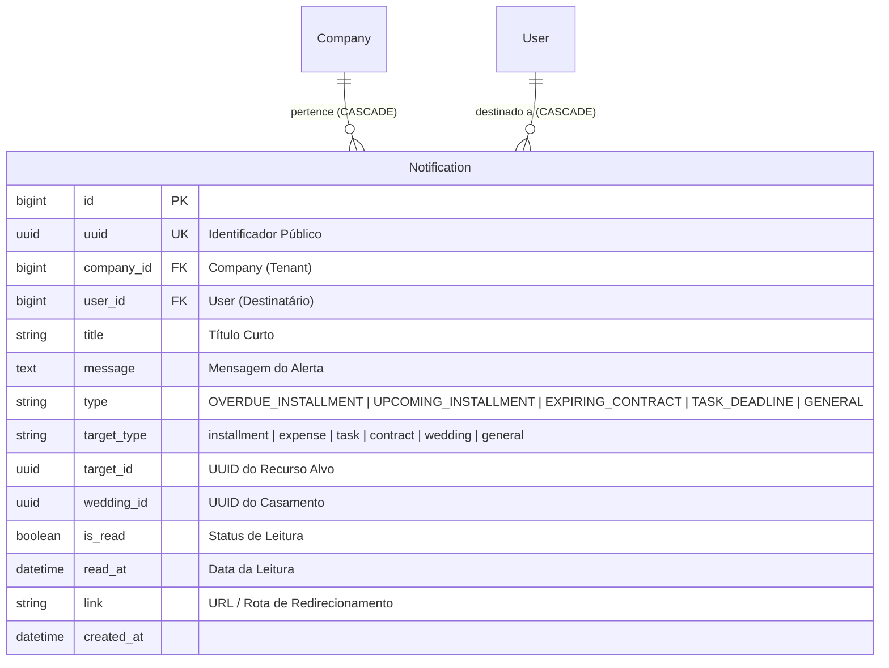

# Domínio de Notificações & Alertas In-App (Notifications)

> **Categoria:** Domínios de Arquitetura (Bounded Contexts)
> **Relacionados:** [Regras de Notificações In-App](../business-rules/notifications/in-app-notifications-rules.md) · [Arquitetura de Tarefas Assíncronas](../concepts/async-tasks-architecture.md) · [ADR-006: Service Layer](../adr/006-service-layer.md) · [ADR-009: Multi-Tenancy](../adr/009-multitenancy.md) · [ADR-017: Infraestrutura de Tarefas Assíncronas](../adr/017-async-task-infrastructure.md) · [Modelos Base & Padrões Core](../../reference/models/core-models.md)

---

## 1. Visão Geral do Domínio

O domínio de **Notifications** centraliza todo o pipeline de comunicação de eventos, alertas e lembretes gerados pelos módulos operacionais do ERP para os usuários do sistema.

Pilares arquiteturais de notificações:
1. **Comunicação In-App Centralizada:** Persistência de notificações para consumo em tempo real no sino (*notification bell*) da interface web.
2. **Dupla Interface de Criação (Síncrona & Assíncrona):**
   - **Síncrona (`NotificationService.create_notification`):** Para disparos imediatos durante execuções diretas de serviços.
   - **Assíncrona (`dispatch_async_notification_task` via `django.tasks`):** Para disparos disparados por crons ou rotinas pesadas em background (ADR-017).
3. **Isolamento Estrito de Multi-Tenancy:** Cada notificação pertence a uma `Company` e a um `User` destinatário (`user.company_id == company.id`).
4. **Ancoragem Polimórfica Leve:** Associação dinâmica com entidades de negócio (`target_type` e `target_id` UUID), permitindo redirecionamento com clique (*deep link*).

---

## 2. Diagrama ERD e Fluxo de Despacho Assíncrono

---

## 3. Tabela de Entidades, Tipos e Invariantes de Persistência

| Entidade / Componente | Papel Arquitetural | Campos & Tipos | Invariantes de Persistência & Regras de Notificação |
| :--- | :--- | :--- | :--- |
| **`Notification`** | Agregado de Notificação (`BaseModel`) | `company` (`ForeignKey`, `CASCADE`), `user` (`ForeignKey`, `CASCADE`), `title`, `message`, `type` (`NotificationType`), `target_type` (`NotificationTargetType`), `target_id`, `wedding_id`, `is_read`, `read_at`, `link` | **Validação de Tenant (BR-N01):** `user.company_id == company.id` (usuário deve pertencer à empresa informada). **Índice Composto:** `models.Index(fields=["company", "user", "is_read"])` para lookups rápidos da contagem de não-lidas. **Transição de Leitura:** Ao marcar como lida, preenche `read_at = timezone.now()`. |
| **`NotificationType`** | Tipos de Eventos do Sistema | `OVERDUE_INSTALLMENT`, `UPCOMING_INSTALLMENT`, `EXPIRING_CONTRACT`, `TASK_DEADLINE`, `CHECKLIST_ITEM_OVERDUE`, `GENERAL` | Categoriza a severidade e o ícone visual a ser renderizado na interface. |
| **`NotificationTargetType`** | Tipos de Entidades Alvo | `installment`, `expense`, `task`, `contract`, `wedding`, `general` | Mapeia o alvo para permitir deep-linking e navegação direta na interface React. |
| **`dispatch_async_notification_task`** | Tarefa em Segundo Plano (`@task()`) | `company_id`, `user_id`, `title`, `message`, `notification_type`, ... | Enfileira a criação da notificação usando `django.tasks` sem bloquear o ciclo de vida da requisição HTTP principal. |

---

## 4. Implementação do Modelo de Domínio e Serviços

O módulo segue rigorosamente a **ADR-030** (Rich Domain Model & Service Layer), estruturado em três níveis de validação:

- **Modelos de Domínio Ricos:**
  - [`apps/notifications/models.py`](../../../backend/apps/notifications/models.py) (`Notification`): Encapsula invariantes multi-tenant e temporais no `clean()` e métodos de ciclo de vida (`mark_as_read()`).
- **Casos de Uso e Serviços:**
  - [`apps/notifications/services.py`](../../../backend/apps/notifications/services.py) (`NotificationService`): Orquestra criação síncrona e assíncrona, marcações individuais e em lote com persistência cirúrgica via `update_fields` e expurgação segura de notificações por tenant.
  - [`apps/notifications/tasks.py`](../../../backend/apps/notifications/tasks.py) (`dispatch_async_notification_task`): Enfileiramento desacoplado em segundo plano via `django.tasks` (ADR-017).
- **Seletores de Leitura CQRS:**
  - [`apps/notifications/selectors.py`](../../../backend/apps/notifications/selectors.py) (`notification_list_selector`, `notification_unread_count_selector`, `notification_get_selector`): Consultas otimizadas com contagens indexadas e anotações do nome do casamento via SQL (`with_wedding_name`).
- **Validação de Entrada (Pydantic):**
  - [`apps/notifications/schemas/`](../../../backend/apps/notifications/schemas/): Pacote modular (`notification.py`, `bulk.py`) com regras de Nível 1 (sanitização de entrada via `str_strip_whitespace=True`, lista com `min_length=1` e DTOs de contagem).

---

## 5. Mapeamento de Camadas (Fullstack)

### Camada de Backend (`backend/apps/notifications/`)
- **Modelos:** `Notification`, `NotificationType`, `NotificationTargetType` em `models.py`.
- **Managers:** `NotificationQuerySet` em `managers.py`.
- **Services:** `NotificationService` em `services.py`.
- **Tasks:** `dispatch_async_notification_task` em `tasks.py`.
- **Selectors:** `notification_list_selector`, `notification_unread_count_selector` em `selectors.py`.
- **Endpoints:** `api.py` com rotas `GET /notifications/`, `GET /notifications/unread-count/`, `POST /notifications/read-all/`, `POST /notifications/bulk-read/`, `POST /notifications/bulk-delete/`, `DELETE /notifications/clear-all/`, `PATCH /notifications/{notification_id}/read/`, `DELETE /notifications/{notification_id}/`.

### Camada de Frontend (`frontend/src/features/notifications/`)
- **Componentes:** `NotificationsDropdown.tsx` (orquestrador com popover e badge de contagem), `NotificationItem.tsx` (apresentação do item individual).
- **Integração de API:** Hooks gerados pelo Orval (`useNotificationsList`, `useNotificationsUnreadCount`, `useNotificationsMarkAsRead`, `useNotificationsMarkAllAsRead`, etc.).

---

## 6. Links e Regras de Negócio Associadas

- [Regras de Negócio de Notificações In-App](../business-rules/notifications/in-app-notifications-rules.md)
- [Arquitetura de Tarefas Assíncronas](../concepts/async-tasks-architecture.md)
- [ADR-006: Service Layer](../adr/006-service-layer.md)
- [ADR-009: Multi-Tenancy](../adr/009-multitenancy.md)
- [ADR-017: Infraestrutura de Tarefas Assíncronas](../adr/017-async-task-infrastructure.md)
- [Modelos Base & Padrões Core](../../reference/models/core-models.md)
- [Core Domain](core-domain.md)
- [Users Domain](users-domain.md)
