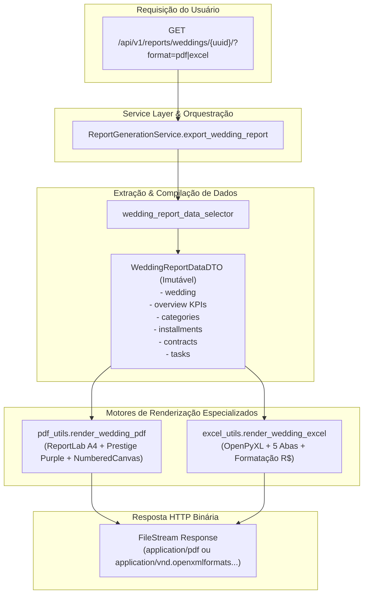

# Domínio de Relatórios & Exportações Analíticas (Reporting)

> **Categoria:** Domínios de Arquitetura (Bounded Contexts)
> **Relacionados:** [Dashboard Domain](dashboard-domain.md) · [Padrão Query Selectors](../concepts/query-selectors-pattern.md) · [ADR-006: Service Layer](../adr/006-service-layer.md) · [ADR-009: Multi-Tenancy](../adr/009-multitenancy.md) · [ADR-028: Diátaxis & Notas Atômicas](../adr/028-diataxis-atomic-notes.md) · [Weddings Domain](weddings-domain.md) · [Finances Domain](finances-domain.md) · [Logistics Domain](logistics-domain.md) · [Scheduler Domain](scheduler-domain.md)

---

## 1. Visão Geral do Domínio

O domínio de **Reporting** é especializado na extração, compilação em DTO imutável, diagramação visual e renderização binária de relatórios executivos e operacionais do casamento. Ele atende à necessidade dos assessores e noivos de gerar relatórios consolidados sob demanda em formatos portáveis:

1. **Relatório Diagramado em PDF (A4):** Construído com **ReportLab**, aplicando a identidade visual e paleta oficial do `DESIGN.md` (*Prestige Purple* `#7C3AED`, `#F5F3FF`, `#1A1C1E`), cartões de KPI, tabelas zebradas com quebra automática de página e paginação em dois passos ("Página X de Y" via `NumberedCanvas`).
2. **Planilha Operacional em Excel (.xlsx):** Gerada via **OpenPyXL**, com múltiplas abas estilizadas (*Resumo Executivo*, *Categorias*, *Parcelas*, *Contratos*, *Tarefas*), formatação monetária automática (`R$ #,##0.00`) e auto-ajuste de largura de colunas.
3. **Isolamento de Renderização via DTO:** A camada de seleção compila todos os dados em um `WeddingReportDataDTO` imutável (`frozen=True`), desacoplando os motores gráficos e de planilhas do ORM do Django.

---

## 2. Diagrama do Pipeline de Exportação de Relatórios



---

## 3. Tabela de Capacidades de Exportação e Especificações Visuais

| Formato de Saída | Biblioteca & Motor | Estrutura de Conteúdo | Padrão de Estilização & Invariantes Visuais |
| :--- | :--- | :--- | :--- |
| **PDF Executivo** | ReportLab (`pdf_utils.py`) | - Cabeçalho institucional com dados do casal e data<br/>- Grade de KPIs (Total Estimado, Gasto Real, Saldo Livre, % Executado)<br/>- Tabelas de Categorias, Parcelas, Contratos e Tarefas | - Paleta: Primária `#7C3AED`, Fundo `#F5F3FF`, Texto `#1A1C1E`<br/>- Paginação em dois passos com `NumberedCanvas`<br/>- Tabelas zebradas com padding e alinhamento monetário à direita. |
| **Planilha Excel (.xlsx)** | OpenPyXL (`excel_utils.py`) | - Aba 1: Resumo Executivo e Indicadores<br/>- Aba 2: Categorias Orçamentárias<br/>- Aba 3: Cronograma de Parcelas<br/>- Aba 4: Fornecedores e Contratos<br/>- Aba 5: Checklist Operacional | - Cabeçalhos estilizados com preenchimento sólido `#7C3AED` e texto branco<br/>- Formatação numérica de moeda `R$ #,##0.00`<br/>- Bordas finas e auto-fit de largura das colunas. |
| **`WeddingReportDataDTO`** | Python Dataclass (`dataclasses.dataclass(frozen=True)`) | Agrega instâncias e dicionários tipados de `Wedding`, `BudgetCategory`, `Installment`, `Contract`, `Task` | **Desacoplamento Puro:** Garante que os renderizadores recebam todas as entidades já carregadas e filtradas por tenant, sem disparar queries adicionais (Zero N+1). |

---

## 4. Transclusão de Código Real

### A. DTO Imutável e Seletor de Compilação (`WeddingReportDataDTO`)
```python
--8<-- "backend/apps/reporting/selectors/report_selectors.py:24:60"
```

### B. Serviço de Orquestração de Relatórios (`ReportGenerationService`)
```python
--8<-- "backend/apps/reporting/services.py:23:78"
```

---

## 5. Mapeamento de Camadas (Fullstack)

### Camada de Backend (`backend/apps/reporting/`)
- **Services:** `ReportGenerationService` em `services.py`.
- **Selectors:** `report_selectors.py` (`wedding_report_data_selector`).
- **Renderizadores:** `pdf_utils.py` (ReportLab engine), `excel_utils.py` (OpenPyXL engine).
- **Endpoints:** `api.py` com rota `GET /api/v1/reports/weddings/{uuid}/` aceitando query param `format=pdf|excel`.

### Camada de Frontend (`frontend/src/features/reporting/`)
- **Componentes:** `ExportReportDropdown.tsx` integrado no cabeçalho de visão geral do casamento (`WeddingOverview.tsx`).
- **Hooks Customizados:** `useExportReport.ts` (gerenciamento de download de Blob com notificações visuais via Sonner).

---

## 6. Links e Referências Cruzadas

- [Dashboard Domain](dashboard-domain.md)
- [Padrão Query Selectors](../concepts/query-selectors-pattern.md)
- [ADR-006: Service Layer](../adr/006-service-layer.md)
- [ADR-009: Multi-Tenancy](../adr/009-multitenancy.md)
- [ADR-028: Diátaxis & Notas Atômicas](../adr/028-diataxis-atomic-notes.md)
- [Weddings Domain](weddings-domain.md)
- [Finances Domain](finances-domain.md)
- [Logistics Domain](logistics-domain.md)
- [Scheduler Domain](scheduler-domain.md)
- [Core Domain](core-domain.md)
