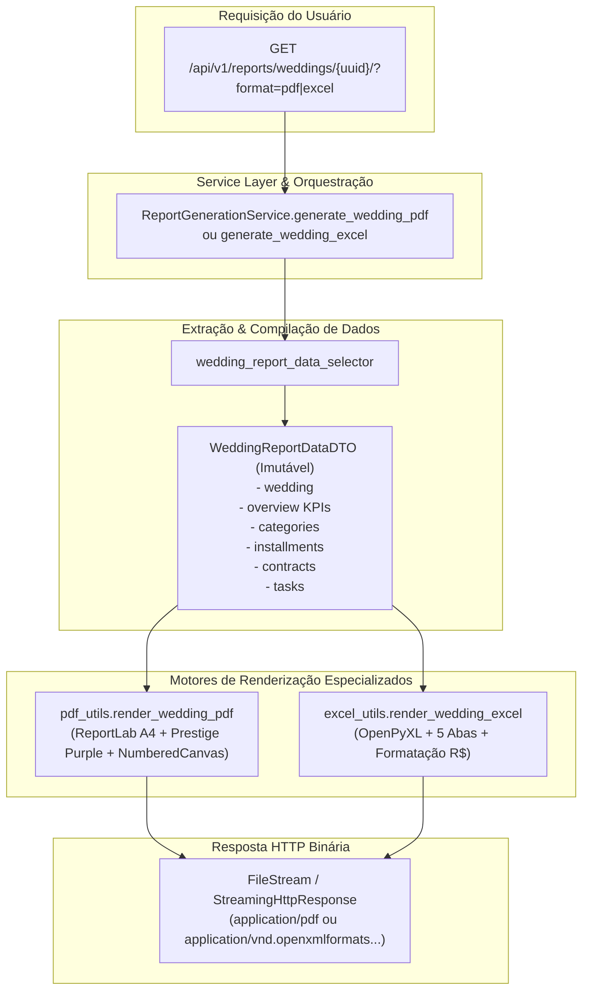

# Domínio de Relatórios & Exportações Analíticas (Reporting)

> **Categoria:** Domínios de Arquitetura (Bounded Contexts)
> **Relacionados:** [Dashboard Domain](dashboard-domain.md) · [Padrão Query Selectors](../concepts/query-selectors-pattern.md) · [ADR-006: Service Layer](../adr/006-service-layer.md) · [ADR-009: Multi-Tenancy](../adr/009-multitenancy.md) · [ADR-028: Diátaxis & Notas Atômicas](../adr/028-diataxis-atomic-notes.md) · [Weddings Domain](weddings-domain.md) · [Finances Domain](finances-domain.md) · [Logistics Domain](logistics-domain.md) · [Scheduler Domain](scheduler-domain.md) · [Core Domain](core-domain.md)

---

## 1. Visão Geral do Domínio

O domínio de **Reporting** é especializado na extração consolidada, compilação em DTO imutável, diagramação visual e renderização binária de relatórios executivos e operacionais do casamento. Ele atende à necessidade dos assessores e casais de exportar dossiês completos sob demanda em formatos portáveis e profissionais:

1. **Relatório Diagramado em PDF (A4):** Construído com **ReportLab**, aplicando rigorosamente a identidade visual do `DESIGN.md` (*Prestige Purple* `#7C3AED`, fundo `#F5F3FF`, texto `#1A1C1E`), cartões de KPI, tabelas zebradas com quebra automática e paginação em dois passos ("Página X de Y" via `NumberedCanvas`).
2. **Planilha Operacional em Excel (.xlsx):** Gerada via **OpenPyXL**, composta por 5 abas estruturadas (*Resumo Executivo*, *Categorias*, *Parcelas*, *Contratos*, *Tarefas*), formatação numérica e monetária automática (`R$ #,##0.00`) e auto-ajuste de largura de colunas.
3. **Isolamento de Renderização via DTO:** A camada de seleção compila previamente todos os dados num `WeddingReportDataDTO` imutável (`frozen=True`), desacoplando os motores gráficos do ORM do Django e prevenindo consultas adicionais (Zero N+1).

---

## 2. Pipeline de Dados e Diagrama de Exportação



---

## 3. Matriz Canônica de Regras de Relatórios (SSOT)

| ID | Regra / Invariante | Descrição & Comportamento | Entidades / Camadas | Referência Canônica |
| :--- | :--- | :--- | :--- | :--- |
| **`BR-R01`** | **Isolamento de Renderização via DTO Imutável** | Os motores ReportLab e OpenPyXL são estritamente isolados do ORM: todos os dados necessários são pré-extraídos via `wedding_report_data_selector` em um `WeddingReportDataDTO(frozen=True)` para garantir Zero N+1. | `WeddingReportDataDTO`, `report_selectors.py` | [query-selectors-pattern.md](../concepts/query-selectors-pattern.md) |
| **`BR-R02`** | **Identidade Visual e Layout PDF em Dois Passos** | Relatórios PDF seguem a paleta oficial (`#7C3AED`, `#F5F3FF`, `#1A1C1E`), margens A4 de 36pt e `NumberedCanvas` com callback de dois passos para cálculo exato do total de páginas ("Página X de Y"). | `pdf_utils.py`, ReportLab | [DESIGN.md](../../../DESIGN.md) |
| **`BR-R03`** | **Planilha Multi-Aba com Formatação Monetária** | Arquivos Excel geram 5 abas padronizadas (*Resumo Executivo*, *Categorias*, *Parcelas*, *Contratos*, *Tarefas*) com cabeçalho roxo, fontes brancas em negrito, auto-ajuste de colunas e máscara monetária `R$ #,##0.00`. | `excel_utils.py`, OpenPyXL | [ADR-006](../adr/006-service-layer.md) |
| **`BR-R04`** | **Isolamento Multi-Tenant na Extração de Relatórios** | A extração de dados valida o tenant autenticado (`request.user.company`), restringindo todo o escopo de leitura aos registros do casamento pertencentes à empresa ativa via `objects.for_tenant()`. | `wedding_report_data_selector`, `Company` | [ADR-009](../adr/009-multitenancy.md) · [ADR-016](../adr/016-pragmatic-multi-tenancy.md) |

---

## 4. Arquitetura Fullstack e Implementação no Código-Fonte

### Backend (`backend/apps/reporting/`)
- **Services:** [`ReportGenerationService`](../../../backend/apps/reporting/services.py) em `services.py` orquestra a geração binária em memória (`io.BytesIO`).
- **Selectors:** [`wedding_report_data_selector`](../../../backend/apps/reporting/selectors/report_selectors.py) compila os agregados em `WeddingReportDataDTO`.
- **Renderizadores:**
  - [`render_wedding_pdf`](../../../backend/apps/reporting/pdf_utils.py): Diagramação ReportLab com `Platypus`, `Table`, `Paragraph` e `NumberedCanvas`.
  - [`render_wedding_excel`](../../../backend/apps/reporting/excel_utils.py): Geração OpenPyXL com formatação de células e auto-fit.
- **Endpoints Ninja:** `GET /api/v1/reports/weddings/{uuid}/` em `api.py` com parâmetro `format=pdf|excel`, retornando streaming com headers de download `Content-Disposition`.

### Frontend (`frontend/src/features/reporting/`)
- **Padrão Smart/Dumb (ADR-024):**
  - **Componentes:** `ExportReportDropdown.tsx` integrado no cabeçalho de visão geral do casamento (`WeddingOverview.tsx`).
  - **Hooks Customizados:** `useExportReport.ts` (gerenciamento assíncrono do Blob, trigger de download no navegador e notificações com Sonner).

### Trechos Canônicos de Implementação

#### A. DTO Imutável e Seletor de Compilação (`report_selectors.py`)

```python
@dataclass(frozen=True)
class WeddingReportDataDTO:
    wedding: Wedding
    overview: dict[str, Any]
    categories: list[BudgetCategory]
    installments: list[Installment]
    contracts: list[Contract]
    tasks: list[Task]

def wedding_report_data_selector(*, company: Company, wedding_uuid: UUID | str) -> WeddingReportDataDTO:
    uuid_obj = UUID(str(wedding_uuid)) if not isinstance(wedding_uuid, UUID) else wedding_uuid
    wedding = wedding_get_selector(company=company, uuid=uuid_obj)
    overview = wedding_overview_selector(company=company, wedding_uuid=uuid_obj)
    return WeddingReportDataDTO(
        wedding=wedding,
        overview=overview,
        categories=list(budget_category_list_selector(company=company, wedding=wedding)),
        installments=list(installment_list_selector(company=company, wedding_id=wedding.uuid)),
        contracts=list(contract_list_selector(company=company, wedding_id=wedding.uuid)),
        tasks=list(task_list_selector(company=company, wedding_id=wedding.uuid)),
    )
```

#### B. Serviço Orquestrador de Relatórios (`services.py`)

```python
class ReportGenerationService:
    @classmethod
    def generate_wedding_pdf(cls, company: Company, wedding_uuid: UUID | str) -> bytes:
        data = wedding_report_data_selector(company=company, wedding_uuid=wedding_uuid)
        return render_wedding_pdf(
            wedding=data.wedding,
            overview=data.overview,
            categories=data.categories,
            installments=data.installments,
            contracts=data.contracts,
            tasks=data.tasks,
        )

    @classmethod
    def generate_wedding_excel(cls, company: Company, wedding_uuid: UUID | str) -> bytes:
        data = wedding_report_data_selector(company=company, wedding_uuid=wedding_uuid)
        return render_wedding_excel(
            wedding=data.wedding,
            overview=data.overview,
            categories=data.categories,
            installments=data.installments,
            contracts=data.contracts,
            tasks=data.tasks,
        )
```

---

## 5. Integrações & Interfaces Públicas (ADR-031)

O módulo de Reporting expõe utilitários de extração e geração consumidos pelos endpoints da API e potenciais tarefas em background:
- `apps.reporting.selectors.report_selectors.wedding_report_data_selector`: Compilação pura dos agregados do casamento em `WeddingReportDataDTO`.
- `apps.reporting.services.ReportGenerationService.generate_wedding_pdf`: Geração síncrona do binário de relatório PDF diagramado.
- `apps.reporting.services.ReportGenerationService.generate_wedding_excel`: Geração síncrona da pasta de trabalho Excel (.xlsx).
- `apps.reporting.pdf_utils.render_wedding_pdf`: Motor gráfico de baixo nível ReportLab.
- `apps.reporting.excel_utils.render_wedding_excel`: Motor de formatação e escrita de planilhas OpenPyXL.

---

## 6. Aprofundamento & Referências

### Decisões Arquiteturais (ADRs)
- [ADR-006: Service Layer](../adr/006-service-layer.md)
- [ADR-009: Multi-Tenancy](../adr/009-multitenancy.md)
- [ADR-016: Multi-Tenancy Pragmático](../adr/016-pragmatic-multi-tenancy.md)
- [ADR-024: Padrão Smart & Dumb Components](../adr/024-padrao-smart-dumb-desacoplamento-componentes-frontend.md)
- [ADR-028: Diátaxis & Notas Atômicas](../adr/028-diataxis-atomic-notes.md)
- [ADR-031: Isolamento de Bounded Contexts](../adr/031-inter-module-communication.md)

### Conceitos & Domínios Relacionados
- [Dashboard Domain](dashboard-domain.md)
- [Weddings Domain](weddings-domain.md)
- [Finances Domain](finances-domain.md)
- [Logistics Domain](logistics-domain.md)
- [Scheduler Domain](scheduler-domain.md)
- [Padrão Query Selectors](../concepts/query-selectors-pattern.md)
- [Guia de Estilo Visual (DESIGN.md)](../../../DESIGN.md)
