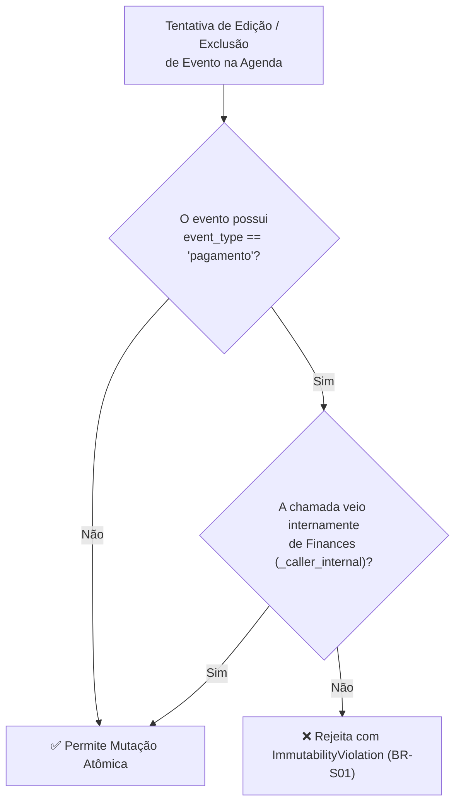
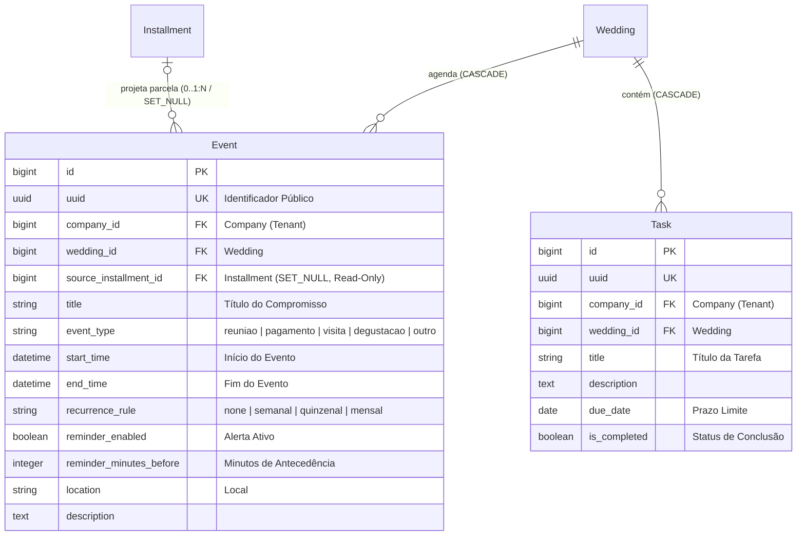

# Domínio de Agendamento, Tarefas & Cronograma (Scheduler)

> **Categoria:** Domínios de Arquitetura (Bounded Contexts)
> **Relacionados:** [Catálogo Canônico de Regras de Negócio](../business-rules/index.md) · [ADR-006: Service Layer](../adr/006-service-layer.md) · [ADR-023: Desacoplamento de Módulos](../adr/023-desacoplamento-modulos-scheduler-finances-weddings.md) · [ADR-030: Rich Domain Model](../adr/030-rich-domain-model-service-layer.md) · [ADR-031: Comunicação Entre Módulos](../adr/031-inter-module-communication.md)

O **Domínio de Agenda e Cronograma (`scheduler`)** é o centro nervoso da coordenação temporal e operacional do *Wedding Management System*. Ele gerencia a agenda interativa de compromissos (`Event`), o checklist operacional de tarefas por fases (`Task`), o motor de recorrência inteligente e a aplicação de modelos canônicos (*templates*) para a jornada do casamento.

---

## 1. Visão de Negócio & Capacidades Operacionais

O planejamento de um evento requer o acompanhamento de centenas de marcos temporais distribuídos ao longo de meses ou anos. O módulo foi arquitetado para evitar choques de agenda, garantir sincronização automática com prazos financeiros e fornecer visibilidade clara de pendências.

### Principais Capacidades Operacionais
- **Cronogramas Automatizados por Fases:** Geração instantânea de marcos e tarefas baseados na data estipulada para o casamento (âncora temporal `event_date`).
  - *Pré-Wedding:* Contratação de buffet (D-360), prova do menu (D-180), entrega de convites (D-90), ensaio fotográfico (D-30).
  - *Semana do Evento & Dia D:* Cronograma detalhado de montagem, chegada da noiva, cortejo cerimonial e recepção.
  - *Pós-Evento:* Devolução de trajes alugados (D+2), cartas de agradecimento (D+15), entrega do álbum final (D+60).
- **Motor de Recorrência Inteligente:** Suporte a reuniões periódicas com os noivos e fornecedores (semanais, quinzenais ou mensais) com controle de quantidade máxima de ocorrências e consciência de fuso horário (`America/Sao_Paulo`).
- **Visão Unificada de Compromissos:** Calendário interativo com distinção visual por natureza (`reuniao`, `pagamento`, `visita`, `degustacao`, `outro`).
- **Checklist Operacional:** Controle de pendências com prazos limites, categorização por fases e alternador de conclusão.

### Bloqueio Read-Only de Eventos de Pagamento
Para assegurar visão 360° do evento sem ferir a integridade contábil, as parcelas registradas em [Finanças](finances-domain.md) geram automaticamente compromissos na agenda (`event_type = 'pagamento'`):
- **Imutabilidade no Scheduler (BR-S01):** Eventos de pagamento são estritamente **somente leitura** na agenda. Tentativas de mutação direta (edição de valor, data ou exclusão) disparadas por rotas de agendamento são bloqueadas pelo `EventService`.
- **SSOT Financeiro:** Para alterar datas de vencimento ou valores, o assessor deve realizar a operação no módulo Financeiro, que propaga a atualização via fachada pública.

### Detecção de Conflito de Horário (Soft Overlap)
Para compromissos manuais (não-financeiros), o sistema analisa sobreposições de intervalo (\((s_1 < e_2) \land (e_1 > s_2)\)). Adota validação flexível (*soft validation*): rejeita por padrão lançando aviso de conflito, mas permite a persistência caso o usuário confirme explicitamente com `force_overlap = True`.

---

## 2. Modelo de Dados & Diagrama ERD

### Tabela de Entidades e Invariantes de Persistência

| Entidade | Papel & Relações | Campos & Tipos | Invariantes de Persistência & Regras Temporais |
| :--- | :--- | :--- | :--- |
| **`Event`** | Compromisso na Agenda (`TenantModel`, `WeddingOwnedMixin`) | `wedding` (`ForeignKey`, `CASCADE`), `source_installment` (`ForeignKey`, `SET_NULL`, nullable), `title`, `event_type` (`TypeChoices`), `start_time`, `end_time`, `recurrence_rule`, `reminder_enabled`, `reminder_minutes_before` | **Imutabilidade Financeira (BR-S01):** Eventos com `event_type == 'pagamento'` não aceitam mutação manual direta via API. **Trava de Data Passada (BR-S02):** Na criação manual, `timezone.localdate(start_time) >= hoje`. **Detecção de Sobreposição (BR-S03):** Validação de colisão de horários contornável por `force_overlap=True`. **Ordenação:** `ordering = ["start_time"]`. |
| **`Task`** | Item do Checklist (`TenantModel`, `WeddingOwnedMixin`) | `wedding` (`ForeignKey`, `CASCADE`), `title`, `description`, `due_date`, `is_completed` (boolean) | **Ciclo de Vida:** Métodos semânticos `complete()` e `reopen()`. **Ordenação Padrão:** `ordering = ["is_completed", "due_date", "created_at"]` (prioriza pendentes urgentes). |

---

## 3. Matriz Consolidada de Regras de Negócio (SSOT)

| Código Canônico | Regra / Especificação | Escopo / Responsabilidade | Entidades Envolvidas | Nota Detalhada |
| :--- | :--- | :--- | :--- | :--- |
| **`BR-S01`** | **Proteção Somente-Leitura de Pagamentos** | Blindagem tríplice (criação, edição e exclusão manuais bloqueadas) de eventos do tipo `pagamento`, espelhados a partir de parcelas financeiras. | `Event`, `Installment` | [payment-event-readonly-guard.md](../business-rules/scheduler/payment-event-readonly-guard.md) |
| **`BR-S02`** | **Motor de Regras de Recorrência** | Validação de datas futuras, intervalos canônicos (`semanal`, `quinzenal`, `mensal`), lembretes preventivos e cálculo de limites de ocorrências. | `Event`, `Task` | [recurrence-rules-engine.md](../business-rules/scheduler/recurrence-rules-engine.md) |
| **`BR-S03`** | **Conflito de Agenda (Soft Overlap)** | Detecção matemática de colisão de intervalos temporais no mesmo casamento com mecanismo de confirmação voluntária (`force_overlap = True`). | `Event`, `Wedding` | [schedule-conflict-validation.md](../business-rules/scheduler/schedule-conflict-validation.md) |

### Matriz de Integração e Relações Cruzadas
- **Com o Módulo de Finanças:** Eventos com `event_type = 'pagamento'` são criados e atualizados exclusivamente pela fachada pública de integração `apps.scheduler.interfaces.sync_installment_event`. Veja [Domínio Financeiro](finances-domain.md).
- **Com o Módulo de Casamentos:** A inicialização de casamentos com templates canônicos injeta automaticamente tarefas e marcos relativos via `TemplateEngine`. Veja [Domínio de Casamentos](weddings-domain.md).
- **Com o Módulo de Notificações:** Eventos e tarefas com lembretes ativos disparam notificações para a assessoria. Veja [Domínio de Notificações](notifications-domain.md).

---

## 4. Arquitetura Fullstack do Módulo

O módulo segue rigorosamente a **ADR-030** (Rich Domain Model & Service Layer) estruturado em três níveis de validação:

### Backend (`backend/apps/scheduler/`)
- **Modelos de Domínio Ricos (Nível 2):**
  - `Event`: Encapsula invariantes temporais em `clean()` (`end_time >= start_time`), propriedade semântica `is_payment_event`, configuração de lembretes e método de reprogramação `reschedule()`.
  - `Task`: Encapsula métodos de ciclo de vida (`complete()`, `reopen()`, `update_details()`) e propriedades dinâmicas de atraso (`is_overdue`, `days_overdue`).
- **Casos de Uso e Serviços (Nível 3):**
  - `EventService`: Orquestra criação e mutações sob `@transaction.atomic`, validando proteção de pagamentos (BR-S01), data futura na criação manual (BR-S02), detecção de sobreposição com *soft override* `force_overlap` (BR-S03) e salvando estritamente com `update_fields`.
  - `TaskService`: Coordena o checklist e transições de status.
  - `TemplateEngine`: Define e provisiona cronogramas de casamentos parametrizados por marcos temporais relativos.
- **Seletores de Leitura CQRS:**
  - `event_list_selector`, `event_get_selector`: Consultas lazy otimizadas com relacionamentos pré-carregados (`select_related=["wedding", "company"]`) e ordenação cronológica.
  - `scheduler_summary_selector`: Agregação analítica para KPIs da agenda (`total`, `upcoming_7_days`, `with_reminder`).
  - `task_list_selector`, `task_urgent_list_selector`: Consultas isoladas por tenant e casamento para tarefas do checklist.
- **Validação de Entrada e Schemas Ninja (Pydantic):**
  - Schemas modulares em `apps/scheduler/schemas/` (`event.py`, `task.py`) com validação de formato e sanitização.
- **Endpoints:**
  - `/scheduler/events/` (CRUD com paginação e resumo analítico).
  - `/scheduler/tasks/` (CRUD de tarefas com rotas semânticas `complete/` e `reopen/`).

### Frontend (`frontend/src/features/scheduler/`)
- **Padrão Smart/Dumb (ADR-024):**
  - **Containers (Smart):** Orquestram os hooks Orval (`useSchedulerEventsList`, `useSchedulerTasksList`), alternância de visualizações (Calendário, Linha do Tempo e Checklist) e diálogo de eventos.
  - **Presenters (Dumb):** Visualizadores da agenda, tabelas de marcos e checklist operacional orientados por props.
  - **Visualização de Pagamentos Read-Only:** Eventos originados de parcelas financeiras são exibidos com bloqueio visual de edição direta, direcionando o usuário para o módulo de finanças.

---

## 5. Integrações & Interfaces Públicas (ADR-031)

A comunicação transacional síncrona com o Scheduler é exposta em:
- `apps.scheduler.interfaces.sync_installment_event`: Criação e atualização de eventos espelho a partir do módulo financeiro.
- `apps.scheduler.interfaces.apply_wedding_template`: Injeção do pacote canônico de cronograma no provisionamento de um casamento.

---

## 6. Aprofundamento & Referências

### Regras de Negócio Detalhadas
- [Proteção Somente-Leitura para Eventos de Pagamento (`BR-S01`)](../business-rules/scheduler/payment-event-readonly-guard.md)
- [Motor de Regras de Recorrência e Agendamentos (`BR-S02`)](../business-rules/scheduler/recurrence-rules-engine.md)
- [Detecção e Validação de Conflito de Agenda (`BR-S03`)](../business-rules/scheduler/schedule-conflict-validation.md)

### Decisões de Arquitetura (ADRs)
- [ADR-006: Service Layer Pattern](../adr/006-service-layer.md)
- [ADR-023: Desacoplamento entre Scheduler, Finances e Weddings](../adr/023-desacoplamento-modulos-scheduler-finances-weddings.md)
- [ADR-030: Rich Domain Model e Casos de Uso](../adr/030-rich-domain-model-service-layer.md)
- [ADR-031: Comunicação Entre Módulos](../adr/031-inter-module-communication.md)
