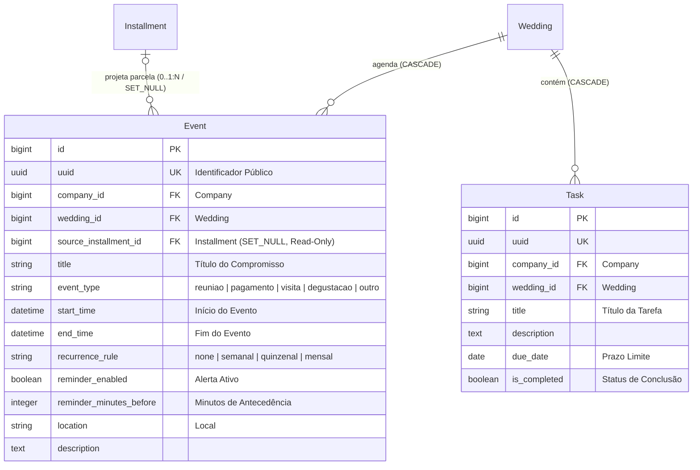

# Domínio de Agendamento, Tarefas & Cronograma (Scheduler)

> **Categoria:** Domínios de Arquitetura (Bounded Contexts)
> **Relacionados:** [Motor de Regras de Recorrência](../business-rules/scheduler/recurrence-rules-engine.md) · [Imutabilidade de Eventos de Pagamento](../business-rules/scheduler/payment-event-readonly-guard.md) · [Templates de Cronograma](../business-rules/weddings/wedding-schedule-templates.md) · [Integração Financeiro-Agenda](../business-rules/finances/payment-schedule-integration.md) · [ADR-006: Service Layer](../adr/006-service-layer.md) · [ADR-023: Desacoplamento de Módulos](../adr/023-desacoplamento-modulos-scheduler-finances-weddings.md)

---

## 1. Visão Geral do Domínio

O domínio de **Scheduler** é o coração temporal e operacional do sistema. Ele gerencia a agenda interativa de compromissos (`Event`), o checklist operacional de tarefas do casamento (`Task`), o motor de recorrência periódica e a geração automatizada de cronogramas a partir de modelos pré-configurados (*templates*).

Pilares arquiteturais de agendamento:
1. **Agenda Multimodal:** Suporte a diferentes naturezas de compromissos (`reuniao`, `pagamento`, `visita`, `degustacao`, `outro`) com definição de horários de início e término e alertas configuráveis.
2. **Proteção de Eventos de Pagamento (BR-S01):** Eventos de pagamento vinculados a parcelas financeiras (`source_installment`) são somente leitura no Scheduler. Criação, edição e exclusão desses eventos só podem ser disparadas pela Service Layer de `Finances`.
3. **Trava de Eventos no Passado (BR-S02):** Eventos criados manualmente por usuários não podem possuir data de início anterior ao dia corrente. Apenas a aplicação de templates de casamento permite offsets retroativos (`_allow_historical_start=True`).
4. **Motor de Recorrência:** Eventos podem se repetir em intervalos definidos (`semanal`, `quinzenal`, `mensal`).
5. **Checklist Operacional:** Tarefas com prazos estimados (`due_date`) e alternador de conclusão (`is_completed`).

---

## 2. Diagrama ERD do Domínio Scheduler

---

## 3. Tabela de Entidades e Invariantes de Persistência

| Entidade | Papel & Relações | Campos & Tipos | Invariantes de Persistência & Regras Temporais |
| :--- | :--- | :--- | :--- |
| **`Event`** | Compromisso na Agenda (`TenantModel`, `WeddingOwnedMixin`) | `wedding` (`ForeignKey`, `CASCADE`), `source_installment` (`ForeignKey`, `SET_NULL`, nullable), `title`, `event_type` (`TypeChoices`), `start_time`, `end_time`, `recurrence_rule`, `reminder_enabled`, `reminder_minutes_before` | **Imutabilidade Financeira (BR-S01):** Eventos com `event_type == 'pagamento'` não podem ser criados, editados ou excluídos diretamente por endpoints do Scheduler. **Trava de Data (BR-S02):** Na criação manual, `timezone.localdate(start_time) >= timezone.localdate()`. **Ordenação:** `ordering = ["start_time"]`. |
| **`Task`** | Item do Checklist (`TenantModel`, `WeddingOwnedMixin`) | `wedding` (`ForeignKey`, `CASCADE`), `title`, `description`, `due_date`, `is_completed` (boolean, default False) | **Ordenação Padrão:** `ordering = ["is_completed", "due_date", "created_at"]` (tarefas pendentes e com prazos mais próximos aparecem primeiro). |
| **`EventService`** | Mutação e Validação | `create()`, `update()`, `delete()` | Executa validações em `@transaction.atomic`. Gerencia flags internas `_caller_internal` e `_allow_historical_start`. |
| **`TemplateEngine`** | Geração Automática | `get_template_events()` | Define listas de marcos com `offset_days` relativos à data da cerimônia para inicialização rápida de novos casamentos. |

---

## 4. Implementação do Modelo de Domínio e Serviços

O módulo segue rigorosamente a **ADR-030** (Rich Domain Model & Service Layer), estruturado em três níveis de validação:

- **Modelos de Domínio Ricos:**
  - [`apps/scheduler/models/event.py`](../../../backend/apps/scheduler/models/event.py) (`Event`): Encapsula invariantes temporais em `clean()` (`end_time >= start_time`), propriedade semântica `is_payment_event`, configuração de lembretes (`enable_reminder`, `disable_reminder`) e método de reprogramação `reschedule()`.
  - [`apps/scheduler/models/task.py`](../../../backend/apps/scheduler/models/task.py) (`Task`): Encapsula métodos de ciclo de vida (`complete()`, `reopen()`, `update_details()`) e propriedades dinâmicas de atraso (`is_overdue`, `days_overdue`).
- **Casos de Uso e Serviços:**
  - [`apps/scheduler/services/events.py`](../../../backend/apps/scheduler/services/events.py) (`EventService`): Orquestra criação e mutações sob `@transaction.atomic`, validando a proteção somente-leitura de pagamentos (BR-S01), data futura na criação manual (BR-S02) e salvando estritamente com `update_fields`.
  - [`apps/scheduler/services/tasks.py`](../../../backend/apps/scheduler/services/tasks.py) (`TaskService`): Coordena checklist, métodos semânticos `complete()` e `reopen()` e mutações cirúrgicas por `update_fields`.
  - [`apps/scheduler/services/templates.py`](../../../backend/apps/scheduler/services/templates.py) (`TemplateEngine`): Define e provisiona cronogramas de casamentos parametrizados por marcos temporais relativos.
- **Seletores de Leitura CQRS:**
  - [`apps/scheduler/selectors/event_selectors.py`](../../../backend/apps/scheduler/selectors/event_selectors.py) (`event_list_selector`, `event_get_selector`): Consultas otimizadas com relacionamentos pré-carregados (`select_related=["wedding", "company"]`) e filtros por período.
  - [`apps/scheduler/selectors/task_selectors.py`](../../../backend/apps/scheduler/selectors/task_selectors.py) (`task_list_selector`, `task_get_selector`, `task_urgent_list_selector`): Consultas isoladas por tenant e casamento para tarefas do checklist.
- **Validação de Entrada (Pydantic):**
  - [`apps/scheduler/schemas/`](../../../backend/apps/scheduler/schemas/): Pacote modular (`event.py`, `task.py`) com regras de Nível 1 (sanitização de strings via `str_strip_whitespace=True`, limites de caracteres e validações de data/hora).

---

## 5. Mapeamento de Camadas (Fullstack)

### Camada de Backend (`backend/apps/scheduler/`)
- **Modelos:** `Event` (`event.py`), `Task` (`task.py`).
- **Managers:** `EventQuerySet`, `TaskQuerySet` em `managers.py`.
- **Services:** `events.py`, `tasks.py`, `templates.py`.
- **Selectors:** `event_selectors.py`, `task_selectors.py`.
- **Endpoints:** `api/events.py` (`/scheduler/events/`) e `api/tasks.py` (`/scheduler/tasks/`, com endpoints de ciclo de vida `POST /{uuid}/complete/` e `POST /{uuid}/reopen/`).

### Camada de Frontend (`frontend/src/features/scheduler/`)
- **Padrão Smart/Dumb ([ADR-024](../concepts/smart-dumb-components.md)):**
  - **Containers (Smart):** Orquestram os hooks Orval (`useSchedulerEventsList`, `useSchedulerTasksList`, `useSchedulerTasksComplete`, `useSchedulerTasksReopen`), alternância de visualizações (Calendário, Linha do Tempo e Checklist) e diálogo de eventos.
  - **Presenters (Dumb):** Componentes visuais da agenda, tabelas de marcos temporais e checklist operacional orientados por props.
  - **Visualização de Pagamentos Read-Only:** Eventos originados de parcelas financeiras (`source_installment`) são exibidos com bloqueio visual de edição direta, direcionando o usuário para o módulo de finanças.

---

## 6. Links e Regras de Negócio Associadas

- [Motor de Regras de Recorrência de Eventos](../business-rules/scheduler/recurrence-rules-engine.md)
- [Proteção de Imutabilidade dos Eventos de Pagamento](../business-rules/scheduler/payment-event-readonly-guard.md)
- [Templates de Cronograma do Casamento](../business-rules/weddings/wedding-schedule-templates.md)
- [Integração de Pagamentos com o Cronograma](../business-rules/finances/payment-schedule-integration.md)
- [ADR-006: Service Layer](../adr/006-service-layer.md)
- [ADR-023: Desacoplamento de Módulos](../adr/023-desacoplamento-modulos-scheduler-finances-weddings.md)
- [Modelos Base & Padrões Core](../../reference/models/core-models.md)
- [Finances Domain](finances-domain.md)
