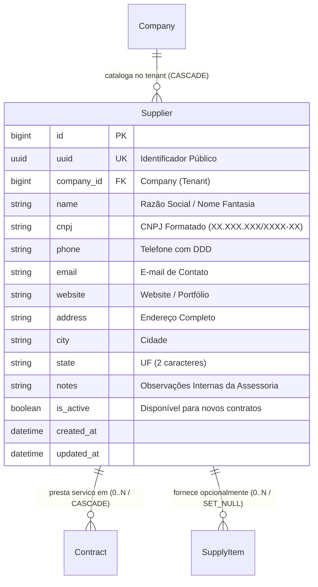

# Domínio de Fornecedores & Catálogo Corporativo (Suppliers)

> **Categoria:** Domínios de Arquitetura (Bounded Contexts)
> **Relacionados:** [Catálogo Canônico de Regras](../business-rules/index.md) · [Regras de Validação de CNPJ (Módulo 11)](../business-rules/logistics/cnpj-validation-rules.md) · [Domínio de Contratos](contracts-domain.md) · [Domínio de Logística de Suprimentos](logistics-domain.md) · [ADR-016: Multi-Tenancy Pragmático](../adr/016-pragmatic-multi-tenancy.md) · [ADR-030: Rich Domain Model](../adr/030-rich-domain-model-service-layer.md) · [ADR-031: Comunicação Entre Módulos](../adr/031-inter-module-communication.md)

O **Domínio de Fornecedores (`apps.suppliers`)** centraliza o catálogo corporativo compartilhado de parceiros comerciais, prestadores de serviços e locadores em nível de empresa assessora (`Company`). Desacoplado de contratos específicos e de operações físicas de casamentos individuais, o catálogo permite o cadastramento, homologação fiscal e reaproveitamento de parceiros ao longo de múltiplos eventos do tenant.

---

## 1. Visão de Negócio & Capacidades Operacionais

Na rotina de uma assessoria cerimonial, o relacionamento com fornecedores transcende casamentos individuais: os mesmos buffets, floristas, decoradores, fotógrafos e empresas de som e iluminação são recomendados, cotados e contratados repetidamente para noivos distintos. Tratar fornecedores como entidades presas a um único evento gerava redundância cadastral, inconsistência de contatos e impossibilidade de manter um histórico de desempenho corporativo.

### Principais Capacidades Operacionais
- **Catálogo Compartilhado no Tenant:** Cada fornecedor é registrado uma única vez sob o escopo da assessoria (`Company`), ficando disponível para seleção em qualquer casamento gerenciado pela empresa.
- **Homologação Fiscal Automatizada (CNPJ Módulo 11):** Validação matemática instantânea dos dois dígitos verificadores (DV1 e DV2), rejeitando fraudes fiscais, erros de digitação e sequências repetidas fictícias.
- **Histórico e Notas Internas:** Campo de observações gerenciais para registro de qualidade de entrega, pontualidade e peculiaridades de negociação da assessoria.
- **Ativação e Desativação Segura (`is_active`):** Parceiros que encerram atividades ou não atendem mais ao padrão da assessoria podem ser inativados para novos contratos, preservando 100% do histórico contratual e contábil de casamentos passados.

---

## 2. Modelo de Dados & Diagrama ERD

O diagrama abaixo ilustra o posicionamento da entidade `Supplier` no ecossistema de dados:

### Invariantes de Persistência & Integridade

| Campo / Relação | Tipo / Validação | Invariante de Domínio & Comportamento |
| :--- | :--- | :--- |
| `company` | `ForeignKey(Company, CASCADE)` | **Isolamento Multi-Tenant:** Todo fornecedor pertence estritamente a um tenant. Acesso cross-tenant retorna `HTTP 404 Not Found`. |
| `name` | `CharField(max_length=255)` | Obrigatório e higienizado com `str_strip_whitespace=True`. |
| `cnpj` | `CharField(max_length=18, blank=True)` | Opcional para autônomos sem PJ; quando preenchido, validação estrita via **Módulo 11** e máscara canônica `XX.XXX.XXX/XXXX-XX`. |
| `state` | `CharField(max_length=2, blank=True)` | Formato obrigatório de 2 letras maiúsculas (sigla UF oficial). |
| `is_active` | `BooleanField(default=True)` | Define disponibilidade para novas contratações sem quebrar contratos legados. |

---

## 3. Matriz Consolidada de Regras de Negócio (SSOT)

| Código Canônico | Regra / Especificação | Escopo / Responsabilidade | Entidades Envolvidas | Nota Detalhada |
| :--- | :--- | :--- | :--- | :--- |
| **`BR-SUP-01`** | **Compartilhamento Multi-Casamento** | Fornecedores são entidades corporativas do tenant, reutilizáveis em múltiplos casamentos e contratos da mesma assessoria. | `Supplier`, `Company` | [cnpj-validation-rules.md](../business-rules/logistics/cnpj-validation-rules.md) |
| **`BR-SUP-02`** | **Validação Algorítmica de CNPJ (Módulo 11)** | Validação dos dois dígitos verificadores via algoritmo Módulo 11 e rejeição de sequências homogêneas (`00.000.000/0000-00`, etc.). | `Supplier` | [cnpj-validation-rules.md](../business-rules/logistics/cnpj-validation-rules.md) |
| **`BR-SUP-03`** | **Preservação de Histórico de Inativação** | A desativação (`is_active=False`) bloqueia seleção em novos contratos, mas mantém intactos contratos e despesas passadas. | `Supplier`, `Contract` | [cnpj-validation-rules.md](../business-rules/logistics/cnpj-validation-rules.md) |
| **`BR-SUP-04`** | **Isolamento de Tenant no Catálogo** | Consultas e mutações exigem escopo de `company` via `SupplierQuerySet.for_tenant(company)`. | `Supplier`, `Company` | [Estratégia Multi-Tenancy](../concepts/multi-tenancy-strategy.md) |

---

## 4. Arquitetura Fullstack do Módulo

O módulo segue o padrão **Rich Domain Model & Service Layer (ADR-030)**:

### Backend (`backend/apps/contracts/`)
- **Modelos de Domínio:**
  - `Supplier`: Encapsula atributos cadastrais, sanitização em `clean_fields()` e validação via `RegexValidator` no modelo.
- **Service Layer (`services/supplier_service.py`):**
  - `SupplierService.create(company, payload)`: Orquestra persistência atômica e higienização.
  - `SupplierService.update(company, supplier, payload)`: Atualização parcial segura respeitando multi-tenancy.
  - `SupplierService.delete(company, supplier)`: Exclusão com proteção referencial.
- **Seletores CQRS (`selectors/supplier_selectors.py`):**
  - `supplier_list_selector(company, active_only=False)`: Retorna queryset lazy filtrado por empresa.
  - `supplier_get_selector(company, uuid)`: Recupera fornecedor por UUID público garantindo tenant ownership.
- **Schemas Pydantic (`schemas/supplier.py`):**
  - `SupplierIn`, `SupplierPatchIn`, `SupplierOut` com `str_strip_whitespace=True` e validadores de campo para regex de CNPJ e URL de website.

### Frontend (`frontend/src/features/logistics/components/suppliers/`)
- **Smart Components:** `SupplierFormDialog`, `SupplierDetailDialog`, `VendorsTable` orquestrando mutações e consultas via hooks gerados pelo Orval.
- **Dumb Components:** `SupplierFormDialogView`, `SupplierDetailDialogView`, `VendorsTableView` puramente declarativos e desacoplados de rede.
- **Validação Antecipada:** Schemas Zod executam a máscara de CNPJ e verificação de formato antes do envio à API.

---

## 5. Integrações & Interfaces Públicas (ADR-031)

O módulo de fornecedores expõe serviços e seletores para outros contextos:

- `apps.contracts.selectors.supplier_get_selector`: Utilizado pelo módulo de contratos para associar parceiros homologados a minutas jurídicas.
- `apps.logistics`: Vinculação de `SupplyItem` no estágio de cotação/negociação (`EM_NEGOCIACAO`).

---

## 6. Aprofundamento e Referências

- [Regras de Validação e Sanitização de CNPJ (Módulo 11)](../business-rules/logistics/cnpj-validation-rules.md)
- [Domínio de Contratos & Aditivos](contracts-domain.md)
- [ADR-016: Multi-Tenancy Pragmático](../adr/016-pragmatic-multi-tenancy.md)
- [ADR-030: Rich Domain Model](../adr/030-rich-domain-model-service-layer.md)
