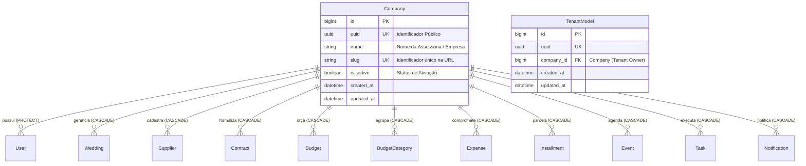

# Domínio de Tenants (Empresas & Multi-Tenancy)

> **Categoria:** Domínios de Arquitetura (Bounded Contexts)
> **Relacionados:** [ADR-009: Multi-Tenancy](../adr/009-multitenancy.md) · [ADR-016: Multi-Tenancy Pragmático](../adr/016-pragmatic-multi-tenancy.md) · [ADR-019: Validação de Tenant na Service Layer](../adr/019-tenant-validation-service-layer.md) · [Estratégia de Multi-Tenancy](../concepts/multi-tenancy-strategy.md) · [Modelos Base & Padrões Core](../../reference/models/core-models.md) · [Core Domain](core-domain.md)

---

## 1. Visão Geral do Domínio

O domínio de **Tenants** é responsável por garantir a segregação lógica e o isolamento absoluto de dados entre as diferentes assessorias de eventos, cerimoniais e noivos (*self-service*) que utilizam a plataforma.

A arquitetura adota a estratégia de **Multi-Tenancy Pragmático** (ADR-009 / ADR-016):
- Um único banco de dados compartilhado (Neon PostgreSQL) com particionamento lógico em nível de linha (*Row-Level Isolation* via chave estrangeira `company_id`).
- Todas as entidades de negócio herdam de `TenantModel`, que injeta a chave estrangeira obrigatória para `Company` e vincula o `TenantManager`.
- Todas as leituras e mutações exigem a passagem explícita do objeto `Company` vindo da autenticação (`request.user.company`).
- Provisionamento automatizado do workspace com slug anti-colisão e workspace reservado para superusuários (`admin-workspace`).

---

## 2. Diagrama ERD de Relacionamento Multi-Tenant



---

## 3. Matriz Canônica de Regras de Tenancy (SSOT)

| ID | Regra / Invariante | Descrição & Comportamento | Entidades / Camadas | Referência Canônica |
| :--- | :--- | :--- | :--- | :--- |
| **`BR-T01`** | **Isolamento Lógico Row-Level Compulsório** | Todas as entidades operacionais herdam de `TenantModel`, possuindo chave estrangeira obrigatória `company_id` com índice composto `["company", "uuid"]` para lookups $O(1)$. | `TenantModel`, `Company` | [ADR-009](../adr/009-multitenancy.md) · [ADR-016](../adr/016-pragmatic-multi-tenancy.md) |
| **`BR-T02`** | **Geração Determinística de Slug Anti-Colisão** | Slugs de empresas são gerados a partir do nome com sufixo UUID de 8 caracteres (`slugify(display_name)[:40] + '-' + uuid[:8]`), prevenindo sobreposições na rota. | `Company`, `TenantService` | [multi-tenancy-strategy.md](../concepts/multi-tenancy-strategy.md) |
| **`BR-T03`** | **Workspace Administrativo Reservado** | O slug `admin-workspace` é reservado e imutável para superusuários globais e rotinas agendadas (Cloud Scheduler crons) sem vinculação a clientes. | `Company`, `TenantService` | [ADR-005](../adr/005-oidc-scheduler.md) · [register-cron-tasks.md](../../guides/backend/register-cron-tasks.md) |
| **`BR-T04`** | **Propagação de Tenant via `TenantQuerySet.for_tenant()`** | Toda operação de leitura na camada de persistência exige a passagem explícita de `Company`, filtrando `self.filter(company=company)` no nível do QuerySet. | `TenantQuerySet`, `TenantManager` | [ADR-016](../adr/016-pragmatic-multi-tenancy.md) · [ADR-019](../adr/019-tenant-validation-service-layer.md) |

---

## 4. Arquitetura Fullstack e Implementação no Código-Fonte

### Backend (`backend/apps/tenants/`)
- **Modelos:** `Company` (`companies`) e `TenantModel` abstrato em `models.py`.
- **Managers de Segurança:** `TenantManager` e `TenantQuerySet` com filtro mandatório `.for_tenant(company)` em `managers.py`.
- **Services:** `TenantService.create_company` (onboarding) e `TenantService.get_or_create_admin_workspace` sob `@transaction.atomic`.
- **Selectors CQRS:** `company_get_selector` em `selectors.py` com validação de 404 semântico.

### Frontend (`frontend/src/`)
- **Store de Autenticação:** `useAuthStore` armazena a empresa ativa (`Company`) do usuário logado.
- **Injeção de Header e Contexto:** O cliente Axios (`src/api/client.ts`) anexa as credenciais JWT que codificam o tenant em cada requisição.

### Trechos Canônicos de Implementação

- **Modelos de Isolamento:** [`Company`](../../../backend/apps/tenants/models.py) e [`TenantModel`](../../../backend/apps/tenants/models.py)
- **Manager e QuerySet Especializado:** [`TenantQuerySet`](../../../backend/apps/tenants/managers.py) e [`TenantManager`](../../../backend/apps/tenants/managers.py)
- **Serviço de Provisionamento:** [`TenantService`](../../../backend/apps/tenants/services/tenant_service.py)
- **Seletor de Consulta:** [`company_get_selector()`](../../../backend/apps/tenants/selectors.py)

#### A. Definição do Modelo `Company` e `TenantModel`

```python
class Company(BaseModel):
    name = models.CharField("Nome da Empresa", max_length=255)
    is_active = models.BooleanField("Ativa", default=True)
    slug = models.SlugField(unique=True, help_text="Identificador único na URL")

    class Meta:
        db_table = "companies"

class TenantModel(BaseModel):
    company = models.ForeignKey(Company, on_delete=models.CASCADE, related_name="%(class)s_records")
    objects = TenantManager()

    class Meta:
        abstract = True
        indexes = [
            models.Index(fields=["company", "uuid"]),
        ]
```

#### B. Manager e QuerySet de Isolamento (`TenantQuerySet`)

```python
class TenantQuerySet(models.QuerySet[_ModelT]):
    def for_tenant(self, company: Company) -> Self:
        return self.filter(company=company)

class TenantManager(models.Manager[_ModelT]):
    _queryset_class = TenantQuerySet

    def get_queryset(self) -> TenantQuerySet[_ModelT]:
        return self._queryset_class(self.model, using=self._db)

    def for_tenant(self, company: Company) -> TenantQuerySet[_ModelT]:
        return self.get_queryset().for_tenant(company)
```

#### C. Serviço de Provisionamento de Tenants (`TenantService`)

```python
class TenantService:
    @staticmethod
    @transaction.atomic
    def create_company(display_name: str, company_name: str = "") -> Company:
        name = company_name.strip() if company_name else f"Workspace de {display_name}"
        base_slug = slugify(display_name)[:40]
        unique_slug = f"{base_slug}-{str(uuid_lib.uuid4())[:8]}"
        return Company.objects.create(name=name, slug=unique_slug, is_active=True)

    @staticmethod
    @transaction.atomic
    def get_or_create_admin_workspace() -> Company:
        company, _ = Company.objects.get_or_create(
            slug="admin-workspace", defaults={"name": "Workspace Administrativo"}
        )
        return company
```

#### D. Seletor de Busca Segura de Empresa (`company_get_selector`)

```python
def company_get_selector(*, uuid: UUID | str) -> Company:
    company = Company.objects.filter(uuid=uuid).first()
    if not company:
        raise ObjectNotFoundError(detail="Empresa não encontrada.")
    return company
```

---

## 5. Integrações & Interfaces Públicas (ADR-031)

A segregação do tenant é consumida horizontalmente por toda a aplicação através dos seguintes pontos de entrada canônicos:
- `apps.tenants.selectors.company_get_selector`: Lookup público de empresa por UUID com validação defensiva.
- `apps.tenants.services.tenant_service.TenantService.create_company`: Ponto de entrada chamado atômica e exclusivamente durante o registro de novos assessores (`RegistrationService`).
- `apps.tenants.services.tenant_service.TenantService.get_or_create_admin_workspace`: Ponto de resolução do workspace reservado para execuções assíncronas de sistema.

---

## 6. Aprofundamento & Referências

### Decisões Arquiteturais (ADRs)
- [ADR-009: Isolamento Multi-Tenancy](../adr/009-multitenancy.md)
- [ADR-016: Multi-Tenancy Pragmático](../adr/016-pragmatic-multi-tenancy.md)
- [ADR-019: Validação de Tenant na Service Layer](../adr/019-tenant-validation-service-layer.md)

### Conceitos & Especificações
- [Estratégia de Multi-Tenancy](../concepts/multi-tenancy-strategy.md)
- [Modelos Base & Padrões Core](../../reference/models/core-models.md)
- [Domínio de Usuários](users-domain.md)
