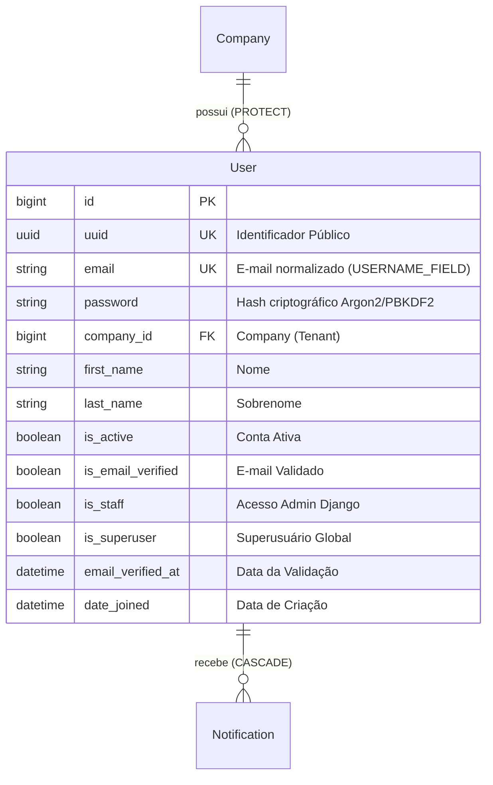
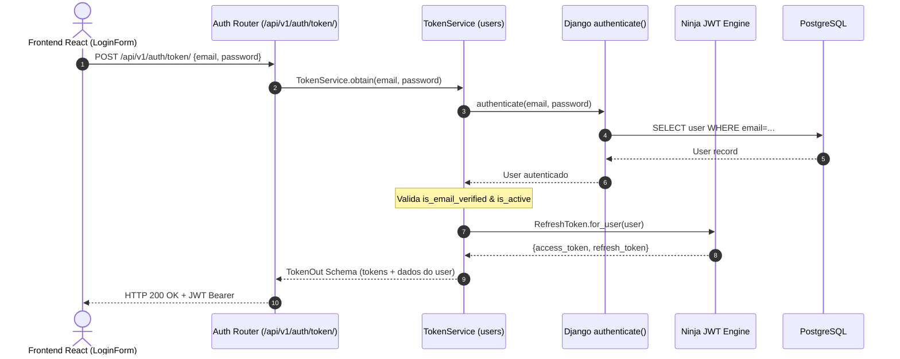

# Domínio de Usuários, Identidade & Autenticação (Users)

> **Categoria:** Domínios de Arquitetura (Bounded Contexts)
> **Relacionados:** [Fluxo de Autenticação JWT](../concepts/auth-jwt-flow.md) · [Estratégia de Multi-Tenancy](../concepts/multi-tenancy-strategy.md) · [ADR-006: Service Layer](../adr/006-service-layer.md) · [ADR-009: Multi-Tenancy](../adr/009-multitenancy.md) · [Modelos Base & Padrões Core](../../reference/models/core-models.md) · [Tenants Domain](tenants-domain.md)

---

## 1. Visão Geral do Domínio

O domínio de **Users** centraliza a gestão de identidade, credenciais, ciclo de vida de contas de usuários, autenticação baseada em tokens JWT (`ninja_jwt`), integração social OAuth2 via Google e controle de acesso RBAC (*Role-Based Access Control*).

Princípios centrais do domínio:
1. **E-mail como Identificador Único:** O campo `email` atua como `USERNAME_FIELD`, normalizado em caixa baixa para evitar duplicações acidentais.
2. **Vínculo Fixo ao Tenant (`Company`):** Todo usuário é obrigatoriamente associado a uma `Company` (`on_delete=models.PROTECT`).
3. **Onboarding Atômico:** O registro de um novo proprietário cria simultaneamente o usuário e a sua empresa (`Company`) em uma única transação atômica (`RegistrationService.register_new_owner`).
4. **Verificação Preventiva de E-mail:** Novos usuários normais são criados com `is_active=False` e `is_email_verified=False`, ativados somente após validação via link seguro com token criptográfico.
5. **Autenticação Social Google OAuth2:** Troca segura de `id_token` do Google por par de tokens JWT (`TokenService`), provisionando automaticamente novos usuários e empresas caso ainda não existam.

---

## 2. Diagrama ERD e Fluxo de Autenticação JWT





---

## 3. Matriz Canônica de Regras de Identidade (SSOT)

| ID | Regra / Invariante | Descrição & Comportamento | Entidades / Camadas | Referência Canônica |
| :--- | :--- | :--- | :--- | :--- |
| **`BR-U01`** | **Normalização e Unicidade Estrita de E-mail** | O campo `email` atua como `USERNAME_FIELD`, normalizado em caixa baixa e sem espaços no cadastro, com consultas insensíveis a maiúsculas (`iexact`). | `User`, `CustomUserManager` | [auth-jwt-flow.md](../concepts/auth-jwt-flow.md) |
| **`BR-U02`** | **Vínculo Imutável ao Tenant via `on_delete=PROTECT`** | Todo usuário pertence obrigatoriamente a uma empresa (`Company`), sendo proibida a deleção física da empresa enquanto houver contas de usuário vinculadas. | `User`, `Company` | [ADR-009](../adr/009-multitenancy.md) · [ADR-016](../adr/016-pragmatic-multi-tenancy.md) |
| **`BR-U03`** | **Onboarding Atômico de Owner + Empresa** | O registro de um novo proprietário cria simultaneamente o usuário e sua `Company` em uma única transação atômica (`RegistrationService`), disparando e-mail pós-commit. | `RegistrationService`, `TenantService` | [ADR-006](../adr/006-service-layer.md) · [ADR-030](../adr/030-rich-domain-model-service-layer.md) |
| **`BR-U04`** | **Verificação Preventiva de E-mail** | Contas iniciam com `is_active=False` e `is_email_verified=False`. Tentativas de login antes da validação por link seguro retornam `HTTP 401 (email_not_verified)`. | `User`, `TokenService`, `EmailVerificationService` | [auth-jwt-flow.md](../concepts/auth-jwt-flow.md) |
| **`BR-U05`** | **Login Social Google OAuth2 com Auto-Provisionamento** | Validação criptográfica do `id_token` do Google; se o e-mail não existir, provisiona automaticamente o usuário, empresa e senha de alta entropia. | `GoogleAuthService`, `TokenService` | [ADR-013](../adr/013-migrate-drf-to-ninja.md) |

---

## 4. Arquitetura Fullstack e Implementação no Código-Fonte

### Backend (`backend/apps/users/`)
- **Modelos:** `User` e `CustomUserManager` em `models.py`.
- **Services:** `registration_service.py`, `token_service.py`, `email_verification_service.py`, `password_reset_service.py`, `google_auth_service.py`.
- **Selectors CQRS:** `user_get_by_email_selector`, `user_get_by_uuid_selector`, `user_list_selector` em `selectors.py`.
- **Endpoints Ninja:** `api.py` com rotas `/auth/token/`, `/auth/register/`, `/auth/verify-email/`, `/auth/password-reset/`, `/auth/google/`.

### Frontend (`frontend/src/features/auth/`)
- **Padrão Smart/Dumb (ADR-024):**
  - **Containers (Smart):** `LoginPage.tsx`, `RegisterPage.tsx`, `VerifyEmailPage.tsx`, `ForgotPasswordPage.tsx`, `ResetPasswordPage.tsx` orquestram chamadas de rede e redirecionamentos.
  - **Presenters (Dumb):** `LoginForm.tsx`, `RegisterForm.tsx`, `PasswordInput.tsx`, `SocialButtons.tsx` orientados por props e `react-hook-form` + `zod`.
- **Estado Global:** `useAuthStore` (`src/stores/authStore.ts`).

### Trechos Canônicos de Implementação

- **Modelo de Identidade:** [`User`](../../../backend/apps/users/models.py)
- **Serviço de Registro:** [`RegistrationService.register_new_owner()`](../../../backend/apps/users/services/registration_service.py)
- **Serviço de Autenticação JWT:** [`TokenService.obtain()`](../../../backend/apps/users/services/token_service.py)
- **Seletores de Usuário:** [`user_get_by_email_selector()`](../../../backend/apps/users/selectors.py) e [`user_get_by_uuid_selector()`](../../../backend/apps/users/selectors.py)

#### A. Definição do Modelo de Usuário (`User`)

```python
class User(AbstractBaseUser, PermissionsMixin):
    email = models.EmailField("E-mail", unique=True, max_length=255)
    uuid = models.UUIDField(default=uuid.uuid4, editable=False, unique=True, db_index=True)
    company = models.ForeignKey("tenants.Company", on_delete=models.PROTECT, related_name="users")
    first_name = models.CharField("Primeiro Nome", max_length=150)
    last_name = models.CharField("Sobrenome", max_length=150)
    is_staff = models.BooleanField("Status da Equipe", default=False)
    is_active = models.BooleanField("Ativo", default=False)
    is_email_verified = models.BooleanField("E-mail Verificado", default=False)
    email_verified_at = models.DateTimeField("Data da Validação", null=True, blank=True)
    USERNAME_FIELD = "email"
```

#### B. Onboarding Atômico de Proprietário (`RegistrationService`)

```python
class RegistrationService:
    @staticmethod
    @transaction.atomic
    def register_new_owner(email: str, password: str, first_name: str = "", last_name: str = "", company_name: str = "") -> User:
        validate_password(password)
        company = TenantService.create_company(display_name=first_name or email, company_name=company_name)
        user = User.objects.create_user(
            email=email,
            password=password,
            company=company,
            first_name=first_name,
            last_name=last_name,
            is_active=False,
            is_email_verified=False,
        )
        transaction.on_commit(lambda: EmailVerificationService.send_verification_email(user))
        return user
```

#### C. Emissão e Validação de Tokens JWT (`TokenService`)

```python
class TokenService:
    @staticmethod
    def obtain(email: str, password: str) -> TokenOut:
        user = authenticate(request=None, username=email, password=password)
        if user is None:
            raise AuthenticationFailedError("Credenciais inválidas.", code="invalid_credentials")
        if not user.is_email_verified:
            raise AuthenticationFailedError("Sua conta ainda não foi ativada.", code="email_not_verified")

        refresh = RefreshToken.for_user(user)
        return TokenOut(access=str(refresh.access_token), refresh=str(refresh), user=UserOut.from_orm(user))
```

#### D. Seletores de Leitura de Usuários (`selectors.py`)

```python
def user_get_by_email_selector(*, email: str) -> User:
    normalized_email = User.objects.normalize_email(email.strip().lower())
    user = User.objects.filter(email__iexact=normalized_email).first()
    if not user:
        raise ObjectNotFoundError(detail="Usuário não encontrado.")
    return user

def user_get_by_uuid_selector(*, uuid: UUID | str) -> User:
    user = User.objects.filter(uuid=uuid).first()
    if not user:
        raise ObjectNotFoundError(detail="Usuário não encontrado.")
    return user
```

---

## 5. Integrações & Interfaces Públicas (ADR-031)

A camada de identidade é consumida pelos demais módulos e pelo gateway HTTP através das seguintes fachadas:
- `apps.users.interfaces.get_user_by_uuid`: Lookup defensivo de usuário por UUID para orçamentos, auditoria e perfil.
- `apps.users.services.token_service.TokenService.obtain`: Autenticação e emissão do par de tokens JWT.
- `apps.users.services.registration_service.RegistrationService.register_new_owner`: Ponto de entrada de onboarding completo.

---

## 6. Aprofundamento & Referências

### Decisões Arquiteturais (ADRs)
- [ADR-006: Service Layer](../adr/006-service-layer.md)
- [ADR-009: Isolamento Multi-Tenancy](../adr/009-multitenancy.md)
- [ADR-013: Migração para Django Ninja](../adr/013-migrate-drf-to-ninja.md)
- [ADR-024: Padrão Smart & Dumb Components](../adr/024-padrao-smart-dumb-desacoplamento-componentes-frontend.md)

### Conceitos & Especificações
- [Fluxo de Autenticação JWT](../concepts/auth-jwt-flow.md)
- [Domínio de Tenants](tenants-domain.md)
- [Modelos Base & Padrões Core](../../reference/models/core-models.md)
