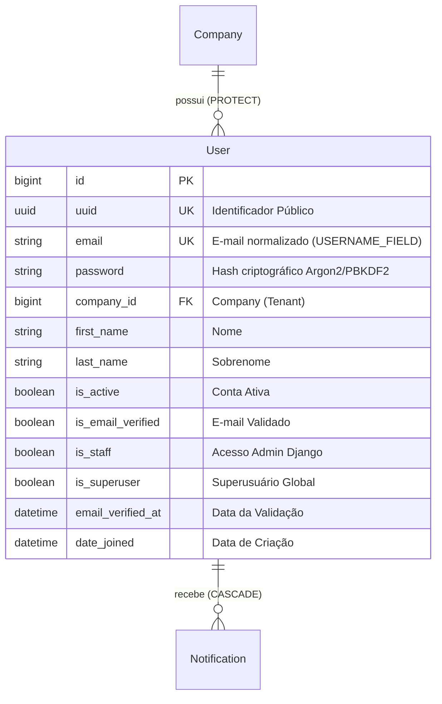
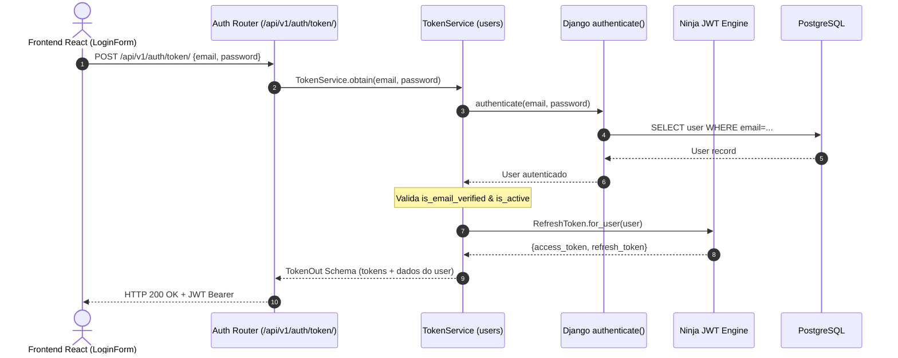

# Domínio de Usuários, Identidade & Autenticação (Users)

> **Categoria:** Domínios de Arquitetura (Bounded Contexts)
> **Relacionados:** [Fluxo de Autenticação JWT](../concepts/auth-jwt-flow.md) · [Estratégia de Multi-Tenancy](../concepts/multi-tenancy-strategy.md) · [ADR-006: Service Layer](../adr/006-service-layer.md) · [ADR-009: Multi-Tenancy](../adr/009-multitenancy.md) · [Modelos Base & Padrões Core](../../reference/models/core-models.md) · [Tenants Domain](tenants-domain.md)

---

## 1. Visão Geral do Domínio

O domínio de **Users** centraliza a gestão de identidade, credenciais, ciclo de vida de contas de usuários, autenticação baseada em tokens JWT (`ninja_jwt`), integração social OAuth2 via Google e controle de acesso RBAC (*Role-Based Access Control*).

Princípios centrais do domínio:
1. **E-mail como Identificador Único:** O campo `email` atua como `USERNAME_FIELD`, normalizado em caixa baixa para evitar duplicações acidentais.
2. **Vínculo Fixo ao Tenant (`Company`):** Todo usuário é obrigatoriamente associado a uma `Company` (`on_delete=models.PROTECT`).
3. **Onboarding Atômico:** O registro de um novo proprietário cria simultaneamente o usuário e a sua empresa (`Company`) em uma única transação atômica (`RegistrationService.register_new_owner`).
4. **Verificação Preventiva de E-mail:** Novos usuários normais são criados com `is_active=False` e `is_email_verified=False`, ativados somente após validação via link seguro com token criptográfico.
5. **Autenticação Social Google OAuth2:** Troca segura de `id_token` do Google por par de tokens JWT (`TokenService`), provisionando automaticamente novos usuários e empresas caso ainda não existam.

---

## 2. Diagrama ERD e Fluxo de Autenticação JWT





---

## 3. Tabela de Entidades e Invariantes de Persistência

| Entidade / Componente | Papel Arquitetural | Campos & Chaves | Invariantes de Persistência & Regras de Negócio |
| :--- | :--- | :--- | :--- |
| **`User`** | Agregado de Identidade (`AbstractBaseUser`, `PermissionsMixin`) | `email` (unique, max 255), `uuid` (unique, indexado), `company` (`ForeignKey` para `tenants.Company`, `on_delete=models.PROTECT`), `first_name`, `last_name`, `is_active`, `is_email_verified`, `is_staff`, `is_superuser` | **Unicidade de E-mail:** `email` normalizado e único globalmente.<br/>**Proteção contra Órfãos:** `company` usa `models.PROTECT`, impedindo a deleção de empresas com usuários vinculados.<br/>**Superusuários:** Superusuários são automaticamente associados ao `admin-workspace`. |
| **`CustomUserManager`** | Manager do Modelo `User` | `create_user()`, `create_superuser()` | Configura `is_active=False` por padrão para usuários comuns e provisiona automaticamente uma empresa padrão caso nenhuma seja passada em testes ou migrações. |
| **`RegistrationService`** | Orquestrador de Cadastro | `register_new_owner()` | Executa em transação `@transaction.atomic`. Cria a `Company` e o `User` em sequência e agenda o envio de e-mail de ativação via `transaction.on_commit()`. |
| **`TokenService`** | Gestão de Sessões JWT | `obtain()`, `refresh()`, `verify()` | Emite tokens de curta duração (*access token*) e de longa duração (*refresh token*) com rotação e suporte a blacklist. |
| **`EmailVerificationService`** | Ciclo de Ativação | `send_verification_email()`, `verify_email_token()`, `resend_verification_email()` | Gera tokens temporários assinados com HMAC-SHA256 (`default_token_generator`), ativa a conta e preenche `email_verified_at = timezone.now()`. |
| **`PasswordResetService`** | Recuperação de Senha | `request_password_reset()`, `confirm_password_reset()` | Previne enumeração de usuários (retorna mensagem de sucesso genérica mesmo se o e-mail não existir). |
| **`GoogleAuthService`** | Login Social OAuth2 | `authenticate_with_google()` | Valida o token de identidade emitido pelos servidores do Google, mascara e-mails em logs e auto-provisiona o usuário com senha aleatória segura. |

---

## 4. Transclusão de Código Real

### A. Definição do Modelo de Usuário (`User`)
```python
--8<-- "backend/apps/users/models.py:119:210"
```

### B. Onboarding Atômico de Proprietário (`RegistrationService`)
```python
--8<-- "backend/apps/users/services/registration_service.py:14:98"
```

### C. Emissão e Validação de Tokens JWT (`TokenService`)
```python
--8<-- "backend/apps/users/services/token_service.py:20:83"
```

### D. Seletores de Leitura de Usuários (`selectors.py`)
```python
--8<-- "backend/apps/users/selectors.py:20:55"
```

---

## 5. Mapeamento de Camadas (Fullstack)

### Camada de Backend (`backend/apps/users/`)
- **Modelos:** `User` e `CustomUserManager` em `models.py`.
- **Services:** `registration_service.py`, `token_service.py`, `email_verification_service.py`, `password_reset_service.py`, `google_auth_service.py`.
- **Selectors:** `user_get_by_email_selector`, `user_get_by_uuid_selector`, `user_list_selector` em `selectors.py`.
- **Endpoints Ninja:** `api.py` com rotas para `/auth/token/`, `/auth/register/`, `/auth/verify-email/`, `/auth/password-reset/`, `/auth/google/`.

### Camada de Frontend (`frontend/src/features/auth/`)
- **Páginas:** `LoginPage.tsx`, `RegisterPage.tsx`, `VerifyEmailPage.tsx`, `VerifyEmailPendingPage.tsx`, `ForgotPasswordPage.tsx`, `ResetPasswordPage.tsx`.
- **Componentes:** `AuthLayout.tsx`, `LoginForm.tsx`, `RegisterForm.tsx`, `PasswordInput.tsx`, `SocialButtons.tsx`.
- **Estado Global:** `useAuthStore` (`src/stores/authStore.ts`).

---

## 6. Links e Referências Cruzadas

- [Fluxo de Autenticação JWT](../concepts/auth-jwt-flow.md)
- [ADR-006: Service Layer](../adr/006-service-layer.md)
- [ADR-009: Multi-Tenancy](../adr/009-multitenancy.md)
- [Modelos Base & Padrões Core](../../reference/models/core-models.md)
- [Tenants Domain](tenants-domain.md)
