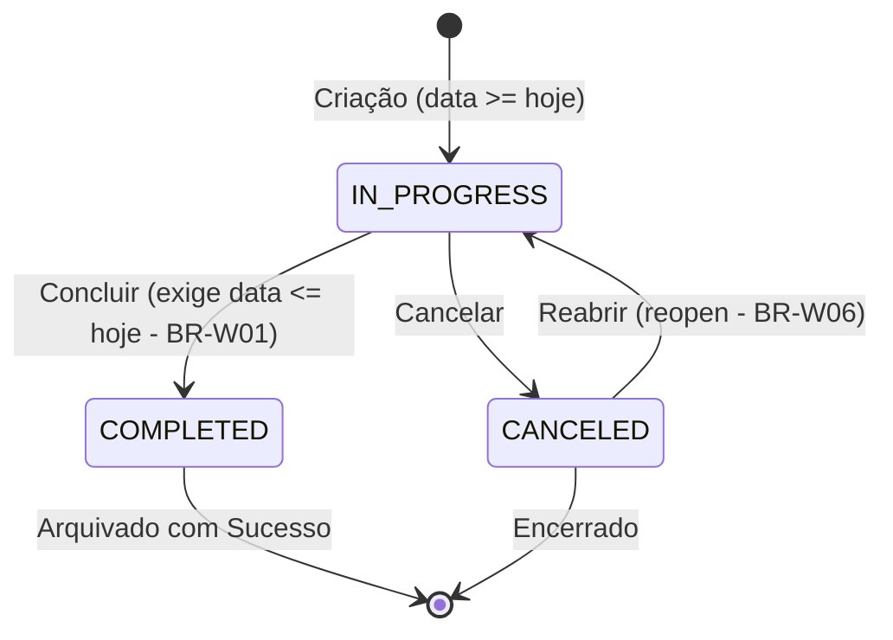
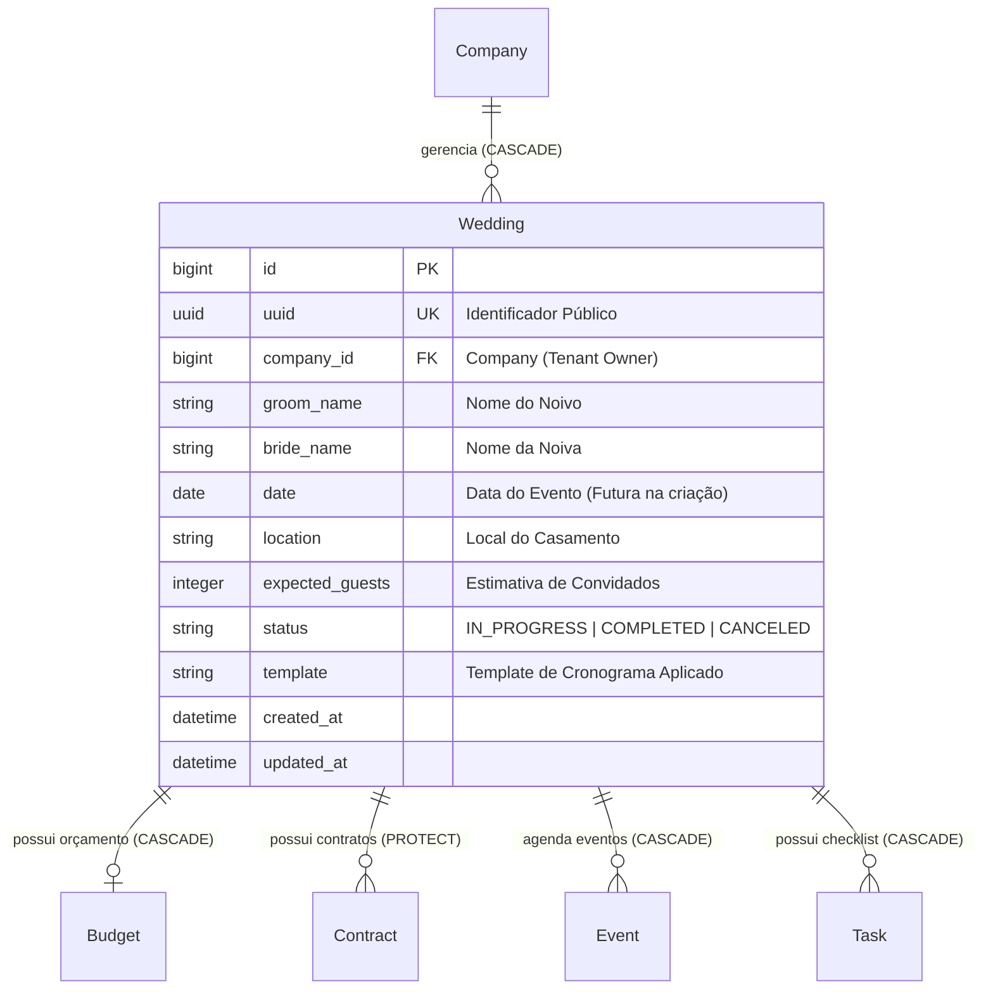

# Domínio de Casamentos & Gestão de Cerimônias (Weddings)

> **Categoria:** Domínios de Arquitetura (Bounded Contexts)
> **Relacionados:** [Catálogo Canônico de Regras de Negócio](../business-rules/index.md) · [ADR-006: Service Layer](../adr/006-service-layer.md) · [ADR-011: BaseModel save com full_clean](../adr/011-basemodel-save-full-clean.md) · [ADR-023: Desacoplamento de Módulos](../adr/023-desacoplamento-modulos-scheduler-finances-weddings.md) · [ADR-030: Rich Domain Model](../adr/030-rich-domain-model-service-layer.md) · [ADR-031: Comunicação Entre Módulos](../adr/031-inter-module-communication.md)

O **Domínio de Casamentos (`weddings`)** é o agregador central de operações de toda a plataforma. Cada casamento (`Wedding`) aglutina o escopo relacional de orçamento, contratos de fornecedores, agenda de compromissos, convidados e cronograma de um casal.

---

## 1. Visão de Negócio & Capacidades Operacionais

O casamento é a entidade raiz em torno da qual todos os módulos operacionais orbitam. Ele define a identidade dos noivos, data da cerimônia, local físico, estimativa de convidados, status de planejamento e o modelo inicial de cronograma (*template*).

### Principais Capacidades Operacionais
- **Gestão do Ciclo de Vida do Evento:** Acompanhamento do casamento desde a contratação inicial da assessoria até a conclusão ou eventual cancelamento e reabertura.
- **Ancoragem Temporal:** A data do casamento (`date`) é o marco zero que norteia todos os prazos de contratação, provas de vestido e pagamentos.
- **Templates de Cronograma Automatizados:** Injeção automática de dezenas de tarefas e eventos baseados no perfil do evento (ex.: 12 meses, 6 meses, 3 meses).
- **Proteção Relacional e de Integridade:** Bloqueio de deleção acidental de casamentos com contratos assinados ou despesas vinculadas (`models.PROTECT`).

### Ciclo de Vida e Máquina de Estados
A entidade `Wedding` encapsula uma máquina de estados finita:
- **`IN_PROGRESS` (Em Andamento):** Estado inicial padrão na criação. A data deve ser futura ou o dia corrente (`date >= hoje`).
- **`COMPLETED` (Concluído):** O casamento foi realizado com sucesso. Trava arquitetural (BR-W01) impede que um casamento seja marcado como concluído antes da data efetiva da cerimônia (`date <= hoje`).
- **`CANCELED` (Cancelado):** O evento foi cancelado. Permite reabertura sem perda de dados históricos via método semântico `reopen()`.

---

## 2. Modelo de Dados & Diagrama ERD

### Tabela de Entidades e Invariantes de Persistência

| Entidade | Papel & Relações | Campos & Tipos | Invariantes de Persistência & Regras de Domínio |
| :--- | :--- | :--- | :--- |
| **`Wedding`** | Agregador Raiz (`TenantModel`) | `groom_name` (max 100), `bride_name` (max 100), `date` (DateField), `location` (max 255), `expected_guests` (PositiveInt, nullable), `status` (`StatusChoices`), `template` (string, nullable) | **Máquina de Estados (ADR-030):** Métodos de ciclo de vida `complete()`, `cancel()`, `reopen()` e `transition_to()`. **Regra de Conclusão (BR-W01):** Um casamento só pode ser concluído se `date <= hoje`. **Proteção de Deleção (BR-W03):** Bloqueio de exclusão em cascata se existirem contratos ou despesas protegidos (`ProtectedError`). |

---

## 3. Matriz Consolidada de Regras de Negócio (SSOT)

| Código Canônico | Regra / Especificação | Escopo / Responsabilidade | Entidades Envolvidas | Nota Detalhada |
| :--- | :--- | :--- | :--- | :--- |
| **`BR-W01`** | **Conclusão Prematura Bloqueada** | Um casamento só pode transitar para `COMPLETED` se a data da cerimônia for igual ou anterior ao dia atual (\(d_{\text{wedding}} \le d_{\text{today}}\)). | `Wedding` | [wedding-status-lifecycle.md](../business-rules/weddings/wedding-status-lifecycle.md) |
| **`BR-W02`** | **Data Inicial no Futuro** | Na criação de um novo casamento, a data da cerimônia deve ser estritamente no presente ou futuro (\(d_{\text{wedding}} \ge d_{\text{today}}\)). | `Wedding` | [wedding-status-lifecycle.md](../business-rules/weddings/wedding-status-lifecycle.md) |
| **`BR-W03`** | **Proteção Relacional na Exclusão** | Casamentos com contratos formalizados (`Contract`) ou despesas ativas (`Expense`) não podem ser deletados (`models.PROTECT`). | `Wedding`, `Contract` | [wedding-status-lifecycle.md](../business-rules/weddings/wedding-status-lifecycle.md) |
| **`BR-W04`** | **Ordenação Decrescente** | Listagens de casamentos adotam ordenação padrão por data decrescente (`ordering = ["-date"]`). | `Wedding` | [wedding-status-lifecycle.md](../business-rules/weddings/wedding-status-lifecycle.md) |
| **`BR-W05`** | **Transição Ilegal de Status** | Transições de status não cadastradas em `ALLOWED_TRANSITIONS` são bloqueadas pelo método `transition_to()`. | `Wedding` | [wedding-status-lifecycle.md](../business-rules/weddings/wedding-status-lifecycle.md) |
| **`BR-W06`** | **Reabertura de Cancelados** | Casamentos no estado `CANCELED` podem retornar para `IN_PROGRESS` via `reopen()`, preservando todo o histórico relacional. | `Wedding` | [wedding-status-lifecycle.md](../business-rules/weddings/wedding-status-lifecycle.md) |
| **`BR-W07`** | **Templates Canônicos** | Provisionamento idempotente de marcos no calendário a partir de templates canônicos relativos à data do casamento. | `Wedding`, `Event` | [wedding-schedule-templates.md](../business-rules/weddings/wedding-schedule-templates.md) |

### Matriz de Integração e Relações Cruzadas
- **Com o Módulo de Cronograma:** A data do casamento é o ponto de ancoragem para o cálculo de todos os prazos relativos e templates de cronograma via `TemplateEngine`. Veja [Domínio de Cronograma](scheduler-domain.md).
- **Com o Módulo de Finanças:** Cada casamento possui exatamente um orçamento mestre (`Budget`), instanciado após a criação válida do casamento. Veja [Domínio Financeiro](finances-domain.md).
- **Com o Módulo de Logística:** Fornecedores e contratos são vinculados estritamente ao casamento, impedindo contaminação cross-wedding. Veja [Domínio de Logística](logistics-domain.md).

---

## 4. Arquitetura Fullstack do Módulo

O módulo segue rigorosamente a **ADR-030** (Rich Domain Model & Service Layer):

### Backend (`backend/apps/weddings/`)
- **Modelos de Domínio Ricos:**
  - `Wedding`: Encapsula a máquina de estados, propriedades dinâmicas e validação em `clean()`.
- **Casos de Uso e Serviços:**
  - `WeddingService`: Orquestra transações atômicas (`@transaction.atomic`), resolução de tenant, aplicação de templates de cronograma e mutações de ciclo de vida (`complete()`, `cancel()`, `reopen()`).
- **Seletores de Leitura CQRS:**
  - `wedding_list_selector`, `wedding_get_selector`: Consultas otimizadas com anotações de métricas agregadas (total orçado, parcelas atrasadas, tarefas pendentes) sem incorrer em N+1 queries.
- **Validação de Entrada e Schemas Ninja (Pydantic):**
  - `WeddingIn`, `WeddingPatchIn`: Sanitização e regras de validação sintática.
  - `WeddingOut`: DTO enriquecido que inclui `can_complete: bool` e `allowed_transitions: list[str]`.
- **Endpoints:**
  - CRUD base: `GET /weddings/`, `POST /weddings/`, `GET /weddings/{uuid}/`, `PATCH /weddings/{uuid}/`, `DELETE /weddings/{uuid}/`.
  - Transições Semânticas: `POST /weddings/{uuid}/complete/`, `POST /weddings/{uuid}/cancel/`, `POST /weddings/{uuid}/reopen/`.

### Frontend (`frontend/src/features/weddings/`)
- **Padrão Smart/Dumb (ADR-024):**
  - **Containers (Smart):** Páginas `WeddingsListPage.tsx` e `WeddingDetailPage.tsx` orquestram hooks Orval, filtros de busca e dialogs de ciclo de vida.
  - **Presenters (Dumb):** `WeddingOverview.tsx`, `WeddingDetailTabs.tsx`, `WeddingsTable.tsx` e `WeddingFilters.tsx` recebem dados via props puras.
  - **Controle Dinâmico de Ações:** O frontend habilita botões de ação baseado estritamente na lista `allowed_transitions` fornecida pelo backend.

---

## 5. Integrações & Interfaces Públicas (ADR-031)

- `apps.weddings.interfaces.get_wedding_for_company`: Lookup seguro por tenant para orçamentos, contratos e eventos.
- Injeção de templates de cronograma via `apps.scheduler.interfaces.apply_wedding_template`.

---

## 6. Aprofundamento & Referências

### Regras de Negócio Detalhadas
- [Ciclo de Vida do Status do Casamento e Validações (`BR-W01` a `BR-W06`)](../business-rules/weddings/wedding-status-lifecycle.md)
- [Aplicação de Templates de Cronograma de Casamento (`BR-W07`)](../business-rules/weddings/wedding-schedule-templates.md)

### Decisões de Arquitetura (ADRs)
- [ADR-006: Service Layer Pattern](../adr/006-service-layer.md)
- [ADR-011: BaseModel save com full_clean](../adr/011-basemodel-save-full-clean.md)
- [ADR-023: Desacoplamento entre Scheduler, Finances e Weddings](../adr/023-desacoplamento-modulos-scheduler-finances-weddings.md)
- [ADR-030: Rich Domain Model e Casos de Uso](../adr/030-rich-domain-model-service-layer.md)
- [ADR-031: Comunicação Entre Módulos](../adr/031-inter-module-communication.md)
