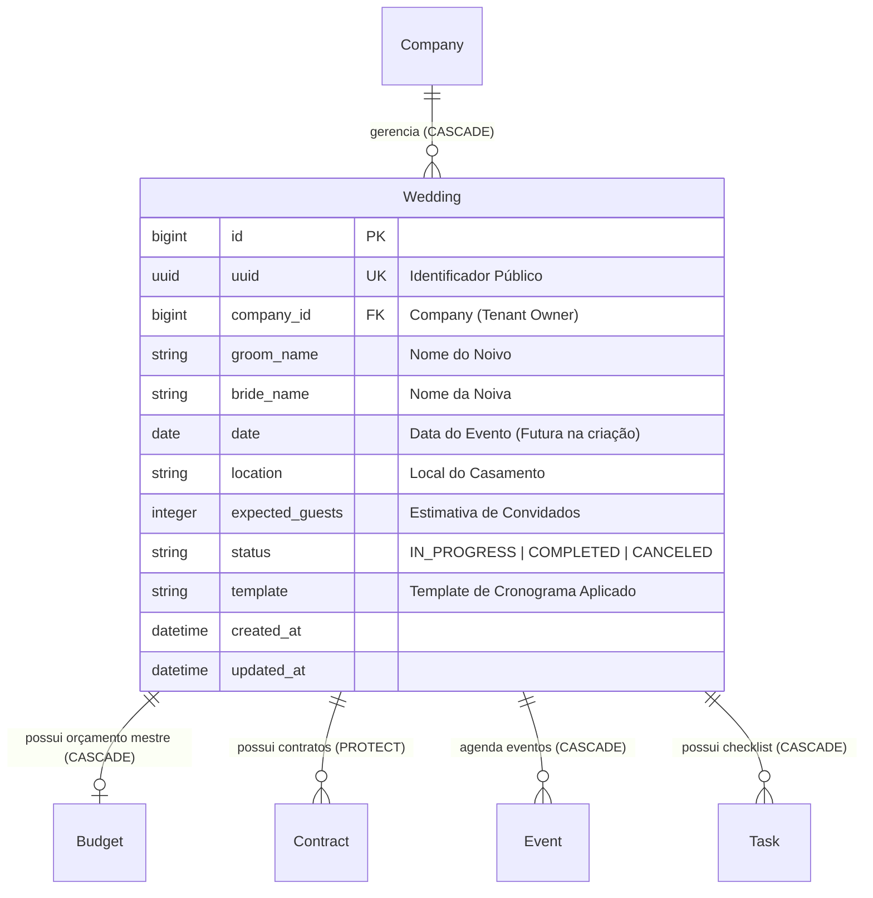
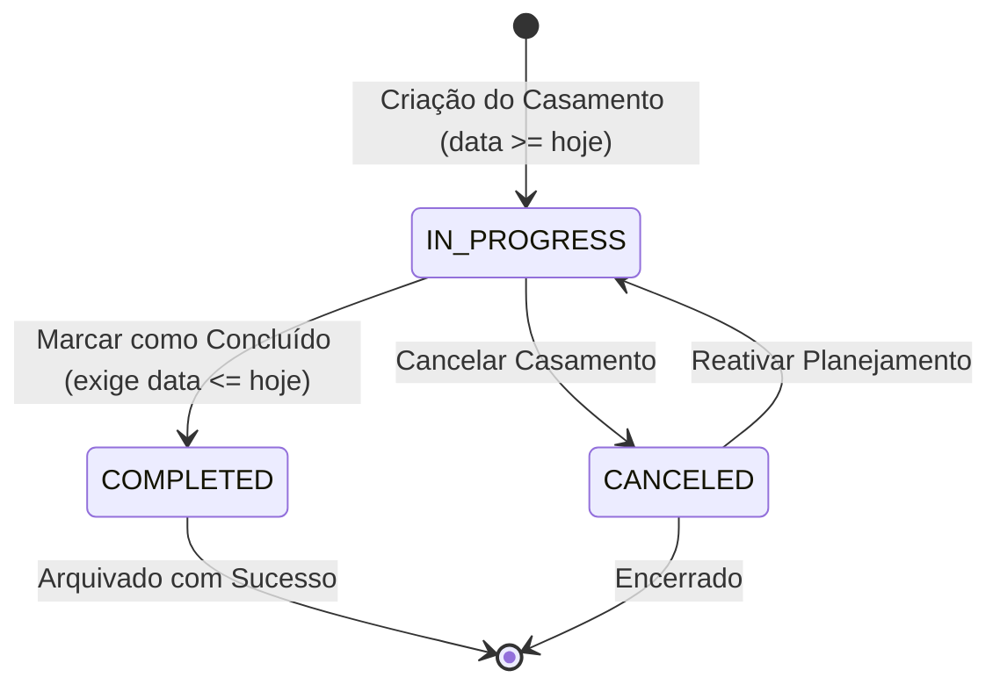

# Domínio de Casamentos & Gestão de Cerimônias (Weddings)

> **Categoria:** Domínios de Arquitetura (Bounded Contexts)
> **Relacionados:** [Ciclo de Vida do Casamento](../business-rules/weddings/wedding-status-lifecycle.md) · [Templates de Cronograma](../business-rules/weddings/wedding-schedule-templates.md) · [ADR-006: Service Layer](../adr/006-service-layer.md) · [ADR-011: BaseModel save com full_clean](../adr/011-basemodel-save-full-clean.md) · [ADR-023: Desacoplamento de Módulos](../adr/023-desacoplamento-modulos-scheduler-finances-weddings.md) · [Modelos Base & Padrões Core](../../reference/models/core-models.md)

---

## 1. Visão Geral do Domínio

O domínio de **Weddings** é o agregador central de operações de toda a plataforma. Ele representa o evento do casamento em si, definindo a identidade dos noivos, data, local, capacidade estimada de convidados, status de planejamento e o modelo inicial de cronograma (*template*).

Todos os demais domínios operacionais (`Finances`, `Logistics`, `Scheduler`, `Reporting`) orbitam em torno da entidade `Wedding`, herdando o pertencimento através do mixin `WeddingOwnedMixin`.

---

## 2. Diagrama ERD e Máquina de Estados de Status





---

## 3. Tabela de Entidades e Invariantes de Persistência

| Entidade / Componente | Papel Arquitetural | Campos & Chaves | Invariantes de Persistência & Regras de Negócio |
| :--- | :--- | :--- | :--- |
| **`Wedding`** | Agregado Central (`TenantModel`) | `groom_name` (max 100), `bride_name` (max 100), `date` (DateField), `location` (max 255), `expected_guests` (PositiveInt, nullable), `status` (`StatusChoices`), `template` (string, nullable) | **Validação de Data Futura:** Na criação, `date >= timezone.now().date()` (regra `validate_future_date`).<br/>**Regra de Conclusão (BR-W01):** Um casamento só pode transitar para `COMPLETED` se `date <= timezone.now().date()`.<br/>**Proteção de Deleção (BR-W03):** Não pode ser excluído se possuir contratos assinados ou despesas protegidas (`ProtectedError`). |
| **`WeddingQuerySet`** | Camada de Consulta Otimizada | `search()`, `by_status()`, `with_metrics()` | Anota de forma eficiente contagens de tarefas incompletas, parcelas atrasadas e total orçado sem incorrer em problemas de N+1 queries. |
| **`WeddingService`** | Mutação e Orquestração | `create()`, `update()`, `delete()` | **Transações Atômicas:** Métodos decorados com `@transaction.atomic`.<br/>**Aplicação de Template (BR-W02):** Caso `template` seja fornecido no payload, executa `_apply_template_events()`, calculando datas relativas e chamando `EventService.create()`. |

---

## 4. Transclusão de Código Real

### A. Modelo de Dados e Validações de Invariantes (`Wedding`)
```python
--8<-- "backend/apps/weddings/models.py:16:69"
```

### B. Criação com Orquestração de Templates (`WeddingService.create`)
```python
--8<-- "backend/apps/weddings/services.py:38:88"
```

### C. Aplicação de Eventos de Template de Cerimônia (`_apply_template_events`)
```python
--8<-- "backend/apps/weddings/services.py:192:233"
```

### D. Seletores de Leitura e Otimização com Métricas (`selectors.py`)
```python
--8<-- "backend/apps/weddings/selectors.py:24:60"
```

---

## 5. Mapeamento de Camadas (Fullstack)

### Camada de Backend (`backend/apps/weddings/`)
- **Modelos:** `Wedding` em `models.py`.
- **Managers:** `WeddingQuerySet` em `managers.py`.
- **Services:** `WeddingService` e `_apply_template_events` em `services.py`.
- **Selectors:** `wedding_list_selector`, `wedding_get_selector`, `critical_weddings_selector` em `selectors.py`.
- **Endpoints:** `api.py` com rotas `/weddings/` (CRUD completo).

### Camada de Frontend (`frontend/src/features/weddings/`)
- **Páginas:** `WeddingsListPage.tsx`, `WeddingDetailPage.tsx`.
- **Componentes:** `WeddingHeader.tsx`, `WeddingOverview.tsx`, `WeddingDetailTabs.tsx`, `WeddingsTable.tsx`, `WeddingFilters.tsx`.
- **Dialogs:** `CreateWeddingDialog.tsx`, `EditWeddingDialog.tsx`, `DeleteWeddingDialog.tsx`.
- **Estado Global & Hooks:** `useWeddingStore`, `useWeddingsPage`, `useWeddingDetail`.

---

## 6. Links e Regras de Negócio Associadas

- [Ciclo de Vida e Transições de Status do Casamento](../business-rules/weddings/wedding-status-lifecycle.md)
- [Templates de Cronograma e Cerimônia](../business-rules/weddings/wedding-schedule-templates.md)
- [ADR-006: Service Layer](../adr/006-service-layer.md)
- [ADR-011: BaseModel save com full_clean](../adr/011-basemodel-save-full-clean.md)
- [ADR-023: Desacoplamento de Módulos](../adr/023-desacoplamento-modulos-scheduler-finances-weddings.md)
- [Modelos Base & Padrões Core](../../reference/models/core-models.md)
- [Finances Domain](finances-domain.md)
- [Scheduler Domain](scheduler-domain.md)
