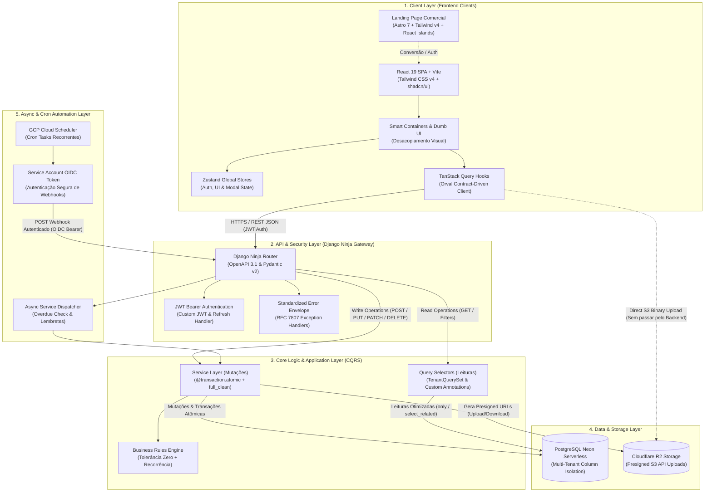
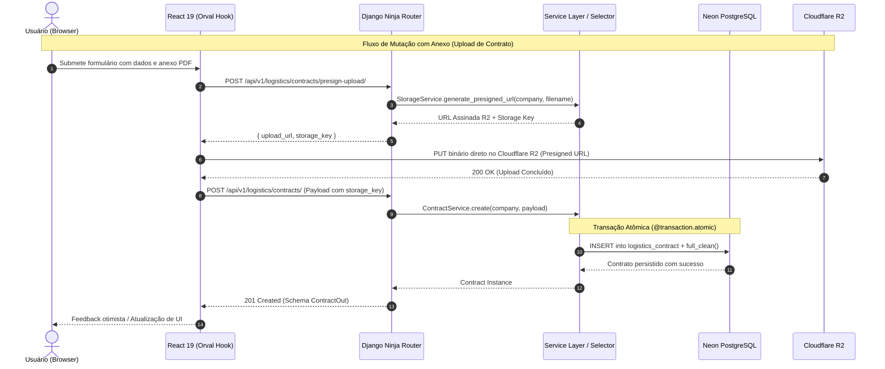
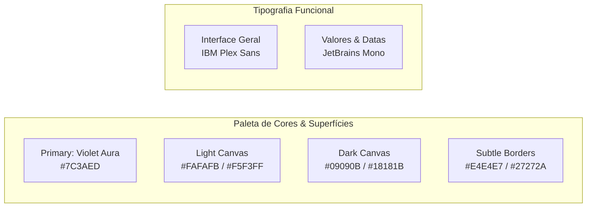

# Arquitetura & System Design da Plataforma

> **Categoria:** Arquitetura (System Design & Decision Records)
> **Relacionados:** [Matriz de Requisitos](requirements.md) | [MOC de Domínios](domains/index.md) | [Índice de ADRs (001–029)](adr/README.md) | [Racional de Design System](concepts/design-system-rationale.md)

Hub executivo de engenharia, topologia de microsserviços e padrões de projeto do Wedding Management System.

  Multi-Tenancy Pragmático
  CQRS & Service Layer
  Contratos OpenAPI & Orval
  Neon PostgreSQL
  Cloudflare R2 Presigned URLs
  Zero-Tolerance Contábil

[:material-sitemap: System Design Unificado](#system-design-unificado){ .md-button .md-button--primary }
[:material-shield-star: Pilares de Engenharia](#pilares-de-engenharia-padroes-arquiteturais){ .md-button }
[:material-view-grid: Bounded Contexts (10 Domínios)](#bounded-contexts-10-dominios-da-plataforma){ .md-button }
[:material-file-document-multiple: Catálogo de ADRs](#catalogo-de-decisoes-arquiteturais-adrs-001029){ .md-button }
[:material-palette: Design System](#design-system-ergonomia-visual){ .md-button }

---

## System Design Unificado (Diagrama Fullstack)

A plataforma opera sob um modelo arquitetural desacoplado, estritamente tipado de ponta a ponta (*Contract-Driven Development*), com segregação clara de responsabilidades entre apresentação, roteamento, domínio, persistência e tarefas assíncronas:

### Ciclo de Vida e Fluxo de Requisições

---

## Pilares de Engenharia & Padrões Arquiteturais

A arquitetura do **Wedding Management System** foi construída sobre princípios sólidos de manutenibilidade, isolamento rigoroso e desacoplamento:

-   :material-layers-triple:{ .lg .middle } **Service Layer & CQRS**

    ---

    Segregação total entre mutações (`services/` com `@transaction.atomic`) e consultas otimizadas (`selectors/` com `TenantQuerySet`). Roteadores em `api.py` não contêm lógica de negócio nem queries ORM brutas.

    [:octicons-arrow-right-24: Service Layer](concepts/service-layer-pattern.md) · [:octicons-arrow-right-24: Query Selectors](concepts/query-selectors-pattern.md) · [:octicons-shield-check-24: ADR-006](adr/006-service-layer.md)

-   :material-domain:{ .lg .middle } **Multi-Tenancy Pragmático**

    ---

    Isolamento lógico absoluto baseado em coluna de pertencimento (`company_id`). Todos os modelos herdam de `TenantModel` e todos os serviços/selectors exigem o parâmetro explícito `company: Company`.

    [:octicons-arrow-right-24: Estratégia Multi-Tenant](concepts/multi-tenancy-strategy.md) · [:octicons-shield-check-24: ADR-009](adr/009-multitenancy.md) · [:octicons-shield-check-24: ADR-016](adr/016-pragmatic-multi-tenancy.md)

-   :material-cash-check:{ .lg .middle } **Tolerância Zero Contábil**

    ---

    Integridade estrita de valores em centavos (`DecimalField(12, 2)`). Rateios e divisões de parcelas utilizam o princípio da conservação de centavos, distribuindo restos indivisíveis sem perdas acumuladas.

    [:octicons-arrow-right-24: Tolerância Zero](business-rules/finances/financial-integrity-rules.md) · [:octicons-shield-check-24: ADR-010](adr/010-tolerance-zero.md)

-   :material-cloud-upload:{ .lg .middle } **Uploads R2 via Presigned URLs**

    ---

    Upload direto de PDFs e contratos anexados ao Cloudflare R2 via API S3-compatível. O tráfego de arquivos pesados não onera o backend Django, e o custo de transferência (egress) é zero.

    [:octicons-arrow-right-24: Fluxo de Upload R2](concepts/contract-pdf-upload-r2-flow.md) · [:octicons-shield-check-24: ADR-004](adr/004-presigned-urls.md) · [:octicons-shield-check-24: ADR-020](adr/020-storage-service-abstraction.md)

-   :material-react:{ .lg .middle } **Smart vs Dumb Components**

    ---

    Divisão clara no frontend React 19 entre contêineres inteligentes (que consom hooks Orval, gerenciam estado Zustand e orquestram fluxos) e componentes de apresentação visuais (100% orientados a props e estilizados).

    [:octicons-arrow-right-24: Smart & Dumb Pattern](concepts/smart-dumb-components.md) · [:octicons-shield-check-24: ADR-024](adr/024-padrao-smart-dumb-desacoplamento-componentes-frontend.md)

-   :material-shield-check:{ .lg .middle } **Suíte de Guard-Rails**

    ---

    Testes arquiteturais estritos que rodam em CI e impedem regressões: barram chamadas `.objects.create()` em testes, bloqueiam queries sem filtro de tenant e validam a presença de docstrings e typing.

    [:octicons-arrow-right-24: Suíte de Guard-Rails](concepts/architectural-guard-rails-suite.md) · [:octicons-checklist-24: Catálogo de Guards](../reference/architecture-standards/guard-rails/index.md)

-   :material-clock-fast:{ .lg .middle } **Tarefas Assíncronas & Crons**

    ---

    Execução serverless de rotinas agendadas (atualização de parcelas em atraso, sincronização de notificações) via GCP Cloud Scheduler com tokens OIDC chamando endpoints seguros.

    [:octicons-arrow-right-24: Arquitetura Async](concepts/async-tasks-architecture.md) · [:octicons-shield-check-24: ADR-005](adr/005-oidc-scheduler.md) · [:octicons-shield-check-24: ADR-017](adr/017-async-task-infrastructure.md)

-   :material-terraform:{ .lg .middle } **CI/CD & Topologia Terraform**

    ---

    Infraestrutura declarativa multi-cloud gerenciada via Terraform com isolamento de states (`shared`, `staging`, `production`) e pipelines automatizados no GitHub Actions.

    [:octicons-arrow-right-24: Pipeline CI/CD](concepts/ci-cd-pipeline-flow.md) · [:octicons-shield-check-24: ADR-025](adr/025-terraform-iac-architecture.md) · [:octicons-shield-check-24: ADR-027](adr/027-terraform-state-topology.md)

---

## Bounded Contexts (10 Domínios da Plataforma)

O sistema é dividido em **10 Bounded Contexts** independentes e desacoplados, cada um com sua camada de modelos, rotas de API, serviços de domínio e seletores de consulta.

Para uma navegação aprofundada em cada bounded context, consulte o [MOC Geral de Domínios](domains/index.md).

| Domínio | Especificação | Responsabilidade Arquitetural | Entidades Chave |
| :--- | :--- | :--- | :--- |
| **Core** | [core-domain](domains/core-domain.md) | Modelos base (`BaseModel`, `TenantModel`), soft-delete, auditoria, constantes e utilitários compartilhados. | `BaseModel`, `TenantModel` |
| **Tenants** | [tenants-domain](domains/tenants-domain.md) | Gestão das empresas/assessorias de evento, isolamento de dados e planos de assinatura. | `Company`, `TenantQuerySet` |
| **Users** | [users-domain](domains/users-domain.md) | Autenticação JWT, perfis de usuários, controle de acesso baseado em funções (RBAC) e convites. | `User`, `UserRole` |
| **Weddings** | [weddings-domain](domains/weddings-domain.md) | Ciclo de vida dos casamentos, perfil dos noivos, detalhes da cerimônia e templates de cronograma. | `Wedding`, `ScheduleTemplate` |
| **Finances** | [finances-domain](domains/finances-domain.md) | Orçamentos mestres, categorias, despesas, parcelamentos com tolerância zero e controle de débitos. | `Budget`, `Expense`, `Installment` |
| **Logistics** | [logistics-domain](domains/logistics-domain.md) | Gestão de fornecedores, contratos, hierarquia de aditivos, itens de logística e integração com Cloudflare R2. | `Supplier`, `Contract`, `Item` |
| **Scheduler** | [scheduler-domain](domains/scheduler-domain.md) | Agenda de eventos, motor de regras de recorrência (RRule) e proteção *read-only* de parcelas sincronizadas. | `Event`, `Task`, `RecurrenceRule` |
| **Dashboard** | [dashboard-domain](domains/dashboard-domain.md) | Agregação em tempo real de métricas executivas, saúde orçamentária, prazos iminentes e pendências críticas. | `DashboardKPIs`, `AlertSummary` |
| **Reporting** | [reporting-domain](domains/reporting-domain.md) | Geração de relatórios analíticos, balancetes consolidados, exportações CSV/PDF e extratos de fornecedores. | `ReportDefinition`, `FinancialReport` |
| **Notifications** | [notifications-domain](domains/notifications-domain.md) | Motor de notificações in-app transacionais, alertas de vencimento, badges e marcação de leitura. | `Notification`, `NotificationPreference` |

---

## Catálogo de Decisões Arquiteturais (ADRs 001–029)

Todas as decisões arquiteturais fundamentais, alternativas descartadas e trade-offs técnicos são registrados formalmente em **Architecture Decision Records (ADRs)** com numeração sequencial imutável.

> Para detalhes completos sobre o processo de governança e histórico de versões, acesse o [Índice Oficial de ADRs](adr/README.md).

=== "Infraestrutura & Cloud"

    | ADR | Título & Decisão | Trade-off / Racional | Status |
    | :--- | :--- | :--- | :--- |
    | **[ADR-001](adr/001-why-cloud-run.md)** | **Cloud Run para Backend Django** | Hospedagem serverless com escala a zero, custos proporcionais ao tráfego e suporte nativo a containers OCI. | `Aceita` |
    | **[ADR-002](adr/002-why-neon.md)** | **Neon Serverless PostgreSQL** | Suporte a Database Branching por ambiente de homologação, autoscaling e alta confiabilidade transacional. | `Aceita` |
    | **[ADR-003](adr/003-why-r2.md)** | **Cloudflare R2 Storage** | Armazenamento de PDFs e anexos com custo zero de transferência (egress) e alta compatibilidade com AWS S3 API. | `Aceita` |
    | **[ADR-004](adr/004-presigned-urls.md)** | **Upload Direto via Presigned URLs** | Upload seguro de arquivos direto do browser para o R2, evitando sobrecarga de I/O e processamento no backend Django. | `Aceita` |
    | **[ADR-005](adr/005-oidc-scheduler.md)** | **Cloud Scheduler & OIDC** | Automação de tarefas cron através de requisições HTTPS autenticadas por OIDC Service Accounts do GCP. | `Aceita` |
    | **[ADR-020](adr/020-storage-service-abstraction.md)** | **StorageService Abstraction** | Abstração da camada de armazenamento com injeção de dependência para isolar a API de provedores específicos. | `Aceita` |
    | **[ADR-025](adr/025-terraform-iac-architecture.md)** | **Terraform IaC & GitOps** | Provisionamento declarativo de toda a infraestrutura multi-cloud (GCP + Cloudflare + Neon) via Terraform. | `Aceita` |
    | **[ADR-026](adr/026-gitops-branching-and-deployment-strategy.md)** | **Estratégia de Branches & Staging** | Modelo de branches (`main`/`develop`), deploy contínuo em ambientes isolados e validação por Sprints. | `Aceita` |
    | **[ADR-027](adr/027-terraform-state-topology.md)** | **Topologia de States Terraform** | Separação física de states (`shared`, `staging`, `production`) no GCS para evitar acoplamento de blast radius. | `Aceita` |

=== "Backend, Segurança & Integridade"

    | ADR | Título & Decisão | Trade-off / Racional | Status |
    | :--- | :--- | :--- | :--- |
    | **[ADR-006](adr/006-service-layer.md)** | **Service Layer Pattern** | Isolamento estrito de lógica de negócios e transações (`@transaction.atomic`) fora de routers e controllers. | `Aceita` |
    | **[ADR-007](adr/007-hybrid-keys.md)** | **Chaves Primárias Híbridas** | `BigAutoField` interno para performance de JOINs relacionais e `UUIDv4` público na API para segurança. | `Aceita` |
    | **[ADR-008](adr/008-soft-delete.md)** | **Estratégia de Soft Delete** | Preservação de histórico e integridade contábil de registros financeiros e contratuais via flag `is_deleted`. | `Aceita` |
    | **[ADR-009](adr/009-multitenancy.md)** | **Multi-Tenancy Strategy** | Isolamento lógico rigoroso por empresa (`Company`) com validação obrigatória em nível de ORM. | `Aceita` |
    | **[ADR-010](adr/010-tolerance-zero.md)** | **Tolerância Zero Contábil** | Exatidão centesimal em parcelamentos financeiros sem perdas de arredondamento cumulativas. | `Aceita` |
    | **[ADR-011](adr/011-basemodel-save-full-clean.md)** | **BaseModel full_clean() Automático** | Execução forçada de validação do modelo durante o ciclo de vida do `save()`, prevenindo dados corrompidos. | `Aceita` |
    | **[ADR-013](adr/013-migrate-drf-to-ninja.md)** | **Migração de DRF para Django Ninja** | Adoção do Django Ninja com schemas Pydantic v2 por tipagem estrita, performance superior e documentação OpenAPI nativa. | `Aceita` |
    | **[ADR-014](adr/014-adocao-tipagem-estatica-mypy.md)** | **Tipagem Estática Estrita (mypy)** | Obrigatoriedade de type hints estritos em 100% do código Python backend, prevenindo erros em runtime. | `Aceita` |
    | **[ADR-016](adr/016-pragmatic-multi-tenancy.md)** | **Multi-Tenancy Pragmático** | Validação mandatória de tenant no Service Layer e bloqueio de queries trans-tenant em selectors. | `Aceita` |
    | **[ADR-017](adr/017-async-task-infrastructure.md)** | **Infraestrutura de Tarefas Assíncronas** | Execução de rotinas desacopladas através de webhooks protegidos e handlers especializados. | `Aceita` |
    | **[ADR-019](adr/019-tenant-validation-service-layer.md)** | **Tenant Validation em Services** | Parâmetro `company` obrigatório em todas as assinaturas de métodos do Service Layer. | `Aceita` |
    | **[ADR-022](adr/022-static-routes-for-performance.md)** | **Rotas Estáticas para Performance** | Priorização e ordenação estrita de rotas estáticas antes de rotas dinâmicas com parâmetros na API. | `Aceita` |
    | **[ADR-023](adr/023-desacoplamento-modulos-scheduler-finances-weddings.md)** | **Desacoplamento de Domínios Core & Reporting** | Eliminação de dependências circulares entre Scheduler, Finances e Weddings e extração do app Reporting. | `Aceita` |

=== "Frontend, Qualidade & Processos"

    | ADR | Título & Decisão | Trade-off / Racional | Status |
    | :--- | :--- | :--- | :--- |
    | **[ADR-012](adr/012-orval-contract-driven-frontend.md)** | **Orval Contract-Driven Frontend** | Geração automática de hooks TanStack Query e tipos TypeScript a partir do OpenAPI, eliminando clientes manuais. | `Aceita` |
    | **[ADR-018](adr/018-playwright-e2e-testing.md)** | **Testes E2E com Playwright** | Suíte de testes automatizados ponta a ponta simulando jornadas reais de noivos e cerimonialistas. | `Aceita` |
    | **[ADR-021](adr/021-padrao-comentarios-docstrings.md)** | **Padrão de Comentários & Docstrings** | Docstrings em formato Google Style escritas em PT-BR para documentar regras de negócio no código-fonte. | `Aceita` |
    | **[ADR-024](adr/024-padrao-smart-dumb-desacoplamento-componentes-frontend.md)** | **Smart vs Dumb Components** | Desacoplamento arquitetural entre componentes lógicos/orquestradores e componentes puramente visuais. | `Aceita` |
    | **[ADR-028](adr/028-diataxis-atomic-notes.md)** | **Framework Diátaxis & Notas Atômicas** | Estruturação de toda a documentação técnica sob os 4 quadrantes Diátaxis com anotações atômicas e SSOT. | `Aceita` |
    | **[ADR-029](adr/029-modern-task-runner-just.md)** | **Modern Task Runner (Just & PoeThePoet)** | Orquestrador multiplataforma rápido, desacoplado e com suporte a dual-track nativo. | `Aceita` |

---

## Design System & Ergonomia Visual

A interface do **Wedding Management System** (*Sim, Aceito!*) foi projetada para minimizar a fadiga cognitiva e visual de planejadores e cerimonialistas que operam a plataforma durante jornadas intensas de 6 a 10 horas diárias.

### Identidade Cromática: *Violet Aura*

- **Tom Primário (*Violet Aura* `#7C3AED`):** Transmite sofisticação e criatividade sem a informalidade de tons pastéis ou a frieza de azuis corporativos tradicionais.
- **Superfícies de Baixo Contraste Ofensivo:** O modo claro adota superfícies levemente arroxeadas (`#FAFAFB` e `#F5F3FF`) em vez de brancos absolutos (`#FFFFFF`), mitigando o cansaço ocular.
- **Modo Escuro (*Surface Dark* `#09090B` / `#18181B`):** Alta elegância visual com pretos profundos de baixa emissão de luz azul.
- **Precisão Numérica (`JetBrains Mono`):** Todos os valores monetários, datas e parcelamentos utilizam fonte monoespaçada para garantir alinhamento tabular perfeito.

### Matriz Decisória de UX: Dialog vs Sheet

Para garantir previsibilidade na interação, janelas sobrepostas seguem regras estritas de densidade de informação:

| Tipo de Componente | Propósito & Gatilho | Densidade de Dados | Exemplo de Uso na Plataforma |
| :--- | :--- | :--- | :--- |
| **Dialog (Modal Central)** | Ações rápidas, alertas de bloqueio ou confirmações irreversíveis de exclusão. | Baixa (< 5 campos simples) | Confirmação de exclusão de despesa, cadastro rápido de categoria. |
| **Sheet (Painel Lateral / Drawer)** | Leitura contextual, edição detalhada e formulários complexos sem perder a visão da página. | Média a Alta (Tabs, Tabelas, Anexos) | `ExpenseDetailSheet`, visualização de contratos PDF, pendências do Dashboard. |

Para a especificação completa de tokens CSS, componentes primitivos e regras de acessibilidade, consulte o [Racional do Design System](concepts/design-system-rationale.md) e a especificação normativa de design [DESIGN.md](../../DESIGN.md).
