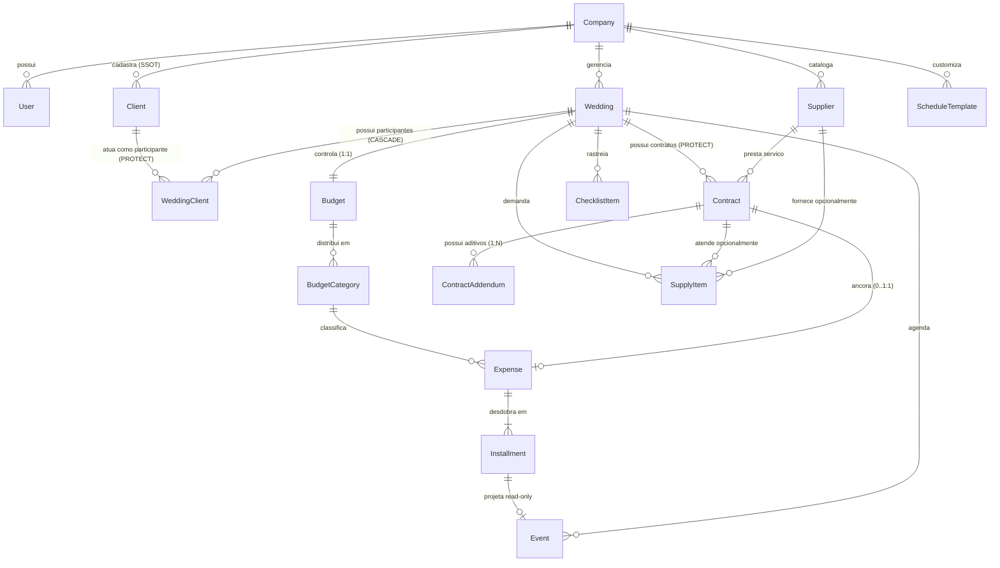
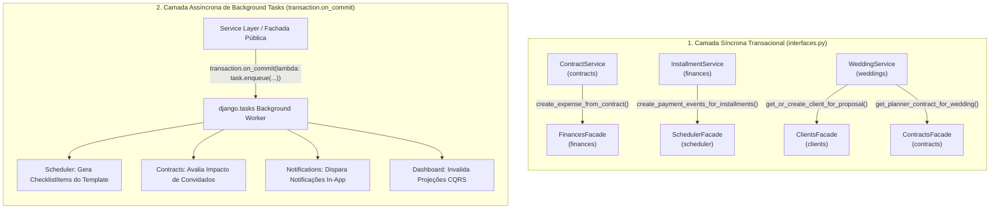

# RFC-001: Macro-Arquitetura da Plataforma SaaS, Escopo Consolidado e Redesenho de Domínios

> **Status:** 🟢 Aprovada
> **Data:** Setembro 2026
> **Autor / Decisor:** Rafael Pereira de Araújo
> **Documento de Origem:** [Documento de Modelagem de Negócio e Visão do Produto](../business-vision.md)
> **Especificação Funcional:** [Especificação de Requisitos de Software (SRS)](../requirements.md)
> **Decisões Relacionadas:** [ADR-006](../adr/006-service-layer.md) · [ADR-010](../adr/010-tolerance-zero.md) · [ADR-016](../adr/016-pragmatic-multi-tenancy.md) · [ADR-030](../adr/030-rich-domain-model-service-layer.md) · [ADR-031](../adr/031-inter-module-communication.md)

---

## 1. Resumo Executivo (Summary)

Esta RFC estabelece a **Macro-Arquitetura**, o **Escopo Consolidado** e o **Redesenho Estrutural de Bounded Contexts** do *Wedding Management System* para sua versão madura em produção.

A proposta consolida três avanços arquiteturais fundamentais:
1. **Redesenho do Ciclo de Vida do Negócio:** Incorporação formal da fase pré-contratual de captação e viabilidade (`PROPOSTA`), permitindo à assessoria cerimonial simular orçamentos dinâmicos e registrar a proposta de honorários antes da efetivação do casamento (`PLANEJAMENTO`).
2. **Refinamento de Entidades e Linguagem Ubíqua (DDD):**
   - Unificação do contrato de assessoria cerimonial no modelo único `Contract` com discriminador `contract_type="PLANNER"` gerenciado em `apps.contracts` e acessado via `apps.contracts.interfaces` (descartando a entidade separada `PlannerContract`);
   - Estabelecimento de `apps.clients` como a **Única Fonte da Verdade (SSOT)** cadastral de clientes e da entidade associativa `WeddingClient` como elo com o casamento;
   - Desacoplamento de termos aditivos contratuais em entidade filha própria (`ContractAddendum`), superando o auto-relacionamento recursivo;
   - Renomeação semântica de `Task` para `ChecklistItem`, eliminando a ambiguidade com tarefas assíncronas do Django (`django.tasks`);
   - Emancipação do módulo de suprimentos físicos (`SupplyItem`), incorporando 3 dimensões de escopo desejado/descartado com motivo obrigatório, cotação e entrega física.
3. **Comunicação Inter-Módulos Híbrida & Descarte do Event Bus:** Harmonização entre **Fachadas Síncronas Transacionais** (`interfaces.py` para mutações ACID imediatas) e **Tarefas Assíncronas Coordenadas** despachadas pós-commit (`transaction.on_commit` + `django.tasks`), descartando o barramento genérico de eventos EDA em favor de chamadas explícitas e rastreáveis.

---

## 2. Contexto & Motivação (Motivation)

### 2.1. O Ponto de Partida e a Dívida Histórica
Na concepção inicial do projeto durante o curso técnico, a solução operava como um monólito Django com templates HTML e formulários acoplados. Na transição para a arquitetura decoupled (Django Ninja REST + React 19), diversas entidades foram agrupadas sob o módulo `logistics` para evitar **imports circulares** entre modelos que ainda não possuíam uma camada clara de interfaces públicas e eventos de domínio.

Esse agrupamento pragmático gerou quatro pontos de atrito:
- **Sobrecarga no Módulo de Logística:** O app `logistics` acumulou a gestão cadastral de fornecedores, a guarda de contratos jurídicos em PDF no Cloudflare R2, o cálculo de aditivos e o checklist de materiais físicos, misturando *Procurement* com *Operações de Campo*.
- **Endpoint Monolítico Transacional (`/contracts/full/`):** Tentativa de criar em um único disparo HTTP o contrato, os arquivos, a lista de itens físicos e o desdobramento financeiro de parcelas, gerando sobrecarga cognitiva e formulários excessivamente complexos.
- **Ausência da Etapa Pré-Casamento:** O sistema forçava o casamento a nascer já em `PLANEJAMENTO`, obrigando a cerimonialista a criar "casamentos fictícios" apenas para apresentar simulações orçamentárias aos noivos em reuniões preliminares.
- **Colisão Semântica de Nomenclatura:** A entidade `Task` no módulo `scheduler` gerava constantes dúvidas de equipe em relação às tarefas assíncronas do framework (`django.tasks`).

### 2.2. Metas de Design
- Refletir fielmente o fluxo de vida real da cerimonialista desde o primeiro contato comercial até o encerramento do evento.
- Estruturar o sistema em Bounded Contexts com responsabilidades de alta coesão e baixo acoplamento.
- Estabelecer contratos formais de comunicação (síncronos e assíncronos) auditáveis pelo `Tach`.
- Preservar a fundação de **Tolerância Zero Contábil (ADR-010)**, isolamento multi-tenant pragmático e infraestrutura cloud serverless de baixo custo (OpEx mínimo).

---

## 3. Fluxo Operacional de Ponta a Ponta (End-to-End User Journey)

O sistema modela a jornada de trabalho da assessoria cerimonial dividida em seis fases cronológicas encadeadas:

```mermaid
flowchart TD
    subgraph F1["Fase 1: Captação & Simulação (PROPOSTA)"]
        A1["Briefing com o Casal (Nomes, Data Estimada, Teto Previsto)"]
        A2["Simulação Orçamentária Dinâmica com Presets de Categoria"]
        A3["Emissão da Proposta de Honorários da Assessoria"]
    end

    subgraph F2["Fase 2: Formalização & Kickoff (PLANEJAMENTO)"]
        B1["Assinatura do Contrato de Assessoria (Contract: PLANNER via interfaces.py)"]
        B2["Efetivação: Ativação do Teto Oficial (Baseline Orçamentária Congelada)"]
        B3["Lançamento Automático dos Honorários da Assessoria em Finanças"]
        B4["Aplicação Inteligente de Template de Cronograma (Offsets D - X)"]
    end

    subgraph F3["Fase 3: Escopo & Contratações Iterativas"]
        C1["Mapeamento de SupplyItems (Desejados vs Descartados com Motivo)"]
        C2["Contratação de Fornecedores Homologados (Validação CNPJ Módulo 11)"]
        C3["Assinatura de Contrato (PDF no R2) → Gera Despesa e Parcelas com Tolerância Zero"]
        C4["Reajustes Formais via Termos Aditivos (ContractAddendum)"]
    end

    subgraph F4["Fase 4: Acompanhamento de Prazos e Agenda"]
        D1["Gestão de ChecklistItems Operacionais com Checkbox"]
        D2["Agenda de Events com Detecção de Conflitos (Soft Overlap)"]
        D3["Varredura Diária de Parcelas Vencidas via Cron (Status OVERDUE)"]
        D4["Emissão Contínua de Relatórios Parciais para Reuniões com os Noivos"]
    end

    subgraph F5["Fase 5: Operação de Campo (EM_ANDAMENTO)"]
        E1["Reta Final (Gatilho Configurável de Dias Pré-Evento)"]
        E2["Roteiro de Montagem Minuto-a-Minuto para Fornecedores"]
        E3["Conferência Física de SupplyItems na Portaria do Salão"]
    end

    subgraph F6["Fase 6: Pós-Evento & Encerramento (CONCLUIDO)"]
        G1["Conferência de Quebras, Sobras e Estornos de Consignação"]
        G2["Emissão do Relatório Executivo Final em PDF e Planilha Excel"]
        G3["Conclusão Auditada do Casamento (Guard de Data Oficial)"]
    end

    F1 --> F2 --> F3 --> F4 --> F5 --> F6
```

---

## 4. Redesenho dos Bounded Contexts & Modelagem de Domínio

O sistema é particionado em Bounded Contexts especializados:

### 4.1. Domínio de Clientes (`apps.clients`)
- **Papel:** **Única Fonte da Verdade (SSOT)** cadastral de pessoas físicas vinculadas à assessoria.
- **Entidade `Client`:** Armazena dados de contato e identificação civil (nome, CPF, e-mail, telefone).
- **Associação `WeddingClient` (`apps.weddings`):** Conecta o `Client` ao `Wedding` com papéis semânticos (`RoleChoices`: `BRIDE`, `GROOM`, `FINANCIAL_PAYER`, `LEGAL_REPRESENTATIVE`, `OTHER`) e rastreia o signatário principal (`is_primary_signatory`).

### 4.2. Domínio de Casamentos (`apps.weddings`)
- **Raiz de Agregação:** `Wedding`.
- **Máquina de Estados:** `PROPOSTA` $\to$ `PLANEJAMENTO` $\to$ `EM_ANDAMENTO` $\to$ `CONCLUIDO` (com caminho para `CANCELADO` e ação de `REABRIR`).
- **Atributos de Contratante:** Projeções sincronizadas com a entidade associativa `WeddingClient`.
- **Contrato de Honorários Unificado:**
  - A criação de uma entidade separada (`PlannerContract`) foi descartada em favor do modelo único `Contract` com `contract_type="PLANNER"` em `apps.contracts`.
  - **Isolamento Estrito (ADR-031):** O acesso a esse contrato a partir de `apps.weddings` ocorre **exclusivamente via fachada pública `apps.contracts.interfaces`** (`get_planner_contract_for_wedding`, `save_planner_contract_for_wedding`), sem qualquer importação direta de models.

### 4.3. Domínios de Contratações (`apps.contracts`) e Fornecedores (`apps.suppliers`)
- **Raiz de Agregação:** `Contract` (em `contracts`) e `Supplier` (em `suppliers`).
- **Entidades:**
  - `Supplier` (`apps.suppliers`): Catálogo corporativo compartilhado em nível de tenant (`Company`) com validação algorítmica de CNPJ (Módulo 11).
  - `Contract` (`apps.contracts`): Instrumento jurídico com fornecedores terceiros ou honorários da assessoria vinculado a um `Wedding`. Ciclo de vida: `DRAFT` $\to$ `PENDING` $\to$ `SIGNED` $\to$ `CANCELED`.
  - `ContractAddendum` **(Entidade Filha Dedicada):**
    - Substitui o auto-relacionamento recursivo (`parent = ForeignKey('self')`);
    - Relação 1:N estrita com `Contract` (`on_delete=CASCADE`);
    - Atributos: `amount` (acréscimo de valor), `signed_date`, `pdf_file`, `justification`, `status`;
    - O contrato-pai expõe: `base_amount`, `addendums_total` e `effective_amount` (\(V_{\text{efetivo}} = V_{\text{base}} + \sum V_{\text{aditivos}}\)).

### 4.4. Domínio Financeiro (`apps.finances`)
- **Raiz de Agregação:** `Budget`.
- **Invariante Central:** **Tolerância Zero Centesimal (ADR-010 / BR-F01)**.
- **Entidades e Regras:**
  - `Budget`: No estado `PROPOSTA`, atua como simulação; no estado `PLANEJAMENTO`, atua como Linha de Base congelada.
  - `BudgetCategory`: Alocação temática. Suporta presets globais da empresa, distribuição dinâmica via percentuais sugeridos e criação livre antes e depois da ativação (respeitando a conservação de teto `BR-F04`).
  - `Expense`: Registro de compromisso formal. Honorários da assessoria são gerados na ativação do casamento; contratos de terceiros geram despesas vinculadas.
  - `Installment`: Cotas de pagamento com datas de vencimento, centavos ajustados na última parcela, máquina de estados (`PENDING`, `PAID`, `OVERDUE`) e ações de quitação e reversão (`mark_as_paid` e `unmark_as_paid`).

### 4.5. Domínio de Logística de Materiais & Suprimentos (`apps.logistics`)
- **Raiz de Agregação:** `SupplyItem` (renomeado de `Item`).
- **Ciclo em 3 Dimensões:**
  1. *Escopo:* `scope_status` (`DESIRED`, `INCLUDED`, `DISCARDED`). Se descartado, exige obrigatoriamente preenchimento de `rejection_reason`.
  2. *Contratação:* `procurement_status` (`A_COTAR`, `EM_NEGOCIACAO`, `CONTRATADO`), vinculado opcionalmente ao `Contract` e `Supplier`.
  3. *Operação de Campo:* `delivery_status` (`PENDING`, `DELIVERED`, `RETURNED`), conferido no dia do evento.

### 4.6. Domínio de Cronograma, Agenda & Checklist (`apps.scheduler`)
- **Entidades:**
  - `Event`: Compromisso com data/hora de início e término (`start_time`, `end_time`) e validação de conflitos suaves (*Soft Overlap* `BR-S03`).
  - `ChecklistItem` **(Renomeado de `Task`):** Pendência operacional com data limite (`due_date`), prioridade e checkbox (`is_completed`), eliminando colisão de nomes com `django.tasks`.
  - `ScheduleTemplate`: Templates de cronograma baseados em offsets relativos ($D - X$). Presets de sistema protegidos + templates customizados criados pela assessoria.
  - *Inteligência de Prazos:* Validação de compatibilidade temporal antes da aplicação do template e reajuste automático de marcos retroativos para a primeira semana em casamentos com prazos comprimidos.

### 4.7. Domínios de Inteligência e Plataforma
- **`apps.dashboard`:** Agregações SQL pré-computadas em quatro eixos analíticos sem N+1 (*Anti-Data-Stitching*).
- **`apps.reporting`:** Exportação em lote de DTOs consolidados para PDF diagramado em dois passos (ReportLab) e planilhas Excel (.xlsx) emitidos sob demanda em qualquer fase.
- **`apps.notifications`:** Alertas in-app com badges operacionais e despacho não-bloqueante.

---

## 5. Comunicação Inter-Módulos Híbrida (ADR-031)

A arquitetura adota um modelo híbrido rigoroso: **Interfaces Síncronas** (`interfaces.py`) para consistência ACID imediata e **Tarefas Assíncronas Coordenadas** (`django.tasks`) enfileiradas pós-commit (`transaction.on_commit`) através das próprias fachadas públicas para efeitos colaterais e reações entre contextos.

> **Decisão Homologada: Descarte do Event Bus Genérico (EDA):** A introdução de um barramento genérico de eventos intermediário (Event Bus / Signals / classes em `events.py`) foi formalmente descartada. Para maximizar a previsibilidade e manter um código estritamente explícito (guard-rails do projeto), as operações assíncronas são disparadas como tarefas coordenadas (`django.tasks`), expostas e encapsuladas nas fachadas públicas de cada app (`apps.<contexto>.interfaces.enqueue_*`).

### 5.1. Contratos de Fachada Síncrona (`interfaces.py`)
Utilizados exclusivamente quando duas operações precisam suceder ou falhar atomicamente na mesma transação de banco de dados (`@transaction.atomic`):
- `apps.clients.interfaces.get_or_create_client_for_proposal(company, name, cpf, email, phone)`: Vincula clientes ao evento com validação multi-tenant.
- `apps.contracts.interfaces.get_planner_contract_for_wedding(company, wedding)` / `save_planner_contract_for_wedding(company, wedding, payload)`: Governança do contrato de honorários unificado.
- `apps.finances.interfaces.freeze_budget_baseline_for_wedding(company, wedding)`: Congela a linha de base orçamentária na conversão para planejamento.
- `apps.finances.interfaces.create_expense_from_contract(company, payload, contract_uuid)`: Garante que um contrato assinado gere imediatamente sua despesa correspondente.
- `apps.finances.interfaces.add_expense_adjustment_from_addendum(company, contract_uuid, addendum_amount)`: Atualiza o compromisso financeiro ao formalizar um aditivo.
- `apps.scheduler.interfaces.create_payment_events_for_installments(company, expense, installments)`: Projeta parcelas como eventos de agenda somente-leitura.

### 5.2. Catálogo Canônico de Tarefas Assíncronas Coordenadas (`django.tasks`)
Disparadas após a confirmação transacional no banco via `transaction.on_commit`:

| Tarefa Assíncrona | Módulo Origem | Módulos Impactados | Efeito Operacional |
| :--- | :--- | :--- | :--- |
| **`on_wedding_activated_task`** | `weddings` | `scheduler`, `notifications` | Dispara em background a geração dos `ChecklistItems` do template selecionado sem travar a requisição HTTP da assessoria. |
| **`on_guest_count_changed_task`** | `weddings` | `contracts`, `notifications` | Avalia contratos com fornecedores sensíveis à contagem de convidados e notifica a assessoria para avaliar aditivos de ajuste. |
| **`on_wedding_canceled_task`** | `weddings` | `scheduler`, `notifications` | Cancela em lote tarefas e eventos futuros e notifica a equipe do cancelamento. |
| **`on_contract_signed_task`** | `contracts` | `logistics`, `notifications` | Habilita os `SupplyItems` contemplados no contrato para acompanhamento de entrega e emite notificação in-app. |
| **`on_contract_addendum_signed_task`** | `contracts` | `notifications`, `dashboard` | Notifica a equipe sobre a formalização do aditivo e atualiza os indicadores analíticos do painel. |
| **`on_installment_overdue_task`** | `finances` | `notifications`, `dashboard` | Disparado pelo cron diário para emitir alertas de inadimplência e atualizar badges de alerta financeiro. |
| **`on_supply_item_delivered_task`** | `logistics` | `dashboard` | Atualiza o percentual de suprimentos recebidos no painel operacional do casamento no dia do evento. |

---

## 6. Estratégia de Implementação e Migração Incremental

Para mitigar riscos em ambiente de produção e assegurar continuidade operacional, a evolução técnica é dividida em **quatro ondas incrementais**:

```mermaid
gantt
    title Cronograma de Implementação Incremental (RFC-001)
    dateFormat  X
    axisFormat Semana %s
    section Onda 1: Documentação & Design
    Formalização RFC-001 & SRS            :active, 0, 1
    section Onda 2: Domínio Weddings
    Status PROPOSTA & Contrato Unificado : 1, 2
    section Onda 3: Contratos & Aditivos
    Separação de ContractAddendum        : 2, 3
    section Onda 4: Scheduler & Suprimentos
    Renomeação ChecklistItem & SupplyItem: 3, 4
```

1. **Onda 1 (Design & Documentação — Presente Fase):** Consolidação da RFC-001, atualização dos hubs de domínio (`domains/`), paridade com a Visão de Negócio (`business-vision.md`) e SRS (`requirements.md`).
2. **Onda 2 (Ciclo Comercial & Casamentos):** Adição do valor `PROPOSTA` nas choices de `Wedding`, unificação do contrato de assessoria (`contract_type='PLANNER'`) em `Contract` consumido via `apps.contracts.interfaces`, consolidação de `apps.clients` como SSOT e endpoint `/convert-to-planning/`.
3. **Onda 3 (Contratos e Aditivos):** Criação da tabela `contract_addendums`, migração dos registros que possuíam `parent_id` e remoção da coluna auto-relacional obsoleta.
4. **Onda 4 (Scheduler e Suprimentos):** Renomeação de tabela e modelo de `Task` para `ChecklistItem`, inclusão de campos de escopo (com justificativa de recusa) em `SupplyItem`, e ativação das tarefas assíncronas coordenadas via `django.tasks`.

---

## 7. Decisão e Homologação

A presente RFC consolida a visão técnica definitiva para a sustentação, escalabilidade e valor de mercado do **Wedding Management System**, servindo como referência norteadora para as próximas sprints de engenharia.
