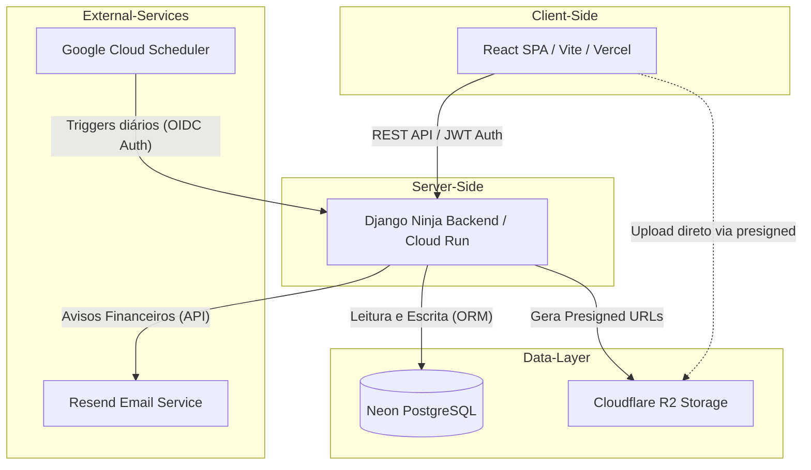

# Diagrama de Arquitetura (System Overview)

Este diagrama representa a visão de alto-nível dos contêineres e tecnologias que dão fundação à aplicação, evidenciando as interconexões da nossa API.

```mermaid
graph TD
    subgraph Client-Side
        A[React SPA / Vite / Vercel]
    end

    subgraph Server-Side
        B[Django Ninja Backend / Cloud Run]
    end

    subgraph Data-Layer
        C[(Neon PostgreSQL)]
        D[Cloudflare R2 Storage]
    end

    subgraph External-Services
        E[Google Cloud Scheduler]
        F[Resend Email Service]
    end

    A -- "REST API / JWT Auth" --> B
    B -- "Leitura e Escrita (ORM)" --> C
    B -- "Gera Presigned URLs" --> D
    A -. "Upload direto via presigned" .-> D
    E -- "Triggers diários (OIDC Auth)" --> B
    B -- "Avisos Financeiros (API)" --> F
```
