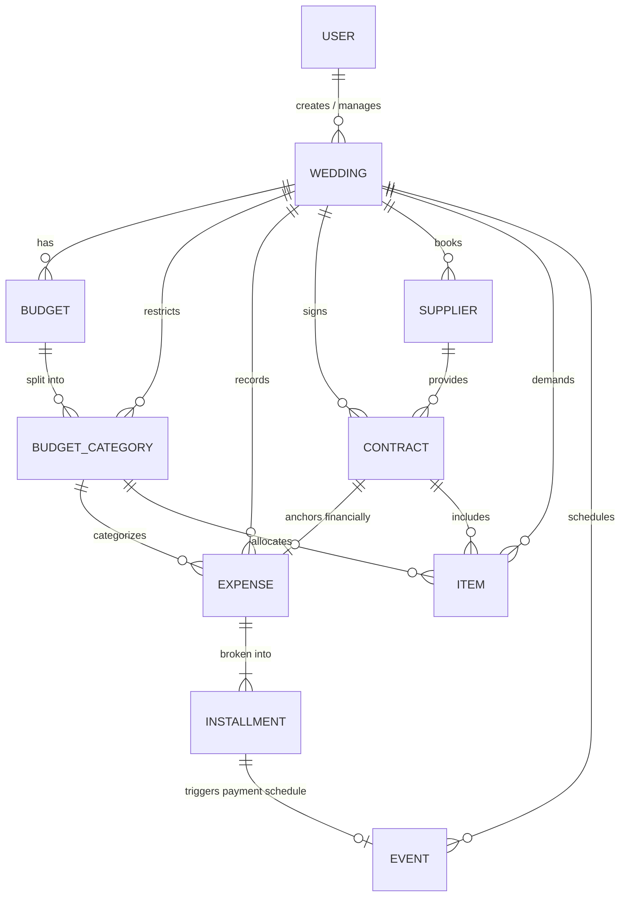

# Entity Relationship Diagram (Conceitual)

Este diagrama demonstra os dados transacionais de negócio presentes no banco de dados e as relações diretas entre eles, evidenciando o quão centralizadora é a entidade `Wedding`.

> Nota: Este não é o esquema SQL estrito; no sistema em produção aplicam-se estratégias de desnormalização defensiva através do uso de `WeddingOwnedMixin` nas entidades para segurança multi-tenant (onde várias das pontas ligam ativamente de volta a `Wedding`).
