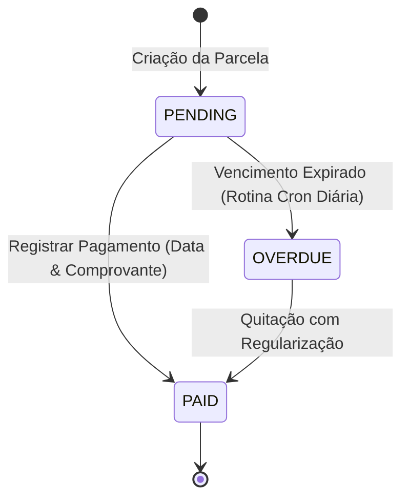

# Módulo Financeiro (Finances)

> **Categoria:** Funcionalidades & Módulos da Plataforma
> **Relacionados:** [Hub de Funcionalidades](index.md) · [Domínio Finances](../architecture/domains/finances-domain.md) · [Tolerância Zero](../architecture/adr/010-tolerance-zero.md)

O **Módulo Financeiro** é o núcleo de controle orçamentário do *Wedding Management System*. Ele permite que assessores de eventos e noivos definam o teto de gastos do casamento, distribuam verbas entre centros de custo, registrem contratos de despesa e acompanhem o fluxo de desembolsos em parcelas com precisão matemática rigorosa.

---

## Visão Geral e Capacidades

O gerenciamento orçamentário em eventos requer confiabilidade contábil absoluta. O módulo foi arquitetado para eliminar ambiguidades no fluxo de caixa, prevenir distorções cumulativas de arredondamento e automatizar a detecção de pagamentos pendentes ou atrasados.

Principais capacidades operacionais:

- **Orçamento Mestre Unificado:** Definição de teto orçamentário global por casamento.
- **Categorização Estruturada:** Distribuição proporcional do orçamento em centros de custo (ex.: Buffet, Espaço, Decoração, Fotografia).
- **Contratos & Despesas:** Registro detalhado de compromissos financeiros vinculados ou não a fornecedores cadastrados.
- **Plano de Parcelamento Flexível:** Divisão de despesas em parcelas com controle de datas de vencimento, formas de pagamento e status em tempo real.
- **Detecção Automatizada de Atrasos:** Rotina diária de auditoria temporal que identifica débitos expirados e atualiza a situação financeira do evento.

---

## Funcionalidades Detalhadas

### 1. Tolerância Zero & Integridade Contábil

No planejamento de casamentos, frações de centavos acumuladas em contratos de dezenas de fornecedores podem gerar divergências contábeis críticas. Por essa razão, a plataforma adota o princípio de **Tolerância Zero** financeira:

- **Precisão Decimal Estrita:** Todos os cálculos monetários utilizam o tipo `Decimal` do Python e campos `DecimalField(max_digits=12, decimal_places=2)` no PostgreSQL Neon.
- **Prevenção de Drift Contábil:** A soma dos valores nominais de todas as parcelas de uma despesa DEVE ser rigorosamente idêntica ao valor total contratado (`total_amount`). Se houver discrepância de até R$ 0,01, a transação é rejeitada pelo Service Layer com uma exceção `DomainIntegrityError`.
- **Integridade Referencial com Proteção:** Despesas e orçamentos vinculados a registros de auditoria e notas fiscais utilizam `models.PROTECT` nas chaves estrangeiras, impedindo que entidades financeiras com histórico sejam deletadas em cascata.

### 2. Gestão de Parcelas & Detecção de Atrasos

Cada despesa pode ser quitada à vista ou dividida em múltiplos desembolsos. O ciclo de vida de uma parcela é gerenciado por uma máquina de estados finita:

- **`PENDING` (Pendente):** Parcela cadastrada cujo prazo de vencimento ainda não expirou (`due_date >= hoje`).
- **`PAID` (Paga):** Parcela liquidada e confirmada pelo assessor ou casal, com data de quitação e comprovante registrados.
- **`OVERDUE` (Em Atraso):** Parcela não quitada cuja data de vencimento é estritamente anterior à data atual (`due_date < hoje`).

A transição para o estado `OVERDUE` é executada automaticamente pelo comando de backend `python manage.py mark_overdue_installments`, orquestrado via job cron diário no **Google Cloud Scheduler** autenticado por OIDC.

### 3. Distribuição Orçamentária por Categoria

Para assegurar que o casal não ultrapasse o limite financeiro estipulado, o sistema oferece controle visual e algorítmico da verba:

- **Alocação Percentual e Nominal:** Definição de limites orçamentários por categoria (`allocated_amount`).
- **Monitoramento em Tempo Real:** O dashboard consolida instantaneamente:
    1. **Teto Total:** Valor global aprovado para o casamento.
    2. **Comprometido:** Soma dos contratos e despesas já formalizados.
    3. **Pago:** Total de parcelas efetivamente liquidadas.
    4. **Saldo Remanescente:** Valor ainda disponível para novas contratações.
- **Alertas de Estouro de Orçamento:** Identificação visual imediata quando a soma das despesas de uma categoria ultrapassa a cota estipulada.

---

## Aprofundamento Técnico & Deep Dive

Para engenheiros e desenvolvedores que necessitam estender ou auditar o módulo financeiro, consulte as especificações técnicas detalhadas:

### Regras de Negócio (Business Rules)
- [Regras de Integridade Contábil (BR-F02 a BR-F05)](../architecture/business-rules/finances/financial-integrity-rules.md): Detalhamento das travas de integridade matemática, invariantes cronológicas e integridade referencial.
- [Lógica de Detecção de Parcelas Atrasadas](../architecture/business-rules/finances/installment-overdue-logic.md): Algoritmo e especificações da rotina de transição de status `mark_overdue_installments`.
- [Distribuição Orçamentária por Categoria](../architecture/business-rules/finances/budget-category-distribution.md): Regras de cálculo de percentuais e restrições de alocação de verbas.

### Decisões Arquiteturais (ADRs)
- [ADR-010: Tolerância Zero Financeira](../architecture/adr/010-tolerance-zero.md): Racional da escolha por tipos Decimais e rejeição estrita de arredondamentos cumulativos.
- [ADR-023: Desacoplamento entre Scheduler, Finances e Weddings](../architecture/adr/023-desacoplamento-modulos-scheduler-finances-weddings.md): Isolamento de dependências e sincronização orientada a eventos.

### Modelos de Dados & APIs
- [Domínio & Modelos de Finanças](../architecture/domains/finances-domain.md): Dicionário de dados, entidades e regras do módulo financeiro.
- [Especificação de Contratos OpenAPI](../reference/api/openapi-schema.md): Endpoints de mutação (`POST /api/v1/finances/budgets/`, `POST /api/v1/finances/expenses/`) e query selectors.
