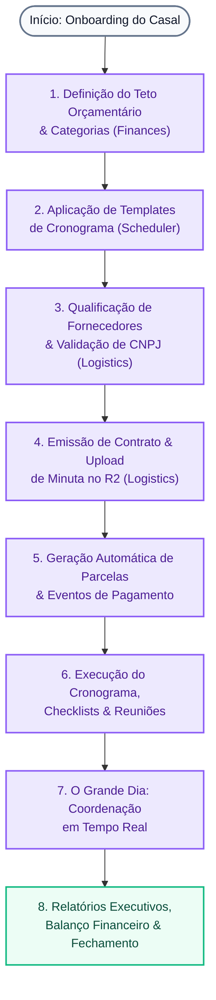

# Hub de Funcionalidades da Plataforma

> **Categoria:** Funcionalidades & Módulos da Plataforma
> **Relacionados:** [Visão Geral da Arquitetura](../architecture/index.md) · [Domínios da Plataforma](../architecture/domains/index.md) · [Hub de APIs & Contratos](../reference/api/index.md)

O **Wedding Management System** é uma plataforma SaaS multi-tenant concebida especificamente para resolver a complexidade operacional de assessorias de eventos e casais. O sistema unifica o planejamento financeiro com precisão centesimal, o controle logístico de contratos e fornecedores com armazenamento em nuvem e a gestão temporal de cronogramas e checklists com motor de recorrência inteligente.

---

## Módulos Centrais da Plataforma

-   :material-cash-multiple:{ .lg .middle } **Módulo Financeiro (Finances)**

    ---

    Controle orçamentário de alta precisão com garantia de **Tolerância Zero** contábil. Gerencie tetos orçamentários, distribuição por categorias, contratos de despesas e parcelamentos com detecção automatizada de inadimplência via cron.

    - **Precisão:** Decimal centesimal sem desvios de arredondamento
    - **Automação:** Transição de status para parcelas vencidas (`OVERDUE`)
    - **Visibilidade:** Gráficos interativos de comprometimento orçamentário

    [:octicons-arrow-right-24: Explorar Módulo Financeiro](finances.md){ .md-button .md-button--primary }

-   :material-truck-delivery:{ .lg .middle } **Módulo de Logística & Contratos**

    ---

    Catálogo corporativo de fornecedores com validação estrita de CNPJ (Módulo 11), upload direto de minutas contratuais em PDF para o **Cloudflare R2** via Presigned URLs seguras e rastreamento de aditivos em árvore pai-filho.

    - **Validação:** Verificação algorítmica de CNPJs de fornecedores
    - **Performance:** Uploads sem sobrecarga na CPU/memória da API
    - **Auditoria:** Histórico imutável de termos aditivos contratuais

    [:octicons-arrow-right-24: Explorar Logística & Fornecedores](logistics.md){ .md-button .md-button--primary }

-   :material-calendar-clock:{ .lg .middle } **Agenda & Cronograma (Scheduler)**

    ---

    Motor temporal completo para sincronizar marcos pré-wedding, checklist do dia do casamento e tarefas pós-evento. Possui suporte a templates canônicos, eventos recorrentes e proteção *read-only* de parcelas.

    - **Templates:** Geração automática de prazos baseada na data do evento
    - **Recorrência:** Motor para reuniões e alinhamentos periódicos
    - **Proteção:** Bloqueio de alteração em eventos de pagamento

    [:octicons-arrow-right-24: Explorar Agenda & Cronograma](scheduler.md){ .md-button .md-button--primary }

---

## Fluxo Ponta a Ponta: A Jornada do Casamento

A plataforma orquestra todas as etapas do ciclo de vida de um evento, garantindo consistência transacional entre as decisões financeiras, os compromissos com prestadores de serviço e o cumprimento dos prazos:

---

## Matriz de Recursos e Integrações

A tabela abaixo resume as capacidades de cada módulo, suas integrações e os mecanismos de segurança aplicados:

| Recurso | Módulo Responsável | Tecnologias Chave | Mecanismo de Garantia |
| :--- | :--- | :--- | :--- |
| **Precisão Orçamentária** | [Finances](finances.md) | `Decimal(12, 2)`, PostgreSQL | Bloqueio de mutações em caso de divergência de centavos |
| **Rotina de Inadimplência** | [Finances](finances.md) | Cloud Scheduler, OIDC | Varredura diária de parcelas não quitadas |
| **Validação de Documento** | [Logistics](logistics.md) | Validador Módulo 11 (BR) | Rejeição imediata de CNPJs inválidos ou fraudulentos |
| **Custódia de Arquivos** | [Logistics](logistics.md) | Cloudflare R2, Presigned URLs | Upload direto via cliente com assinatura HMAC de curta duração |
| **Árvore de Aditivos** | [Logistics](logistics.md) | Auto-relacionamento com `PROTECT` | Impedimento de deleção acidental de contratos-base |
| **Timeline Inteligente** | [Scheduler](scheduler.md) | Motor de offsets baseados em datas | Auto-cálculo de marcos a partir da data de casamento |
| **Trava Contábil na Agenda**| [Scheduler](scheduler.md) | Service Layer Read-Only Guard | Eventos financeiros não podem ser alterados ou excluídos na agenda |

---

## Navegação e Aprofundamento

Para explorar os detalhes arquiteturais de cada componente ou inspecionar as especificações de API da plataforma:

- **Arquitetura & Design de Domínios:** Acesse o [MOC de Domínios da Plataforma](../architecture/domains/index.md) para compreender a modelagem dos Bounded Contexts.
- **Padrões de Implementação:** Consulte os [Padrões Arquiteturais](../architecture/concepts/service-layer-pattern.md) como Service Layer, CQRS e Isolamento Multi-Tenant.
- **Referência de APIs:** Explore o [Hub de APIs](../reference/api/index.md) e o [Contrato OpenAPI](../reference/api/openapi-schema.md) gerado pelo Django Ninja.
