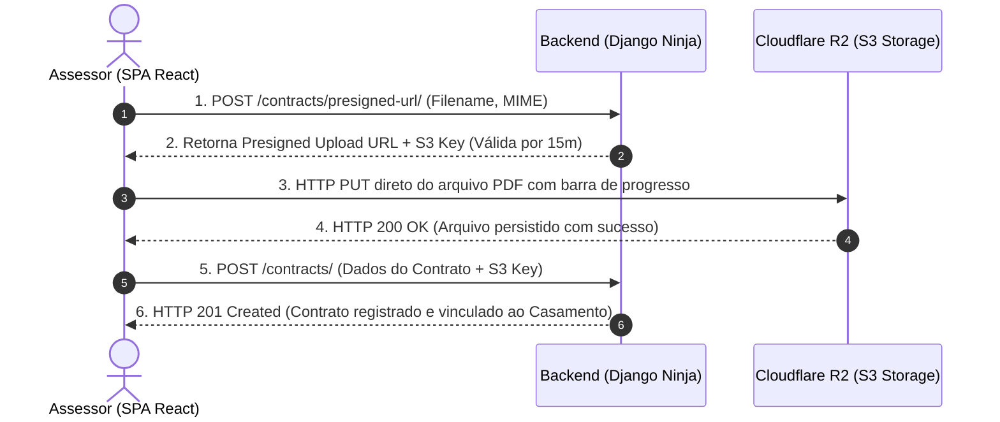

# Módulo de Logística e Contratos (Logistics)

> **Categoria:** Funcionalidades & Módulos da Plataforma
> **Relacionados:** [Hub de Funcionalidades](index.md) · [Domínio Logistics](../architecture/domains/logistics-domain.md) · [Upload de Contratos R2](../architecture/concepts/contract-pdf-upload-r2-flow.md)

O **Módulo de Logística** do *Wedding Management System* centraliza o relacionamento corporativo com fornecedores, a guarda de minutas contratuais em PDF e o rastreamento dos itens e serviços contratados para cada evento. A arquitetura foi desenhada para garantir segurança documental, alta performance de upload sem consumo desnecessário de computação no backend e flexibilidade jurídica através de termos aditivos.

---

## Visão Geral e Capacidades

Um casamento de médio ou grande porte envolve dezenas de contratos com empresas distintas (espaço de festas, buffet, fotógrafos, músicos, decoradores, floristas). A plataforma resolve os desafios de conformidade cadastral e custódia digital desses acordos:

- **Catálogo Corporativo de Fornecedores:** Cadastro centralizado de pessoas jurídicas e físicas com validação cadastral rigorosa.
- **Custódia Segura de PDFs:** Armazenamento seguro de minutas contratuais assinadas em nuvem com links de acesso efêmeros.
- **Rastreamento de Itens & Entregáveis:** Detalhamento dos serviços e bens contratados por contrato ou aditivo.
- **Gestão de Termos Aditivos:** Suporte a contratos adicionais (reajustes, prorrogações ou expansão de escopo) vinculados ao contrato original.

---

## Funcionalidades Detalhadas

### 1. Validação Estrita de CNPJ

Para evitar fornecedores fraudulentos, erros de digitação e duplicidade no catálogo corporativo do tenant:

- **Algoritmo Módulo 11:** O backend e o frontend executam a validação dos dois dígitos verificadores (DV1 e DV2) do Cadastro Nacional da Pessoa Jurídica (CNPJ).
- **Rejeição de Sequências Repetidas:** Números falsos com caracteres idênticos (ex.: `00.000.000/0000-00`, `11.111.111/1111-11`, ..., `99.999.999/9999-99`) são sumariamente invalidados.
- **Sanitização & Formatação:** Armazenamento padronizado no banco de dados como sequência numérica de 14 dígitos, enquanto o frontend apresenta a máscara amigável `XX.XXX.XXX/XXXX-XX`.

### 2. Upload Direto de PDFs via Presigned URLs no Cloudflare R2

O upload de minutas contratuais pesadas (PDFs de 10 MB a 50 MB) representa um risco operacional para arquiteturas serverless tradicionais, onde o tráfego de binários pelo processo Django consome memória, bloqueia workers e encarece a infraestrutura.

A plataforma implementa a estratégia de **Presigned URLs**:

1. O cliente (SPA React) solicita uma URL de upload ao backend via `POST /api/v1/logistics/contracts/presigned-url/`.
2. O Django Ninja valida as permissões do tenant e gera uma URL assinada (S3 Compatible) temporária (expiração em 15 minutos) do **Cloudflare R2** com assinatura HMAC SHA-256.
3. O frontend realiza o envio binário direto (`HTTP PUT`) para o Cloudflare R2, com monitoramento de progresso no navegador.
4. Após o upload bem-sucedido, o cliente confirma o registro do contrato no backend (`POST /api/v1/logistics/contracts/`), salvando metadados e a chave de objeto (*storage key*).

### 3. Hierarquia Contratual (Contrato Principal e Aditivos Pai-Filho)

Mudanças de escopo são rotineiras no planejamento de casamentos (ex.: contratação de 50 convidados adicionais no buffet ou acréscimo de iluminação cênica na decoração). O sistema modela essa flexibilidade através de uma estrutura hierárquica pai-filho:

- **Contrato Principal (`parent_contract = None`):** Contrato mestre inicial firmado com o fornecedor.
- **Termos Aditivos (`parent_contract = Contrato`):** Acordos complementares que herdam o fornecedor e o contexto do casamento, registrando novos valores, prazos e PDFs.
- **Proteção Contra Exclusão Acidental (`models.PROTECT`):** Um contrato principal que possua termos aditivos vinculados não pode ser removido sem que os aditivos sejam previamente resolvidos, garantindo a integridade jurídica e contábil do histórico.

---

## Aprofundamento Técnico & Deep Dive

Para consultar o código-fonte, arquitetura e playbooks de manutenção do módulo de logística:

### Regras de Negócio (Business Rules)
- [Regras de Validação de CNPJ](../architecture/business-rules/logistics/cnpj-validation-rules.md): Especificação dos pesos do Módulo 11 e testes unitários com matriz de casos de teste.
- [Hierarquia de Contratos Pai-Filho](../architecture/business-rules/logistics/contract-parent-child-hierarchy.md): Relacionamentos de auto-referência e integridade referencial.
- [Máquina de Estados de Contratos](../architecture/business-rules/logistics/contract-state-machine.md): Transições válidas para contratos e itens.

### Decisões Arquiteturais (ADRs)
- [ADR-003: Por que Cloudflare R2](../architecture/adr/003-why-r2.md): Análise de custos de egresso zero e compatibilidade com a API S3.
- [ADR-004: Upload Direto via Presigned URLs](../architecture/adr/004-presigned-urls.md): Eliminação de gargalos de rede e isolamento de carga no backend Django.

### Modelos de Dados & APIs
- [Domínio & Modelos de Logística](../architecture/domains/logistics-domain.md): Esquema de fornecedores, contratos, itens e upload via R2.
- [Especificação de Contratos OpenAPI](../reference/api/openapi-schema.md): Schemas de requisição e resposta do módulo de logística.
