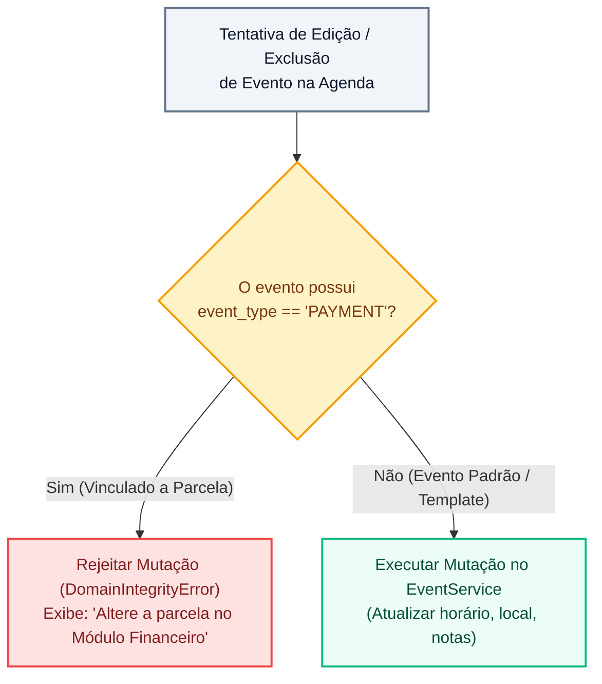

# Agenda e Cronograma do Casamento (Scheduler)

> **Categoria:** Funcionalidades & Módulos da Plataforma
> **Relacionados:** [Hub de Funcionalidades](index.md) · [Domínio Scheduler](../architecture/domains/scheduler-domain.md) · [Motor de Recorrência](../architecture/business-rules/scheduler/recurrence-rules-engine.md)

O **Módulo de Agenda e Cronograma (Scheduler)** é o centro nervoso da coordenação temporal do *Wedding Management System*. Ele organiza a jornada do evento em três dimensões: a **Agenda de Compromissos** (degustações, provas de vestido, reuniões), o **Cronograma Executivo** (linha do tempo estruturada por fases) e o **Checklist Operacional** de tarefas com responsáveis e prazos.

---

## Visão Geral e Capacidades

O planejamento de um casamento demanda o acompanhamento de centenas de marcos temporais distribuídos ao longo de meses ou anos. O módulo automatiza esse planejamento através de:

- **Cronogramas Automatizados:** Geração instantânea de dezenas de marcos e tarefas baseados na data estipulada para o casamento.
- **Motor de Recorrência Temporal:** Suporte nativo a reuniões periódicas de alinhamento (semanais, quinzenais, mensais).
- **Visão Unificada de Compromissos:** Calendário interativo com distinção visual por tipo de evento (reuniões, prazos de pagamento, marcos executivos).
- **Checklist Interativo:** Controle de pendências operacionais categorizadas por fases (Planejamento Inicial, 6 Meses Antes, Semana do Evento, Dia D, Pós-Casamento).

---

## Funcionalidades Detalhadas

### 1. Aplicação de Templates de Eventos

Em vez de cadastrar manualmente cada compromisso da jornada do casal, o sistema disponibiliza templates operacionais padronizados pela assessoria:

- **Âncora Temporal (`event_date`):** Todas as datas de marcos são calculadas como deslocamentos (*offsets* em dias) relativos à data do casamento.
- **Fases do Ciclo do Evento:**
    - **Pré-Wedding:** Prazos para contratação de buffet (D-360), prova do menu (D-180), entrega dos convites (D-90), ensaio fotográfico (D-30).
    - **Semana do Evento & Dia D:** Cronograma minuto a minuto da montagem de palco, chegada da noiva, cortejo cerimonial, início do jantar e abertura da pista.
    - **Pós-Evento:** Devolução de trajes alugados (D+2), envio de cartas de agradecimento (D+15), entrega do álbum final (D+60).
- **Flexibilidade de Ajustes:** Após a aplicação do template, cada compromisso gerado pode ter seu horário ou data ajustado individualmente para refletir as particularidades do casal.

### 2. Motor de Recorrência Inteligente

Assessorias de ponta realizam alinhamentos periódicos com os noivos e comissões de fornecedores. O módulo de agendamento incorpora um motor de recorrência robusto:

- **Padrões Suportados:** Frequências diárias, semanais, quinzenais ou mensais.
- **Controle de Limites:** Definição de data limite ou quantidade máxima de ocorrências para evitar eventos infinitos no banco de dados.
- **Consciência de Fuso Horário:** Normalização estrita para o fuso local (`America/Sao_Paulo` / UTC) para garantir que horários de compromissos não sofram deslocamentos indesejados no horário de verão.

### 3. Bloqueio Read-Only de Eventos de Pagamento

Para assegurar uma visão 360° do evento, as parcelas financeiras registradas no [Módulo Financeiro](finances.md) geram automaticamente compromissos visuais na agenda com a classificação `event_type = 'PAYMENT'`.

Para resguardar a integridade contábil do sistema:

- **Imutabilidade na Agenda:** Eventos de pagamento são estritamente **somente leitura** (*read-only*) no contexto da agenda.
- **Guarda Arquitetural no Service Layer:** O `EventService` bloqueia qualquer tentativa de mutação direta (edição de valor, alteração de data ou exclusão) enviada pelas rotas de agendamento para eventos do tipo pagamento.
- **Ponto Único da Verdade (SSOT):** Para alterar ou prorrogar uma data de vencimento de parcela, o assessor DEVE realizar a operação no módulo Financeiro, que por sua vez propaga a atualização para o calendário.

---

## Aprofundamento Técnico & Deep Dive

Para engenheiros de software e analistas técnicos, consulte os documentos de suporte arquitetural:

### Regras de Negócio (Business Rules)
- [Motor de Regras de Recorrência](../architecture/business-rules/scheduler/recurrence-rules-engine.md): Especificação de intervalos, regras de cálculo e limites computacionais de expansão.
- [Guarda Read-Only de Eventos de Pagamento (BR-S01)](../architecture/business-rules/scheduler/payment-event-readonly-guard.md): Implementação do decorator e travas de integridade no `EventService`.
- [Templates de Cronograma do Casamento](../architecture/business-rules/weddings/wedding-schedule-templates.md): Especificação dos esquemas de templates e offsets.

### Decisões Arquiteturais (ADRs)
- [ADR-005: Cloud Scheduler & OIDC](../architecture/adr/005-oidc-scheduler.md): Integração assíncrona segura para execução de tarefas agendadas.
- [ADR-023: Desacoplamento de Módulos (Scheduler, Finances, Weddings)](../architecture/adr/023-desacoplamento-modulos-scheduler-finances-weddings.md): Padrão de comunicação desacoplado entre domínios.

### Modelos de Dados & APIs
- [Domínio & Modelos do Scheduler](../architecture/domains/scheduler-domain.md): Estrutura de dados de compromissos, tarefas e checklist operacional.
- [Especificação de Contratos OpenAPI](../reference/api/openapi-schema.md): Schemas dos endpoints do Scheduler (`/api/v1/scheduler/events/`, `/api/v1/scheduler/tasks/`).
