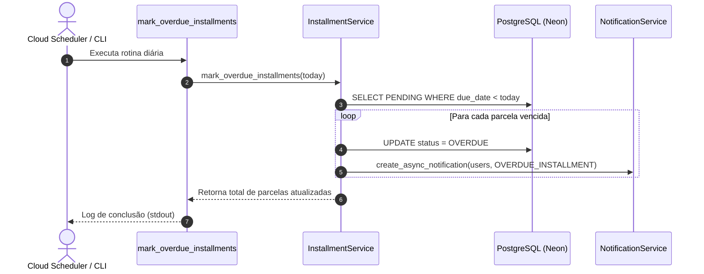

# Como Executar a Rotina de Marcação de Parcelas Vencidas

> **Categoria:** [backend](../../reference/architecture-standards/index.md) | [installment-overdue-logic](../../architecture/business-rules/finances/installment-overdue-logic.md) | [financial-integrity-rules](../../architecture/business-rules/finances/financial-integrity-rules.md)
> **Comando CLI:** `python manage.py mark_overdue_installments`
> **Serviço Responsável:** `InstallmentService.mark_overdue_installments`

---

## Visão Geral

No **Wedding Management System (WMS)**, a máquina de estados financeiros atualiza proativamente o status de parcelas não pagas cujo prazo de vencimento expirou.

Quando uma parcela permanece com `status='PENDING'` e sua `due_date` é anterior à data corrente (`due_date < date.today()`):
1. O status da parcela é transicionado atomicamente para **`OVERDUE`**.
2. Uma notificação in-app assíncrona (**`NotificationType.OVERDUE_INSTALLMENT`**) é gerada para cada usuário ativo da empresa proprietária do casamento.
3. O status consolidado da despesa pai é recalculado para refletir a existência de débitos pendentes.



---

## Código da Management Command

```python
--8<-- "backend/apps/finances/management/commands/mark_overdue_installments.py"
```

---

## Passo 1: Execução Manual no Ambiente Local

Para executar a verificação manualmente durante testes de desenvolvimento:

```bash
# Executando via Docker Compose:
docker compose exec backend python manage.py mark_overdue_installments

# Ou diretamente no ambiente virtual do host:
cd backend
uv run python manage.py mark_overdue_installments
```

### Saídas Esperadas no Console

**Quando houver parcelas vencidas identificadas:**
```text
3 parcela(s) marcada(s) como OVERDUE (vencidas antes de 2026-08-31).
```

**Quando todas as parcelas estiverem em dia:**
```text
Nenhuma parcela vencida encontrada.
```

---

## Passo 2: Execução em Produção (Cloud Scheduler & Cron)

Em ambiente de produção, esta rotina é executada de forma programada:

- **Frequência:** Diariamente às **03:00 AM UTC** (00:00 Horário de Brasília).
- **Mecanismo:** Disparo via **Google Cloud Scheduler** autenticado com token OIDC contra o endpoint de cron da aplicação, ou via execução agendada no Cloud Run Jobs.
- **Isolamento Atômico:** A execução opera sob o decorator `@transaction.atomic`, garantindo que falhas parciais não deixem registros inconsistentes.

---

## Passo 3: Estrutura da Notificação Gerada

A notificação in-app enviada aos usuários possui o seguinte formato:

- **Título:** `Parcela Vencida`
- **Mensagem:** `A parcela 2 de 'Buffet Real' no valor de R$ 5.000,00 venceu em 25/08/2026.`
- **Tipo:** `NotificationType.OVERDUE_INSTALLMENT`
- **Link de Destino:** `/weddings/{wedding_uuid}?tab=finances` (redireciona diretamente para a aba financeira do evento).

---

## Troubleshooting & Resolução de Problemas

### 1. Parcela que venceu hoje não mudou para OVERDUE
- **Causa:** A regra de negócio utiliza estritamente o operador de menor (`due_date < today`). Uma parcela que vence na data de hoje só é considerada em atraso a partir de amanhã (00:00).
- **Solução:** Comportamento esperado. O devedor tem até o final do dia do vencimento para efetuar o pagamento.

### 2. Usuários da empresa não receberam notificação
- **Causa:** Usuários inativos (`is_active=False`) são filtrados e não recebem notificações do sistema.
- **Solução:** Verifique no painel administrativo se os usuários da empresa possuem `is_active=True`.

### 3. Divergência de Fuso Horário
- **Causa:** O servidor está configurado em fuso diferente do horário local dos usuários.
- **Solução:** O Django está configurado com `USE_TZ=True` e `TIME_ZONE='America/Sao_Paulo'`. Garanta que a data de referência `date.today()` respeite o fuso configurado no `settings.py`.
