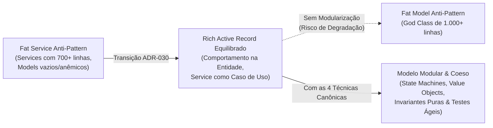
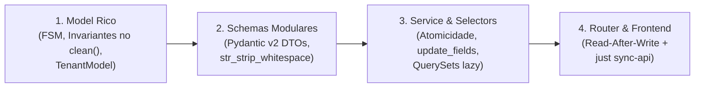

# Como Estruturar e Modularizar Modelos Ricos (Evitando Fat Models)

> **Categoria:** Guias de Backend (Django Ninja & Domain Models)
> **Relacionados:** [ADR-030: Rich Domain Model](../../architecture/adr/030-rich-domain-model-service-layer.md) · [Padrão Service Layer](../../architecture/concepts/service-layer-pattern.md) · [ADR-011: BaseModel save() com full_clean()](../../architecture/adr/011-basemodel-save-full-clean.md) · [Padrão de Serviços Core](use-core-services.md) · [Domínio de Casamentos](../../architecture/domains/weddings-domain.md)

---

## 1. Visão Geral & O Dilema Arquitetural

Ao migrar de um modelo de domínio anêmico (*Anemic Domain Model*) para um **Rich Domain Model (Rich Active Record)** conforme a [ADR-030](../../architecture/adr/030-rich-domain-model-service-layer.md), eliminamos o problema crônico dos **Fat Services** (serviços com 500 a 700 linhas de lógica procedural misturada).

Entretanto, surge um novo risco se não houver disciplina de engenharia: o **Fat Model** (classes de modelo com mais de 1.000 linhas concentrando responsabilidades demais).



Este guia define as **regras decisórias, thresholds e técnicas canônicas** para manter os modelos de domínio ricos, expressivos e modularizados à medida que o sistema escala.

---

## 2. A Regra de Ouro: Onde Colocar Cada Regra?

Para evitar tanto o inchaço do Service quanto o do Model, utilize a seguinte **Matriz Decisória de Responsabilidades**:

| Tipo de Regra ou Operação | Onde Deve Residir? | Exemplo Real no Sistema | Justificativa Arquitetural |
| :--- | :--- | :--- | :--- |
| **Sintaxe & Sanitização de Entrada** | **Pydantic Schemas (`schemas.py`)** | `str_strip_whitespace=True`, `min_length=1`, `ge=1` | *Fail-fast* imediato na borda com HTTP 422 antes de abrir transação ou conexões de banco. |
| **Invariante Local da Entidade** | **Model (`clean()` ou Métodos)** | `wedding.complete()`, validação de data futura em eventos concluídos | Depende exclusivamente dos dados que a própria instância já possui em memória. |
| **Transição de Ciclo de Vida** | **Model / State Machine** | `ALLOWED_TRANSITIONS`, `can_transition_to()`, `transition_to()` | A entidade é dona do seu próprio estado e impede transições ilegais. |
| **Cálculo ou Política Específica** | **Value Object puro** | Cálculo de capacidade de convidados, distribuição centesimal de parcelas | Dataclasses imutáveis em Python puro sem acoplamento com o ORM. |
| **Invariante Multi-Agregado** | **Domain Service** | Checar se a soma das despesas (`Expense`) ultrapassa o orçamento (`Budget`) | Demanda consultas ORM a tabelas externas ou múltiplos agregados filhos. |
| **Orquestração de Caso de Uso** | **Service Layer (`services.py`)** | `WeddingService.complete()`, `ContractService.sign()` | Coordena transação `@transaction.atomic`, isolamento multi-tenant (`company`) e efeitos colaterais. |

---

## 3. Thresholds Práticos: Quando Modularizar?

Não aplique modularizações complexas prematuramente (*Anti-Overengineering*). Siga a regra dos limites:

* **Faixa Verde (80 a 250 linhas):** Mantenha tudo no arquivo único do modelo (como feito em [`Wedding`](../../../backend/apps/weddings/models.py)). É a faixa ideal de legibilidade e coesão.
* **Gatilho Amarelo (Passou de 250-300 linhas):**
  * Se houver máquina de estados com mais de 3 estados: extraia a **Técnica 2 (State Machine)**.
  * Se houver cálculos matemáticos ou políticas complexas: extraia a **Técnica 3 (Value Objects)**.
* **Gatilho Vermelho (Múltiplos agregados no mesmo arquivo):**
  * Transforme o arquivo `models.py` em um pacote `models/` (**Técnica 1**), como já é feito em `apps/finances/models/`.

---

## 4. As 4 Técnicas Canônicas de Modularização

### Técnica 1: Transformar `models.py` em Pacote `models/`

Quando o módulo possui mais de uma entidade de persistência relevante, particione fisicamente os arquivos:

```bash
apps/finances/models/
├── __init__.py          # Exporta Budget, BudgetCategory, Expense, Installment
├── budget.py           # Agregado de Orçamento Mestre
├── category.py         # Categorias de Despesas
├── expense.py          # Lançamento de Gastos
└── installment.py      # Parcelas financeiras e tolerância zero
```

No `__init__.py`, garanta a exportação pública explícita para preservar compatibilidade com migrações do Django:

```python
# apps/finances/models/__init__.py
from .budget import Budget
from .category import BudgetCategory
from .expense import Expense
from .installment import Installment

__all__ = ["Budget", "BudgetCategory", "Expense", "Installment"]
```

---

### Técnica 2: Máquina de Estados Modularizada (*State Pattern*)

Se o ciclo de vida da entidade possuir múltiplos estados e regras condicionais de transição, isole a máquina de estados em uma classe dedicada de domínio:

```python
# apps/logistics/domain/contract_state_machine.py
from collections.abc import Mapping
from typing import ClassVar
from apps.core.exceptions import BusinessRuleViolation

class ContractStateMachine:
    """Gerencia regras de transição de status do contrato."""

    ALLOWED_TRANSITIONS: ClassVar[Mapping[str, list[str]]] = {
        "DRAFT": ["PENDING_SIGNATURE", "CANCELED"],
        "PENDING_SIGNATURE": ["ACTIVE", "CANCELED"],
        "ACTIVE": ["COMPLETED", "TERMINATED"],
        "COMPLETED": [],
        "TERMINATED": [],
        "CANCELED": [],
    }

    def __init__(self, contract: Contract) -> None:
        self.contract = contract

    def can_transition_to(self, target: str) -> bool:
        allowed = self.ALLOWED_TRANSITIONS.get(self.contract.status, [])
        return target in allowed

    def transition_to(self, target: str) -> None:
        if self.contract.status == target:
            return
        if not self.can_transition_to(target):
            raise BusinessRuleViolation(
                detail=f"Transição de '{self.contract.status}' para '{target}' não permitida.",
                code="contract_invalid_transition",
            )
        self.contract.status = target
```

No modelo Django, a interface pública permanece idêntica e sem inchaço:

```python
# apps/logistics/models/contract.py
class Contract(TenantModel):
    # ... campos ...

    @property
    def state_machine(self) -> ContractStateMachine:
        return ContractStateMachine(self)

    def sign(self) -> None:
        self.state_machine.transition_to("ACTIVE")

    def terminate(self) -> None:
        self.state_machine.transition_to("TERMINATED")
```

---

### Técnica 3: *Value Objects* (Objetos de Valor em Python Puro)

Agrupe campos relacionados e suas operações lógicas em classes `@dataclass(frozen=True)` imutáveis. Elas não herdam do Django e não dependem de banco de dados:

```python
# apps/finances/domain/installment_split.py
from dataclasses import dataclass
from decimal import Decimal

@dataclass(frozen=True)
class CentesimalSplit:
    """Distribui um valor monetário em N parcelas com Tolerância Zero."""
    total_amount: Decimal
    number_of_installments: int

    def calculate_installments(self) -> list[Decimal]:
        if self.number_of_installments <= 0:
            raise ValueError("Número de parcelas deve ser maior que zero.")

        base_value = (self.total_amount / self.number_of_installments).quantize(Decimal("0.01"))
        remainder = self.total_amount - (base_value * self.number_of_installments)

        installments = [base_value] * self.number_of_installments
        # O resto de centavos é atribuído à primeira parcela (ADR-010)
        installments[0] += remainder
        return installments
```

---

### Técnica 4: Invariantes Limpas no `clean()` e Concorrência com `update_fields`

Dois princípios fundamentais para evitar bugs crônicos de concorrência e sobrecarga de ORM:

#### A. Invariantes Diretas no `clean()` (Sem Dirty-Tracking)
**Proibido:** Sobrescrever `__init__` ou `from_db` para rastrear `_original_*`. Isso quebra com queries parciais (`.only()`) e adiciona sobrecarga de memória.

**Correto:** Valide no `clean()` apenas o estado presente na instância:

```python
def clean(self) -> None:
    super().clean()
    today = timezone.now().date()
    # Invariante 1: Novo casamento não pode nascer no passado
    if self._state.adding and self.status == self.StatusChoices.IN_PROGRESS and self.date and self.date < today:
        raise ValidationError({"date": "A data do casamento não pode ser no passado."})

    # Invariante 2: Casamento concluído não pode ter data futura
    if self.status == self.StatusChoices.COMPLETED and self.date and self.date > today:
        raise ValidationError("Não pode marcar como CONCLUÍDO antes da data do casamento")
```

#### B. Mutações Cirúrgicas com `update_fields` no Service
Em operações de mudança de status ou atualizações pontuais, **nunca faça `instance.save()` cego**. Especifique exatamente as colunas alteradas para prevenir sobrescrita acidental (*race condition*):

```python
# apps/weddings/services.py
@classmethod
@transaction.atomic
def complete(cls, company: Company, instance: Wedding) -> Wedding:
    validate_tenant_ownership(company, instance)
    instance.complete()
    # Atualiza apenas as colunas envolvidas no UPDATE SQL
    instance.save(update_fields=["status", "updated_at"])
    return instance
```

---

## 5. Estratégia de Testes Ágeis

A modularização em Rich Domain Models acelera drasticamente a suíte de testes:

1. **Testes de Domínio Unitários (Em Memória Pura — $< 5\text{ms}$):**
   * Teste regras de transição e Value Objects instanciando o modelo diretamente em memória (`Model(...)` ou `Factory.build()`), sem acessar o PostgreSQL.
   ```python
   def test_cannot_complete_future_wedding():
       future_date = timezone.now().date() + timedelta(days=10)
       wedding = Wedding(date=future_date, status=Wedding.StatusChoices.IN_PROGRESS)

       with pytest.raises(BusinessRuleViolation):
           wedding.complete()
   ```

2. **Testes de Integração do Caso de Uso (Service Layer):**
   * Use `@pytest.mark.django_db` para testar persistência atômica, isolamento multi-tenant e geração de registros vinculados.

---

## 6. Checklist de Code Review para Rich Models

Antes de aprovar um Pull Request envolvendo modelos de domínio:

- [ ] **Borda HTTP:** Os campos de entrada possuem schemas Pydantic com `str_strip_whitespace=True` e restrições de limite?
- [ ] **Invariantes Locais:** As regras de ciclo de vida pertencem à entidade através de métodos semânticos (ex: `.complete()`, `.cancel()`)?
- [ ] **Sem Hacks de ORM:** O modelo não possui tracking de atributos sujos via `__init__` ou `from_db`?
- [ ] **Invariantes do `clean()`:** O método `clean()` valida apenas inconsistências do estado atual sem depender do histórico?
- [ ] **Concorrência Segura:** O Service utiliza `save(update_fields=[...])` nas mutações de status ou alterações parciais?
- [ ] **Atomicidade & Multi-Tenant:** Todos os métodos do serviço estão com `@transaction.atomic` e recebem `company`?
- [ ] **Tamanho e Coesão:** O arquivo do modelo respeita o teto de 250-300 linhas ou adotou as técnicas de modularização adequadas?

---

## 7. Fluxo Ponta a Ponta: Da Modelagem à Entrega no Frontend (Os 4 Passos)

Ao desenvolver ou estender funcionalidades sob a **ADR-030**, o ciclo de vida da feature segue 4 etapas sequenciais e desacopladas:



1. **Passo 1: Model Rico & Invariantes Locais (`models/`)**
   - Crie ou evolua o modelo herdando de `TenantModel` e mixins apropriados (`WeddingOwnedMixin`).
   - Declare métodos semânticos para mudanças de estado (ex: `sign()`, `complete()`, `archive()`).
   - Adicione regras de integridade locais puras no método `clean()`.
   - Conecte o manager encadeável `objects = ModelQuerySet.as_manager()`.

2. **Passo 2: Schemas Pydantic v2 de Borda (`schemas/`)**
   - Declare DTOs separados: `ModelIn` (payload de criação obrigatório), `ModelPatchIn` (atualização com campos opcionais) e `ModelOut` (projeção de leitura).
   - Configure `model_config = {"extra": "ignore", "str_strip_whitespace": True}` para sanitização automática na borda HTTP.

3. **Passo 3: Service Orquestrador & Query Selectors (`services/` e `selectors/`)**
   - Implemente mutações no Service sob `@transaction.atomic`, validando relacionamentos multi-tenant via `resolve_tenant_resource`.
   - Realize persistência cirúrgica usando `instance.save(update_fields=[...])`.
   - Escreva seletores puros em `selectors/` para buscas pontuais (`*_get_selector`) e listagens com `for_tenant(company)`.

4. **Passo 4: Router Django Ninja & Sincronização Frontend (`api.py` e `just sync-api`)**
   - Exponha os endpoints decorados com `operation_id` explícito e envelopes de erro (`READ_ERROR_RESPONSES` / `MUTATION_ERROR_RESPONSES`).
   - Aplique o padrão **Read-After-Write** nas rotas `POST` e `PATCH`.
   - Execute `just sync-api`: o pipeline atualizará o contrato `openapi.json` e gerará automaticamente os hooks tipados do TanStack Query e schemas Zod no frontend (`@/api/generated/`).

---

## 8. Matriz Rápida de Diagnóstico de Bugs por Camada (Guia de Manutenção)

Quando um bug é relatado ou um teste falha, utilize esta matriz diagnóstica para identificar instantaneamente em qual camada a correção deve ser realizada:

| Sintoma Observado | Camada Responsável | Onde Inspecionar & Corrigir | Ação Recomendada |
| :--- | :--- | :--- | :--- |
| **Strings com espaços indesejados, campos ausentes ou tipos inválidos na entrada** | **Nível 1: Schemas (`schemas/`)** | `apps/<modulo>/schemas/` | Adicionar/ajustar `str_strip_whitespace=True`, `min_length`, `ge`, ou tipos Pydantic no schema de entrada (`*In` / `*PatchIn`). |
| **Transição de estado ilegal (ex: reabrir evento arquivado) ou valores inválidos entre campos da mesma entidade** | **Nível 2: Model Rico (`models/`)** | `apps/<modulo>/models/` ou `domain/*_state_machine.py` | Implementar guarda no método de transição (`can_transition_to`) ou adicionar validação de integridade pura em `clean()`. |
| **Vazamento de dados entre empresas (IDOR) ou entidade órfã após falha intermediária** | **Nível 3: Service Layer (`services/`)** | `apps/<modulo>/services/` | Adicionar `resolve_tenant_resource` para validar chaves estrangeiras do tenant e garantir o decorador `@transaction.atomic`. |
| **Sobrescrita concorrente acidental (*race condition*) em campos não alterados pelo usuário** | **Nível 3: Service Layer (`services/`)** | `apps/<modulo>/services/` | Substituir `instance.save()` cego por mutação cirúrgica: `instance.save(update_fields=[..., 'updated_at'])`. |
| **Lentidão em listagens, explosão de queries SQL (problema N+1) ou dados ausentes na leitura** | **Camada de Projeção (`selectors/` & `managers.py`)** | `apps/<modulo>/selectors/` e `managers.py` | Otimizar com `select_related`, `prefetch_related` ou anotações de agregados SQL no `TenantQuerySet`. |
| **Erro de serialização Pydantic após `POST`/`PATCH` (campo calculado ou anotação SQL retornando `None`)** | **Transporte HTTP (`api.py`)** | `apps/<modulo>/api.py` | Aplicar o padrão **Read-After-Write**: não retornar a instância crua do service; retornar `*_get_selector(company=..., uuid=...)`. |
