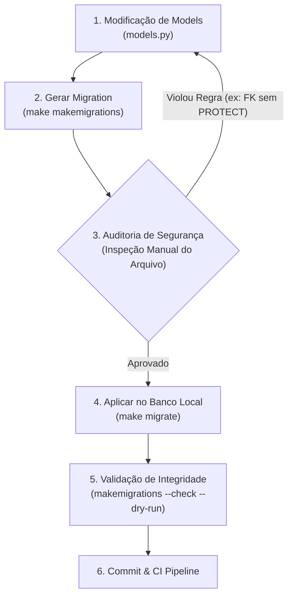

# Como Executar Migrações de Banco de Dados com Segurança

> **Categoria:** [dev-environment](index.md) | [setup-local-environment](setup-local-environment.md) | [db-connection-locks](../ops-troubleshooting/db-connection-locks.md)
> **Comandos Principais:** `make makemigrations`, `make migrate`, `uv run python manage.py showmigrations`

---

## Visão Geral

No **Wedding Management System (WMS)**, o gerenciamento do esquema relacional no **PostgreSQL (Neon)** é estritamente controlado pelas migrações do Django ORM. Devido às garantias arquiteturais de **Multi-Tenancy Pragmático** e **Tolerância Zero Financeira**, toda alteração de schema deve seguir um fluxo rigoroso de criação, auditoria, execução e verificação de integridade.



---

## Passo 1: Gerar Novas Migrações (`makemigrations`)

Após alterar ou criar modelos em qualquer aplicativo em `backend/apps/`:

```bash
# Executando no container Docker via Makefile:
make makemigrations

# Ou executando diretamente no ambiente virtual do host:
cd backend
uv run python manage.py makemigrations
```

> [!TIP]
> Para gerar uma migração com nome semântico facilitando a rastreabilidade no histórico:
> ```bash
> uv run python manage.py makemigrations --name add_budget_alert_threshold finances
> ```

---

## Passo 2: Checklist de Auditoria de Segurança

Abra o arquivo gerado em `backend/apps/<modulo>/migrations/XXXX_....py` e valide as seguintes diretrizes antes de aplicar:

### 1. Proteção de Chaves Estrangeiras Multi-Tenant
Chaves estrangeiras que referenciam `Company` (Tenant) ou entidades pai (como `Wedding`) **DEVEM** utilizar `on_delete=models.PROTECT` para evitar deleções em cascata não autorizadas:

```python
# CORRETO:
company = models.ForeignKey(
    "tenants.Company",
    on_delete=models.PROTECT,
    related_name="%(app_label)s_%(class)s_set",
)
```

### 2. Novos Campos `NOT NULL` com Valores Padrão
Nunca adicione campos com `null=False` sem definir um `default` seguro, pois isso causará falhas ao aplicar a migração em tabelas existentes com registros.

### 3. Herança do `BaseModel`
Novos modelos devem herdar de `BaseModel` (`apps.core.models`), garantindo a presença dos campos `uuid`, `created_at`, `updated_at`, `is_active` e a execução mandatória de `full_clean()` no `save()`.

---

## Passo 3: Aplicar as Migrações no Banco (`migrate`)

Aplique as alterações pendentes no banco de dados local:

```bash
# Via Makefile:
make migrate

# Ou diretamente com uv no Host:
cd backend
uv run python manage.py migrate
```

Para verificar quais migrações foram aplicadas e quais estão pendentes:

```bash
uv run python manage.py showmigrations
```

*Saída de exemplo:*
```text
finances
 [X] 0001_initial
 [X] 0002_add_installment_overdue_fields
 [ ] 0003_add_budget_alert_threshold (pendente)
```

---

## Passo 4: Procedimento de Rollback Seguro

Caso uma migração cause comportamento inesperado durante o desenvolvimento ou teste, é possível revertê-la com segurança especificando o nome do app e o número da migração anterior desejada:

```bash
# Reverter o app 'finances' para o estado da migration 0001
cd backend
uv run python manage.py migrate finances 0001
```

Para reverter todas as migrações de um app (voltando ao estado inicial):

```bash
uv run python manage.py migrate finances zero
```

> [!CAUTION]
> **Atenção ao apagar arquivos:** Nunca delete o arquivo físico da migração antes de ter executado o comando `migrate` para a versão anterior no banco de dados. Caso contrário, a tabela `django_migrations` ficará em estado inconsistente.

---

## Passo 5: Validação em CI/CD (`--check --dry-run`)

Na esteira de Integração Contínua (CI), garantimos que nenhuma alteração nos modelos de código foi comitada sem a sua respectiva migração:

```bash
# Falha com código 1 caso existam alterações nos models sem migrations geradas:
uv run python manage.py makemigrations --check --dry-run
```

---

## Troubleshooting & Resolução de Problemas

### 1. Conflito de Branches (Merge Migrations)
- **Sintoma:** `CommandError: Conflicting migrations detected in 'finances': (0002_feature_a, 0002_feature_b)`.
- **Causa:** Dois desenvolvedores criaram migrações a partir da mesma base em branches distintas.
- **Solução:** Execute o comando de merge automático:
  ```bash
  uv run python manage.py makemigrations --merge
  ```
  Isso gerará uma nova migração de junção (ex: `0003_merge_...py`).

### 2. Migração Travada por Conexão Presa (Lock Timeout)
- **Sintoma:** O comando `migrate` congela indefinidamente ao alterar uma tabela.
- **Causa:** Uma transação aberta no banco está segurando um lock exclusivo na tabela alvo (DDL Lock contention).
- **Solução:** Consulte o guia de [Diagnóstico de DB Connection Locks](../ops-troubleshooting/db-connection-locks.md) para identificar e encerrar os processos bloqueadores via `pg_stat_activity`.

### 3. Inconsistência de Histórico Fake (`--fake`)
- **Sintoma:** `django.db.utils.ProgrammingError: relation "table_name" already exists`.
- **Solução:** Se a tabela já foi criada manualmente no banco mas o Django não registrou a migração, sincronize o ponteiro com a flag `--fake`:
  ```bash
  uv run python manage.py migrate <app_name> <migration_number> --fake
  ```
