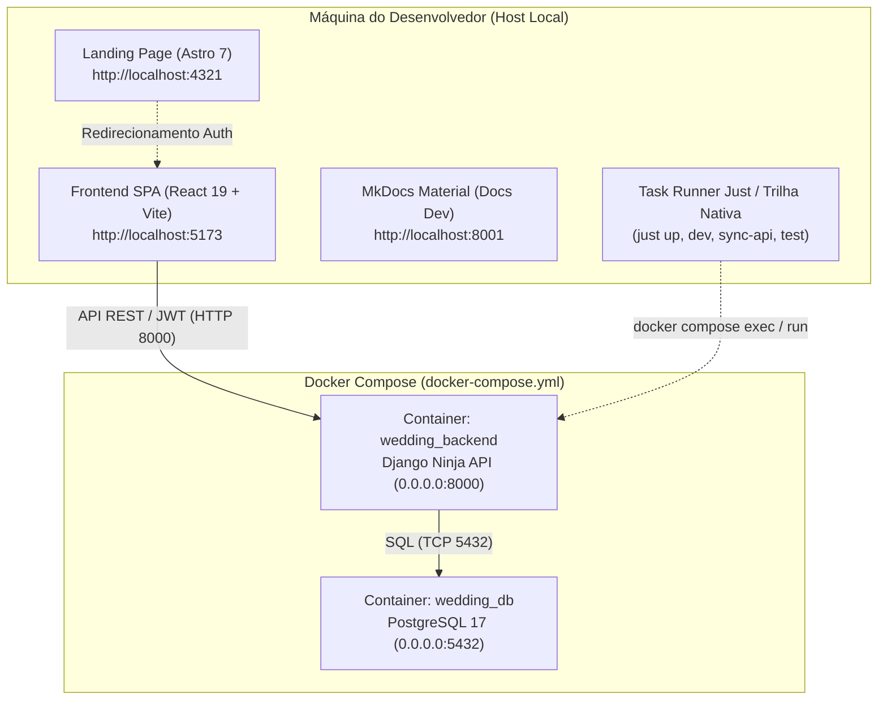

# How-To: Ambiente de Desenvolvimento Local (MOC)

> **Categoria:** [how-to](../../index.md) | [setup-local-environment](setup-local-environment.md) | [task-runner-just](task-runner-just.md) | [database-migrations](database-migrations.md)
> **Camada:** Ambiente de Desenvolvimento, Docker & Serviços Locais

---

## 1. Visão Geral do Ambiente de Desenvolvimento

O ecossistema local do **Wedding Management System (WMS)** adota uma arquitetura híbrida e otimizada para produtividade:
- **Camada de Dados e Backend:** Executados preferencialmente via **Docker Compose** (`db` com PostgreSQL 16 e `backend` com Python 3.12 + Django Ninja).
- **Camada de Apresentação (Frontend SPA e Landing Page):** Executados diretamente no **Host** (`pnpm run dev` com Vite 8 e Astro 7) para garantir Hot Module Replacement (HMR) instantâneo e eliminar sobrecargas de I/O em volumes Docker.
- **Camada de Documentação:** Servida localmente via **MkDocs Material** com live-reload na porta `8001`.



---

## 2. Tabela de Portas e Serviços Locais

| Serviço | URL Local | Porta Host | Atalho Just | Comando Nativo Direto | Descrição |
| :--- | :--- | :--- | :--- | :--- | :--- |
| **Backend & Swagger API** | [`http://localhost:8000/api/v1/docs`](http://localhost:8000/api/v1/docs) | `8000` | `just up` / `just dev` | `docker compose up -d backend` | Documentação OpenAPI interativa do Django Ninja |
| **Frontend SPA** | [`http://localhost:5173`](http://localhost:5173) | `5173` | `just frontend-dev` | `cd frontend && pnpm run dev` | Interface SPA React 19 para casais e cerimonialistas |
| **Landing Page Comercial** | [`http://localhost:4321`](http://localhost:4321) | `4321` | `just landing-dev` | `cd landing && pnpm run dev` | Portal público estático em Astro com ilhas React |
| **Documentação Técnica** | [`http://localhost:8001`](http://localhost:8001) | `8001` | `just docs-dev` | `uv run --project backend --group docs mkdocs serve -a 0.0.0.0:8001` | Portal MkDocs Material com recarregamento em tempo real |
| **PostgreSQL Database** | `localhost:5432` | `5432` | `just up` | `docker compose up -d db` | Banco de dados relacional principal |

---

## 3. Catálogo de Guias Práticos da Seção

Nesta seção você encontrará receitas passo a passo para gerenciar o ciclo de vida do ambiente local:

1. **[Configuração do Ambiente Local (Setup)](setup-local-environment.md)**:
   Passo a passo completo para inicialização via Docker Compose ou Host local (UV + Pnpm), provisionamento do arquivo `.env`, execução de seeds e verificação de saúde.

2. **[Task Runner Just & Comandos Nativos](task-runner-just.md)**:
   Guia de instalação do `just`, tabela de equivalência completa de comandos e playbook de manutenção (`justfile`, `poethepoet` e `package.json`).

3. **[Execução Segura de Migrações de Banco de Dados](database-migrations.md)**:
   Fluxo de trabalho para criar (`makemigrations`), aplicar (`migrate`), inspecionar e reverter migrações no PostgreSQL sem violar regras multi-tenant.

4. **[Como Popular o Banco de Dados Local (Seeding)](../backend/seed-database.md)**:
   Geração de dados fictícios verossímeis com Faker e inserção de templates oficiais de cronograma de casamento.

5. **[Diagnóstico e Resolução de DB Connection Locks](../ops-troubleshooting/db-connection-locks.md)**:
   Como identificar e destravar transações presas ou pools saturados durante o desenvolvimento ou migrações.

---

## 4. Comandos de Referência Rápida (`justfile`)

```bash
# Iniciar banco e backend em segundo plano e aplicar migrations
just up

# Iniciar containers e acompanhar logs em tempo real (modo interativo)
just dev

# Executar o frontend SPA no host
just frontend-dev

# Sincronizar contratos OpenAPI e gerar hooks do Orval
just sync-api

# Parar todos os containers locais
just down

# Reset rápido do banco de dados local (apaga dados e reaplica migrations)
just db-reset
```
