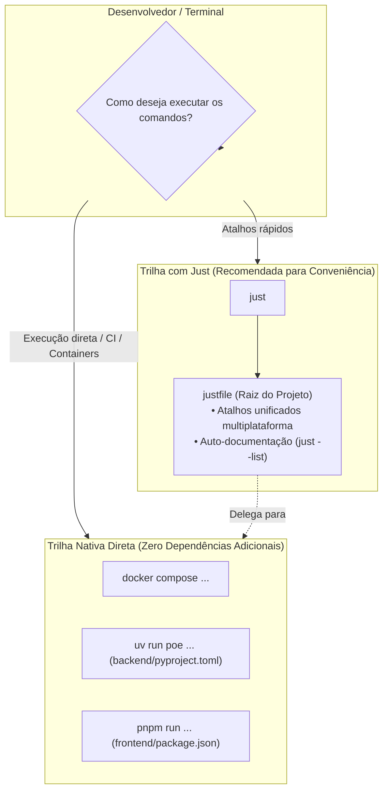

# How-To: Utilizar o Task Runner Just e a Trilha Nativa de Comandos

> **Categoria:** [how-to](../../index.md) | [dev-environment](index.md)
> **Camada:** Ferramentas de Desenvolvimento, Automação & Scripting
> **Relacionados:** [ADR-029: Modern Task Runner (Just)](../../architecture/adr/029-modern-task-runner-just.md) · [Setup do Ambiente Local](setup-local-environment.md) · [Migrações de Banco de Dados](database-migrations.md) · [Pipeline de CI/CD](../../architecture/concepts/ci-cd-pipeline-flow.md)

---

## 1. Visão Geral & Filosofia de Dupla Trilha

O **Wedding Management System** implementa uma arquitetura de comandos baseada no princípio de **Dupla Trilha (*Dual-Track Workflow*)**:



1. **Trilha com Just (Conveniência & Produtividade):** Atalhos unificados, rápidos e com auto-documentação para todos os subsistemas do projeto (Docker, Django, React, Astro, Testes, MkDocs). Funciona nativamente em **Windows (PowerShell)**, **Linux** e **macOS**.
2. **Trilha Nativa Direta (Sem Just):** Todo comando do `justfile` possui mapeamento 1:1 para as ferramentas nativas (`docker compose`, `uv run poe`, `pnpm`). Não há obrigatoriedade de instalar o `just` no seu ambiente local, containers Docker ou esteiras de CI/CD.

---

## 2. Instalação do Just (Opcional)

Caso escolha utilizar a Trilha com Just, instale o binário leve utilizando o gerenciador de pacotes do seu sistema:

=== "Windows"

    ```powershell
    # Via WinGet (Recomendado)
    winget install Casey.Just

    # Via Scoop
    scoop install just

    # Via Cargo (Rust)
    cargo install just
    ```

=== "macOS"

    ```bash
    # Via Homebrew (Recomendado)
    brew install just

    # Via MacPorts
    sudo port install just
    ```

=== "Linux (Debian / Ubuntu)"

    ```bash
    # Via APT (Ubuntu 22.04+)
    sudo apt update && sudo apt install just
    ```

=== "Linux (Arch / Fedora / Alpine)"

    ```bash
    # Arch Linux / Manjaro
    sudo pacman -S just

    # Fedora / RHEL
    sudo dnf install just

    # Alpine Linux
    apk add just
    ```

=== "Multiplataforma via Python (uv)"

    ```bash
    # Instalável em qualquer SO com o uv instalado
    uv tool install rust-just
    ```

### Verificação da Instalação

Após instalar, valide no terminal:

```bash
just --version
# Exemplo de saída: just 1.39.0
```

Para listar todos os comandos disponíveis no projeto com suas descrições:

```bash
just
# ou
just --list
```

---

## 3. Tabela Completa de Equivalência de Comandos

Abaixo está o catálogo completo comparando cada atalho do `justfile` com o respectivo comando nativo:

### 3.1 Docker & Ciclo de Vida Local

| Ação / Propósito | Atalho Just | Trilha Nativa Direta |
| :--- | :--- | :--- |
| **Setup inicial completo** | `just setup` | Criação do `.env` + `docker compose up -d backend` + migrations + superusuário |
| **Subir backend e banco** | `just up` | `docker compose up -d backend && docker compose exec backend uv run poe migrate` |
| **Modo interativo com logs** | `just dev` | `docker compose up -d backend && docker compose logs -f backend db` |
| **Reconstruir imagens** | `just build` | `docker compose up --build -d backend && docker compose exec backend uv run poe migrate` |
| **Parar todos os containers** | `just down` | `docker compose down` |
| **Limpar volumes e imagens** | `just clean` | `docker compose down -v && docker image prune -f` |
| **Resetar banco de dados** | `just db-reset` | `docker compose down -v db && docker compose up -d backend && docker compose exec backend uv run poe migrate` |
| **Logs do Backend** | `just back-logs` | `docker compose logs -f backend` |
| **Logs do Frontend** | `just front-logs` | `docker compose logs -f frontend` |

---

### 3.2 Backend & Banco de Dados (Django / uv / poe)

| Ação / Propósito | Atalho Just | Trilha Nativa Direta |
| :--- | :--- | :--- |
| **Aplicar migrações** | `just migrate` | `docker compose exec backend uv run poe migrate` *(ou no host: `cd backend && uv run poe migrate`)* |
| **Criar novas migrações** | `just makemigrations` | `docker compose exec backend uv run poe makemigrations` |
| **Criar superusuário** | `just superuser` | `docker compose exec backend uv run poe superuser` |
| **Shell interativo Django** | `just shell` | `docker compose exec backend uv run poe shell` |
| **Popular dados fictícios** | `just seed-db` | `docker compose exec backend uv run poe seed-db` |
| **Popular massa E2E fixa** | `just seed-e2e` | `docker compose exec backend uv run poe seed-e2e` |
| **Atualizar lockfile (uv)** | `just reqs` | `cd backend && uv lock` |

---

### 3.3 Frontend, Landing Page & Contratos

| Ação / Propósito | Atalho Just | Trilha Nativa Direta |
| :--- | :--- | :--- |
| **Frontend SPA Dev (Vite)** | `just frontend-dev` | `cd frontend && pnpm run dev` |
| **Landing Page Dev (Astro)** | `just landing-dev` | `cd landing && pnpm run dev` |
| **Exportar OpenAPI Schema** | `just openapi` | `docker compose exec backend uv run poe openapi` |
| **Gerar Hooks Orval** | `just orval` | `cd frontend && pnpm run generate:api` |
| **Sincronizar API + Orval** | `just sync-api` | `docker compose exec backend uv run poe openapi && cd frontend && pnpm run generate:api` |
| **Testes Unitários (Vitest)**| `just frontend-test` | `cd frontend && pnpm test` |
| **Testes do Git Modificados**| `just frontend-test-changed` | `cd frontend && pnpm exec vitest run --changed` |
| **Testes E2E (Playwright)** | `just frontend-e2e` | Flush/Seed no banco + `cd frontend && pnpm exec playwright test --workers=1` |
| **Relatório do Playwright** | `just frontend-e2e-report` | `cd frontend && pnpm exec playwright show-report` |

---

### 3.4 Qualidade, Linters & CI Gates

| Ação / Propósito | Atalho Just | Trilha Nativa Direta |
| :--- | :--- | :--- |
| **Testes Backend (Pytest)** | `just test` | `docker compose exec backend uv run poe test` |
| **Testes com Cobertura** | `just test-cov` | `docker compose exec backend uv run poe test-cov` |
| **Linter Backend (Ruff)** | `just lint` | `docker compose exec backend uv run poe lint` |
| **Formatação Backend** | `just format` | `docker compose exec backend uv run poe format` |
| **Tipagem Backend (Mypy)** | `just mypy` | `docker compose exec backend uv run poe mypy` |
| **Quality Gate Backend** | `just check-backend` | `docker compose exec backend uv run poe check` |
| **Quality Gate Frontend** | `just check-frontend` | `cd frontend && pnpm install --frozen-lockfile && pnpm run lint && pnpm run type-check && pnpm test && pnpm run build` |
| **Quality Gate Landing** | `just check-landing` | `cd landing && pnpm install --frozen-lockfile && pnpm exec astro check && pnpm run build` |
| **Quality Gate Docs** | `just check-docs` | `uv run python scripts/validate_docs_links.py && uv run python scripts/validate_docs_snippets.py && npx -y @google/design.md lint DESIGN.md && uv run --project backend --group docs mkdocs build --strict` |
| **Quality Gate Total (CI)** | `just check-ci` | Execução dos 4 checks (`check-docs`, `check-backend`, `check-frontend`, `check-landing`) |

---

### 3.5 Documentação Técnica (MkDocs Material)

| Ação / Propósito | Atalho Just | Trilha Nativa Direta |
| :--- | :--- | :--- |
| **Servidor Docs (Live-reload)**| `just docs-dev` | `uv run --project backend --group docs mkdocs serve -a 0.0.0.0:8001` |
| **Build Estrito da Doc** | `just docs-build` | `uv run --project backend --group docs mkdocs build --strict` |
| **Publicação GitHub Pages** | `just docs-gh-deploy`| `uv run --project backend --group docs mkdocs gh-deploy --force` |

---

### 3.6 Utilitários do Sistema

| Ação / Propósito | Atalho Just | Trilha Nativa Direta |
| :--- | :--- | :--- |
| **Gerar arquivo `.env`** | `just env-setup` | `python3 -c "import os, shutil; shutil.copyfile('.env.example', '.env') if not os.path.exists('.env') else None"` |
| **Gerar SECRET_KEY segura** | `just secret-key` | `python3 -c "import secrets; print(secrets.token_urlsafe(50))"` |

---

## 4. Playbook de Manutenção e Extensão de Comandos

Para preservar o desacoplamento arquitetural e a manutenibilidade, siga as diretrizes abaixo ao adicionar ou modificar comandos no projeto:

### 4.1 Adicionando Tarefas no Backend (`backend/pyproject.toml`)

O backend utiliza **PoeThePoet**. Todas as novas rotinas Python devem ser cadastradas na tabela `[tool.poe.tasks]`:

```toml
# backend/pyproject.toml
[tool.poe.tasks]
# 1. Comando simples de string:
meu-comando = "python manage.py meu_comando_customizado"

# 2. Comando composto (lista sequencial de outras tarefas poe):
check-rapido = ["lint", "test"]

# 3. Comando com passagem de argumentos adicionais:
test-modulo = "pytest apps/finances/tests/ -v"
```

> **Regra de Ouro:** Sempre teste a tarefa nativamente no container ou no host via `uv run poe meu-comando` antes de criar o atalho no `justfile`.

---

### 4.2 Adicionando Scripts no Frontend (`frontend/package.json`)

No frontend React e na Landing Page Astro, os scripts residem em seus respectivos arquivos `package.json`:

```json
// frontend/package.json
{
  "scripts": {
    "meu-script": "oxlint --fix ."
  }
}
```

Executável diretamente via `pnpm run meu-script`.

---

### 4.3 Adicionando Atalhos no `justfile`

Ao adicionar um atalho no `justfile`, siga as convenções estabelecidas:

1. **Comentário de Documentação:** Adicione sempre um comentário iniciado por `#` imediatamente acima da receita. Este comentário será exibido no menu `just --list`.
2. **Encapsulamento Fino:** Delegue sempre a execução para a ferramenta nativa (`uv run poe`, `pnpm`, `docker compose`), evitando lógica de script complexa inline.
3. **Agrupamento Semântico:** Posicione o comando na seção temática adequada do arquivo.

```just
# ==============================================================================
# 🐍 BACKEND & BANCO DE DADOS (via uv / poe)
# ==============================================================================

# Executa minha rotina customizada no container backend
minha-tarefa:
    docker compose exec backend uv run poe meu-comando
```

---

## 5. Resolução de Problemas Comuns

### 1. `just: command not found`
- O utilitário `just` não está instalado no PATH do seu sistema.
- **Solução:** Instale o `just` conforme a [Seção 2](#2-instalacao-do-just-opcional) ou utilize a **Trilha Nativa Direta** apresentada na [Seção 3](#3-tabela-completa-de-equivalencia-de-comandos).

### 2. Erro de execução no Windows PowerShell
- Verifique se as duas primeiras linhas do `justfile` estão presentes:
  ```just
  set dotenv-load := true
  set windows-shell := ["powershell.exe", "-NoLogo", "-Command"]
  ```
- No PowerShell, se houver bloqueio de execução de scripts, execute: `Set-ExecutionPolicy -ExecutionPolicy RemoteSigned -Scope CurrentUser`.

### 3. Variáveis de ambiente não carregadas
- O `justfile` carrega automaticamente o `.env` através da diretiva `set dotenv-load := true`. Certifique-se de que o arquivo `.env` existe na raiz do repositório (execute `just env-setup`).
