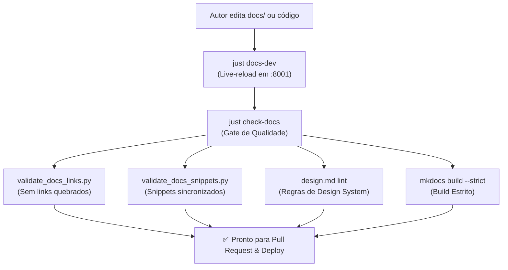

# Receitas Práticas de Documentação (MOC)

> **Categoria:** [how-to](../../index.md) | [documentation-standards](../../reference/architecture-standards/documentation-standards.md) | [write-and-update-docs](write-and-update-docs.md)
> **Camada:** Documentação Técnica, Diátaxis & Qualidade de Código

---

## 1. Visão Geral do Sistema de Documentação

A documentação técnica do **Wedding Management System (WMS)** sob o diretório `docs/` segue estritamente a metodologia **Diátaxis** e o princípio de **Notas Atômicas** (ADR-028).

Para evitar o fenômeno de *Code-Drift* (documentação defasada em relação ao código), nosso pipeline integra guard-rails automatizados que verificam a existência de transclusões de código PyMdown, auditam 100% dos links Markdown e validam o design system no CI/CD.



---

## 2. Guias e Padrões da Seção

Nesta seção você encontrará guias práticos e referências de engenharia para a criação e manutenção da base de conhecimento:

1. **[Como Escrever e Atualizar Documentação Técnica](write-and-update-docs.md)**:
   Receita prática passo a passo para criar novas notas atômicas, estruturar títulos e metadados, utilizar transclusões PyMdown e validar links locais.

2. **[Especificação Técnica: Padrões de Documentação (Diátaxis)](../../reference/architecture-standards/documentation-standards.md)**:
   Regras formais de classificação em quadrantes (Tutorials, How-To, Reference, Explanation), proibição de duplicações e arquitetura de MOCs.

3. **[Padrão de Comentários & Docstrings em PT-BR](../../reference/architecture-standards/commenting-standards.md)**:
   Convenções de documentação de código-fonte no backend (Google Style) e frontend (TSDoc).

---

## 3. Fluxo de Trabalho de Desenvolvimento Local

### 1. Iniciar o Servidor de Documentação com Live-Reload
Execute o servidor MkDocs Material local na porta `8001`:

```bash
# Via Just:
just docs-dev

# Ou Trilha Nativa:
uv run --project backend --group docs mkdocs serve -a 0.0.0.0:8001
```
*Acesse a documentação no navegador em [`http://localhost:8001`](http://localhost:8001).*

### 2. Validar Links e Snippets Localmente
Antes de submeter commits ou Pull Requests, execute o gate de integridade:

```bash
# Via Just:
just check-docs

# Ou Trilha Nativa:
uv run --project backend python scripts/validate_docs_links.py && \
uv run --project backend python scripts/validate_docs_snippets.py && \
npx -y @google/design.md lint DESIGN.md && \
uv run --project backend --group docs mkdocs build --strict
```

*Saída esperada no terminal:*
```text
🔍 Iniciando validação automática de links da documentação e skills...
📊 Resumo da Validação:
   - Arquivos auditados: 137
   - Links verificados:  800+
✨ Todos os links da documentação e skills estão válidos e os arquivos alvo existem!

🔍 Iniciando auditoria de sincronização de código na documentação (Code-Drift Guardian)...
   - Snippets PyMdown verificados: 96
✨ Todos os snippets e referências de código estão 100% sincronizados!

INFO    -  Documentation built in 0.85 seconds
```

---

## 4. Tabela de Comandos de Documentação (`justfile` & UV)

| Atalho Just | Comando Nativo Direto | Descrição |
| :--- | :--- | :--- |
| `just docs-dev` | `uv run --project backend --group docs mkdocs serve -a 0.0.0.0:8001` | Inicia o servidor local MkDocs com hot-reload na porta `8001`. |
| `just docs-build` | `uv run --project backend --group docs mkdocs build --strict` | Compila os arquivos estáticos da documentação em modo estrito (`--strict`). |
| `just check-docs` | `uv run --project backend python scripts/validate_docs_links.py && uv run --project backend python scripts/validate_docs_snippets.py && npx -y @google/design.md lint DESIGN.md && uv run --project backend --group docs mkdocs build --strict` | Executa a suíte completa de validação (links, snippets, design.md e build). |
| `just docs-gh-deploy` | `uv run --project backend --group docs mkdocs gh-deploy --force` | Publica a documentação no branch `gh-pages` do GitHub. |
