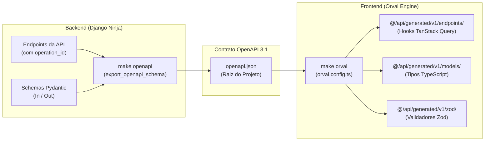

# Como Sincronizar Contratos OpenAPI e Gerar Hooks Orval

> **Categoria:** [frontend](../../reference/frontend/index.md) | [create-hook-form-zod](create-hook-form-zod.md) | [msw-testing-patterns](msw-testing-patterns.md)
> **Comandos Principais:** `make sync-api`, `make openapi`, `make orval`

---

## Visão Geral

O **Wedding Management System (WMS)** adota a arquitetura **Contract-Driven Frontend** (ADR-012). O backend Django Ninja atua como a **Single Source of Truth (SSOT)** de todos os contratos de dados. O frontend nunca escreve chamadas manuais com `fetch` ou `axios`; em vez disso, todas as interfaces TypeScript, hooks do **TanStack Query** e validadores **Zod** são gerados automaticamente pelo **Orval**.



---

## Configuração do Orval (`orval.config.ts`)

A configuração do Orval divide a geração em dois alvos:
1. **`weddingApi`:** Gera os hooks React Query com `tags-split` utilizando nosso cliente centralizado com interceptação de autenticação JWT (`customInstance` em `src/api/api-client.ts`).
2. **`weddingZod`:** Gera schemas de validação Zod correspondentes aos payloads de entrada e saída.

```typescript
--8<-- "frontend/orval.config.ts"
```

---

## Passo 1: Pré-requisitos nos Endpoints Backend

Para que o Orval gere funções com nomes semânticos e limpos no TypeScript, toda rota no Django Ninja **DEVE** declarar um `operation_id` explícito e tipagens Pydantic nos parâmetros de entrada e saída:

```python
# backend/apps/finances/api/budgets.py
@budgets_router.post(
    "/",
    response={201: BudgetOut, **MUTATION_ERROR_RESPONSES},
    operation_id="finances_budgets_create",  # Gera useFinancesBudgetsCreate no frontend!
)
def create_budget(request: AuthRequest, payload: BudgetIn) -> tuple[int, Budget]:
    ...
```

---

## Passo 2: Exportar o Schema OpenAPI (`make openapi`)

Extraia o esquema formal da API Django Ninja diretamente para o arquivo `openapi.json` na raiz do projeto:

```bash
# Executa a extração no container backend e copia para a raiz:
make openapi
```

*Comando executado internamente:*
```bash
python manage.py export_openapi_schema --api config.api.api --output openapi.json --settings=config.settings.development --indent 2
```

---

## Passo 3: Gerar os Hooks e Tipos no Frontend (`make orval`)

Com o `openapi.json` atualizado na raiz, processe a geração dos artefatos TypeScript no frontend:

```bash
# Executa a compilação do Orval:
make orval

# Ou diretamente dentro da pasta frontend:
cd frontend && pnpm run generate:api
```

*Saída esperada no terminal:*
```text
📦 Gerando hooks do Orval...
🎉 orval v8.24.0 - Generated 38 endpoint files, 94 models, and 38 zod schemas.
```

---

## Passo 4: Atalho Unificado (`make sync-api`)

Para executar o pipeline completo (OpenAPI + Orval) em uma única instrução:

```bash
make sync-api
```

---

## Passo 5: Consumindo os Hooks Gerados no React 19

Uma vez gerados, utilize os hooks diretamente nos componentes React:

### Consulta de Dados (Query Hook)
```tsx
import { useFinancesBudgetsList } from "@/api/generated/v1/endpoints/finances/finances";

export function BudgetSummary({ weddingUuid }: { weddingUuid: string }) {
  const { data, isPending, error } = useFinancesBudgetsList({ wedding: weddingUuid });

  if (isPending) return <div>Carregando orçamento...</div>;
  if (error) return <div>Erro ao carregar dados do orçamento.</div>;

  return <div>Total: R$ {data.items[0]?.total_budget}</div>;
}
```

### Mutação de Dados (Mutation Hook)
```tsx
import { useFinancesBudgetsCreate } from "@/api/generated/v1/endpoints/finances/finances";
import { toast } from "sonner";

export function CreateBudgetButton({ weddingUuid }: { weddingUuid: string }) {
  const { mutate, isPending } = useFinancesBudgetsCreate();

  const handleCreate = () => {
    mutate(
      {
        data: {
          wedding: weddingUuid,
          total_budget: 100000,
        },
      },
      {
        onSuccess: () => toast.success("Orçamento criado com sucesso!"),
        onError: (err) => toast.error(err.response?.data?.message ?? "Falha ao criar orçamento."),
      }
    );
  };

  return (
    <button onClick={handleCreate} disabled={isPending}>
      {isPending ? "Salvando..." : "Criar Orçamento"}
    </button>
  );
}
```

---

## Troubleshooting & Resolução de Problemas

### 1. Nomes Genéricos de Hooks (`usePostApiV1...`)
- **Sintoma:** O Orval gerou nomes de hooks com a URL crua em vez de nomes semânticos.
- **Causa:** O endpoint no Django Ninja não possui o parâmetro `operation_id`.
- **Solução:** Adicione `operation_id="<modulo>_<entidade>_<acao>"` no decorator `@router.post(...)` ou `@router.get(...)` no backend e reexecute `make sync-api`.

### 2. Erro de Schema OpenAPI Desatualizado
- **Sintoma:** Novos campos do backend não aparecem no autocomplete do TypeScript.
- **Solução:** Execute `make sync-api` para garantir que tanto o `openapi.json` quanto a pasta `@/api/generated/` sejam atualizados com base no código backend mais recente.

### 3. Erro de Mutator `customInstance`
- **Sintoma:** `Cannot find module 'src/api/api-client'`.
- **Solução:** O `orval.config.ts` utiliza o caminho relativo `src/api/api-client.ts`. Certifique-se de executar o comando `pnpm run generate:api` a partir do diretório `frontend/` ou utilize `make orval` na raiz.
