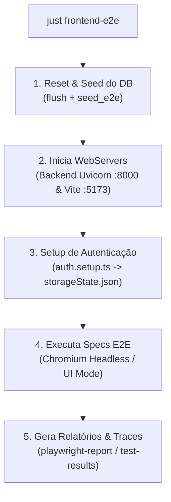

# How-To: Executando e Depurando Testes E2E com Playwright

> **Categoria:** Guias Práticos (Frontend & Testes)
> **Relacionados:** [ADR-018: Testes E2E com Playwright](../../architecture/adr/018-playwright-e2e-testing.md) · [Especificação de Testes E2E](../../reference/testing/e2e-testing-spec.md) · [MOC de Testes](../../reference/testing/index.md)

---

## 1. Visão Geral e Pré-requisitos

A suíte de testes de ponta a ponta (E2E) valida os fluxos críticos de negócio do **Wedding Management System** simulando a experiência do usuário real em navegadores Chromium reais.

### Pré-requisitos
- Ambiente de desenvolvimento ativo com PostgreSQL (Neon local/Docker).
- Node.js 20+ e gerenciador de pacotes `pnpm`.
- Python 3.12+ com ambiente virtual `.venv` configurado.



---

## 2. Playbook de Execução Rápida

### 2.1 Execução Completa Automatizada (Recomendado)
O comando do Just (`just frontend-e2e`) cuida de todo o ciclo: limpa a base de dados, popula os registros iniciais (seeds) e roda os testes com 1 worker para evitar concorrência no banco:

```bash
# Via Just (Recomendado):
just frontend-e2e

# Ou Trilha Nativa Direta:
docker compose exec backend uv run python manage.py flush --noinput && \
docker compose exec backend uv run poe seed-e2e && \
cd frontend && pnpm exec playwright test --workers=1
```

### 2.2 Visualização do Relatório HTML
Após a execução dos testes, abra o relatório visual interativo:

```bash
# Via Just:
just frontend-e2e-report

# Ou Trilha Nativa pelo pnpm:
cd frontend && pnpm exec playwright show-report
```

---

## 3. Modos de Execução e Depuração

### 3.1 Modo Gráfico Interativo (UI Mode)
Permite navegar visualmente pela árvore de testes, inspecionar o DOM em tempo real e reexecutar cenários com hot-reload:

```bash
cd frontend
pnpm exec playwright test --ui
```

### 3.2 Executando um Teste ou Arquivo Específico
Para acelerar o feedback ao desenvolver uma funcionalidade específica:

```bash
cd frontend

# Executa apenas a spec de autenticação
pnpm exec playwright test e2e/specs/auth.spec.ts

# Executa testes que contenham uma tag ou título específico
pnpm exec playwright test -g "deve criar um novo casamento com sucesso"
```

### 3.3 Modo Inspector / Debug Passo a Passo
Abre o Playwright Inspector para pausar a execução a cada clique, inspecionar seletores e avançar linha a linha:

```bash
cd frontend
# Inicia com o inspetor interativo
pnpm exec playwright test --debug

# Ou via variável de ambiente
PWDEBUG=1 pnpm exec playwright test e2e/specs/weddings.spec.ts
```

### 3.4 Inspecionando Gravações de Falha no Trace Viewer
O Playwright grava snapshots de DOM, requisições de rede e capturas de tela sempre que um teste falha no primeiro retry (`trace: "on-first-retry"`):

```bash
cd frontend
# Abre o arquivo de trace gerado na pasta de resultados
pnpm exec playwright show-trace test-results/e2e-specs-weddings-deve-criar-casamento-chromium/trace.zip
```

---

## 4. Estrutura de Seeds e Sessões de Autenticação

Para evitar fazer login manualmente em cada cenário, o Playwright utiliza um projeto de **`setup`**:

1. **`frontend/e2e/setup/auth.setup.ts`:** Realiza login com o usuário seed (`admin@wedding.local`) e salva os cookies e tokens JWT em `frontend/playwright/.auth/user.json`.
2. **Reuso de Sessão:** Todas as specs dependentes (`chromium`) carregam o estado autenticado automaticamente através da propriedade `storageState: "playwright/.auth/user.json"`.

---

## 5. Resolução de Problemas Comuns (Troubleshooting)

| Problema | Causa Raiz | Solução |
| :--- | :--- | :--- |
| **Porta 8000 ou 5173 ocupada** | Processo antigo preso em segundo plano | Execute `kill -9 $(lsof -t -i:8000)` e `kill -9 $(lsof -t -i:5173)`. |
| **Erro 401 Unauthorized nos testes** | Cache do `storageState.json` expirado ou banco resetado sem novo seed | Execute `rm -rf frontend/playwright/.auth` e rode `just frontend-e2e`. |
| **Timeout de 60s em elementos dinâmicos** | Seletor frágil ou animação do Radix UI não finalizada | Utilize seletores semânticos acessíveis (`page.getByRole('button', { name: 'Salvar' })`) em vez de classes CSS. |
