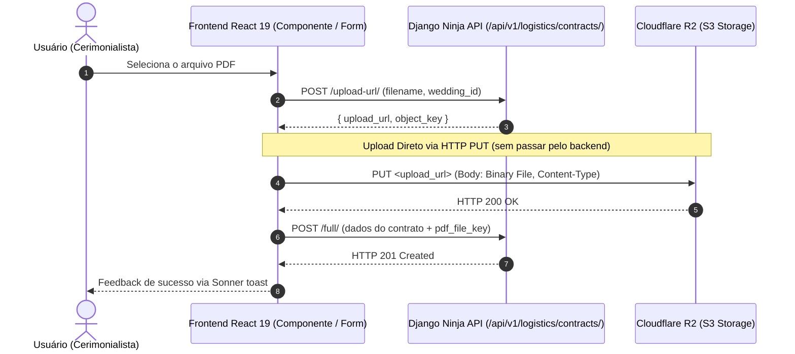

# Como Fazer Upload de Arquivos Direto para o Cloudflare R2

> **Categoria:** Guia Prático (Frontend & Armazenamento)
> **Relacionados:** [ADR-004: URLs Pré-Assinadas](../../architecture/adr/004-presigned-urls.md) · [ADR-020: Abstração do StorageService](../../architecture/adr/020-storage-service-abstraction.md) · [ADR-024: Padrão Smart & Dumb Components](../../architecture/adr/024-padrao-smart-dumb-desacoplamento-componentes-frontend.md) · [Fluxo de Upload de Contratos PDF](../../architecture/concepts/contract-pdf-upload-r2-flow.md) · [Geração de Cliente Orval](generate-orval-client.md) · [Resolução de Falhas de Upload R2](../ops-troubleshooting/r2-upload-failures.md)

---

Este guia prático ensina como implementar o upload de documentos e contratos em PDF diretamente do navegador para o **Cloudflare R2** via URLs pré-assinadas (*Presigned URLs*), desacoplando totalmente a transferência pesada de arquivos binários do container backend Django Ninja.

---

## 1. Visão Geral da Estratégia de Direct Upload

No **Wedding Management System (WMS)**, nenhum arquivo binário passa pelo servidor de aplicação Python no Cloud Run. O fluxo de upload opera em duas etapas desacopladas:

1. **Obtenção da Credencial Temporária:** O frontend solicita à API uma URL pré-assinada de curta duração (900 segundos / 15 minutos).
2. **Transferência Binária Direta:** O frontend despacha o arquivo diretamente ao Cloudflare R2 através de um método `PUT` HTTP padrão, acompanhado do cabeçalho de tipo MIME correspondente.
3. **Persistência dos Metadados:** Com a chave do objeto (`object_key`) confirmada, o frontend envia a requisição de criação ou associação do contrato à API Django Ninja em uma transação atômica.



---

## 2. O Serviço Centralizado de Upload (`@/services/r2.ts`)

A transferência binária pura é isolada em um serviço determinístico do frontend, responsável por executar a requisição `PUT` com os cabeçalhos apropriados.

```typescript
// frontend/src/services/r2.ts

/**
 * Envia um arquivo binário diretamente para a URL pré-assinada do Cloudflare R2.
 *
 * @param presignedUrl URL pré-assinada gerada pelo backend.
 * @param file Arquivo selecionado pelo usuário no navegador.
 */
export async function uploadFileToR2(
  presignedUrl: string,
  file: File,
): Promise<void> {
  const response = await fetch(presignedUrl, {
    method: "PUT",
    body: file,
    headers: {
      "Content-Type": file.type || "application/octet-stream",
    },
  });

  if (!response.ok) {
    throw new Error(
      `Upload failed: ${response.status} ${response.statusText}`,
    );
  }
}
```

> [!IMPORTANT]
> **Paridade de `Content-Type` com a Assinatura Criptográfica:**
> A assinatura gerada pelo backend vincula o cabeçalho `ContentType`. Para arquivos PDF, o cabeçalho `application/pdf` deve ser repassado fielmente no `PUT`. Se o cabeçalho diferir daquele assinado pelo S3/R2, a requisição falhará com erro `403 SignatureDoesNotMatch`.

---

## 3. Passo a Passo de Implementação

### Passo 3.1: Obter a URL Pré-Assinada com o Hook Orval

Utilize o hook gerado pelo Orval `useLogisticsContractsUploadUrl` para solicitar a URL temporária informando o nome do arquivo e o identificador do casamento:

```typescript
import { useLogisticsContractsUploadUrl } from "@/api/generated/v1/endpoints/logistics/logistics";

const { mutateAsync: getUploadUrl } = useLogisticsContractsUploadUrl();

// Obtenção da URL pré-assinada
const uploadUrlRes = await getUploadUrl({
  data: {
    filename: selectedFile.name,
    wedding_id: weddingUuid,
  },
});

const presignedUrl = uploadUrlRes.data.upload_url;
const objectKey = uploadUrlRes.data.object_key;
```

### Passo 3.2: Enviar o Arquivo Binário ao R2

Com a URL em mãos, chame `uploadFileToR2`. Se a rede oscilar ou o upload falhar, capture a exceção antes de tentar salvar qualquer registro no banco:

```typescript
import { uploadFileToR2 } from "@/services/r2";

await uploadFileToR2(presignedUrl, selectedFile);
```

### Passo 3.3: Fornecer Feedback Visual com Sonner e Tratar Erros

Integre notificações com a biblioteca **Sonner** e telemetria via Sentry para monitorar instabilidades:

```typescript
import { toast } from "sonner";
import * as Sentry from "@sentry/react";

try {
  // 1. Gera URL
  const uploadUrlRes = await getUploadUrl({
    data: { filename: file.name, wedding_id: weddingUuid },
  });

  // 2. Upload direto
  await uploadFileToR2(uploadUrlRes.data.upload_url, file);

  toast.success("Documento enviado com sucesso!");
} catch (error) {
  toast.error("Erro ao enviar documento para o storage.");
  Sentry.captureException(error);
}
```

---

## 4. Integração Completa com Formulário (`react-hook-form` + `zod`)

No hook customizado [`useContractUploadForm.ts`](../../../frontend/src/features/logistics/hooks/useContractUploadForm.ts), o fluxo de upload é orquestrado de forma transacional no cliente: o upload binário precede o cadastro do contrato. Se o upload falhar, nenhuma entidade órfã é criada na API.

```typescript
// frontend/src/features/logistics/hooks/useContractUploadForm.ts
import { useState } from "react";
import { useForm, type Resolver } from "react-hook-form";
import { zodResolver } from "@hookform/resolvers/zod";
import { toast } from "sonner";
import type { z } from "zod";

import {
  useLogisticsContractsCreateFull,
  useLogisticsContractsUploadUrl,
} from "@/api/generated/v1/endpoints/logistics/logistics";
import { LogisticsContractsCreateBody } from "@/api/generated/v1/zod/logistics/logistics";
import { uploadFileToR2 } from "@/services/r2";
import { getApiErrorInfo } from "@/api/error-utils";

export type CreateContractFormData = z.input<typeof LogisticsContractsCreateBody>;

interface UseContractUploadFormProps {
  weddingUuid: string;
  onSuccess: () => void;
}

export function useContractUploadForm({
  weddingUuid,
  onSuccess,
}: UseContractUploadFormProps) {
  const [selectedFile, setSelectedFile] = useState<File | null>(null);

  const { mutateAsync: createFull } = useLogisticsContractsCreateFull();
  const { mutateAsync: getUploadUrl } = useLogisticsContractsUploadUrl();

  const form = useForm<CreateContractFormData>({
    resolver: zodResolver(LogisticsContractsCreateBody) as Resolver<CreateContractFormData>,
    defaultValues: {
      wedding: weddingUuid,
      supplier: "",
      name: "",
      total_amount: undefined,
      status: "DRAFT",
      description: "",
    },
  });

  const onSubmit = async (data: CreateContractFormData) => {
    try {
      let pdfFileKey: string | null = null;

      // Fase 1 & 2: Se houver arquivo selecionado, faz o upload direto primeiro
      if (selectedFile) {
        const uploadUrlRes = await getUploadUrl({
          data: {
            filename: selectedFile.name,
            wedding_id: weddingUuid,
          },
        });

        await uploadFileToR2(uploadUrlRes.data.upload_url, selectedFile);
        pdfFileKey = uploadUrlRes.data.object_key;
      }

      // Fase 3: Persiste o contrato com a referência do arquivo no R2
      await createFull({
        data: {
          ...data,
          pdf_file_key: pdfFileKey,
        },
      });

      toast.success("Contrato criado com sucesso!");
      form.reset();
      setSelectedFile(null);
      onSuccess();
    } catch (error) {
      const { message } = getApiErrorInfo(error, "Erro ao criar contrato.");
      toast.error(message);
    }
  };

  return {
    form,
    selectedFile,
    setSelectedFile,
    isSubmitting: form.formState.isSubmitting,
    onSubmit,
  };
}
```

---

## 5. Visualização e Upload em Componentes Separados (`ContractDocumentSection.tsx`)

Para anexar documentos em contratos já existentes, o componente de visualização [`ContractDocumentSection.tsx`](../../../frontend/src/features/logistics/components/contracts/ContractDocumentSection.tsx) gerencia o estado de envio, progresso e invalidação de cache no TanStack Query:

```tsx
// frontend/src/features/logistics/components/contracts/ContractDocumentSection.tsx
import { useRef, useState } from "react";
import { toast } from "sonner";
import { Upload, Loader2, X } from "lucide-react";
import { useQueryClient } from "@tanstack/react-query";
import * as Sentry from "@sentry/react";

import {
  useLogisticsContractsUpload,
  useLogisticsContractsDeleteUpload,
  getLogisticsContractsListQueryKey,
  getLogisticsContractsReadQueryKey,
  useLogisticsContractsUploadUrl,
} from "@/api/generated/v1/endpoints/logistics/logistics";

import { Button } from "@/components/ui/button";
import { Input } from "@/components/ui/input";
import { uploadFileToR2 } from "@/services/r2";

interface ContractDocumentSectionProps {
  contractUuid: string;
  hasFile: boolean;
  fileName: string | null | undefined;
  weddingUuid: string;
}

export function ContractDocumentSection({
  contractUuid,
  hasFile,
  fileName,
  weddingUuid,
}: ContractDocumentSectionProps) {
  const queryClient = useQueryClient();
  const fileInputRef = useRef<HTMLInputElement>(null);
  const [selectedFile, setSelectedFile] = useState<File | null>(null);
  const [isUploading, setIsUploading] = useState(false);

  const uploadMutation = useLogisticsContractsUpload();
  const deleteUploadMutation = useLogisticsContractsDeleteUpload();
  const { mutateAsync: getUploadUrl } = useLogisticsContractsUploadUrl();

  const handleUpload = async () => {
    if (!selectedFile) return;
    setIsUploading(true);
    try {
      // 1. Obtenção da URL pré-assinada
      const uploadUrlRes = await getUploadUrl({
        data: {
          filename: selectedFile.name,
          wedding_id: weddingUuid,
        },
      });

      // 2. Envio binário direto ao R2
      await uploadFileToR2(uploadUrlRes.data.upload_url, selectedFile);

      // 3. Notificação à API da chave persistida
      await uploadMutation.mutateAsync({
        uuid: contractUuid,
        data: {
          pdf_file_key: uploadUrlRes.data.object_key,
        },
      });

      toast.success("Documento enviado com sucesso!");
      queryClient.invalidateQueries({
        queryKey: getLogisticsContractsListQueryKey(),
      });
      queryClient.invalidateQueries({
        queryKey: getLogisticsContractsReadQueryKey(contractUuid),
      });
      setSelectedFile(null);
    } catch (error) {
      toast.error("Erro ao enviar documento.");
      Sentry.captureException(error);
    } finally {
      setIsUploading(false);
    }
  };

  const handleRemoveFile = () => {
    deleteUploadMutation.mutate(
      { uuid: contractUuid },
      {
        onSuccess: () => {
          toast.success("Documento removido.");
          queryClient.invalidateQueries({
            queryKey: getLogisticsContractsListQueryKey(),
          });
          queryClient.invalidateQueries({
            queryKey: getLogisticsContractsReadQueryKey(contractUuid),
          });
        },
        onError: () => {
          toast.error("Erro ao remover documento.");
        },
      },
    );
  };

  return (
    <div>
      <h4 className="text-sm font-semibold mb-2">Documento</h4>
      {hasFile ? (
        <div className="rounded-lg border bg-muted/30 p-3">
          <div className="flex items-center justify-between">
            <div className="flex items-center gap-2 text-sm">
              <span className="text-muted-foreground">📎</span>
              <span className="font-medium truncate max-w-[300px]">
                {fileName || "documento"}
              </span>
            </div>
            <Button
              variant="destructive"
              size="sm"
              className="h-7 text-xs"
              onClick={handleRemoveFile}
              disabled={deleteUploadMutation.isPending || isUploading}
            >
              {deleteUploadMutation.isPending ? (
                <Loader2 className="size-3 mr-1 animate-spin" />
              ) : (
                <X className="size-3 mr-1" />
              )}
              Remover
            </Button>
          </div>
        </div>
      ) : (
        <div className="rounded-lg border bg-muted/30 p-3">
          <div className="flex items-center gap-2">
            <Input
              ref={fileInputRef}
              type="file"
              accept=".pdf,.docx,.doc,.xlsx,.xls,.png,.jpg,.jpeg,.txt"
              className="flex-1 text-sm"
              onChange={(e) => setSelectedFile(e.target.files?.[0] ?? null)}
              disabled={uploadMutation.isPending || isUploading}
            />
            <Button
              variant="outline"
              size="sm"
              className="h-8 text-xs shrink-0"
              onClick={handleUpload}
              disabled={uploadMutation.isPending || isUploading || !selectedFile}
            >
              {uploadMutation.isPending || isUploading ? (
                <Loader2 className="size-3 mr-1 animate-spin" />
              ) : (
                <Upload className="size-3 mr-1" />
              )}
              Enviar
            </Button>
          </div>
          <p className="text-[11px] text-muted-foreground mt-1">
            Formatos: PDF, Word, Excel, imagens
          </p>
        </div>
      )}
    </div>
  );
}
```

---

## 6. Cuidados e Boas Práticas

1. **Expiração da URL:** As URLs pré-assinadas possuem validade restrita a 15 minutos (900s). Não armazene URLs pré-assinadas no estado local por longos períodos.
2. **Isolamento Multitenant:** O endpoint `/upload-url/` valida se o `wedding_id` pertence à empresa autenticada antes de assinar a chave no bucket.
3. **Rollback no Frontend:** Se `uploadFileToR2` lançar exceção, não invoque a mutação de persistência. A falha deve ser reportada ao usuário com feedback claro e opção de nova tentativa.
