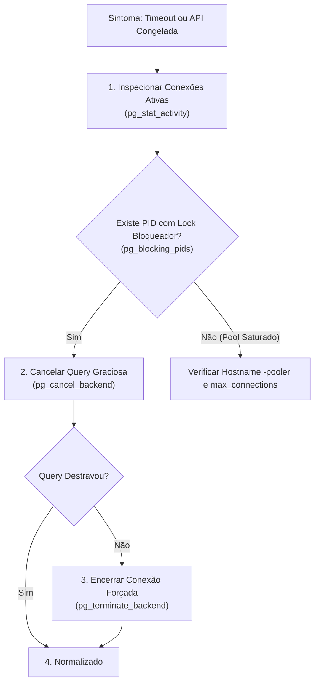

# Troubleshooting: Resolução de Connection Locks e Timeouts no PostgreSQL Neon

> **Categoria:** [ops-troubleshooting](../../reference/architecture-standards/index.md) | [database-migrations](../dev-environment/database-migrations.md) | [setup-local-environment](../dev-environment/setup-local-environment.md)
> **Sintomas:** Backend congela em requisições, erros HTTP 504 / timeout, migrações travadas, `OperationalError: connection timeout`

---

## Visão Geral

O **PostgreSQL Neon** opera em arquitetura *Serverless* com separação de armazenamento e computação, utilizando instâncias do **PgBouncer** para agrupamento de conexões (*connection pooling*).

Bloqueios (*locks*) e saturação de conexões ocorrem principalmente por:
1. **Transações Ociosas Abertas (`idle in transaction`):** Código que inicia `@transaction.atomic` e faz chamadas de rede lentas (I/O externo ou APIs de terceiros) antes de comitar.
2. **Contenção DDL em Migrações:** Operações como `ALTER TABLE` ou criação de índices não concorrentes que solicitam `AccessExclusiveLock`.
3. **Concorrência em Atualizações Financeiras:** Múltiplas requisições disputando a mesma linha de despesa ou orçamento mestre.



---

## Passo 1: Inspecionar Conexões Ativas e Queries Lentas

Acesse o banco de dados via Neon SQL Editor ou cliente `psql` e execute a consulta de diagnóstico:

```sql
SELECT
    pid,
    usename,
    application_name,
    client_addr,
    state,
    now() - query_start AS query_duration,
    now() - state_change AS state_duration,
    query
FROM pg_stat_activity
WHERE state != 'idle'
  AND pid <> pg_backend_pid()
ORDER BY query_duration DESC;
```

---

## Passo 2: Identificar a Árvore de Bloqueios (Lock Tree)

Para descobrir exatamente qual transação está travando outras requisições:

```sql
SELECT
    blocked_locks.pid     AS blocked_pid,
    blocked_activity.usename  AS blocked_user,
    blocking_locks.pid    AS blocking_pid,
    blocking_activity.usename AS blocking_user,
    blocked_activity.query    AS blocked_statement,
    blocking_activity.query   AS blocking_statement,
    now() - blocked_activity.query_start AS blocked_duration
FROM  pg_catalog.pg_locks         blocked_locks
JOIN pg_catalog.pg_stat_activity blocked_activity ON blocked_activity.pid = blocked_locks.pid
JOIN pg_catalog.pg_locks         blocking_locks
    ON blocking_locks.locktype = blocked_locks.locktype
    AND blocking_locks.database IS NOT DISTINCT FROM blocked_locks.database
    AND blocking_locks.relation IS NOT DISTINCT FROM blocked_locks.relation
    AND blocking_locks.page IS NOT DISTINCT FROM blocked_locks.page
    AND blocking_locks.tuple IS NOT DISTINCT FROM blocked_locks.tuple
    AND blocking_locks.virtualxid IS NOT DISTINCT FROM blocked_locks.virtualxid
    AND blocking_locks.transactionid IS NOT DISTINCT FROM blocked_locks.transactionid
    AND blocking_locks.classid IS NOT DISTINCT FROM blocked_locks.classid
    AND blocking_locks.objid IS NOT DISTINCT FROM blocked_locks.objid
    AND blocking_locks.objsubid IS NOT DISTINCT FROM blocked_locks.objsubid
    AND blocking_locks.pid != blocked_locks.pid
JOIN pg_catalog.pg_stat_activity blocking_activity ON blocking_activity.pid = blocking_locks.pid
WHERE NOT blocked_locks.granted;
```

---

## Passo 3: Encerrar Conexões Problemáticas

### 1. Cancelamento Gracioso da Query (`pg_cancel_backend`)
Interrompe a query em execução mantendo a conexão TCP aberta:
```sql
SELECT pg_cancel_backend(<BLOCKING_PID>);
```

### 2. Terminação Forçada da Conexão (`pg_terminate_backend`)
Se o processo não responder ao cancelamento, derrube a conexão por completo:
```sql
SELECT pg_terminate_backend(<BLOCKING_PID>);
```

### 3. Limpeza em Lote de Transações Ociosas Presas
Para derrubar todas as conexões presas em `idle in transaction` há mais de 2 minutos:
```sql
SELECT pg_terminate_backend(pid)
FROM pg_stat_activity
WHERE state = 'idle in transaction'
  AND state_change < now() - interval '2 minutes'
  AND pid <> pg_backend_pid();
```

---

## Passo 4: Prevenção Estrutural de Conexões no Neon

1. **Utilize Sempre o Endpoint com Connection Pooler:**
   No arquivo `.env` de produção e homologação, garanta que a `DATABASE_URL` utiliza o subdomínio `-pooler`:
   ```env
   # CORRETO (com pooling PgBouncer):
   DATABASE_URL=postgres://<usuario>:<senha>@ep-cool-fog-123456-pooler.us-east-2.aws.neon.tech/wedding_db?sslmode=require  # pragma: allowlist secret
   ```

2. **Configure Timeouts de Sessão no Django:**
   No `backend/config/settings/base.py`, defina timeouts padrão para evitar que transações fiquem presas indefinidamente:
   ```python
   DATABASES = {
       "default": {
           ...
           "OPTIONS": {
               "options": "-c statement_timeout=15000 -c idle_in_transaction_session_timeout=30000",
           },
       }
   }
   ```

3. **NUNCA Realize I/O Externo Dentro de `@transaction.atomic`:**
   Mantenha chamadas HTTP a serviços externos (como envio de e-mails, geração de Presigned URLs R2 ou webhooks) **fora** do bloco atômico do banco de dados.
