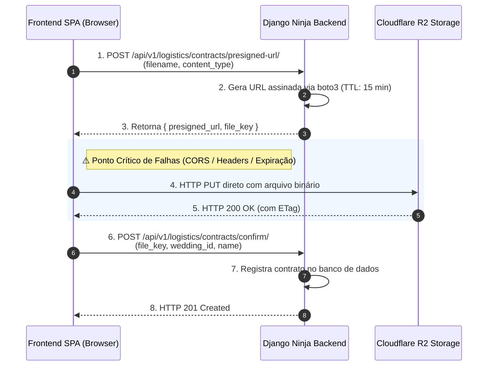

# Troubleshooting: Resolução de Falhas de Upload no Cloudflare R2

> **Categoria:** [ops-troubleshooting](../../reference/architecture-standards/index.md) | [contract-pdf-upload-r2-flow](../../architecture/concepts/contract-pdf-upload-r2-flow.md) | [004-presigned-urls](../../architecture/adr/004-presigned-urls.md)
> **Sintomas:** HTTP `403 Forbidden` (`SignatureDoesNotMatch`), `CORS Error` no browser, `RequestTimeTooSkewed`, upload zerado

---

## Visão Geral do Fluxo de Upload

Para desonerar os servidores de aplicação Django e eliminar custos de egresso de dados, o **Wedding Management System (WMS)** adota o padrão de **Upload Direto via Presigned URLs S3-compatíveis** no **Cloudflare R2** (ADR-003, ADR-004).



---

## Passo 1: Diagnóstico e Configuração de CORS no Cloudflare R2

Quando o upload falha no navegador com erro `Cross-Origin Request Blocked` ou `Preflight Response is not valid`:

1. **Acesse as configurações do Bucket no Cloudflare Dashboard:**
   Vá em *R2 Object Storage* > Selecione seu Bucket > *Settings* > *CORS Policy*.

2. **Garanta que o JSON de CORS permita a origem e os headers necessários:**
   ```json
   [
     {
       "AllowedOrigins": [
         "http://localhost:5173",
         "http://localhost:4321",
         "https://app.seudominio.com.br"
       ],
       "AllowedMethods": [
         "GET",
         "PUT",
         "POST",
         "HEAD"
       ],
       "AllowedHeaders": [
         "*"
       ],
       "ExposeHeaders": [
         "ETag"
       ],
       "MaxAgeSeconds": 3600
     }
   ]
   ```

---

## Passo 2: Investigar Erro `403 SignatureDoesNotMatch`

Este erro ocorre quando os parâmetros ou cabeçalhos enviados na requisição `PUT` do frontend não correspondem estritamente ao que o backend assinou criptograficamente com o `boto3`.

### 1. Incompatibilidade do Header `Content-Type`
Se o backend assinou a URL informando `ContentType='application/pdf'`, o frontend **DEVE** enviar exatamente `Content-Type: application/pdf` no cabeçalho do `PUT`.

```typescript
// CORRETO no Frontend:
await axios.put(presignedUrl, fileBlob, {
  headers: {
    "Content-Type": "application/pdf", // Exatamente o mesmo tipo assinado
  },
});
```

### 2. Cabeçalhos Extras Injetados por Interceptors
Se o cliente Axios ou Fetch possuir interceptors globais injetando `Authorization: Bearer ...` na requisição para o R2, a Cloudflare rejeitará a assinatura.
- **Solução:** O `PUT` para o Cloudflare R2 deve ser feito utilizando uma instância pura do `axios` ou `fetch` nativo, sem headers de autenticação do backend.

---

## Passo 3: Desvio de Relógio e Expiração (`RequestTimeTooSkewed`)

As URLs assinadas possuem tempo de vida útil estrito (padrão: 15 minutos / 900 segundos). Se o relógio da máquina do backend ou do cliente estiver dessincronizado:

1. **Verifique a sincronização de hora no servidor:**
   ```bash
   timedatectl status
   ```

2. **Force a sincronização com servidores NTP:**
   ```bash
   sudo ntpdate -u pool.ntp.org
   ```

---

## Passo 4: Teste Isolado de Upload via `curl`

Para descartar problemas do frontend e testar a infraestrutura isoladamente:

1. **Gere uma Presigned URL chamando a API do backend:**
   ```bash
   curl -X POST http://localhost:8000/api/v1/logistics/contracts/presigned-url/ \
     -H "Authorization: Bearer <TOKEN_JWT>" \
     -H "Content-Type: application/json" \
     -d '{"filename": "teste.pdf", "content_type": "application/pdf"}'
   ```

2. **Execute o upload binário direto com o `curl`:**
   ```bash
   curl -i -X PUT \
     -H "Content-Type: application/pdf" \
     --data-binary @"./meu_contrato.pdf" \
     "<URL_ASSINADA_RETORNADA>"
   ```

Se o comando retornar `HTTP/2 200 OK`, a infraestrutura do R2 e o backend estão saudáveis, indicando que o problema reside na implementação do frontend (ex: CORS ou headers extras).

---

## Passo 5: Checklist de Variáveis de Ambiente no Backend

Verifique se todas as credenciais do Cloudflare R2 estão corretamente preenchidas no `.env`:

```env
CLOUDFLARE_R2_ACCESS_KEY_ID=seu_access_key_id_r2
CLOUDFLARE_R2_SECRET_ACCESS_KEY=seu_secret_access_key_r2
CLOUDFLARE_R2_BUCKET_NAME=wedding-contracts-prod
CLOUDFLARE_R2_ENDPOINT_URL=https://<ACCOUNT_ID>.r2.cloudflarestorage.com
```
