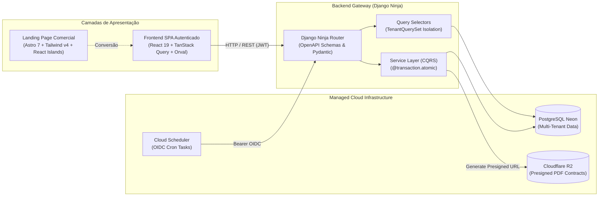

# Wedding Management System

<p class="mdx-hero__subtitle" style="font-size: 1.25rem; font-weight: 500; color: var(--md-default-fg-color--light); margin-top: -0.5rem; margin-bottom: 1.5rem;">
Plataforma SaaS Multi-Tenant de Alta Confiabilidade para Gestão de Casamentos, Orçamentos e Fornecedores.
</p>

<p align="left" style="display: flex; gap: 0.5rem; flex-wrap: wrap; margin-bottom: 2rem;">
  <span class="md-tag" style="background-color: #3776AB; color: white; padding: 3px 10px; border-radius: 6px; font-weight: 600; font-size: 0.8rem;">Python 3.12+</span>
  <span class="md-tag" style="background-color: #092E20; color: white; padding: 3px 10px; border-radius: 6px; font-weight: 600; font-size: 0.8rem;">Django 6.0</span>
  <span class="md-tag" style="background-color: #087EA4; color: white; padding: 3px 10px; border-radius: 6px; font-weight: 600; font-size: 0.8rem;">Django Ninja 1.6+</span>
  <span class="md-tag" style="background-color: #61DAFB; color: #09090B; padding: 3px 10px; border-radius: 6px; font-weight: 600; font-size: 0.8rem;">React 19</span>
  <span class="md-tag" style="background-color: #FF5D01; color: white; padding: 3px 10px; border-radius: 6px; font-weight: 600; font-size: 0.8rem;">Astro 7</span>
  <span class="md-tag" style="background-color: #38B2AC; color: white; padding: 3px 10px; border-radius: 6px; font-weight: 600; font-size: 0.8rem;">Tailwind CSS v4</span>
  <span class="md-tag" style="background-color: #00E599; color: #09090B; padding: 3px 10px; border-radius: 6px; font-weight: 600; font-size: 0.8rem;">PostgreSQL Neon</span>
  <span class="md-tag" style="background-color: #F38020; color: white; padding: 3px 10px; border-radius: 6px; font-weight: 600; font-size: 0.8rem;">Cloudflare R2</span>
  <span class="md-tag" style="background-color: #7B42BC; color: white; padding: 3px 10px; border-radius: 6px; font-weight: 600; font-size: 0.8rem;">Terraform IaC</span>
  <span class="md-tag" style="background-color: #2EAD33; color: white; padding: 3px 10px; border-radius: 6px; font-weight: 600; font-size: 0.8rem;">Playwright E2E</span>
</p>

[:material-rocket-launch: Funcionalidades](features/index.md){ .md-button .md-button--primary }
[:material-sitemap: Arquitetura](architecture/index.md){ .md-button }
[:material-book-open-page-variant: Guias & Onboarding](guides/index.md){ .md-button }
[:material-code-json: Referência Técnica](reference/index.md){ .md-button }
[:material-lightning-bolt: Quickstart](#quickstart){ .md-button }

---

## Pilares de Engenharia & Diferenciais

<div class="grid cards" markdown>

-   :material-cash-multiple:{ .lg .middle } **Tolerância Zero Financeira**

    ---

    Distribuição exata de parcelas com integridade decimal de centavos (`DecimalField(max_digits=12, decimal_places=2)`), sem arredondamentos cumulativos e máquina de estados para débitos em atraso.

    [:octicons-arrow-right-24: Regras de Integridade](architecture/business-rules/finances/financial-integrity-rules.md) · [:octicons-shield-check-24: ADR-010](architecture/adr/010-tolerance-zero.md)

-   :material-domain:{ .lg .middle } **Multi-Tenancy Pragmático**

    ---

    Isolamento lógico absoluto de dados por empresa via `TenantQuerySet`, restrição em cascata no Service Layer e validação de tenant em 100% das mutações e selectors.

    [:octicons-arrow-right-24: Service Layer Pattern](architecture/concepts/service-layer-pattern.md) · [:octicons-shield-check-24: ADR-016](architecture/adr/016-pragmatic-multi-tenancy.md)

-   :material-cloud-upload:{ .lg .middle } **Storage Direto no Cloudflare R2**

    ---

    Upload seguro e direto de contratos e PDFs através de Presigned URLs S3-compatíveis, desonerando a CPU da API Django e garantindo contenção de custos de egresso.

    [:octicons-arrow-right-24: Fluxo de Upload R2](architecture/concepts/contract-pdf-upload-r2-flow.md) · [:octicons-shield-check-24: ADR-004](architecture/adr/004-presigned-urls.md)

-   :material-calendar-clock:{ .lg .middle } **Motor de Cronograma & Recorrência**

    ---

    Cálculo automatizado de prazos de casamento a partir de templates canônicos, com proteção *read-only* em eventos de parcelas vinculadas ao módulo financeiro.

    [:octicons-arrow-right-24: Motor de Recorrência](architecture/business-rules/scheduler/recurrence-rules-engine.md) · [:octicons-lock-24: Read-Only Guard](architecture/business-rules/scheduler/payment-event-readonly-guard.md)

-   :material-sync:{ .lg .middle } **Contrato Tipado Fullstack**

    ---

    Fluxo ponta a ponta: Django Ninja -> OpenAPI 3.1 -> Orval -> React 19 (TanStack Query + Zod), garantindo *type-safety* completo sem necessidade de escrever hooks manuais.

    [:octicons-arrow-right-24: Geração Orval](guides/frontend/generate-orval-client.md) · [:octicons-shield-check-24: ADR-012](architecture/adr/012-orval-contract-driven-frontend.md)

-   :material-application:{ .lg .middle } **Landing Page Comercial em Astro 7**

    ---

    Vitrine pública em Astro com renderização estática ultrarrápida (SSG), ilhas interativas em React 19 e design system unificado em Tailwind CSS v4.

    [:octicons-arrow-right-24: Especificação da Landing Page](reference/frontend/landing-page-spec.md) · [:octicons-checklist-24: Componentes UI](reference/frontend/ui-components-spec.md)

</div>

---

## Exemplo Prático de Código

A arquitetura estabelece contratos tipados onde o frontend consome diretamente os hooks gerados a partir dos schemas Django Ninja validados pelo Service Layer:

=== "Backend: API Route"

    ```python
    # apps/finances/api/budgets.py
    from uuid import UUID
    from ninja_extra import Router
    from apps.core.constants import MUTATION_ERROR_RESPONSES, READ_ERROR_RESPONSES
    from apps.finances.models.budget import Budget
    from apps.finances.schemas import BudgetIn, BudgetOut
    from apps.finances.services.budget_service import BudgetService
    from apps.users.types import AuthRequest

    budgets_router = Router(tags=["Finances"])

    @budgets_router.post(
        "/",
        response={201: BudgetOut, **MUTATION_ERROR_RESPONSES},
        operation_id="finances_budgets_create",
    )
    def create_budget(request: AuthRequest, payload: BudgetIn) -> tuple[int, Budget]:
        """Cria um novo orçamento mestre para o casamento (relação 1:1)."""
        budget = BudgetService.create(company=request.user.company, payload=payload)
        return 201, budget
    ```

=== "Backend: Service Layer"

    ```python
    # apps/finances/services/budget_service.py
    import logging
    from django.db import transaction
    from apps.core.exceptions import DomainIntegrityError
    from apps.core.shortcuts import get_object_or_404_for_tenant
    from apps.finances.models import Budget
    from apps.finances.schemas import BudgetIn
    from apps.tenants.models import Company
    from apps.weddings.models import Wedding

    logger = logging.getLogger(__name__)

    class BudgetService:
        """Camada de serviço para mutações e orquestração do orçamento mestre."""

        @staticmethod
        @transaction.atomic
        def create(company: Company, payload: BudgetIn) -> Budget:
            """Cria orçamento garantindo isolamento de tenant e integridade de negócio."""
            wedding = get_object_or_404_for_tenant(Wedding, company, uuid=payload.wedding)

            if Budget.objects.for_tenant(company).filter(wedding=wedding).exists():
                raise DomainIntegrityError("Este casamento já possui um orçamento configurado.")

            logger.info("Criando orçamento mestre para o casamento %s (Tenant: %s)", wedding.uuid, company.uuid)
            return Budget.objects.create(
                company=company,
                wedding=wedding,
                total_budget=payload.total_budget,
            )
    ```

=== "Frontend: React Hook"

    ```tsx
    // features/finances/hooks/useCreateBudgetForm.ts
    import { useForm } from "react-hook-form";
    import { zodResolver } from "@hookform/resolvers/zod";
    import { useFinancesBudgetsCreate } from "@/api/generated/v1/endpoints/finances/finances";
    import { FinancesBudgetsCreateBody } from "@/api/generated/v1/zod/finances/finances";
    import type { z } from "zod";

    type CreateBudgetFormData = z.input<typeof FinancesBudgetsCreateBody>;

    export function useCreateBudgetForm(weddingUuid: string, onSuccess: () => void) {
      const { mutate, isPending } = useFinancesBudgetsCreate();

      const form = useForm<CreateBudgetFormData>({
        resolver: zodResolver(FinancesBudgetsCreateBody),
        defaultValues: {
          wedding: weddingUuid,
          total_budget: 0,
        },
      });

      const onSubmit = (data: CreateBudgetFormData) => {
        mutate({ data }, { onSuccess });
      };

      return { form, onSubmit, isPending };
    }
    ```

---

## Visão Geral da Arquitetura do Sistema



---

<a id="quickstart"></a>
## Quickstart (Setup Local)

Escolha a modalidade de ambiente de desenvolvimento preferida:

=== "Just Runner & Docker Compose (Recomendado)"

    ```bash
    # 1. Clonar repositório e preparar variáveis de ambiente
    git clone git@github.com:Rafaelp122/wedding_management.git
    cd wedding_management
    just env-setup

    # 2. Inicializar banco de dados e backend no Docker
    just up

    # 3. Iniciar o servidor de desenvolvimento do Frontend SPA (no Host)
    just frontend-dev

    # 4. Iniciar a Landing Page comercial (no Host)
    just landing-dev
    ```

=== "Host Local (uv + pnpm)"

    ```bash
    # 1. Backend: Sincronizar ambiente Python e aplicar migrações
    cd backend
    uv sync --all-groups
    uv run python manage.py migrate
    uv run python manage.py runserver 0.0.0.0:8000

    # 2. Frontend SPA: Instalar dependências e iniciar Vite
    cd ../frontend
    pnpm install
    pnpm run dev

    # 3. Landing Page: Iniciar servidor Astro
    cd ../landing
    pnpm install
    pnpm run dev

    # 4. Documentação: Iniciar servidor MkDocs
    cd ..
    uv run --project backend --group docs mkdocs serve -a 0.0.0.0:8001
    ```

### Painel de Acesso aos Serviços Locais

| Serviço | URL Local | Atalho Just | Comando Nativo Direto | Descrição |
| :--- | :--- | :--- | :--- | :--- |
| **Landing Page Comercial** | [`http://localhost:4321`](http://localhost:4321) | `just landing-dev` | `cd landing && pnpm run dev` | Portal de marketing institucional em Astro 7 |
| **Frontend SPA** | [`http://localhost:5173`](http://localhost:5173) | `just frontend-dev` | `cd frontend && pnpm run dev` | Aplicação web principal em React 19 com Vite |
| **Backend & Swagger API** | [`http://localhost:8000/api/v1/docs`](http://localhost:8000/api/v1/docs) | `just up` / `just dev` | `docker compose up -d backend` | Documentação OpenAPI interativa do Django Ninja |
| **MkDocs Documentação** | [`http://localhost:8001`](http://localhost:8001) | `just docs-dev` | `uv run --project backend --group docs mkdocs serve -a 0.0.0.0:8001` | Portal de documentação técnica com live-reload |

---

## Tabela de Stack Tecnológica

| Camada | Tecnologia Principal | Versão Exata | Papel & Responsabilidade |
| :--- | :--- | :--- | :--- |
| **Landing Page Comercial** | Astro, Tailwind CSS v4, React 19 | `Astro 7.1+`, `Tailwind 4.3+`, `React 19.2+` | Portal institucional público de alta conversão, renderização estática (SSG) e SEO. |
| **Frontend SPA** | React 19, TypeScript, Tailwind CSS v4, shadcn/ui | `React 19.2+`, `Vite 8.2+`, `TS 7.0+` | Interface do usuário rica e autenticada para cerimonialistas e casais. |
| **Camada de Contratos** | Django Ninja, OpenAPI 3.1, Orval, Zod | `Ninja 1.6+`, `Orval 8.24+`, `Zod 4.4+` | Sincronização automática e tipagem estrita de ponta a ponta sem clientes manuais. |
| **Backend & APIs** | Python, Django, Django Ninja, Pydantic v2 | `Python 3.12+`, `Django 6.0+`, `Ninja 1.6+` | Roteamento performático, validação de payload, autenticação JWT e serialização. |
| **Lógica & Domínio** | Service Layer (`@transaction.atomic`), `TenantQuerySet` | Padrão Nativo CQRS | Validação de regras de negócio, garantia de tolerância zero e isolamento multi-tenant. |
| **Persistência de Dados** | Neon Serverless PostgreSQL | `psycopg 3.3+` | Banco relacional escalável com isolamento lógico estrito por empresa (`company_id`). |
| **Armazenamento de Arquivos** | Cloudflare R2 (S3-Compatible) | `django-storages 1.14+`, `boto3 1.43+` | Armazenamento de PDFs contratuais via Presigned URLs com custo de egresso zero. |
| **Tarefas & Workers** | Huey, Redis/Valkey, Cloud Scheduler | `huey 2.5+`, `redis 5.0+` | Execução de rotinas assíncronas em segundo plano e cron tasks via OIDC. |
| **Infraestrutura como Código** | Terraform, Google Cloud Run, Cloud Scheduler | `Terraform 1.10+` | Provisionamento declarativo serverless e esteiras de automação GitOps. |
| **Qualidade & Testes** | Pytest, Vitest, Playwright E2E, Ruff, Mypy, Oxlint | `Pytest 9.1+`, `Vitest 4.0+`, `Playwright 1.62+` | Pirâmide completa de testes (unitários, integração, E2E) e linters rigorosos. |
