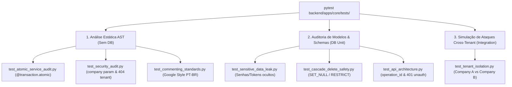

# Especificações Técnicas de Guard-Rails de Integridade e Segurança (MOC)

> **Categoria:** Referência Técnica (Guard-Rails & Integridade)
> **Relacionados:** [Padrões de Arquitetura](../index.md) · [Suíte de Guard-Rails](../../../architecture/concepts/architectural-guard-rails-suite.md) · [MOC de Testes](../../testing/index.md)

---

## 1. Visão Geral da Barreira de Integridade

A suíte em `backend/apps/core/tests/` atua como a **barreira dinâmica de governança e integridade arquitetural** do sistema. Em vez de testar regras de negócio pontuais, estes testes executam metaprogramação, análise estática de Árvore Sintática Abstrata (AST) e testes parametrizados sobre todas as aplicações (`apps/`), garantindo que nenhum código viole as diretrizes não negociáveis do projeto.

---

## 2. Matriz Completa de Suítes de Auditoria

| Arquivo de Teste | Regra Arquitetural Auditada | Mecanismo de Execução | Impacto da Falha & Ação Corretiva |
| :--- | :--- | :--- | :--- |
| **`test_tenant_isolation.py`** | Isolamento total de dados entre empresas (ADR-016). | Cria `Company A` e `Company B` via factories e testa `.for_tenant()` e `get_object_or_404_for_tenant()`. | **Vazamento de dados.** Corrigir o modelo herdando de `TenantModel` ou ajustar o seletor. |
| **`test_atomic_service_audit.py`** | Funções com 2+ escritas no banco devem ser atômicas. | Varredura AST em `apps/*/services/` contando chamadas a `.save()`, `.create()`, `.update()`, etc. | **Inconsistência transacional.** Adicionar `@transaction.atomic` à função de serviço. |
| **`test_security_audit.py`** | Serviços públicos devem exigir `company` e proibir `django.shortcuts.get_object_or_404`. | Análise AST de argumentos de funções e imports de atalhos globais. | **Vulnerabilidade IDOR.** Adicionar parâmetro `company: Company` e usar `get_object_or_404_for_tenant`. |
| **`test_sensitive_data_leak.py`** | Schemas de saída da API (`*Out`, `*Response`) jamais expõem credenciais. | Reflexão dinâmica de classes Pydantic/Ninja verificando campos proibidos (`password`, `token`, etc.). | **Exposição de segredos.** Remover campos sensíveis do schema DTO de resposta. |
| **`test_api_architecture.py`** | 100% das rotas possuem `operation_id` e rotas privadas retornam 401. | Inspeção de `config.api.api._routers` e requisições HTTP simuladas sem token JWT. | **Falha na geração do Orval.** Declarar `operation_id` único no decorador do router Ninja. |
| **`test_commenting_standards.py`** | Comentários e docstrings em PT-BR sem referências a assistentes de IA. | Regex e AST inspecionando tokens textuais nos arquivos `.py`. | **Poluição de código.** Remover menções a ferramentas externas e adequar docstring ao Google Style. |
| **`test_cascade_delete_safety.py`** | Modelos não devem utilizar `on_delete=CASCADE` indiscriminadamente em dados críticos. | Inspeção de metadados de campos Foreign Key no `apps.get_models()`. | **Exclusão catastrófica de dados.** Usar `PROTECT`, `RESTRICT` ou `SET_NULL`. |

---

## 3. Especificações Atômicas de Guard-Rails

- :material-shield-lock: **[tenant-isolation-guard.md](tenant-isolation-guard.md)** — Auditoria de Isolação Multitenant (`test_tenant_isolation.py`).
- :material-lightning-bolt: **[atomic-service-audit-guard.md](atomic-service-audit-guard.md)** — Auditoria de Atomicidade na Service Layer (`test_atomic_service_audit.py`).
- :material-key-alert: **[security-permissions-guard.md](security-permissions-guard.md)** — Auditoria de Permissões, Segurança e Prevenção de Vazamento (`test_security_audit.py` e `test_sensitive_data_leak.py`).
