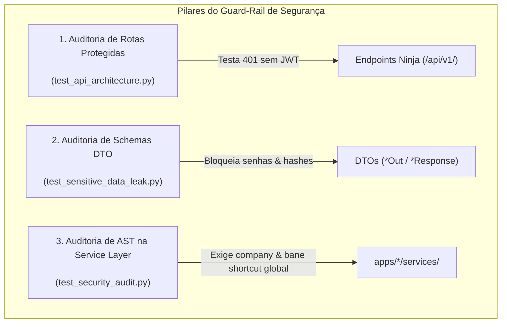

# Especificação Técnica: Guard-Rail de Segurança, Permissões e Prevenção de Vazamentos

> **Categoria:** Referência Técnica (Guard-Rails & Integridade)
> **Relacionados:** [MOC de Guard-Rails](index.md) · [Fluxo de Autenticação JWT](../../../architecture/concepts/auth-jwt-flow.md) · [Suíte de Guard-Rails](../../../architecture/concepts/architectural-guard-rails-suite.md)
> **Implementação:** `backend/apps/core/tests/test_security_audit.py`, `test_sensitive_data_leak.py` e `test_api_architecture.py`

---

## 1. Visão Geral e Arquitetura de Defesa

Os guard-rails de segurança atuam como uma barreira preventiva contra três das principais vulnerabilidades em aplicações web (OWASP Top 10):
1. **Broken Object Level Authorization (BOLA/IDOR):** Garantido pela exigência do parâmetro `company` e atalhos tenant-scoped.
2. **Broken Authentication & Missing Function Level Access Control:** Garantido pela verificação de retorno HTTP 401 em todas as rotas privadas sem token JWT.
3. **Sensitive Data Exposure:** Garantido pela inspeção reflexiva de todos os DTOs Pydantic de resposta.



---

## 2. Detalhamento das Verificações

### 2.1 Auditoria de Rotas Protegidas (Retorno HTTP 401)
Localizado em `backend/apps/core/tests/test_api_architecture.py`:
- Inspeciona todas as rotas registradas na instância `config.api.api._routers`.
- Filtra rotas públicas de infraestrutura (`/health`) e de autenticação inicial (`/auth/login`, `/auth/register`, `/auth/refresh`).
- Dispara requisições HTTP anônimas para cada rota privada e assere:
  ```python
  response = client.get(url)
  assert response.status_code == 401, f"Rota privada {url} acessível sem token!"
  ```

---

### 2.2 Prevenção contra Vazamento de Segredos em Schemas DTO
Localizado em `backend/apps/core/tests/test_sensitive_data_leak.py`:
- Realiza descoberta dinâmica de todas as classes de schema que terminam com `Out` ou contêm `Response` em `apps/*/schemas.py`.
- Percorre recursivamente todos os campos dos modelos Pydantic (incluindo uniões, listas e tipos aninhados) verificando contra a lista proibida:
  ```python
  SENSITIVE_FIELDS: set[str] = {
      "password",
      "password_hash",
      "raw_password",
      "secret_key",
      "private_key",
      "auth_token",
      "reset_token",
  }
  ```
- O teste falha imediatamente se qualquer schema público contiver algum destes campos no payload JSON de retorno.

---

### 2.3 Auditoria Estática AST de Serviços Públicos
Localizado em `backend/apps/core/tests/test_security_audit.py`:
1. **Banimento de `django.shortcuts.get_object_or_404`:** Varre a árvore sintática de todos os arquivos de serviço. Se encontrar `from django.shortcuts import get_object_or_404` ou chamadas a esse método, o teste reprova exigindo o uso de `get_object_or_404_for_tenant`.
2. **Declaração Obrigatória do Parâmetro `company`:** Garante que todas as funções públicas (que não começam com `_`) declaram `company: Company` em sua assinatura (exceto serviços globais de infraestrutura explicitamente isentos na lista `exempt_relative_files`).

---

## 3. Como Executar e Remediar Violações

### Comandos de Execução
```bash
# Executa a suíte de auditoria de segurança e permissões
pytest backend/apps/core/tests/test_security_audit.py backend/apps/core/tests/test_sensitive_data_leak.py backend/apps/core/tests/test_api_architecture.py -v
```

### Guia de Resolução de Falhas
- **Falha em `test_protected_routes_return_401`:** Certifique-se de não adicionar `auth=None` indevidamente em routers privados no arquivo `config/api.py`.
- **Falha em `test_no_public_response_schemas_contain_sensitive_fields`:** Crie um schema de saída restrito (ex: `UserOut`) sem campos de senha ou utilize `exclude={"password"}` no DTO.
- **Falha em `test_public_service_functions_declare_company_parameter`:** Adicione o argumento `company: Company` como primeiro parâmetro da função pública em `services/`.
