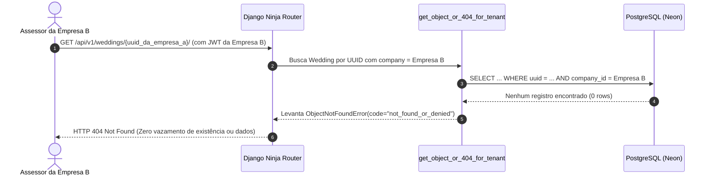

# Especificação Técnica: Guard-Rail de Isolação Multitenant

> **Categoria:** Referência Técnica (Guard-Rails & Integridade)
> **Relacionados:** [MOC de Guard-Rails](index.md) · [ADR-016: Multi-tenancy Pragmático](../../../architecture/adr/016-pragmatic-multi-tenancy.md) · [Suíte de Guard-Rails](../../../architecture/concepts/architectural-guard-rails-suite.md)
> **Implementação:** `backend/apps/core/tests/test_tenant_isolation.py` e `backend/apps/core/tests/base.py`

---

## 1. Visão Geral e Objetivo

O guard-rail **`test_tenant_isolation.py`** é a salvaguarda central contra vazamento de dados entre clientes (*cross-tenant data leak* / vulnerabilidades IDOR).

Ele valida parametrizadamente que todo modelo de domínio vinculado a uma organização (`TenantModel`) respeita a segregação estrita de dados tanto no nível de consultas ORM (`for_tenant(company)`) quanto nos atalhos de resolução (`get_object_or_404_for_tenant`).



---

## 2. Modelos Auditados pela Suíte

A suíte cobre parametrizadamente todos os modelos de domínio do sistema:

| Domínio | Modelo Django | Factory Associada | Validação Relacional |
| :--- | :--- | :--- | :--- |
| **Weddings** | `Wedding` | `WeddingFactory` | Isolamento direto por `company`. |
| **Finances** | `Budget` | `BudgetFactory` | Isolamento por `company` e `wedding`. |
| **Finances** | `BudgetCategory` | `BudgetCategoryFactory` | Isolamento por `company` e `wedding`. |
| **Finances** | `Expense` | `ExpenseFactory` | Isolamento com `category` e `wedding` na mesma empresa. |
| **Finances** | `Installment` | `InstallmentFactory` | Isolamento com `expense` e `wedding` vinculados. |
| **Logistics** | `Supplier` | `SupplierFactory` | Isolamento direto de fornecedores por `company`. |
| **Logistics** | `Contract` | `ContractFactory` | Contrato logístico com `supplier` e `wedding`. |
| **Logistics** | `Item` | `ItemFactory` | Itens e serviços do catálogo da empresa. |
| **Scheduler** | `Event` | `EventFactory` | Eventos do cronograma do casamento. |
| **Scheduler** | `Task` | `TaskFactory` | Tarefas e checklist operacional. |

---

## 3. As Três Asserções de Segurança (`BaseTenantIsolationTest`)

A classe base em `apps/core/tests/base.py` executa 3 asserções rigorosas para cada modelo:

### 3.1 `assert_for_tenant_isolation`
Instancia dois objetos idênticos para duas empresas distintas (`Company A` e `Company B`) e assegura:
```python
qs_a = model_cls.objects.for_tenant(company_a)
qs_b = model_cls.objects.for_tenant(company_b)

# Asserções
assert obj_a in qs_a
assert obj_b not in qs_a  # ❌ Vazamento se obj_b aparecer em qs_a
assert obj_b in qs_b
assert obj_a not in qs_b  # ❌ Vazamento se obj_a aparecer em qs_b
```

### 3.2 `assert_get_object_or_404_for_tenant_isolation`
Garante que tentar acessar o UUID do objeto da Empresa A usando o contexto da Empresa B lança imediatamente `ObjectNotFoundError`:
```python
with pytest.raises(ObjectNotFoundError) as exc_info:
    get_object_or_404_for_tenant(model_cls, company_b, obj_a.uuid)

assert exc_info.value.code == "not_found_or_denied"
```

### 3.3 `assert_resolve_tenant_resource_isolation`
Valida que a função utilitária `resolve_tenant_resource()` rejeita instâncias ou UUIDs que não pertençam ao tenant fornecido.

---

## 4. Como Executar e Resolver Falhas

### Comando de Execução
```bash
# Executa apenas a suíte de isolamento de tenant
pytest backend/apps/core/tests/test_tenant_isolation.py -v
```

### Guia de Resolução de Falhas
1. **Falha em `assert_for_tenant_isolation`:** Verifique se o modelo herda de `TenantModel` e se o seu `objects` está configurado com `TenantManager` / `TenantQuerySet.as_manager()`.
2. **Falha por `IntegrityError` de Foreign Key:** Certifique-se de que as entidades filhas (ex: `wedding`, `category`) foram instanciadas com a mesma `company` da entidade pai na factory.
3. **Novo Modelo Criado:** Sempre adicione a tupla `(NovoModelo, NovoModeloFactory)` na lista `@pytest.mark.parametrize` em `test_tenant_isolation.py`.
