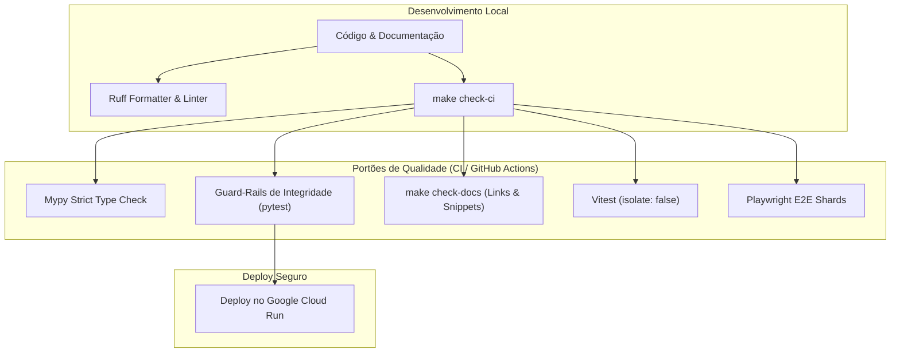

# Padrões Arquiteturais e Governança de Código (MOC)

> **Categoria:** Referência Técnica (Padrões & Governança)
> **Relacionados:** [Visão Geral do Sistema](../../architecture/concepts/system-overview.md) · [Guard-Rails de Integridade](guard-rails/index.md) · [MOC de Testes](../testing/index.md)

---

## 1. Visão Geral da Governança Arquitetural

Esta seção consolida os **padrões normativos e regras de engenharia** do **Wedding Management System**. Cada padrão atua como um contrato vinculante para desenvolvedores e agentes autônomos, garantindo manutenibilidade, isolamento multitenant rigoroso e alta testabilidade.

### Mecanismos de Aplicação (Enforcement Matrix)

---

## 2. Catálogo de Especificações e Padrões Normativos

| Especificação | Escopo / Módulo | Ferramenta / Guard-Rail | Link |
| :--- | :--- | :--- | :--- |
| **Padrão de Documentação** | Framework Diátaxis & Notas Atômicas | `validate_docs_links.py`, `validate_docs_snippets.py` | [documentation-standards.md](documentation-standards.md) |
| **Query Selectors & CQRS** | Consultas ORM e isolamento de leitura | `TenantQuerySet`, `test_selectors.py` | [query-selectors-spec.md](query-selectors-spec.md) |
| **Comentários e Docstrings** | Google Style em PT-BR e proibição de menções a IA | `test_commenting_standards.py` | [commenting-standards.md](commenting-standards.md) |
| **Convenção de Commits** | Conventional Commits padronizados | `commitlint`, GitHub Actions | [commit-convention-spec.md](commit-convention-spec.md) |
| **Guard-Rails de Integridade** | Auditorias AST de atomicidade, segurança e tenant | `apps/core/tests/test_*_audit.py` | [guard-rails/index.md](guard-rails/index.md) |
| **Serviços de Infraestrutura** | GCP Cloud Run, Neon DB, Cloudflare R2 | Docker, Secret Manager | [infrastructure-services.md](infrastructure-services.md) |
| **Suíte de Testes Automatizados** | Backend (Pytest), Frontend (Vitest), E2E (Playwright) | `pytest`, `vitest`, `playwright` | [../testing/index.md](../testing/index.md) |
| **Módulos Terraform IaC** | Infraestrutura declarativa e topologia de 3 roots | `terraform test`, GCS State Locks | [../terraform/index.md](../terraform/index.md) |

---

## 3. Diretrizes de Contribuição e Conformidade

1. **Leitura Prévia Obrigatória:** Antes de propor alterações estruturais, consulte os ADRs em [docs/architecture/adr/](../../architecture/adr/README.md).
2. **Execução de Gates Locais:** Todo Pull Request deve ser validado localmente com `make check-ci` antes da abertura no GitHub.
3. **Preservação de Guard-Rails:** É terminantemente proibido desativar ou suprimir asserções de guard-rails (`@pytest.mark.skip`) sem aprovação explícita de arquitetura.
